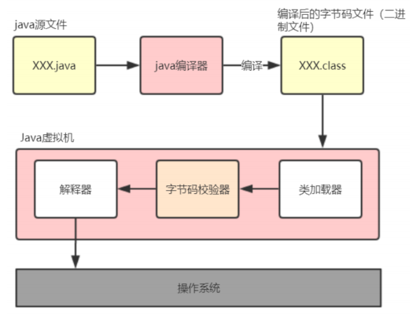
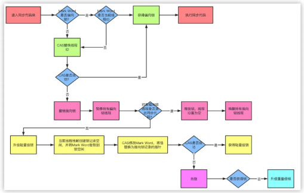
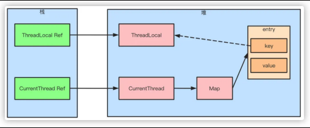
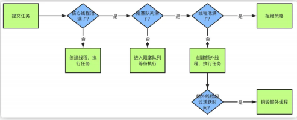
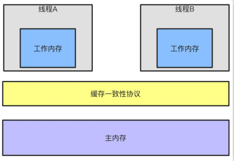

# **多线程&并发篇**

[[toc]]

## 1.说说Java中实现多线程有几种方法?

创建线程的常用三种方式：

1. 继承Thread类

2. 实现Runnable接口

3. 实现Callable接口（ JDK1.5>= ）

4. 线程池方式创建

通过继承Thread类或者实现Runnable接口、Callable接口都可以实现多线程，不过实现Runnable接口与实现Callable接口的方式基本相同，只是Callable接口里定义的方法返回值，可以声明抛出异常而已。因此将实现Runnable接口和实现Callable接口归为一种方式。这种方式与继承Thread方式之间的主要差别如下。

**采用实现Runnable、Callable接口的方式创建线程的优缺点**

**优点**：线程类只是实现了Runnable或者Callable接口，还可以继承其他类。这种方式下，多个线程可以共享一个target对象，所以非常适合多个相同线程来处理同一份资源的情况，从而可以将CPU、代码和数据分开，形成清晰的模型，较好的体现了面向对象的思想。

**缺点**：编程稍微复杂一些，如果需要访问当前线程，则必须使用Thread.currentThread() 方法

**采用继承Thread类的方式创建线程的优缺点优点**：编写简单，如果需要访问当前线程，则无需使用 Thread.currentThread() 方法，直接使用this即可获取当前线程

**缺点**：因为线程类已经继承了Thread类，Java语言是单继承的，所以就不能再继承其他父类了。

## 2.**如何停止一个正在运行的线程**？

1、使用退出标志，使线程正常退出，也就是当run方法完成后线程终止。

2、使用stop方法强行终止，但是不推荐这个方法，因为stop和suspend及resume一样都是过期作废的方法。

3、使用interrupt方法中断线程。

````java
class MyThread extends Thread {
 volatile boolean stop = false;
 public void run() {
 while (!stop) {
 System.out.println(getName() + " is running");
 try {
 sleep(1000);
 } catch (InterruptedException e) {
 System.out.println("week up from blcok...");
 stop = true; // 在异常处理代码中修改共享变量的状态
 }
 }
 System.out.println(getName() + " is exiting...");
 }
}
class InterruptThreadDemo3 {
 public static void main(String[] args) throws InterruptedException {
 MyThread m1 = new MyThread();
 System.out.println("Starting thread...");
 m1.start();
 Thread.sleep(3000);
 System.out.println("Interrupt thread...: " + m1.getName());
 m1.stop = true; // 设置共享变量为true
 m1.interrupt(); // 阻塞时退出阻塞状态
 Thread.sleep(3000); // 主线程休眠3秒以便观察线程m1的中断情况
 System.out.println("Stopping application...");
 }
}
````

## 3.**notify()**和notifyAll()有什么区别？

notify可能会导致死锁，而notifyAll则不会

任何时候只有一个线程可以获得锁，也就是说只有一个线程可以运行synchronized 中的代码

使用notifyall,可以唤醒 所有处于wait状态的线程，使其重新进入锁的争夺队列中，而notify只能唤醒一个。

wait() 应配合while循环使用，不应使用if，务必在wait()调用前后都检查条件，如果不满足，必须调用notify()唤醒另外的线程来处理，自己继续wait()直至条件满足再往下执行。

notify() 是对notifyAll()的一个优化，但它有很精确的应用场景，并且要求正确使用。不然可能导致死锁。正确的场景应该是 WaitSet中等待的是相同的条件，唤醒任一个都能正确处理接下来的事项，如果唤醒的线程无法正确处理，务必确保继续notify()下一个线程，并且自身需要重新回到WaitSet中。

## 4.sleep()和wait()有什么区别?

对于sleep()方法，我们首先要知道该方法是属于Thread类中的。而wait()方法，则是属于Object类中的。

sleep()方法导致了程序暂停执行指定的时间，让出cpu该其他线程，但是他的监控状态依然保持者，当指定的时间到了又会自动恢复运行状态。在调用sleep()方法的过程中，线程不会释放对象锁。

当调用wait()方法的时候，线程会放弃对象锁，进入等待此对象的等待锁定池，只有针对此对象调用notify()方法后本线程才进入对象锁定池准备，获取对象锁进入运行状态。

## 5.**volatile**是什么?可以保证有序性吗?

一旦一个共享变量（类的成员变量、类的静态成员变量）被volatile修饰之后，那么就具备了两层语义：

1）保证了不同线程对这个变量进行操作时的可见性，即一个线程修改了某个变量的值，这新值对其他线程来说是立即可见的,volatile关键字会强制将修改的值立即写入主存。

2）禁止进行指令重排序。

**volatile 不是原子性操作**。

什么叫保证部分有序性?

当程序执行到volatile变量的读操作或者写操作时，在其前面的操作的更改肯定全部已经进行，且结果已经对后面的操作可见；在其后面的操作肯定还没有进行；

````java
x = 2; //语句1
y = 0; //语句2
flag = true; //语句3
x = 4; //语句4
y = -1; //语句5
````

由于flflag变量为volatile变量，那么在进行指令重排序的过程的时候，不会将语句3放到语句1、语句2前面，也不会讲语句3放到语句4、语句5后面。但是要注意语句1和语句2的顺序、语句4和语句5的顺序是不作任何保证的。

使用volatile 一般用于 状态标记量 和 单例模式的双检锁。

## 6.**Thread** **类中的start()** **和** **run()** **方法有什么区别？**

start()方法被用来启动新创建的线程，而且start()内部调用了run()方法，这和直接调用run()方法的效果不一样。当你调用run()方法的时候，只会是在原来的线程中调用，没有新的线程启动，start()方法才会启动新线程。

## 7. **为什么wait, notify** **和** notifyAll这些方法不在thread类里面?

明显的原因是JAVA提供的锁是对象级的而不是线程级的，每个对象都有锁，通过线程获得。如果线程需要等待某些锁那么调用对象中的wait()方法就有意义了。如果wait()方法定义在Thread类中，线程正在等待的是哪个锁就不明显了。简单的说，由于wait，notify和notifyAll都是锁级别的操作，所以把他们定义在Object类中因为锁属于对象。

## 8.**为什么wait和notify方法要在同步块中调用？**

1. 只有在调用线程拥有某个对象的独占锁时，才能够调用该对象的wait(),notify()和notifyAll()方法。

2. 如果你不这么做，你的代码会抛出IllegalMonitorStateException异常。

3. 还有一个原因是为了避免wait和notify之间产生竞态条件。

wait()方法强制当前线程释放对象锁。这意味着在调用某对象的wait()方法之前，当前线程必须已经获得该对象的锁。因此，线程必须在某个对象的同步方法或同步代码块中才能调用该对象的wait()方法。

在调用对象的notify()和notifyAll()方法之前，调用线程必须已经得到该对象的锁。因此，必须在某个对象的同步方法或同步代码块中才能调用该对象的notify()或notifyAll()方法。

调用wait()方法的原因通常是，调用线程希望某个特殊的状态(或变量)被设置之后再继续执行。调用notify()或notifyAll()方法的原因通常是，调用线程希望告诉其他等待中的线程:"特殊状态已经被设置"。这个状态作为线程间通信的通道，它必须是一个可变的共享状态(或变量)。

## 9.Java中interrupted 和 isInterruptedd方法的区别？

interrupted() 和 isInterrupted()的主要区别是前者会将中断状态清除而后者不会。Java多线程的中断机制是用内部标识来实现的，调用Thread.interrupt()来中断一个线程就会设置中断标识为true。

当中断线程调用静态方法Thread.interrupted()来检查中断状态时，中断状态会被清零。而非静态方法isInterrupted()用来查询其它线程的中断状态且不会改变中断状态标识。简单的说就是任何抛出InterruptedException异常的方法都会将中断状态清零。无论如何，一个线程的中断状态有有可能被其它线程调用中断来改变。

## 10.**Java中synchronized 和** **ReentrantLock** **有什么不同**？

相似点：

这两种同步方式有很多相似之处，它们都是加锁方式同步，而且都是阻塞式的同步，也就是说当如果一个线程获得了对象锁，进入了同步块，其他访问该同步块的线程都必须阻塞在同步块外面等待，而进行线程阻塞和唤醒的代价是比较高的.

区别：

这两种方式最大区别就是对于Synchronized来说，它是java语言的关键字，是原生语法层面的互斥，需要jvm实现。而ReentrantLock它是JDK 1.5之后提供的API层面的互斥锁，需要lock()和unlock()方法配合try/fifinally语句块来完成。

Synchronized进过编译，会在同步块的前后分别形成monitorenter和monitorexit这个两个字节码指令。在执行monitorenter指令时，首先要尝试获取对象锁。如果这个对象没被锁定，或者当前线程已经拥有了那个对象锁，把锁的计算器加1，相应的，在执行monitorexit指令时会将锁计算器就减1，当计算器为0时，锁就被释放了。如果获取对象锁失败，那当前线程就要阻塞，直到对象锁被另一个线程释放为止。

由于ReentrantLock是java.util.concurrent包下提供的一套互斥锁，相比Synchronized，

ReentrantLock类提供了一些高级功能，主要有以下3项：

1.等待可中断，持有锁的线程长期不释放的时候，正在等待的线程可以选择放弃等待，这相当于Synchronized来说可以避免出现死锁的情况。

2.公平锁，多个线程等待同一个锁时，必须按照申请锁的时间顺序获得锁，Synchronized锁非公平锁，ReentrantLock默认的构造函数是创建的非公平锁，可以通过参数true设为公平锁，但公平锁表现的性能不是很好。

3.锁绑定多个条件，一个ReentrantLock对象可以同时绑定对个对象。

## 11.有三个线程T1,T2,T3,如何保证顺序执行？

在多线程中有多种方法让线程按特定顺序执行，你可以用线程类的join()方法在一个线程中启动另一个线程，另外一个线程完成该线程继续执行。为了确保三个线程的顺序你应该先启动最后一个(T3调用T2，T2调用T1)，这样T1就会先完成而T3最后完成。

实际上先启动三个线程中哪一个都行， 因为在每个线程的run方法中用join方法限定了三个线程的执行顺序。

````java
public class JoinTest2 {
 // 1.现在有T1、T2、T3三个线程，你怎样保证T2在T1执行完后执行，T3在T2执行完后执行
 public static void main(String[] args) {
 final Thread t1 = new Thread(new Runnable() {
 @Override
 public void run() {
 System.out.println("t1");
 }
 });
 final Thread t2 = new Thread(new Runnable() {
 @Override
 public void run() {
 try {
 // 引用t1线程，等待t1线程执行完
 t1.join();
 } catch (InterruptedException e) {
 e.printStackTrace();
 }
 System.out.println("t2");
 }
 });
 Thread t3 = new Thread(new Runnable() {
 @Override
 public void run() {
 try {
 // 引用t2线程，等待t2线程执行完
 t2.join();
 } catch (InterruptedException e) {
 e.printStackTrace();
 }
 System.out.println("t3");
 }
 });
 t3.start();//这里三个线程的启动顺序可以任意，大家可以试下！
 t2.start();
 t1.start();
 }
}
````


## **12.** **SynchronizedMap和ConcurrentHashMap有什么区别**？

SynchronizedMap()和Hashtable一样，实现上在调用map所有方法时，都对整个map进行同步。

而ConcurrentHashMap的实现却更加精细，它对map中的所有桶加了锁。所以，只要有一个线程访问map，其他线程就无法进入map，而如果一个线程在访问ConcurrentHashMap某个桶时，其他线程，仍然可以对map执行某些操作。

所以，ConcurrentHashMap在性能以及安全性方面，明显比Collections.synchronizedMap()更加有优势。同时，同步操作精确控制到桶，这样，即使在遍历map时，如果其他线程试图对map进行数据修改，也不会抛出ConcurrentModifificationException。

## **13.** 什么是线程安全？

线程安全就是说多线程访问同一段代码，不会产生不确定的结果。

又是一个理论的问题，各式各样的答案有很多，我给出一个个人认为解释地最好的：**如果你的代码在多线程下执行和在单线程下执行永远都能获得一样的结果，那么你的代码就是线程安全的**。

这个问题有值得一提的地方，就是线程安全也是有几个级别的：

（1）不可变

像String、Integer、Long这些，都是fifinal类型的类，任何一个线程都改变不了它们的值，要改变除非新创建一个，因此这些不可变对象不需要任何同步手段就可以直接在多线程环境下使用

（2）绝对线程安全

不管运行时环境如何，调用者都不需要额外的同步措施。要做到这一点通常需要付出许多额外的代价，Java中标注自己是线程安全的类，实际上绝大多数都不是线程安全的，不过绝对线程安全的类，Java中也有，比方说CopyOnWriteArrayList、CopyOnWriteArraySet

（3）相对线程安全

相对线程安全也就是我们通常意义上所说的线程安全，像Vector这种，add、remove方法都是原子操作，不会被打断，但也仅限于此，如果有个线程在遍历某个Vector、有个线程同时在add这个Vector，99%的情况下都会出现ConcurrentModifificationException，也就是**fail-fast机制**。

（4）线程非安全

这个就没什么好说的了，ArrayList、LinkedList、HashMap等都是线程非安全的类

## 14. Thread类中的yield方法有什么作用？

Yield方法可以暂停当前正在执行的线程对象，让其它有相同优先级的线程执行。它是一个静态方法而且只保证当前线程放弃CPU占用而不能保证使其它线程一定能占用CPU，执行yield()的线程有可能在进入到暂停状态后马上又被执行。

## 15.Java线程池中submit() 和 execute()方法有什么区别?

两个方法都可以向线程池提交任务。

+ execute()方法的返回类型是void，它定义在Executor接口中。

+ 而submit()方法可以返回持有计算结果的Future对象，它定义在ExecutorService接口中，它扩展了Executor接口，其它线程池类像ThreadPoolExecutor和ScheduledThreadPoolExecutor都有这些方法。

## 16.说一说自己对于 synchronized 关键字的了解？

+ synchronized关键字解决的是多个线程之间访问资源的同步性，synchronized关键字可以保证被它修饰的方法或者代码块在任意时刻只能有一个线程执行。 

+ 另外，在 Java 早期版本中，synchronized属于重量级锁，效率低下，因为监视器锁（monitor）是依赖于底层的操作系统的Mutex Lock 来实现的，Java 的线程是映射到操作系统的原生线程之上的。

+ 如果要挂起或者唤醒一个线程，都需要操作系统帮忙完成，而操作系统实现线程之间的切换时需要从用户态转换到内核态，这个状态之间的转换需要相对比较长的时间，时间成本相对较高，这也是为什么早期的synchronized 效率低的原因。

+ 庆幸的是在 Java 6 之后 Java 官方对从 JVM 层面对synchronized 较大优化，所以现在的 synchronized 锁效率也优化得很不错了。

+ JDK1.6对锁的实现引入了大量的优化，如自旋锁、适应性自旋锁、锁消除、锁粗化、偏向锁、轻量级锁等技术来减少锁操作的开销。

## 17.说说自己是怎么使用 synchronized **关键字**？

**修饰实例方法**: 作用于当前对象实例加锁，进入同步代码前要获得当前对象实例的锁 **修饰静态方法**:

也就是给当前类加锁，会作用于类的所有对象实例，因为静态成员不属于任何一个实例对象，是类成员（ static 表明这是该类的一个静态资源，不管new了多少个对象，只有一份）。所以如果一个线程A调用一个实例对象的非静态 synchronized 方法，而线程B需要调用这个实例对象所属类的静态 synchronized 方法，是允许的，不会发生互斥现象，**因为访问静态** **synchronized** 方法占用的锁是当前类的锁，而访问非静态 **synchronized** **方法占用的锁是当前实例对象锁。修饰代码块 : 指定加锁对象，对给定对象加锁，进入同步代码库前要获得给定对象的锁。**

**总结**： synchronized 关键字加到 static 静态方法和 synchronized(class)代码块上都是是给 Class 类上锁。synchronized关键字加到实例方法上是给对象实例上锁。尽量不要使用 synchronized(String a) 因为JVM中，字符串常量池具有缓存功能！

## 18.什么是线程安全？Vector是一个线程安全类吗?

+ 如果你的代码所在的进程中有多个线程在同时运行，而这些线程可能会同时运行这段代码。

+ 如果每次运行结果和单线程运行的结果是一样的，而且其他的变量 的值也和预期的是一样的，就是线程安全的。

+ 一个线程安全的计数器类的同一个实例对象在被多个线程使用的情况下也不会出现计算失误。

+ 很显然你可以将集合类分 成两组，线程安全和非线程安全的。

+ Vector 是用同步方法来实现线程安全的, 而和它相似的ArrayList不是线程安全的。

## 19. volatile关键字的作用?

一旦一个共享变量（类的成员变量、类的静态成员变量）被volatile修饰之后，那么就具备了两层语义：

+ 保证了不同线程对这个变量进行操作时的可见性，即一个线程修改了某个变量的值，这新值对其他线程来说是立即可见的。

+ 禁止进行指令重排序。

+ volatile本质是在告诉jvm当前变量在寄存器（工作内存）中的值是不确定的，需要从主存中读取；synchronized则是锁定当前变量，只有当前线程可以访问该变量，其他线程被阻塞住。

+ volatile仅能使用在变量级别；synchronized则可以使用在变量、方法、和类级别的。

+ volatile仅能实现变量的修改可见性，并不能保证原子性；synchronized则可以保证变量的修改可见性和原子性。

+ volatile不会造成线程的阻塞；synchronized可能会造成线程的阻塞。

+ volatile标记的变量不会被编译器优化；synchronized标记的变量可以被编译器优化。

## 20.常用的线程池有哪些?

+ newSingleThreadExecutor：创建一个单线程的线程池，此线程池保证所有任务的执行顺序按照任务的提交顺序执行。

+ newFixedThreadPool：创建固定大小的线程池，每次提交一个任务就创建一个线程，直到线程达到线程池的最大大小。

+ newCachedThreadPool：创建一个可缓存的线程池，此线程池不会对线程池大小做限制，线程池大小完全依赖于操作系统（或者说JVM）能够创建的最大线程大小。

+ newScheduledThreadPool：创建一个大小无限的线程池，此线程池支持定时以及周期性执行任务的需求。

+ newSingleThreadExecutor：创建一个单线程的线程池。此线程池支持定时以及周期性执行任务的需求。

## 21. 简述一下你对线程池的理解?

（如果问到了这样的问题，可以展开的说一下线程池如何用、线程池的好处、线程池的启动策略）合理利用线程池能够带来三个好处。

第一：降低资源消耗。通过重复利用已创建的线程降低线程创建和销毁造成的消耗。

第二：提高响应速度。当任务到达时，任务可以不需要等到线程创建就能立即执行。

第三：提高线程的可管理性。线程是稀缺资源，如果无限制的创建，不仅会消耗系统资源，还会降低系统的稳定性，使用线程池可以进行统一的分配，调优和监控。

## 22.Java程序是如何执行的？

我们日常的工作中都使用开发工具（IntelliJ IDEA 或 Eclipse 等）可以很方便的调试程序，或者是通过打包工具把项目打包成 jar 包或者 war 包，放入 Tomcat 等 Web 容器中就可以正常运行了，但你有没有想过 Java 程序内部是如何执行的？其实不论是在开发工具中运行还是在 Tomcat 中运行，Java 程序的执行流程基本都是相同的，它的执行流程如下：

+ 先把 Java 代码编译成字节码，也就是把 .java 类型的文件编译成 .class 类型的文件。这个过程的大致执行流程：Java 源代码 -> 词法分析器 -> 语法分析器 -> 语义分析器 -> 字符码生成器 ->最终生成字节码，其中任何一个节点执行失败就会造成编译失败；

+ 把 class 文件放置到 Java 虚拟机，这个虚拟机通常指的是 Oracle 官方自带的 Hotspot JVM；

+ Java 虚拟机使用类加载器（Class Loader）装载 class 文件；

+ 类加载完成之后，会进行字节码效验，字节码效验通过之后 JVM 解释器会把字节码翻译成机器码交由操作系统执行。但不是所有代码都是解释执行的，JVM 对此做了优化，比如，以Hotspot 虚拟机来说，它本身提供了 JIT（Just In Time）也就是我们通常所说的动态编译器，它能够在运行时将热点代码编译为机器码，这个时候字节码就变成了编译执行。Java 程序执行

流程图如下：




## 23. 锁的优化机制了解吗？

从JDK1.6版本之后，synchronized本身也在不断优化锁的机制，有些情况下他并不会是一个很重量级的锁了。优化机制包括自适应锁、自旋锁、锁消除、锁粗化、轻量级锁和偏向锁。

锁的状态从低到高依次为**无锁->偏向锁->轻量级锁->重量级锁**，升级的过程就是从低到高，降级在一定条件也是有可能发生的。

**自旋锁**：由于大部分时候，锁被占用的时间很短，共享变量的锁定时间也很短，所有没有必要挂起线程，用户态和内核态的来回上下文切换严重影响性能。自旋的概念就是让线程执行一个忙循环，可以理解为就是啥也不干，防止从用户态转入内核态，自旋锁可以通过设置-XX:+UseSpining来开启，自旋的默认次数是10次，可以使用-XX:PreBlockSpin设置。

**自适应锁**：自适应锁就是自适应的自旋锁，自旋的时间不是固定时间，而是由前一次在同一个锁上的自旋时间和锁的持有者状态来决定。

**锁消除**：锁消除指的是JVM检测到一些同步的代码块，完全不存在数据竞争的场景，也就是不需要加锁，就会进行锁消除。

**锁粗化**：锁粗化指的是有很多操作都是对同一个对象进行加锁，就会把锁的同步范围扩展到整个操作序列之外。

**偏向锁**：当线程访问同步块获取锁时，会在对象头和栈帧中的锁记录里存储偏向锁的线程ID，之后这个线程再次进入同步块时都不需要CAS来加锁和解锁了，偏向锁会永远偏向第一个获得锁的线程，如果后续没有其他线程获得过这个锁，持有锁的线程就永远不需要进行同步，反之，当有其他线程竞争偏向锁时，持有偏向锁的线程就会释放偏向锁。可以用过设置-XX:+UseBiasedLocking开启偏向锁。

**轻量级锁**：JVM的对象的对象头中包含有一些锁的标志位，代码进入同步块的时候，JVM将会使用CAS方式来尝试获取锁，如果更新成功则会把对象头中的状态位标记为轻量级锁，如果更新失败，当前线程就尝试自旋来获得锁。

整个锁升级的过程非常复杂，我尽力去除一些无用的环节，简单来描述整个升级的机制。

简单点说，偏向锁就是通过对象头的偏向线程ID来对比，甚至都不需要CAS了，而轻量级锁主要就是通过CAS修改对象头锁记录和自旋来实现，重量级锁则是除了拥有锁的线程其他全部阻塞。



## **24.说说进程和线程的区别？**

1. 进程是一个“执行中的程序”，是系统进行资源分配和调度的一个独立单位。

2. 线程是进程的一个实体，一个进程中拥有多个线程，线程之间共享地址空间和其它资源（所以通信和同步等操作线程比进程更加容易）

3. 线程上下文的切换比进程上下文切换要快很多。

（1）进程切换时，涉及到当前进程的CPU环境的保存和新被调度运行进程的CPU环境的设置。

（2）线程切换仅需要保存和设置少量的寄存器内容，不涉及存储管理方面的操作。

## **25.产生死锁的四个必要条件？**

1. 互斥条件：一个资源每次只能被一个线程使用

2. 请求与保持条件：一个线程因请求资源而阻塞时，对已获得的资源保持不放

3. 不剥夺条件：进程已经获得的资源，在未使用完之前，不能强行剥夺

4. 循环等待条件：若干线程之间形成一种头尾相接的循环等待资源关系

## **26.如何避免死锁？**

指定获取锁的顺序，举例如下：

1. 比如某个线程只有获得A锁和B锁才能对某资源进行操作，在多线程条件下，如何避免死锁？

2. 获得锁的顺序是一定的，比如规定，只有获得A锁的线程才有资格获取B锁，按顺序获取锁就可以避免死锁！！！

## **27.线程池核心线程数怎么设置呢？**

分为CPU密集型和IO密集型

**CPU**

这种任务消耗的主要是 CPU 资源，可以将线程数设置为 N（CPU 核心数）+1，比 CPU 核心数多出来的一个线程是为了防止线程偶发的缺页中断，或者其它原因导致的任务暂停而带来的影响。一旦任务暂停，CPU 就会处于空闲状态，而在这种情况下多出来的一个线程就可以充分利用 CPU 的空闲时间。

**IO密集型**

这种任务应用起来，系统会用大部分的时间来处理 I/O 交互，而线程在处理 I/O 的时间段内不会占用 CPU 来处理，这时就可以将 CPU 交出给其它线程使用。因此在 I/O 密集型任务的应用中，我们可以多配置一些线程，具体的计算方法是 ： 核心线程数=CPU核心数量*2。

## **28.Java线程池中队列常用类型有哪些？**

+ ArrayBlockingQueue 是一个基于数组结构的**有界阻塞队列**，此队列按 FIFO（先进先出）原则对元素进行排序。

+ LinkedBlockingQueue 一个基于链表结构的**阻塞队列**，此队列按FIFO （先进先出） 

排序元素，吞吐量通常要高于 ArrayBlockingQueue 。

+ SynchronousQueue 一个不存储元素的**阻塞队列**。

PriorityBlockingQueue 一个具有优先级的**无限阻塞队列**。 PriorityBlockingQueue 也是**基于最小二叉堆实现**

+ DelayQueue只有当其指定的延迟时间到了，才能够从队列中获取到该元素。

+ DelayQueue 是一个没有大小限制的队列，因此往队列中插入数据的操作（生产者）永远不会被阻塞，而只有获取数据的操作（消费者）才会被阻塞。

这里能说出前三种也就差不多了，如果能说全那是最好。

## **29.线程安全需要保证几个基本特征？**

+ **原子性**，简单说就是相关操作不会中途被其他线程干扰，一般通过同步机制实现。

+ **可见性**，是一个线程修改了某个共享变量，其状态能够立即被其他线程知晓，通常被解释为将线程本地状态反映到主内存上，volatile 就是负责保证可见性的。

+ **有序性**，是保证线程内串行语义，避免指令重排等。

## **30.说一下线程之间是如何通信的？**

线程之间的通信有两种方式：共享内存和消息传递。

**共享内存**

在共享内存的并发模型里，线程之间共享程序的公共状态，线程之间通过写-读内存中的公共状态来隐式进行通信。典型的共享内存通信方式，就是通过共享对象进行通信。

例如上图线程 A 与 线程 B 之间如果要通信的话，那么就必须经历下面两个步骤：

1. 线程 A 把本地内存 A 更新过得共享变量刷新到主内存中去。

2. 线程 B 到主内存中去读取线程 A 之前更新过的共享变量。

**消息传递**

在消息传递的并发模型里，线程之间没有公共状态，线程之间必须通过明确的发送消息来显式进行通信。在 Java 中典型的消息传递方式，就是 wait() 和 notify() ，或者 BlockingQueue 。

## **31.CAS的原理呢？**

CAS叫做CompareAndSwap，比较并交换，主要是通过处理器的指令来保证操作的原子性，它包含三个操作数：

1. 变量内存地址，V表示

2. 旧的预期值，A表示

3. 准备设置的新值，B表示

当执行CAS指令时，只有当V等于A时，才会用B去更新V的值，否则就不会执行更新操作。

## **32.CAS有什么缺点吗？**

CAS的缺点主要有3点：

**ABA问题**：ABA的问题指的是在CAS更新的过程中，当读取到的值是A，然后准备赋值的时候仍然是A，但是实际上有可能A的值被改成了B，然后又被改回了A，这个CAS更新的漏洞就叫做ABA。只是ABA的问题大部分场景下都不影响并发的最终效果。

Java中有AtomicStampedReference来解决这个问题，他加入了预期标志和更新后标志两个字段，更新时不光检查值，还要检查当前的标志是否等于预期标志，全部相等的话才会更新。

**循环时间长开销大**：自旋CAS的方式如果长时间不成功，会给CPU带来很大的开销。

**只能保证一个共享变量的原子操作**：只对一个共享变量操作可以保证原子性，但是多个则不行，多个可以通过AtomicReference来处理或者使用锁synchronized实现。

## **33.引用类型有哪些？有什么区别？**

引用类型主要分为强软弱虚四种：

1. 强引用指的就是代码中普遍存在的赋值方式，比如A a = new A()这种。强引用关联的对象，永远不会被GC回收。

2. 软引用可以用SoftReference来描述，指的是那些有用但是不是必须要的对象。系统在发生内存溢出前会对这类引用的对象进行回收。

3. 弱引用可以用WeakReference来描述，他的强度比软引用更低一点，弱引用的对象下一次GC的时候一定会被回收，而不管内存是否足够。

4. 虚引用也被称作幻影引用，是最弱的引用关系，可以用PhantomReference来描述，他必须和ReferenceQueue一起使用，同样的当发生GC的时候，虚引用也会被回收。可以用虚引用来管理堆外内存。

## **34.说说ThreadLocal原理？**

**ThreadLocal用于实现线程范围内的局部变量，它在同一个线程中是共享的，但在不同线程之间是隔离的。**

+ ThreadLocal可以理解为线程本地变量，他会在每个线程都创建一个副本，那么在线程之间访问内部副本变量就行了，做到了线程之间互相隔离，相比于synchronized的做法是用空间来换时间。

+ ThreadLocal有一个静态内部类ThreadLocalMap，ThreadLocalMap又包含了一个Entry数组，Entry本身是一个弱引用，他的key是指向ThreadLocal的弱引用，Entry具备了保存key value键值对的能力。

+ 弱引用的目的是为了防止内存泄露，如果是强引用那么ThreadLocal对象除非线程结束否则始终无法被回收，弱引用则会在下一次GC的时候被回收。

+ 但是这样还是会存在内存泄露的问题，假如key和ThreadLocal对象被回收之后，entry中就存在key为null，但是value有值的entry对象，但是永远没办法被访问到，同样除非线程结束运行。

+ 但是只要ThreadLocal使用恰当，在使用完之后调用remove方法删除Entry对象，实际上是不会出现这个问题的。



## **35.线程池原理知道吗？以及核心参数**

首先线程池有几个核心的参数概念：

1. 最大线程数maximumPoolSize

2. 核心线程数corePoolSize

3. 活跃时间keepAliveTime

4. 阻塞队列workQueue

5. 拒绝策略RejectedExecutionHandler

当提交一个新任务到线程池时，具体的执行流程如下：

1. 当我们提交任务，线程池会根据corePoolSize大小创建若干任务数量线程执行任务

2. 当任务的数量超过corePoolSize数量，后续的任务将会进入阻塞队列阻塞排队

3. 当阻塞队列也满了之后，那么将会继续创建(maximumPoolSize-corePoolSize)个数量的线程来执行任务，如果任务处理完成，maximumPoolSize-corePoolSize额外创建的线程等待keepAliveTime之后被自动销毁

4. 如果达到maximumPoolSize，阻塞队列还是满的状态，那么将根据不同的拒绝策略对应处理



## **36.线程池的拒绝策略有哪些？**

主要有4种拒绝策略：

1. AbortPolicy：直接丢弃任务，抛出异常，这是默认策略

2. CallerRunsPolicy：只用调用者所在的线程来处理任务

3. DiscardOldestPolicy：丢弃等待队列中最旧的任务，并执行当前任务

4. DiscardPolicy：直接丢弃任务，也不抛出异常

## **37.说说你对JMM内存模型的理解？为什么需要JMM？**

随着CPU和内存的发展速度差异的问题，导致CPU的速度远快于内存，所以现在的CPU加入了高速缓存，高速缓存一般可以分为L1、L2、L3三级缓存。基于上面的例子我们知道了这导致了缓存一致性的问题，所以加入了缓存一致性协议，同时导致了内存可见性的问题，而编译器和CPU的重排序导致了原子性和有序性的问题，JMM内存模型正是对多线程操作下的一系列规范约束，因为不可能让陈雇员的代码去兼容所有的CPU，通过JMM我们才屏蔽了不同硬件和操作系统内存的访问差异，这样保证了Java程序在不同的平台下达到一致的内存访问效果，同时也是保证在高效并发的时候程序能够正确执行。



**原子性**：Java内存模型通过read、load、assign、use、store、write来保证原子性操作，此外还有lock和unlock，直接对应着synchronized关键字的monitorenter和monitorexit字节码指令。**可见性**：可见性的问题在上面的回答已经说过，Java保证可见性可以认为通过volatile、synchronized、fifinal来实现。

**有序性**：由于处理器和编译器的重排序导致的有序性问题，Java通过volatile、synchronized来保证。

**happen-before规则**

虽然指令重排提高了并发的性能，但是Java虚拟机会对指令重排做出一些规则限制，并不能让所有的指令都随意的改变执行位置，主要有以下几点：

1. 单线程每个操作，happen-before于该线程中任意后续操作

2. volatile写happen-before与后续对这个变量的读

3. synchronized解锁happen-before后续对这个锁的加锁

4. fifinal变量的写happen-before于fifinal域对象的读，happen-before后续对fifinal变量的读

5. 传递性规则，A先于B，B先于C，那么A一定先于C发生

**说了半天，到底工作内存和主内存是什么？**

主内存可以认为就是物理内存，Java内存模型中实际就是虚拟机内存的一部分。而工作内存就是CPU缓存，他有可能是寄存器也有可能是L1\L2\L3缓存，都是有可能的。

## **38.多线程有什么用？**

一个可能在很多人看来很扯淡的一个问题：我会用多线程就好了，还管它有什么用？在我看来，这个回答更扯淡。所谓"知其然知其所以然"，"会用"只是"知其然"，"为什么用"才是"知其所以然"，只有达到"知其然知其所以然"的程度才可以说是把一个知识点运用自如。OK，下面说说我对这个问题的看法：

（1）发挥多核CPU的优势

随着工业的进步，现在的笔记本、台式机乃至商用的应用服务器至少也都是双核的，4核、8核甚至16核的也都不少见，如果是单线程的程序，那么在双核CPU上就浪费了50%，在4核CPU上就浪费

了75%。**单核CPU上所谓的"多线程"那是假的多线程，同一时间处理器只会处理一段逻辑，只不过**

**线程之间切换得比较快，看着像多个线程"同时"运行罢了**。多核CPU上的多线程才是真正的多线程，它能让你的多段逻辑同时工作，多线程，可以真正发挥出多核CPU的优势来，达到充分利用CPU的目的。

（2）防止阻塞

从程序运行效率的角度来看，单核CPU不但不会发挥出多线程的优势，反而会因为在单核CPU上运行多线程导致线程上下文的切换，而降低程序整体的效率。但是单核CPU我们还是要应用多线程，就是为了防止阻塞。试想，如果单核CPU使用单线程，那么只要这个线程阻塞了，比方说远程读取某个数据吧，对端迟迟未返回又没有设置超时时间，那么你的整个程序在数据返回回来之前就停止运行了。多线程可以防止这个问题，多条线程同时运行，哪怕一条线程的代码执行读取数据阻塞，也不会影响其它任务的执行。

（3）便于建模

这是另外一个没有这么明显的优点了。假设有一个大的任务A，单线程编程，那么就要考虑很多，建立整个程序模型比较麻烦。但是如果把这个大的任务A分解成几个小任务，任务B、任务C、任务D，分别建立程序模型，并通过多线程分别运行这几个任务，那就简单很多了。

## **39.说说CyclicBarrier和CountDownLatch的区别？**

两个看上去有点像的类，都在java.util.concurrent下，都可以用来表示代码运行到某个点上，二者的区别在于：

（1）CyclicBarrier的某个线程运行到某个点上之后，该线程即停止运行，直到所有的线程都到达了这个点，所有线程才重新运行；CountDownLatch则不是，某线程运行到某个点上之后，只是给某个数值-1而已，该线程继续运行

（2）CyclicBarrier只能唤起一个任务，CountDownLatch可以唤起多个任务

（3）CyclicBarrier可重用，CountDownLatch不可重用，计数值为0该CountDownLatch就不可再用了

## 40.什么是AQS？

简单说一下AQS，AQS全称为AbstractQueuedSychronizer，翻译过来应该是抽象队列同步器。

如果说java.util.concurrent的基础是CAS的话，那么AQS就是整个Java并发包的核心了，

ReentrantLock、CountDownLatch、Semaphore等等都用到了它。AQS实际上以双向队列的形式连接所有的Entry，比方说ReentrantLock，所有等待的线程都被放在一个Entry中并连成双向队列，前面一个线程使用ReentrantLock好了，则双向队列实际上的第一个Entry开始运行。

AQS定义了对双向队列所有的操作，而只开放了tryLock和tryRelease方法给开发者使用，开发者可以根据自己的实现重写tryLock和tryRelease方法，以实现自己的并发功能。

## **41.了解Semaphore吗？**

emaphore就是一个信号量，它的作用是**限制某段代码块的并发数**。Semaphore有一个构造函数，可以传入一个int型整数n，表示某段代码最多只有n个线程可以访问，如果超出了n，那么请等待，等到某个线程执行完毕这段代码块，下一个线程再进入。由此可以看出如果Semaphore构造函数中传入的int型整数n=1，相当于变成了一个synchronized了。

## **42.什么是Callable和Future?**

Callable接口类似于Runnable，从名字就可以看出来了，但是Runnable不会返回结果，并且无法抛出返回结果的异常，而Callable功能更强大一些，被线程执行后，可以返回值，这个返回值可以被Future拿到，也就是说，Future可以拿到异步执行任务的返回值。可以认为是带有回调的Runnable。

Future接口表示异步任务，是还没有完成的任务给出的未来结果。所以说Callable用于产生结果，Future用于获取结果。

## **43.什么是阻塞队列？阻塞队列的实现原理是什么？如何使用阻塞队列来实现生产者消费者模型？**

阻塞队列（BlockingQueue）是一个支持两个附加操作的队列。

这两个附加的操作是：在队列为空时，获取元素的线程会等待队列变为非空。当队列满时，存储元素的线程会等待队列可用。

阻塞队列常用于生产者和消费者的场景，生产者是往队列里添加元素的线程，消费者是从队列里拿元素的线程。阻塞队列就是生产者存放元素的容器，而消费者也只从容器里拿元素。

JDK7提供了7个阻塞队列。分别是：

+ ArrayBlockingQueue ：一个由数组结构组成的有界阻塞队列。

+ LinkedBlockingQueue ：一个由链表结构组成的有界阻塞队列。

+ PriorityBlockingQueue ：一个支持优先级排序的无界阻塞队列。

+ DelayQueue：一个使用优先级队列实现的无界阻塞队列。

+ SynchronousQueue：一个不存储元素的阻塞队列。

+ LinkedTransferQueue：一个由链表结构组成的无界阻塞队列。

+ LinkedBlockingDeque：一个由链表结构组成的双向阻塞队列。

Java 5之前实现同步存取时，可以使用普通的一个集合，然后在使用线程的协作和线程同步可以实现生产者，消费者模式，主要的技术就是用好，wait,notify,notifyAll,sychronized这些关键字。而在java 5之后，可以使用阻塞队列来实现，此方式大大简少了代码量，使得多线程编程更加容易，安全方面也有保障。

BlockingQueue接口是Queue的子接口，它的主要用途并不是作为容器，而是作为线程同步的的工具，因此他具有一个很明显的特性，当生产者线程试图向BlockingQueue放入元素时，如果队列已满，则线程被阻塞，当消费者线程试图从中取出一个元素时，如果队列为空，则该线程会被阻塞，正是因为它所具有这个特性，所以在程序中多个线程交替向BlockingQueue中放入元素，取出元素，它可以很好的控制线程之间的通信。

阻塞队列使用最经典的场景就是socket客户端数据的读取和解析，读取数据的线程不断将数据放入队列，然后解析线程不断从队列取数据解析。

## **44.什么是多线程中的上下文切换？**

在上下文切换过程中，CPU会停止处理当前运行的程序，并保存当前程序运行的具体位置以便之后继续运行。从这个角度来看，上下文切换有点像我们同时阅读几本书，在来回切换书本的同时我们需要记住每本书当前读到的页码。

在程序中，上下文切换过程中的“页码”信息是保存在进程控制块（PCB）中的。PCB还经常被称作“切换桢”（switchframe）。“页码”信息会一直保存到CPU的内存中，直到他们被再次使用。

上下文切换是存储和恢复CPU状态的过程，它使得线程执行能够从中断点恢复执行。上下文切换是多任务操作系统和多线程环境的基本特征。

## **45.什么是Daemon线程？它有什么意义？**

所谓后台(daemon)线程，也叫守护线程，是指在程序运行的时候在后台提供一种通用服务的线程，并且这个线程并不属于程序中不可或缺的部分。

因此，当所有的非后台线程结束时，程序也就终止了，同时会杀死进程中的所有后台线程。反过来说， 只要有任何非后台线程还在运行，程序就不会终止。

必须在线程启动之前调用setDaemon()方法，才能把它设置为后台线程。注意：后台进程在不执行fifinally子句的情况下就会终止其run()方法。

比如：JVM的垃圾回收线程就是Daemon线程，Finalizer也是守护线程。

## **46.乐观锁和悲观锁的理解及如何实现，有哪些实现方式？**

悲观锁：总是假设最坏的情况，每次去拿数据的时候都认为别人会修改，所以每次在拿数据的时候都会上锁，这样别人想拿这个数据就会阻塞直到它拿到锁。

传统的关系型数据库里边就用到了很多这种锁机制，比如行锁，表锁等，读锁，写锁等，都是在做操作之前先上锁。再比如Java里面的同步原语synchronized关键字的实现也是悲观锁。

乐观锁：顾名思义，就是很乐观，每次去拿数据的时候都认为别人不会修改，所以不会上锁，但是在更新的时候会判断一下在此期间别人有没有去更新这个数据，可以使用版本号等机制。

乐观锁适用于多读的应用类型，这样可以提高吞吐量，像数据库提供的类似于write_condition机制，其实都是提供的乐观锁。

在Java中java.util.concurrent.atomic包下面的原子变量类就是使用了乐观锁的一种实现方式CAS实现的。

**乐观锁的实现方式：**

1、使用版本标识来确定读到的数据与提交时的数据是否一致。提交后修改版本标识，不一致时可以采取丢弃和再次尝试的策略。2、java中的Compare and Swap即CAS ，当多个线程尝试使用CAS同时更新同一个变量时，只有其中一个线程能更新变量的值，而其它线程都失败，失败的线程并不会被挂起，而是被告知这次竞争中失败，并可以再次尝试。 CAS 操作中包含三个操作数 —— 需要读写的内存位置（V）、进行比较的预期原值（A）和拟写入的新值(B)。如果内存位置V的值与预期原值A相匹配，那么处理器会自动将该位置值更新为新值B。否则处理器不做任何操作。

**CAS缺点：**

1. **ABA问题：** 比如说一个线程one从内存位置V中取出A，这时候另一个线程two也从内存中取出A，并且two进行了一些操作变成了B，然后two又将V位置的数据变成A，这时候线程one进行CAS操作发现内存中仍然是A，然后one操作成功。尽管线程one的CAS操作成功，但可能存在潜藏的问题。从Java1.5开始JDK的atomic包里提供了一个类AtomicStampedReference来解决ABA问题。

2. **循环时间长开销大：** 对于资源竞争严重（线程冲突严重）的情况，CAS自旋的概率会比较大，从而浪费更多的CPU资源，效率低于synchronized。

3. **只能保证一个共享变量的原子操作：** 当对一个共享变量执行操作时，我们可以使用循环CAS的方式来保证原子操作，但是对多个共享变量操作时，循环CAS就无法保证操作的原子性，这个时候就可以用锁。