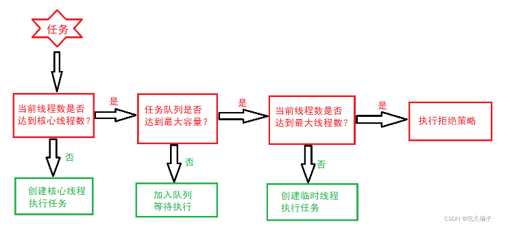
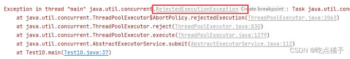
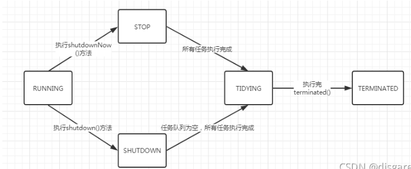

## 1.什么是线程池?

线程池（ThreadPool）是一种基于池化思想管理和使用线程的机制。它是将多个线程预先存储在一个“池子”内，当有任务出现时可以避免重新创建和销毁线程所带来性能开销，只需要从“池子”内取出相应的线程执行对应的任务即可。常见的运用池化思想的有：内存池、数据库连接池。使用线程池的优点如下：

1、降低资源的消耗：使得线程可以重复使用，不需要在创建线程和销毁线程上浪费资源

2、提高响应速度：任务到达时，线程可以不需要创建即可以执行

3、线程的可管理性：线程是稀缺资源，如果无限制的创建会严重影响系统效率，线程池可以对线程进行管理、监控、调优。
————————————————

                            版权声明：本文为博主原创文章，遵循 CC 4.0 BY-SA 版权协议，转载请附上原文出处链接和本声明。

原文链接：https://blog.csdn.net/qq_41571395/article/details/124916679


## 2.ThreadPoolExecutor类是什么？？

[[toc]]

**ThreadPoolExecutor**是Java标准库的线程池，**Executors**本质上是对其进行封装后的类。

**服务（Service）**有诸多定义，要精准描述也比较难。这里的ExecutorService不同于我们Spring里面的Service层，而是更类似于我们操作系统或者说企业级系统层面的服务（进程），这类长时间运行地服务的特点就是有<font color='red'>启动（start up） 和关闭（shut down）</font>的概念。而ThreadPoolExecutor也是如此，会在我们应用（进程）内部开启一个常驻服务用于接收计算任务（compute task）去执行（execute），**当开发者想要退出应用时，要记得主动关闭已开启的ThreadPoolExecutor**，否则你的应用不会主动退出，这是初学者使用ThreadPoolExecutor时比较容易遇到的一个问题。

你可以在下面的源码摘要里看到，ExecutorService接口所定义的shutdown相关的接口。

````java
public class ThreadPoolExecutor extends AbstractExecutorService { /* 略 */ }
public abstract class AbstractExecutorService implements ExecutorService { /* 略 */ }
public interface ExecutorService extends Executor { 
	void shutdown();
	List<Runnable> shutdownNow();
	boolean isShutdown();
	boolean isTerminated();
	/* 略 */
}
````

## 3.ThreadPoolExecutor的参数

````java
public ThreadPoolExecutor(int corePoolSize,
                              int maximumPoolSize,
                              long keepAliveTime,
                              TimeUnit unit,
                              BlockingQueue<Runnable> workQueue,
                              ThreadFactory threadFactory,
                              RejectedExecutionHandler handler) {
````

| 参数名          | 中文名                 | 说明                                                         |
| --------------- | ---------------------- | ------------------------------------------------------------ |
| corePoolSize    | 核心线程数，默认为1    | 默认不会销毁，需要设置allowCoreThreadTimeOut为true时会销毁。核心线程即使处于空闲状态也不会被销毁 |
| maximumPoolSize | 最大线程数量           | 线程数量要大于核心线程数，且不能小于等于0，包括核心线程数和非核心线程数，任务队列满了，才会创建非核心线程。最大线程数量 = 核心线程数 + 临时线程数；临时线程处于空闲状态达到一定时间，就会被销毁。 |
| keepAliveTime   | 临时线程能够存活的时间 | 表示临时线程可以处于空闲状态的最长时间。                     |
| unit            | 空闲时间单位           | 表示临时线程的时间单位 ，可以设置为纳秒、微秒、毫秒、秒、分钟等单位。 |
| workQueue       | 用于保存任务的阻塞队列 | jdk实现的queue在初始化时需要设置队列长度，给线程池传入一个工作队列。 |
| threadFactory   | 线程创建的工厂         | **ThreadFactory**是一个接口，描述了线程的创建方式，我们可以通过**ThreadFactory**对象手动来指定如何创建线程。 |
| handler         | 拒绝策略               | 默认拒绝策略为AbortPolicy，直接抛出异常                      |

### 1.线程池的参数详解？

+ corePoolSize 核心线程数，默认为1

  **设置规则：**
  <font color='red'>CPU密集型</font>(CPU密集型也叫计算密集型，指的是运算较多)：corePoolSize = CPU核数 + 1
  <font color='red'>IO密集型</font>（IO操作较多时）：corePoolSize = CPU核数 * 2

+ maximumPoolSize 最大线程数，默认为Integer.MAX_VALUE

  一般设置为和核心线程数一样

+ keepAliveTime

  线程空闲时间，默认为60s，一般设置为默认60s

+ unit

  时间单位，默认为秒

+ workQueue 阻塞队列

  队列，当线程数目超过核心线程数时用于保存任务的队列。（BlockingQueue workQueue）此队列仅保存实现Runnable接口的任务。（因为线程池的底层BlockingQueue的泛型为Runnable）

+ threadFactory 线程工厂，用来创建线程

  为了统一在创建线程时设置一些参数，如是否守护线程，线程一些特性等，如优先级。通过这个TreadFactory创建出来的线程能保证有相同的特性。

+ handler  拒绝策略，默认是AbortPolicy，会抛出异常

  当线程数已经达到maxPoolSize，且队列已满，会拒绝新任务。
  当线程池被调用shutdown()后，会等待线程池里的任务执行完毕再shutdown。如果在调用shutdown()和线程池真正shutdown之间提交任务，会拒绝新任务。
  **AbortPolicy 丢弃任务，抛运行时异常。
  CallerRunsPolicy 由当前调用的任务线程执行任务。
  DiscardPolicy 忽视，什么都不会发生。
  DiscardOldestPolicy 从队列中踢出最先进入队列（最后一个执行）的任务。**

## 4.ThreadPoolExecutor的执行流程？

1、当线程池中新加入一个任务时，先判断**核心线程数**是否达到最大值，如果没有达到，则创建一个核心线程执行任务，如果达到了，执行第二步；

2、判断当前**任务队列**是否已满，如果没有满，则将任务加入到队列中等待执行；如果满了，则判断当前线程数是否达到最大线程数；（也就说明了任务队列满了，才会创建非核心线程）

3、如果当前线程数没有达到最大线程数，则创建**临时线程**来执行任务，如果达到最大线程数，则执行拒绝策略。



## 5.拒绝策略？

拒绝策略指的是线程池中线程数量达到最大值，<span style="background:#f9eda6;">并且</span>任务队列为满时，来了新任务的处理方式。

标准库中提供了以下几种拒绝策略：

1、ThreadPoolExecutor.AbortPolicy :抛出一个**RejectedExecutionException异常**来拒绝执行任务：



2、ThreadPoolExecutor.CallerRunsPolicy 新加入的任务由线程池的调用线程来执行；


如果调用线程被销毁了，那么新加入的任务就会被丢弃。


3、ThreadPoolExecutor.DiscardOdestPolicy

**丢弃当前还未被执行的任务中的第一个任务**，然后重新执行新加入的任务；如果线程池的调用线程被销毁了，那么新加入的任务就会被丢弃。


4、ThreadPoolExecutor.DiscardPolicy 直接丢弃新加入的任务。


## 6.ThreadPoolExecutor方法

+ submit与execute

**submit有返回值**

**execute没有返回值**

submit可以提交Callable子类对象并获得一个Future类型的对象，比如FutrueTask作为返回值。可以通过Future的get方法来获取返回值，不过get会阻塞调用该方法的线程，因此是同步的，get方法可以带时间，时间一过就会抛出异常

execute方法用于提交不需要返回值的任务，所以无法判断任务是否被线程池执行成功与否，同时由于Runnable的run方法没有抛出异常，因此Runnable实现的线程也不会抛出异常

+ shutdown与shutdownNow

shutdown：关闭线程池，线程池的状态变为SHUTDOWN，不再接受新任务，并执行所有在队列中的任务

shutdownNow：立即关闭线程池，线程池的状态变为STOP，停止执行所有任务，返回在队列中的任务链表

同时，还有isShutdown()方法与isTerminated()方法来判断它是否执行shutdown方法以及是否抛出了所有队列进入了terminated状态。

+ Future与FutureTast

Future是一个接口，里面定义了一些方法：

````java
boolean cancel(boolean mayInterruptIfRunning);如果任务已经启动，执行cancel(true)方法将以中断执行此任务线程的方式来试图停止任务
boolean isCancelled();
boolean isDone();
V get();
V get(long timeout, TimeUnit unit);

````

FutureTask除了实现了Future接口外还实现了Runnable接口（即可以通过Runnable接口实现线程，也可以通过Future取得线程执行完后的结果），因此FutureTask也可以直接提交给Executor执行。

## 7.线程池有5种状态？

1，RUNNING：线程池一旦被创建，就处于 RUNNING 状态，任务数为0，能够接收新任务，对已排队的任务进行处理。

2，SHUTDOWN：不接收新任务，但能处理已排队的任务。调用线程池的shutdown()方法，线程池由RUNNING转变为SHUTDOWN状态。

3，STOP：不接收新任务，不处理已排队的任务，并且会中断正在处理的任务。调用线程池的shutdownNow()方法，线程池由RUNNING或SHUTDOWN转变为STOP状态。

4，TIDYING（整理）：

SHUTDOWN状态下，任务数为 0，其他所有任务已终止，线程池会变为TIDYING状态，会执行terminated方法。线程池中的terminated()方法是空实现，可以重写该方法进行相应的处理
线程池在SHUTDOWN状态，任务队列为空且执行中任务为空，线程池就会由SHUTDOWN转变为TIDYING状态。线程池在STOP状态，线程池中执行中任务为空时，就会由STOP转变为TIDYING状态。

5，TERMINATED（结束）：线程池彻底终止。线程池在TIDYING状态执行完terminated()方法就会由TIDYING转变为TERMINATED状态。



## 8.连接池的线程复用?

````java
private Runnable getTask() {
    boolean timedOut = false;
    for (;;) {
        int c = ctl.get();
        int wc = workerCountOf(c);

        // wc > corePoolSize，表示当前线程池中的线程数量大于核心线程数量；
        // 对于超过核心线程数量的这些线程，需要进行超时控制
        boolean timed = allowCoreThreadTimeOut || wc > corePoolSize;

        if (timed && timedOut) {
            // 如果需要进行超时控制，且上次从缓存队列中获取任务时发生了超时，那么尝试将workerCount减1,即当前活动线程数减1，
            // 如果减1成功，则返回null，这就意味着runWorker()方法中的while循环会被退出，其对应的线程就要销毁了，也就是线程池中少了一个线程了
            if (compareAndDecrementWorkerCount(c))
                return null;
            continue;
        }

        try {
            Runnable r = timed ?
                workQueue.poll(keepAliveTime, TimeUnit.NANOSECONDS) :
                workQueue.take();

            // 注意workQueue中的poll()方法与take()方法的区别
            // poll方式取任务的特点是从缓存队列中取任务,最长等待keepAliveTime的时长，取不到返回null
            // take方式取任务的特点是从缓存队列中取任务，若队列为空,则进入阻塞状态，直到能取出对象为止

            if (r != null)
                return r;
            timedOut = true;
        } catch (InterruptedException retry) {
            timedOut = false;
        }
    }
}

````

上面的代码实现了连接池的线程复用，以及超过核心线程数的线程如何被销毁，核心线程如何被保存，<font color='red'>思路就是把Runnable放进BlockingQueue里，用一定方式调用线程去拿任务。</font>

如果当前活动线程数大于核心线程数，当去缓存队列中取任务的时候，如果缓存队列中没任务了，则等待keepAliveTime的时长，此时还没任务就返回null，这就意味着runWorker()方法中的while循环会被退出，其对应的线程就要销毁了，也就是线程池中少了一个线程了。

因此只要线程池中的线程数大于核心线程数就会这样一个一个地销毁这些多余的线程。

如果当前活动线程数小于等于核心线程数，同样也是去缓存队列中取任务，但当缓存队列中没任务了，就会进入阻塞状态，直到能取出任务为止，因此这个线程是处于阻塞状态的，并不会因为缓存队列中没有任务了而被销毁。这样就保证了线程池有N个线程是活的，可以随时处理任务，从而达到重复利用的目的。

所以最大线程与核心线程的不同，就是调用获取任务的方法不同，一个take一个是poll，这两个方法都由BlockingQueue友情提供。

## 9.阻塞队列？

### 1.阻塞队列的种类？

+ **ThreadPoolTaskExecutor**使用一个阻塞队列来存储等待执行的任务。在Spring中，有三种主要的阻塞队列实现可供选择：

+ **LinkedBlockingQueue:** 这是一个基于链表的阻塞队列。它具有无界容量，意味着它可以一直增长，直到系统耗尽内存。
+ **SynchronousQueue:** 这是一个没有容量的阻塞队列。每个插入操作都必须等待另一个线程的对应移除操作，因此此队列维持着零元素。
+ **ArrayBlockingQueue:** 这是一个基于数组的阻塞队列，其容量是固定的。它可以预先指定容量，因此不会耗尽系统资源。

### 2.阻塞队列的特性？

+ **LinkedBlockingQueue：**由于其无界特性，可以在处理大量任务时提供更好的吞吐量。然而，可能会导致内存溢出。
+ **SynchronousQueue：**适用于负载较轻的场景，因为它没有存储能力，任务必须立即由另一个线程执行。
+ **ArrayBlockingQueue：**容量固定，可以避免内存溢出问题。但当达到容量上限时，会阻塞新任务的提交。

### 3.适用业务场景？

选择适当的阻塞队列取决于应用程序的特定需求和性能目标。以下是一些建议的业务场景：

+ 如果应用程序需要处理大量短时任务，并且对内存使用没有严格限制，可以考虑使用LinkedBlockingQueue，以提高吞吐量。
+ 对于高并发但负载较轻的场景，可以选择SynchronousQueue，确保任务能够立即传递给工作线程，避免额外的队列开销。
+ 如果应用程序需要限制内存使用，并希望在达到容量限制时阻塞新任务提交，可以选择ArrayBlockingQueue。

### 4.实际业务场景举例？

+ **LinkedBlockingQueue:**假设我们有一个电商平台，需要处理商品库存的增减操作。这是一个高并发的场景，因为用户可能同时对同一商品进行多次操作。

  由于这个场景下任务是短时且高并发的，我们可以选择LinkedBlockingQueue。这样可以确保在高峰时期能够快速处理大量的库存变更任务，提高系统的吞吐量。虽然队列理论上是无界的，但在实践中，我们可以通过监控和调整队列容量，以防止潜在的内存问题。

````java
ThreadPoolTaskExecutor executor = new ThreadPoolTaskExecutor();
executor.setCorePoolSize(10);
executor.setMaxPoolSize(20);
// 无界队列
executor.setQueueCapacity(Integer.MAX_VALUE); 
executor.setQueue(new LinkedBlockingQueue<>());
executor.initialize();
````

+ **ArrayBlockingQueue:**假设我们有一个消息队列，需要异步地处理不同类型的消息。消息的产生速度可能不一致，因此我们需要一个灵活的队列来适应各种负载情况。

  在这种情况下，我们可以选择ArrayBlockingQueue，通过限制队列的容量，以防止消息队列消费者在处理速度慢于消息产生速度时耗尽系统资源。

````java
ThreadPoolTaskExecutor executor = new ThreadPoolTaskExecutor();
executor.setCorePoolSize(5);
executor.setMaxPoolSize(10);
 // 有界队列
executor.setQueueCapacity(100);
executor.setQueue(new ArrayBlockingQueue<>(100));
executor.initialize();
````

+ **SynchronousQueue:** 适用于一些特定的业务场景，主要特点是它具有零容量，即每个插入操作必须等待另一个线程的对应移除操作。以下是一些 SynchronousQueue 适用的实际业务场景：

  直接执行任务当希望任务能够立即传递给工作线程，而不必在队列中等待，可以选择 SynchronousQueue。这在某些负载较轻、需要实时性较高的场景下非常有用，例如任务的执行时间非常短，且需要即时响应。
  负载较轻的高并发系统在负载相对较轻的系统中，使用 SynchronousQueue 可以减少队列的开销。因为该队列不会保留任何任务，而是直接将任务交给工作线程，因此不会在队列中存储任务对象。
  避免任务排队在某些场景下，我们可能更关心任务的即时执行而不是排队等待执行。SynchronousQueue 可以确保任务不会在队列中排队等待，而是立即传递给可用的线程。
  避免资源浪费对于那些执行时间短、资源占用少的任务，使用 SynchronousQueue 可以避免资源浪费，因为不需要为任务在队列中占用额外的存储空间。
  任务处理时间短暂且不可预测的场景如果任务的执行时间非常短，且难以准确预测，那么使用 SynchronousQueue 可能更加合适。这样可以尽可能地减少任务等待时间，提高系统的响应性。
  需要注意的是，由于 SynchronousQueue 不存储任务，所以在一些高负载或任务执行时间较长的场景下，可能会导致线程池频繁创建新线程，影响性能。因此，在选择队列类型时，应该根据具体的业务需求和系统特点进行合理的权衡和选择。


## 参考文章

https://blog.csdn.net/torane/article/details/128349539

https://blog.csdn.net/trusause/article/details/125747447

https://blog.csdn.net/m0_67683346/article/details/127024812

https://blog.csdn.net/sekever/article/details/114898973

https://blog.csdn.net/weixin_42313773/article/details/134823983

https://www.cnblogs.com/aspirant/p/8657801.html