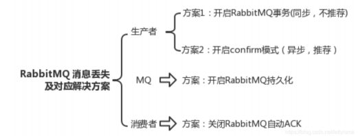
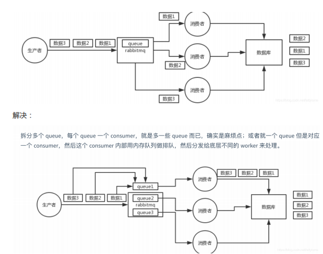

# mq篇

[[toc]]

## 1.**为什么要使用**MQ?

**核心：解耦****,****异步****,****削峰****1****）解耦：**A 系统发送数据到 BCD 三个系统，通过接口调用发送。如果 E 系统也要这个数据呢？那

如果 C 系统现在不需要了呢？A 系统负责人几乎崩溃......A 系统跟其它各种乱七八糟的系统严重耦

合，A 系统产生一条比较关键的数据，很多系统都需要 A 系统将这个数据发送过来。如果使用

MQ，A 系统产生一条数据，发送到 MQ 里面去，哪个系统需要数据自己去 MQ 里面消费。如果新

系统需要数据，直接从 MQ 里消费即可；如果某个系统不需要这条数据了，就取消对 MQ 消息的消

费即可。这样下来，A 系统压根儿不需要去考虑要给谁发送数据，不需要维护这个代码，也不需要

考虑人家是否调用成功、失败超时等情况。

就是一个系统或者一个模块，调用了多个系统或者模块，互相之间的调用很复杂，维护起来很麻

烦。但是其实这个调用是不需要直接同步调用接口的，如果用 MQ 给它异步化解耦。

**（****2****）异步：**A 系统接收一个请求，需要在自己本地写库，还需要在 BCD 三个系统写库，自己本地

写库要 3ms，BCD 三个系统分别写库要 300ms、450ms、200ms。最终请求总延时是 3 + 300 +

450 + 200 = 953ms，接近 1s，用户感觉搞个什么东西，慢死了慢死了。用户通过浏览器发起请

求。如果使用 MQ，那么 A 系统连续发送 3 条消息到 MQ 队列中，假如耗时 5ms，A 系统从接受一

个请求到返回响应给用户，总时长是 3 + 5 = 8ms。

**（****3****）削峰：**减少高峰时期对服务器压力。

欢迎关注微信公众号：Java后端技术全栈

## 2. **MQ有什么优缺点**？

优点上面已经说了，就是在特殊场景下有其对应的好处，解耦、异步、削峰。

**缺点有以下几个：**

**系统可用性降低** 系统引入的外部依赖越多，越容易挂掉。万一 MQ 挂了，MQ 一挂，整套系统崩

溃，你不就完了？

**系统复杂度提高** 硬生生加个 MQ 进来，你怎么保证消息没有重复消费？怎么处理消息丢失的情况？

怎么保证消息传递的顺序性？问题一大堆。

**一致性问题** A 系统处理完了直接返回成功了，人都以为你这个请求就成功了；但是问题是，要是

BCD 三个系统那里，BD 两个系统写库成功了，结果 C 系统写库失败了，咋整？你这数据就不一致

了。

## 3.**KafkaActiveMQ、RabbitMQ、RocketMQ** **都有什么区别？**

对于吞吐量来说kafka和RocketMQ支撑高吞吐，ActiveMQ和RabbitMQ比他们低一个数量级。对于

延迟量来说RabbitMQ是最低的。

**1.****从社区活跃度**按照目前网络上的资料，RabbitMQ 、activeM 、ZeroMQ 三者中，综合来看，RabbitMQ 是首

选。

**2.****持久化消息比较**

ActiveMq 和RabbitMq 都支持。持久化消息主要是指我们机器在不可抗力因素等情况下挂掉了，消

息不会丢失的机制。

**3.****综合技术实现**

可靠性、灵活的路由、集群、事务、高可用的队列、消息排序、问题追踪、可视化管理工具、插件

系统等等。

RabbitMq / Kafka 最好，ActiveMq 次之，ZeroMq 最差。当然ZeroMq 也可以做到，不过自己必

须手动写代码实现，代码量不小。尤其是可靠性中的：持久性、投递确认、发布者证实和高可用

性。

**4.****高并发**

毋庸置疑，RabbitMQ 最高，原因是它的实现语言是天生具备高并发高可用的erlang 语言。

**5.****比较关注的比较，** **RabbitMQ** **和** **Kafka**

RabbitMq 比Kafka 成熟，在可用性上，稳定性上，可靠性上， RabbitMq 胜于 Kafka （理论

上）。

另外，Kafka 的定位主要在日志等方面， 

因为Kafka 设计的初衷就是处理日志的，可以看做是一个

日志（消息）系统一个重要组件，针对性很强，所以 如果业务方面还是建议选择 RabbitMq 。

还有就是，Kafka 的性能（吞吐量、TPS ）比RabbitMq 要高出来很多。

## 4.如何保证高可用的？

RabbitMQ 是比较有代表性的，因为是**基于主从**（非分布式）做高可用性的，我们就以 RabbitMQ

为例子讲解第一种 MQ 的高可用性怎么实现。RabbitMQ 有三种模式：单机模式、普通集群模式、

镜像集群模式。

单机模式，就是 Demo 级别的，一般就是你本地启动了玩玩儿的?，没人生产用单机模式

普通集群模式，意思就是在多台机器上启动多个 RabbitMQ 实例，每个机器启动一个。你**创建的**

**queue****，只会放在一个** **RabbitMQ** **实例上**，但是每个实例都同步 queue 的元数据（元数据可以认

为是 queue 的一些配置信息，通过元数据，可以找到 queue 所在实例）。你消费的时候，实际上

如果连接到了另外一个实例，那么那个实例会从 queue 所在实例上拉取数据过来。**这方案主要是提**

**高吞吐量的**，就是说让集群中多个节点来服务某个 queue 的读写操作。镜像集群模式：这种模式，才是所谓的 RabbitMQ 的高可用模式。跟普通集群模式不一样的是，在

镜像集群模式下，你创建的 queue，无论元数据还是 queue 里的消息都会**存在于多个实例上**，就

是说，每个 RabbitMQ 节点都有这个 queue 的一个完整镜像，包含 queue 的全部数据的意思。然

后每次你写消息到 queue 的时候，都会自动把消息同步到多个实例的 queue 上。RabbitMQ 有很

好的管理控制台，就是在后台新增一个策略，这个策略是镜像集群模式的策略，指定的时候是可以

要求数据同步到所有节点的，也可以要求同步到指定数量的节点，再次创建 queue 的时候，应用这

个策略，就会自动将数据同步到其他的节点上去了。这样的话，好处在于，你任何一个机器宕机

了，没事儿，其它机器（节点）还包含了这个 queue 的完整数据，别的 consumer 都可以到其它

节点上去消费数据。坏处在于，第一，这个性能开销也太大了吧，消息需要同步到所有机器上，导

致网络带宽压力和消耗很重！RabbitMQ 一个 queue 的数据都是放在一个节点里的，镜像集群下，

也是每个节点都放这个 queue 的完整数据。

Kafka 一个最基本的架构认识：由多个 broker 组成，每个 broker 是一个节点；你创建一个

topic，这个 topic 可以划分为多个 partition，每个 partition 可以存在于不同的 broker 上，每个

partition 就放一部分数据。这就是天然的分布式消息队列，就是说一个 topic 的数据，是**分散放在**

**多个机器上的，每个机器就放一部分数据**。Kafka 0.8 以后，提供了 HA 机制，就是 replica（复制

品） 

副本机制。每个 partition 的数据都会同步到其它机器上，形成自己的多个 replica 副本。所有

replica 会选举一个 leader 出来，那么生产和消费都跟这个 leader 打交道，然后其他 replica 就是

follower。写的时候，leader 会负责把数据同步到所有 follower 上去，读的时候就直接读 leader

上的数据即可。只能读写 leader？很简单，要是你可以随意读写每个 follower，那么就要 care 数

据一致性的问题，系统复杂度太高，很容易出问题。Kafka 会均匀地将一个 partition 的所有

replica 分布在不同的机器上，这样才可以提高容错性。因为如果某个 broker 宕机了，没事儿，那

个 broker上面的 partition 在其他机器上都有副本的，如果这上面有某个 partition 的 leader，那

么此时会从 follower 中重新选举一个新的 leader 出来，大家继续读写那个新的 leader 即可。这就

有所谓的高可用性了。写数据的时候，生产者就写 leader，然后 leader 将数据落地写本地磁盘，

接着其他 follower 自己主动从 leader 来 pull 数据。一旦所有 follower 同步好数据了，就会发送

ack 给 leader，leader 收到所有 follower 的 ack 之后，就会返回写成功的消息给生产者。（当

然，这只是其中一种模式，还可以适当调整这个行为）消费的时候，只会从 leader 去读，但是只有

当一个消息已经被所有 follower 都同步成功返回 ack 的时候，这个消息才会被消费者读到。

## 5.**如何保证消息的可靠传输？如果消息丢了怎么办**？

数据的丢失问题，可能出现在生产者、MQ、消费者中

生产者丢失：生产者将数据发送到 RabbitMQ 的时候，可能数据就在半路给搞丢了，因为网络问题

啥的，都有可能。此时可以选择用 RabbitMQ 提供的事务功能，就是生产者发送数据之前开启

RabbitMQ 事务channel.txSelect，然后发送消息，如果消息没有成功被 RabbitMQ 接收到，那么

生产者会收到异常报错，此时就可以回滚事务channel.txRollback，然后重试发送消息；如果收到

了消息，那么可以提交事务channel.txCommit。吞吐量会下来，因为太耗性能。所以一般来说，如

果你要确保说写 RabbitMQ 的消息别丢，可以开启confifirm模式，在生产者那里设置开启confifirm模

式之后，你每次写的消息都会分配一个唯一的 id，然后如果写入了 RabbitMQ 中，RabbitMQ 会给你回传一个ack消息，告诉你说这个消息 ok 了。如果 RabbitMQ 没能处理这个消息，会回调你一个

nack接口，告诉你这个消息接收失败，你可以重试。而且你可以结合这个机制自己在内存里维护每

个消息 id 的状态，如果超过一定时间还没接收到这个消息的回调，那么你可以重发。事务机制和

cnofifirm机制最大的不同在于，事务机制是同步的，你提交一个事务之后会阻塞在那儿，但是

confifirm机制是异步的，你发送个消息之后就可以发送下一个消息，然后那个消息RabbitMQ 接收

了之后会异步回调你一个接口通知你这个消息接收到了。所以一般在生产者这块避免数据丢失，都

是用confifirm机制的。

MQ中丢失：就是 RabbitMQ 自己弄丢了数据，这个你必须开启 RabbitMQ 的持久化，就是消息写

入之后会持久化到磁盘，哪怕是 RabbitMQ 自己挂了，恢复之后会自动读取之前存储的数据，一般

数据不会丢。设置持久化有两个步骤：创建 queue 的时候将其设置为持久化，这样就可以保证

RabbitMQ 持久化 queue 的元数据，但是不会持久化 queue 里的数据。第二个是发送消息的时候

将消息的 deliveryMode 设置为 2，就是将消息设置为持久化的，此时 RabbitMQ 就会将消息持久

化到磁盘上去。必须要同时设置这两个持久化才行，RabbitMQ 哪怕是挂了，再次重启，也会从磁

盘上重启恢复 queue，恢复这个 queue 里的数据。持久化可以跟生产者那边的confifirm机制配合起

来，只有消息被持久化到磁盘之后，才会通知生产者ack了，所以哪怕是在持久化到磁盘之前，

RabbitMQ 挂了，数据丢了，生产者收不到ack，你也是可以自己重发的。注意，哪怕是你给

RabbitMQ 开启了持久化机制，也有一种可能，就是这个消息写到了 RabbitMQ 中，但是还没来得

及持久化到磁盘上，结果不巧，此时 RabbitMQ 挂了，就会导致内存里的一点点数据丢失。

消费端丢失：你消费的时候，刚消费到，还没处理，结果进程挂了，比如重启了，那么就尴尬了，

RabbitMQ 认为你都消费了，这数据就丢了。这个时候得用 RabbitMQ 提供的ack机制，简单来

说，就是你关闭 RabbitMQ 的自动ack，可以通过一个 api 来调用就行，然后每次你自己代码里确

保处理完的时候，再在程序里ack一把。这样的话，如果你还没处理完，不就没有ack？那

RabbitMQ 就认为你还没处理完，这个时候 RabbitMQ 会把这个消费分配给别的 consumer 去处

理，消息是不会丢的。

## **6.如何保证消息的顺序性**?

先看看顺序会错乱的场景：RabbitMQ：一个 queue，多个 consumer，这不明显乱了；

## **7. 如何解决消息队列的延时以及过期失效问题？消息队列满了以后该怎么处理？有几百万消息持续积压几小时，说说怎么解决？**

消息积压处理办法：临时紧急扩容：

先修复 consumer 的问题，确保其恢复消费速度，然后将现有 cnosumer 都停掉。 新建一个

topic，partition 是原来的 10 倍，临时建立好原先 10 倍的 queue 数量。 然后写一个临时的分发

数据的 consumer 程序，这个程序部署上去消费积压的数据，消费之后不做耗时的处理，直接均匀

轮询写入临时建立好的 10 倍数量的 queue。 接着临时征用 10 倍的机器来部署 consumer，每一

批 consumer 消费一个临时 queue 的数据。这种做法相当于是临时将 queue 资源和 consumer 资

源扩大 10 倍，以正常的 10 倍速度来消费数据。 等快速消费完积压数据之后，得恢复原先部署的

架构，重新用原先的 consumer 机器来消费消息。 MQ中消息失效：假设你用的是 RabbitMQ，

RabbtiMQ 是可以设置过期时间的，也就是 TTL。如果消息在 queue 中积压超过一定的时间就会被

RabbitMQ 给清理掉，这个数据就没了。那这就是第二个坑了。这就不是说数据会大量积压在 mq

里，而是大量的数据会直接搞丢。我们可以采取一个方案，就是批量重导，这个我们之前线上也有

类似的场景干过。就是大量积压的时候，我们当时就直接丢弃数据了，然后等过了高峰期以后，比

如大家一起喝咖啡熬夜到晚上12点以后，用户都睡觉了。这个时候我们就开始写程序，将丢失的那

批数据，写个临时程序，一点一点的查出来，然后重新灌入 mq 里面去，把白天丢的数据给他补回来。也只能是这样了。假设 1 万个订单积压在 mq 里面，没有处理，其中 1000 个订单都丢了，你

只能手动写程序把那 1000 个订单给查出来，手动发到 mq 里去再补一次。

mq消息队列块满了：如果消息积压在 mq 里，你很长时间都没有处理掉，此时导致 mq 都快写满

了，咋办？这个还有别的办法吗？没有，谁让你第一个方案执行的太慢了，你临时写程序，接入数

据来消费，消费一个丢弃一个，都不要了，快速消费掉所有的消息。然后走第二个方案，到了晚上

再补数据吧。

## **8.让你来设计一个消息队列，你会怎么设计**?

比如说这个消息队列系统，我们从以下几个角度来考虑一下：

首先这个 mq 得支持可伸缩性吧，就是需要的时候快速扩容，就可以增加吞吐量和容量，那怎么

搞？设计个分布式的系统呗，参照一下 kafka 的设计理念，broker -> topic -> partition，每个

partition 放一个机器，就存一部分数据。如果现在资源不够了，简单啊，给 topic 增加 partition，

然后做数据迁移，增加机器，不就可以存放更多数据，提供更高的吞吐量了？

其次你得考虑一下这个 mq 的数据要不要落地磁盘吧？那肯定要了，落磁盘才能保证别进程挂了数

据就丢了。那落磁盘的时候怎么落啊？顺序写，这样就没有磁盘随机读写的寻址开销，磁盘顺序读

写的性能是很高的，这就是 kafka 的思路。

其次你考虑一下你的 mq 的可用性啊？这个事儿，具体参考之前可用性那个环节讲解的 kafka 的高

可用保障机制。多副本 -> leader & follower -> broker 挂了重新选举 leader 即可对外服务。

能不能支持数据 0 丢失啊？可以的，参考我们之前说的那个 kafka 数据零丢失方案。