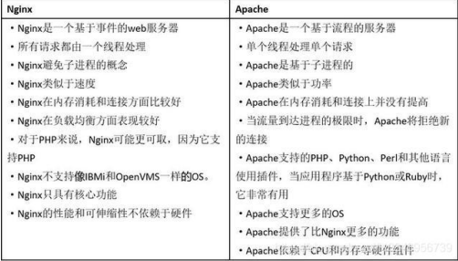

# nginx篇

[[toc]]

## 1.**简述一下什么是**Nginx，它有什么优势和功能?

Nginx是一个web服务器和方向代理服务器，用于HTTP、HTTPS、SMTP、POP3和IMAP协议。因

它的稳定性、丰富的功能集、示例配置文件和低系统资源的消耗而闻名。

Nginx---Ngine X，是一款免费的、自由的、开源的、高性能HTTP服务器和反向代理服务器；

也是一个IMAP、POP3、SMTP代理服务器；Nginx以其高性能、稳定性、丰富的功能、简单的

配置和低资源消耗而闻名。也就是说Nginx本身就可以托管网站（类似于Tomcat一样），进行Http服务处理，也可以作为

反向代理服务器 、负载均衡器和HTTP缓存。

Nginx 解决了服务器的C10K（就是在一秒之内连接客户端的数目为10k即1万）问题。它的设

计不像传统的服务器那样使用线程处理请求，而是一个更加高级的机制—事件驱动机制，是一

种异步事件驱动结构。

优点：

**（****1****）更快** 这表现在两个方面：一方面，在正常情况下，单次请求会得到更快的响应；另一方面，

在高峰期（如有数以万计的并发请求），Nginx可以比其他Web服务器更快地响应请求。

**（****2****）高扩展性，跨平台** Nginx的设计极具扩展性，它完全是由多个不同功能、不同层次、不同类型

且耦合度极低的模块组成。因此，当对某一个模块修复Bug或进行升级时，可以专注于模块自身，

无须在意其他。而且在HTTP模块中，还设计了HTTP过滤器模块：一个正常的HTTP模块在处理完请

求后，会有一串HTTP过滤器模块对请求的结果进行再处理。这样，当我们开发一个新的HTTP模块

时，不但可以使用诸如HTTP核心模块、events模块、log模块等不同层次或者不同类型的模块，还

可以原封不动地复用大量已有的HTTP过滤器模块。这种低耦合度的优秀设计，造就了Nginx庞大的

第三方模块，当然，公开的第三方模块也如官方发布的模块一样容易使用。 Nginx的模块都是嵌入

到二进制文件中执行的，无论官方发布的模块还是第三方模块都是如此。这使得第三方模块一样具

备极其优秀的性能，充分利用Nginx的高并发特性，因此，许多高流量的网站都倾向于开发符合自

己业务特性的定制模块。

**（****3****）高可靠性：用于反向代理，宕机的概率微乎其微** 高可靠性是我们选择Nginx的最基本条件，因

为Nginx的可靠性是大家有目共睹的，很多家高流量网站都在核心服务器上大规模使用Nginx。

Nginx的高可靠性来自于其核心框架代码的优秀设计、模块设计的简单性；另外，官方提供的常用

模块都非常稳定，每个worker进程相对独立，master进程在1个worker进程出错时可以快速“拉

起”新的worker子进程提供服务。

**（****4****）低内存消耗** 一般情况下，10 000个非活跃的HTTP Keep-Alive连接在Nginx中仅消耗2.5MB的

内存，这是Nginx支持高并发连接的基础。

**（****5****）单机支持****10****万以上的并发连接** 这是一个非常重要的特性！随着互联网的迅猛发展和互联网用

户数量的成倍增长，各大公司、网站都需要应付海量并发请求，一个能够在峰值期顶住10万以上并

发请求的Server，无疑会得到大家的青睐。理论上，Nginx支持的并发连接上限取决于内存，10万

远未封顶。当然，能够及时地处理更多的并发请求，是与业务特点紧密相关的。

**（****6****）热部署** master管理进程与worker工作进程的分离设计，使得Nginx能够提供热部署功能，即

可以在7×24小时不间断服务的前提下，升级Nginx的可执行文件。当然，它也支持不停止服务就更

新配置项、更换日志文件等功能。**（****7****）最自由的****BSD****许可协议** 这是Nginx可以快速发展的强大动力。BSD许可协议不只是允许用户免

费使用Nginx，它还允许用户在自己的项目中直接使用或修改Nginx源码，然后发布。这吸引了无数

开发者继续为Nginx贡献自己的智慧。 以上7个特点当然不是Nginx的全部，拥有无数个官方功能模

块、第三方功能模块使得Nginx能够满足绝大部分应用场景，这些功能模块间可以叠加以实现更加

强大、复杂的功能，有些模块还支持Nginx与Perl、Lua等脚本语言集成工作，大大提高了开发效

率。这些特点促使用户在寻找一个Web服务器时更多考虑Nginx。 选择Nginx的核心理由还是它能

在支持高并发请求的同时保持高效的服务。

## 2. **Nginx是如何处理一个HTTP请求的呢**？

Nginx 是一个高性能的 Web 服务器，能够同时处理大量的并发请求。它结合多进程机制和异步机制

，异步机制使用的是异步非阻塞方式 ，接下来就给大家介绍一下 Nginx 的多线程机制和异步非阻塞

机制 。

**1****、多进程机制**

服务器每当收到一个客户端时，就有 服务器主进程 （ master process ）生成一个 子进程（

worker process ）出来和客户端建立连接进行交互，直到连接断开，该子进程就结束了。

使用进程的好处是各个进程之间相互独立，不需要加锁，减少了使用锁对性能造成影响，同时降低

编程的复杂度，降低开发成本。其次，采用独立的进程，可以让进程互相之间不会影响 ，如果一个

进程发生异常退出时，其它进程正常工作， master 进程则很快启动新的 worker 进程，确保服务

不会中断，从而将风险降到最低。

缺点是操作系统生成一个子进程需要进行 内存复制等操作，在资源和时间上会产生一定的开销。当

有大量请求时，会导致系统性能下降 。

**2****、异步非阻塞机制**

每个工作进程 使用 异步非阻塞方式 ，可以处理 多个客户端请求 。

当某个 工作进程 接收到客户端的请求以后，调用 IO 进行处理，如果不能立即得到结果，就去 处理

其他请求 （即为 非阻塞 ）；而 客户端 在此期间也 无需等待响应 ，可以去处理其他事情（即为 异

步 ）。

当 IO 返回时，就会通知此 工作进程 ；该进程得到通知，暂时 挂起 当前处理的事务去 响应客户端

请求 。

## 3.**列举一些Nginx的特性**？

1. Nginx服务器的特性包括：

2. 反向代理/L7负载均衡器

3. 嵌入式Perl解释器

4. 动态二进制升级

5. 可用于重新编写URL，具有非常好的PCRE支持

## 4.**请列举Nginx和Apache** **之间的不同点**？



## 5.在Nginx中，如何使用未定义的服务器名称来阻止处理请求？

只需将请求删除的服务器就可以定义为：

````xml
Server{
listen 80;
server_name "";
return 444;
}
````

这里，服务器名被保留为一个空字符串，它将在没有“主机”头字段的情况下匹配请求，而一个特殊

的Nginx的非标准代码444被返回，从而终止连接。

一般推荐 worker 进程数与CPU内核数一致，这样一来不存在大量的子进程生成和管理任务，避免

了进程之间竞争CPU 资源和进程切换的开销。而且 Nginx 为了更好的利用 多核特性 ，提供了 CPU

亲缘性的绑定选项，我们可以将某一个进程绑定在某一个核上，这样就不会因为进程的切换带来

Cache 的失效。

对于每个请求，有且只有一个工作进程 对其处理。首先，每个 worker 进程都是从 master进程

fork 过来。在 master 进程里面，先建立好需要 listen 的 socket（listenfd） 

之后，然后再 fork 出

多个 worker 进程。所有 worker 进程的 listenfd 会在新连接到来时变得可读 ，为保证只有一个进程处理该连接，所有

worker 进程在注册 listenfd 读事件前抢占 accept_mutex ，抢到互斥锁的那个进程注册 listenfd 读

事件 ，在读事件里调用 accept 接受该连接。

当一个 worker 进程在 accept 这个连接之后，就开始读取请求、解析请求、处理请求，产生数据

后，再返回给客户端 ，最后才断开连接。这样一个完整的请求就是这样的了。我们可以看到，一个

请求，完全由 worker 进程来处理，而且只在一个 worker 进程中处理。

在 Nginx 服务器的运行过程中， 

主进程和工作进程 需要进程交互。交互依赖于 Socket 实现的管道

来实现。

## **6.**请解释Nginx服务器上的Master和Worker进程分别是什么?

主程序 Master process 启动后，通过一个 for 循环来 接收 和 处理外部信号 ；

主进程通过 fork() 函数产生 worker 子进程 ，每个子进程执行一个 for循环来实现Nginx服务器

对事件的接收和处理 。

## **7. **请解释代理中的正向代理和反向代理**？**

首先，代理服务器一般指局域网内部的机器通过代理服务器发送请求到互联网上的服务器，代理服

务器一般作用在客户端。例如：GoAgent翻墙软件。我们的客户端在进行翻墙操作的时候，我们使

用的正是正向代理，通过正向代理的方式，在我们的客户端运行一个软件，将我们的HTTP请求转发

到其他不同的服务器端，实现请求的分发。

反向代理服务器作用在服务器端，它在服务器端接收客户端的请求，然后将请求分发给具体的服务

器进行处理，然后再将服务器的相应结果反馈给客户端。Nginx就是一个反向代理服务器软件。

从上图可以看出：客户端必须设置正向代理服务器，当然前提是要知道正向代理服务器的IP地址，

还有代理程序的端口。 反向代理正好与正向代理相反，对于客户端而言代理服务器就像是原始服务

器，并且客户端不需要进行任何特别的设置。客户端向反向代理的命名空间（name-space）中的

内容发送普通请求，接着反向代理将判断向何处（原始服务器）转交请求，并将获得的内容返回给

客户端。

## **8.**解释Nginx用途?

Nginx服务器的最佳用法是在网络上部署动态HTTP内容，使用SCGI、WSGI应用程序服务器、用于

脚本的FastCGI处理程序。它还可以作为负载均衡器。