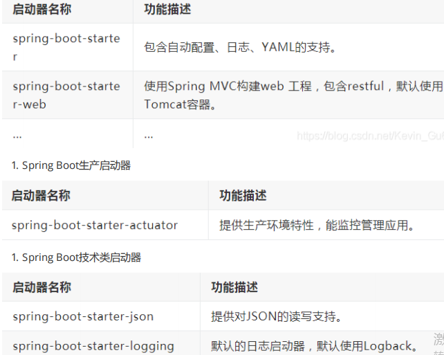

# springboot篇

[[toc]]

## 1.**为什么要用**SpringBoot?

Spring Boot 优点非常多，如：

+ 独立运行：Spring Boot而且内嵌了各种servlet容器，Tomcat、Jetty等，现在不再需要打成war包部署到容器中，Spring Boot只要打成一个可执行的jar包就能独立运行，所有的依赖包都在一个jar包内。

+ 简化配置：spring-boot-starter-web启动器自动依赖其他组件，简少了maven的配置。 
+ 自动配置：Spring Boot能根据当前类路径下的类、jar包来自动配置bean，如添加一个spring-boot-starter-web启动器就能拥有web的功能，无需其他配置。

+ 无代码生成和XML配置：Spring Boot配置过程中无代码生成，也无需XML配置文件就能完成所有配置工作，这一切都是借助于条件注解完成的，这也是Spring4.x的核心功能之一。

+ 应用监控：Spring Boot提供一系列端点可以监控服务及应用，做健康检测。

## 2.Spring Boot的核心注解是哪个？

启动类上面的注解@SpringBootApplication，是 Spring Boot 的核心注解，主要组合包含了以下 3 个注解：

+ @SpringBootConfiguration：这个注解是@Configuration的一个特殊形式，它表明当前类是配置类，并且由Spring容器进行管理。

+ @EnableAutoConfiguration：打开自动配置的功能，也可以关闭某个自动配置的选项，如关闭数据源自动配置功能： @SpringBootApplication(exclude = { DataSourceAutoConfifiguration.class

})。

+ @ComponentScan：用于自动扫描并加载符合条件的组件（比如@Component和@Service等注解标记类）到Spring容器中。

## 3.**如何理解** Spring Boot中的Starter？

Spring Boot中的Starter是一系列预设的依赖集合，作用主要是**简化依赖管理和自动化配置**。

+ 简化依赖管理：Starter通过将常用库和框架的组合预先打包，减少了手动添加和管理这些依赖的工作量。
+ 自动配置：Starter与Spring Boot的自动配置机制紧密集成，能够根据添加的Starter自动应用合适配置。
+ 约定优于配置：Starter体现了Spring Boot的核心理念之一，即约定优于配置。通过使用Starter，开发者可以遵循一套默认的约定，而无需进行大量的自定义配置。
+ 可扩展性：虽然Starter提供了一套默认的配置，但开发者仍然可以根据需要覆盖这些配置，以满足特定的业务需求。

Starters分类：

1. Spring Boot应用类启动器

## 4. 如何在Spring Boot启动的时候运行一些特定的代码?

如果你想在Spring Boot启动的时候运行一些特定的代码，你可以实现接口**ApplicationRunner**或者**CommandLineRunner**，这两个接口实现方式一样，它们都只提供了一个run方法。

**CommandLineRunner**：启动获取命令行参数

## 5. Spring Boot中的监视器是什么?

Spring boot actuator是spring启动框架中的重要功能之一。Spring boot监视器可帮助您访问生产环境中正在运行的应用程序的当前状态。有几个指标必须在生产环境中进行检查和监控。即使一些外部应用程序可能正在使用这些服务来向相关人员触发警报消息。监视器模块公开了一组可直接作为HTTP URL访问的REST端点来检查状态。

## 6.如何使用Spring Boot实现异常处理?

Spring提供了一种使用**ControllerAdvice**处理异常的非常有用的方法。 我们通过实现一个

ControlerAdvice类，来处理控制器类抛出的所有异常。

## 7.springboot常用的starter有哪些？

spring-boot-starter-web 嵌入tomcat和web开发需要servlet与jsp支持

spring-boot-starter-data-jpa 数据库支持

spring-boot-starter-data-redis redis数据库支持

spring-boot-starter-data-solr solr支持

mybatis-spring-boot-starter 第三方的mybatis集成starter

## 8.SpringBoot的启动流程？

1.**启动main方法**：Spring Boot应用的启动通常是从带有@SpringBootApplication注解类的main方法开始执行的。这个main方法会调用SpringApplication.run()方法来启动应用。

2.**初始化SpringApplication**：在SpringApplication.run()方法中，首先会创建一个SpringApplication对象，并加载各种配置，包括环境变量、资源等。

3.**准备环境**：Spring Boot会根据项目的配置和类路径中的类来准备应用的运行环境，这包括确定要加载的组件、自动配置的条件等。

4.**加载配置**：接着，Spring Boot会加载外部配置（如application.properties或application.yml文件），并根据这些配置来调整自动配置的行为。

5.**执行自动配**置：Spring Boot会根据项目中的类路径、已定义的bean以及外部配置来决定哪些自动配置应该被应用。这是通过一些列的条件注解来实现的，如@ConditionalOnclass、@ConditionalonMissingBean等。

6.**创建和管理bean**:Spring Boot会自动扫描并加载符合条件的组件，并将它们注册为Spring容器中的bean。

7.**处理Web应用**：如果项目中包含了web相关的Starter（如spring-boot-starter-web），Spring Boot会自动配置嵌入式的Web服务器（默认是Tomcat）和Spring MVC框架。

8.**启动嵌入式Web服务器**：最后，如果应用是一个web应用，Spring Boot会启动内嵌的Web服务器，并监听指定的端口，等待接收请求。

## 9.Spring Boot自动配置的原理是什么？

Spring Boot的自动配置原理是通过一系列的智能扫描和条件注解来实现的，确保只有需要的配置被加载和应用。

+ **智能扫描**：Spring Boot在启动时会扫描项目中的组件，包括类、配置等，在这一过程由@ComponentScan完成，通常是通过@SpringBootApplication注解触发的。
+ **条件注解**：Spring Boot使用条件注解（如@ConditionalOnClass、@ConditionalOnMissingBean等）来决定是否应用某个配置。这些条件可以基于类路径中是否存在某个类或者某个bean是否已经存在等因素。
+ **外部化配置**：Spring Boot允许开发者通过外部配置（如application.properties或者application.yml文件）来覆盖自动配置默认值，使得应用程序更加灵活和易于定制。
+ **自动配置导入选择器**：当Spring Boot项目启动时，会先导入AutoConfigurationImportSelector，这个类会帮助选择所有候选的配置。这些配置类的位置存在于MATA-INF/spring.factories文件中。
+ **简化配置**：Spring Boot的设计初衷是为了简化Spring中繁琐的XML配置，它通过提供一个默认的配置来减少开发者的配置工作量，使得服务启动更加快速。