# 1.分布式篇

[[toc]]

## 1.分布式幂等性如何设计？

在高并发场景的架构里，幂等性是必须得保证的。比如说支付功能，用户发起支付，如果后台没有做幂等校验，刚好用户手抖多点了几下，于是后台就可能多次受到同一个订单请求，不做幂等很容易就让用户重复支付了，这样用户是肯定不能忍的。

**解决方案**
``一、token机制``
token机制的幂等保障的主要流程就是：

服务端提供了发送token的接口。我们在分析业务的时候，哪些业务是存在幂等问题的，就必须在执行业务前，先去获取token，服务器会把token保存到redis中。（微服务肯定是分布式了，如果单机就适用jvm缓存）。
然后调用业务接口请求时，把token携带过去，一般放在请求头部。
服务器判断token是否存在redis中，存在表示第一次请求，这时把redis中的token删除，继续执行业务。
如果判断token不存在redis中，就表示是重复操作，直接返回重复标记给client，这样就保证了业务代码，不被重复执行。
缺点：业务请求每次请求，都会有额外的请求（一次获取token请求、判断token是否存在的业务）。其实真实的生产环境中，1万请求也许只会存在10个左右的请求会发生重试，为了这10个请求，我们让9990个请求都发生了额外的请求。（当然redis性能很好，耗时不会太明显）

``二、数据库实现幂等``
1、唯一索引
往数据库去重表里插入数据的时候，利用数据库的唯一索引特性，保证唯一的逻辑。唯一序列号可以是一个字段，例如订单的订单号，也可以是多字段的唯一性组合。

使用数据库防重表的方式它有个严重的缺点，那就是系统容错性不高，如果幂等表所在的数据库连接异常或所在的服务器异常，则会导致整个系统幂等性校验出问题。

2、多版本号控制之乐观锁
多版本并发控制，该策略主要使用update with condition（更新带条件来防止）来保证多次外部请求调用对系统的影响是一致的。在系统设计的过程中，合理的使用乐观锁，通过version或者updateTime（timestamp）等其他条件，来做乐观锁的判断条件，这样保证更新操作即使在并发的情况下，也不会有太大的问题。借鉴数据库的乐观锁机制。

示例：

````java
update t_goods set count = count -1 , version = version + 1 where good_id=2 and version = 1
````

根据version版本，也就是在操作库存前先获取当前商品的version版本号，然后操作的时候带上此version号。我们梳理下，我们第一次操作库存时，得到version为1，调用库存服务version变成了2；但返回给订单服务出现了问题，订单服务又一次发起调用库存服务，当订单服务传如的version还是1，再执行上面的sql语句时，就不会执行；因为version已经变为2了，where条件就不成立。这样就保证了不管调用几次，只会真正的处理一次。

3、悲观锁
使用悲观锁实现幂等性，一般是配合事务一起来实现。

使用select…for update会把数据给锁住，不过我们需要注意一些锁的级别，MySQL InnoDB默认行级锁。行级锁都是基于索引的，如果一条SQL语句用不到索引是不会使用行级锁的，会使用表级锁把整张表锁住。for update仅适用于InnoDB，且必须在事务块(BEGIN/COMMIT)中才能生效。在进行事务操作时，通过“for update”语句，MySQL会对查询结果集中每行数据都添加排他锁，其他线程对该记录的更新与删除操作都会阻塞。排他锁包含行锁、表锁。

select for update，整个执行过程中锁定该订单对应的记录。注意：这种在DB读大于写的情况下尽量少用。

举个更新订单的业务场景：

假设先查出订单，如果查到的是处理中状态，就处理完业务，再然后更新订单状态为完成。如果查到订单，并且是不是处理中的状态，则直接返回

``三、全局唯一ID``
如果使用全局唯一ID，就是根据业务的操作和内容生成一个全局ID，在执行操作前先根据这个全局唯一ID是否存在，来判断这个操作是否已经执行。如果不存在则把全局ID，存储到存储系统中，比如数据库、Redis等。如果存在则表示该方法已经执行。使用全局唯一ID是一个通用方案，可以支持插入、更新、删除业务操作。

结合redis的incr自增实现全局唯一ID，是一个常用的方案。

``四、分布式锁``
分布式锁实现幂等性的逻辑是，在每次执行方法之前判断，是否可以获取到分布式锁，如果可以，则表示为第一次执行方法，否则直接舍弃请求即可。需要注意的是分布式锁的key必须为业务的唯一标识，通常适用redis或者zookeeper来实现分布式锁

如果是分布是系统，构建唯一索引比较困难，例如唯一性的字段没法确定，这时候可以引入分布式锁，通过第三方的系统，在业务系统插入数据或者更新数据，获取分布式锁，然后做操作，之后释放锁，这样其实是把多线程并发的锁的思路，引入多多个系统，也就是分布式系统中得解决思路；

目前主要有几种方式实现分布式锁：

1、redis setNx命令

（1）获取锁的时候，使用setnx加锁，并使用expire命令为锁添加一个超时时间，超过该时间则自动释放锁，锁的value值为一个随机生成的UUID，通过此在释放锁的时候进行判断。

（2）获取锁的时候还设置一个获取的超时时间，若超过这个时间则放弃获取锁。

（3）释放锁的时候，通过UUID判断是不是该锁，若是该锁，则执行delete进行锁释放。

优点：

（1）Redis有很高的性能；
（2）Redis命令对此支持较好，实现起来比较方便

2、数据库

基于数据库的实现方式的核心思想是：在数据库中创建一个表，表中包含方法名等字段，并在方法名字段上创建唯一索引，想要执行某个方法，就使用这个方法名向表中插入数据，成功插入则获取锁，执行完成后删除对应的行数据释放锁。

优点：实现简单

缺点：使用基于数据库的这种实现方式很简单，但是对于分布式锁应该具备的条件来说，它有一些问题需要解决及优化：

因为是基于数据库实现的，数据库的可用性和性能将直接影响分布式锁的可用性及性能，所以，数据库需要双机部署、数据同步、主备切换；
不具备可重入的特性，因为同一个线程在释放锁之前，行数据一直存在，无法再次成功插入数据，所以，需要在表中新增一列，用于记录当前获取到锁的机器和线程信息，在再次获取锁的时候，先查询表中机器和线程信息是否和当前机器和线程相同，若相同则直接获取锁；
没有锁失效机制，因为有可能出现成功插入数据后，服务器宕机了，对应的数据没有被删除，当服务恢复后一直获取不到锁，所以，需要在表中新增一列，用于记录失效时间，并且需要有定时任务清除这些失效的数据；
不具备阻塞锁特性，获取不到锁直接返回失败，所以需要优化获取逻辑，循环多次去获取。
在实施的过程中会遇到各种不同的问题，为了解决这些问题，实现方式将会越来越复杂；依赖数据库需要一定的资源开销，性能问题需要考虑。

``五、状态机``
在设计单据相关的业务，或者是任务相关的业务，肯定会涉及到状态机，就是业务单据上面有个状态，状态在不同的情况下会发生变更，一般情况下存在有限状态机，这时候，如果状态机已经处于下一个状态，这时候来了一个上一个状态的变更，理论上是不能够变更的，这样的话，保证了有限状态机的幂等。

很多业务表，都是有状态的，比如转账流水表，就会有0-待处理，1-处理中、2-成功、3-失败状态。转账流水更新的时候，都会涉及流水状态更新，即涉及状态机 (即状态变更图)。

状态机是怎么实现幂等的呢？

第1次请求来时，如流水号是 666，该流水的状态是处理中，值是 1，要更新为2-成功的状态，所以该update语句可以正常更新数据，sql执行结果的影响行数是1，流水状态最后变成了2。
第2请求也过来了，如果它的流水号还是 666，因为该流水状态已经2-成功的状态了，所以不会再处理业务逻辑，接口直接返回。
示例： 对于不少业务是有一个业务流转状态的，每一个状态都有前置状态和后置状态，以及最后的结束状态。例如流程的待审批，审批中，驳回，从新发起，审批经过，审批拒绝。订单的待提交，待支付，已支付，取消。

以订单为例，已支付的状态的前置状态只能是待支付，而取消状态的前置状态只能是待支付，经过这种状态机的流转就能够控制请求的幂等。假设当前状态是已支付，这时候若是支付接口又接收到了支付请求，则会抛异常或拒绝这次处理。
————————————————
原文链接：https://blog.csdn.net/u014618114/article/details/122800042

``六、实际项目中使用的``

1.定义**防止重复提交拦截器**，确定唯一标识，通常用url+token，判断两次提交的时间间隔是否超过5秒，在5秒内，判断为重复提交。

2.定义**防止重复提交注解**，在需要的方法上添加注解。

3.对于特殊接口，例如订单接口，添加**分布式锁**,如redis--setnx。

4.数据库层面，添加版本号，以及通过状态控制。

## 2.简单一次完整的HTTP请求所经历的步骤？

+ 1、DNS 解析(通过访问的域名找出其 IP 地址，递归搜索)。
+ 2、HTTP 请求，当输入一个请求时，建立一个 Socket 连接发起 TCP的 3 次握手。如果是 HTTPS 请求，会略微有不同。等到 HTTPS 小节，我们在来讲。
+ 3.1、客户端向服务器发送请求命令（一般是 GET 或 POST 请求）。
      这个是补充内容，面试一般不用回答。
      客户端的网络层不用关心应用层或者传输层的东西，主要做的是通过查找路由表确定如何到达服务器，期间可能经过多个路由器，这些都是由路由器来完成的工作，我不作过多的 描述，无非就是通过查找路由表决定通过那个路径到达服务器。
      客户端的链路层，包通过链路层发送到路由器，通过邻居协议查找给定 IP 地址的 MAC 地址，然后发送 ARP 请求查找目的地址，如果得到回应后就可以使用 ARP 的请求应答交换的 IP 数据包现在就可以传输了，然后发送 IP 数据包到达服务器的地址。
+ 3.2、客户端发送请求头信息和数据。
+ 4.1、服务器发送应答头信息。
+ 4.2、服务器向客户端发送数据。
  5、服务器关闭 TCP 连接（4次挥手）。
+ ​    这里是否关闭 TCP 连接，也根据 HTTP Keep-Alive 机制有关。
  ​	同时，客户端也可以主动发起关闭 TCP 连接。
+ 6、客户端根据返回的 HTML 、 CSS 、 JS 进行渲染。

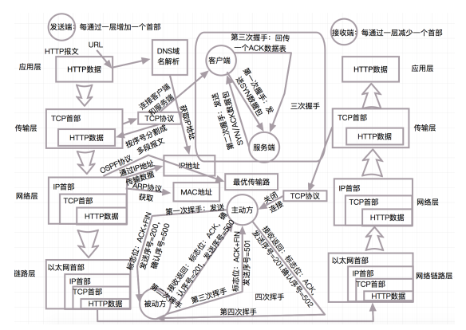

## 3.说说你对分布式事务的了解?

分布式事务是企业集成中的一个技术难点，也是每一个分布式系统架构中都会涉及到的一个东西，特别是在微服务架构中，几乎可以说是无法避免。

首先要搞清楚：ACID、CAP、BASE理论。

**ACID**

指数据库事务正确执行的四个基本要素：

1. 原子性（Atomicity）

2. 一致性（Consistency）

3. 隔离性（Isolation）

4. 持久性（Durability）

**CAP**

CAP原则又称CAP定理，指的是在一个分布式系统中，一致性（Consistency）、可用性（Availability）、分区容忍性（Partition tolerance）。CAP 原则指的是，这三个要素最多只能同时实现两点，不可能三者兼顾。

+ 一致性：在分布式系统中的所有数据备份，在同一时刻是否同样的值。

+ 可用性：在集群中一部分节点故障后，集群整体是否还能响应客户端的读写请求。

+ 分区容忍性：以实际效果而言，分区相当于对通信的时限要求。系统如果不能在时限内达成数据一致性，就意味着发生了分区的情况，必须就当前操作在C和A之间做出选择。

**BASE**理论

BASE理论是对CAP中的一致性和可用性进行一个权衡的结果，理论的核心思想就是：我们无法做到强一致，但每个应用都可以根据自身的业务特点，采用适当的方式来使系统达到最终一致性。

+ Basically Available（基本可用）

+ Soft state（软状态）

+ Eventually consistent（最终一致性）

## 4.你知道哪些分布式事务解决方案？

我目前知道的有五种：

1. 两阶段提交(2PC)

2. 三阶段提交(3PC)

3. 补偿事务(TCC=Try-Confifirm-Cancel)

4. 本地消息队列表(MQ)

5. Sagas事务模型(最终一致性)

## 5.什么是二阶段提交？

两阶段提交2PC是分布式事务中最强大的事务类型之一，两段提交就是分两个阶段提交：

+ 第一阶段询问各个事务数据源是否准备好。

+ 第二阶段才真正将数据提交给事务数据源。

为了保证该事务可以满足ACID，就要引入一个协调（Cooradinator）。其他的节点被称为参与者（Participant）。协调者负责调度参与者的行为，并最终决定这些参与者是否要把事务进行提交。

处理流程如下：

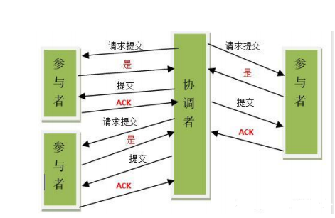

**阶段一**

a) 协调者向所有参与者发送事务内容，询问是否可以提交事务，并等待答复。

b) 各参与者执行事务操作，将 undo 和 redo 信息记入事务日志中（但不提交事务）。

c) 如参与者执行成功，给协调者反馈 yes，否则反馈 no。

**阶段二**

如果协调者收到了参与者的失败消息或者超时，直接给每个参与者发送回滚(rollback)消息；否则，发送提交(commit)消息。两种情况处理如下：

**情况**1：当所有参与者均反馈 yes，提交事务

a) 协调者向所有参与者发出正式提交事务的请求（即 commit 请求）。

b) 参与者执行 commit 请求，并释放整个事务期间占用的资源。

c) 各参与者向协调者反馈 ack(应答)完成的消息。

d) 协调者收到所有参与者反馈的 ack 消息后，即完成事务提交。

**情况**2：当有一个参与者反馈 no，回滚事务

a) 协调者向所有参与者发出回滚请求（即 rollback 请求）。

b) 参与者使用阶段 1 中的 undo 信息执行回滚操作，并释放整个事务期间占用的资源。

c) 各参与者向协调者反馈 ack 完成的消息。

d) 协调者收到所有参与者反馈的 ack 消息后，即完成事务。

**问题**

**1) 性能问题：**所有参与者在事务提交阶段处于同步阻塞状态，占用系统资源，容易导致性能瓶颈。

**2) 可靠性问题：**如果协调者存在单点故障问题，或出现故障，提供者将一直处于锁定状态。

**3) 数据一致性问题：**在阶段 2 中，如果出现协调者和参与者都挂了的情况，有可能导致数据不一致。

**优点：** 尽量保证了数据的强一致，适合对数据强一致要求很高的关键领域。（其实也不能100%保证强一致）。

**缺点：** 实现复杂，牺牲了可用性，对性能影响较大，不适合高并发高性能场景。

## **6**.什么是三阶段提交？

三阶段提交是在二阶段提交上的改进版本，3PC最关键要解决的就是协调者和参与者同时挂掉的问题，所以3PC把2PC的准备阶段再次一分为二，这样三阶段提交。

处理流程如下 

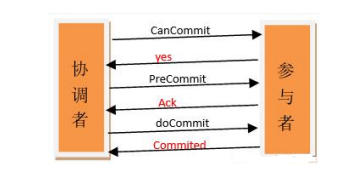

**阶段一**

a) 协调者向所有参与者发出包含事务内容的 canCommit 请求，询问是否可以提交事务，并等待所有参与者答复。

b) 参与者收到 canCommit 请求后，如果认为可以执行事务操作，则反馈 yes 并进入预备状态，否则反馈 no。

**阶段二**

协调者根据参与者响应情况，有以下两种可能。

**情况**1：所有参与者均反馈 yes，协调者预执行事务

a) 协调者向所有参与者发出 preCommit 请求，进入准备阶段。

b) 参与者收到 preCommit 请求后，执行事务操作，将 undo 和 redo 信息记入事务日志中（但不提交事务）。

c) 各参与者向协调者反馈 ack 响应或 no 响应，并等待最终指令。

**情况2：**只要有一个参与者反馈 no，或者等待超时后协调者尚无法收到所有提供者的反馈，即中断事务

a) 协调者向所有参与者发出 abort 请求。

b) 无论收到协调者发出的 abort 请求，或者在等待协调者请求过程中出现超时，参与者均会中断事务。

**阶段三**

该阶段进行真正的事务提交，也可以分为以下两种情况。

**情况** **1**：所有参与者均反馈 ack 响应，执行真正的事务提交

a) 如果协调者处于工作状态，则向所有参与者发出 do Commit 请求。

b) 参与者收到 do Commit 请求后，会正式执行事务提交，并释放整个事务期间占用的资源。

c) 各参与者向协调者反馈 ack 完成的消息。

d) 协调者收到所有参与者反馈的 ack 消息后，即完成事务提交。

**情况**2：只要有一个参与者反馈 no，或者等待超时后协调组尚无法收到所有提供者的反馈，即回滚事务。

a) 如果协调者处于工作状态，向所有参与者发出 rollback 请求。

b) 参与者使用阶段 1 中的 undo 信息执行回滚操作，并释放整个事务期间占用的资源。

c) 各参与者向协调组反馈 ack 完成的消息。

d) 协调组收到所有参与者反馈的 ack 消息后，即完成事务回滚。

**优点：**相比二阶段提交，三阶段提交降低了阻塞范围，在等待超时后协调者或参与者会中断事务。

避免了协调者单点问题。阶段 3 中协调者出现问题时，参与者会继续提交事务。

**缺点：**数据不一致问题依然存在，当在参与者收到 preCommit 请求后等待 do commite 指令时，此时如果协调者请求中断事务，而协调者无法与参与者正常通信，会导致参与者继续提交事务，造成数据不一致。

## 7.什么是补偿事务？

``TCC ``（Try Confifirm Cancel）是服务化的二阶段编程模型，采用的补偿机制：

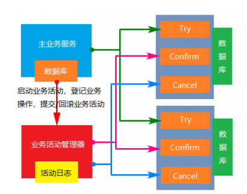

TCC 其实就是采用的补偿机制，其核心思想是：针对每个操作，都要注册一个与其对应的确认和补偿（撤销）操作。

它分为三个步骤：

Try 阶段主要是对业务系统做检测及资源预留。

Confifirm 阶段主要是对业务系统做确认提交，Try阶段执行成功并开始执行 Confifirm阶段时，默认 Confifirm阶段是不会出错的。即：只要Try成功，Confifirm一定成功。

Cancel 阶段主要是在业务执行错误，需要回滚的状态下执行的业务取消，预留资源释放。

举个例子，假入你要向 老田 转账，思路大概是： 

我们有一个本地方法，里面依次调用步骤：

1、首先在 Try 阶段，要先调用远程接口把 你 和 老田 的钱给冻结起来。 2、在 Confifirm 阶段，执行远程调用的转账的操作，转账成功进行解冻。 3、如果第2步执行成功，那么转账成功，如果第二步执行失败，则调用远程冻结接口对应的解冻方法 (Cancel)。

**优点：**

性能提升：具体业务来实现控制资源锁的粒度变小，不会锁定整个资源。

数据最终一致性：基于 Confifirm 和 Cancel 的幂等性，保证事务最终完成确认或者取消，保证数据的一致性。

可靠性：解决了 XA 协议的协调者单点故障问题，由主业务方发起并控制整个业务活动，业务活动管理器也变成多点，引入集群。

**缺点：**TCC 的 Try、Confifirm 和 Cancel 操作功能要按具体业务来实现，业务耦合度较高，提高了开发成本。

## **8**.消息队列是怎么实现的？

**本地消息表（异步确保）**

本地消息表这种实现方式应该是业界使用最多的，其核心思想是将分布式事务拆分成本地事务进行处理，这种思路是来源于ebay。我们可以从下面的流程图中看出其中的一些细节：

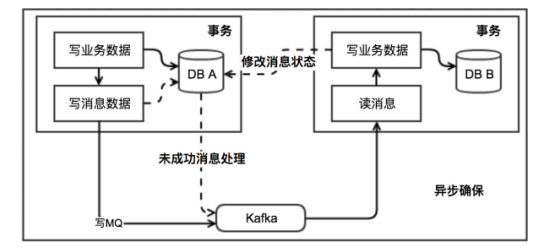

基本思路就是：

消息生产方，需要额外建一个消息表，并记录消息发送状态。消息表和业务数据要在一个事务里提交，也就是说他们要在一个数据库里面。然后消息会经过MQ发送到消息的消费方。如果消息发送失败，会进行重试发送。

消息消费方，需要处理这个消息，并完成自己的业务逻辑。此时如果本地事务处理成功，表明已经处理成功了，如果处理失败，那么就会重试执行。如果是业务上面的失败，可以给生产方发送一个业务补偿消息，通知生产方进行回滚等操作。

生产方和消费方定时扫描本地消息表，把还没处理完成的消息或者失败的消息再发送一遍。如果有靠谱的自动对账补账逻辑，这种方案还是非常实用的。

这种方案遵循BASE理论，采用的是最终一致性，笔者认为是这几种方案里面比较适合实际业务场景的，即不会出现像2PC那样复杂的实现(当调用链很长的时候，2PC的可用性是非常低的)，也不会像TCC那样可能出现确认或者回滚不了的情况。

**优点：** 

一种非常经典的实现，避免了分布式事务，实现了最终一致性。在 .NET中 有现成的解决方案。

**缺点：** 

消息表会耦合到业务系统中，如果没有封装好的解决方案，会有很多杂活需要处理。

**MQ** **事务消息**有一些第三方的MQ是支持事务消息的，比如RocketMQ，他们支持事务消息的方式也是类似于采用的二阶段提交，但是市面上一些主流的MQ都是不支持事务消息的，比如 RabbitMQ 和 Kafka 都不支持。

以阿里的 RocketMQ 中间件为例，其思路大致为：

第一阶段Prepared消息，会拿到消息的地址。 第二阶段执行本地事务，第三阶段通过第一阶段拿到的地址去访问消息，并修改状态。

也就是说在业务方法内要想消息队列提交两次请求，一次发送消息和一次确认消息。如果确认消息发送失败了RocketMQ会定期扫描消息集群中的事务消息，这时候发现了Prepared消息，它会向消息发送者确认，所以生产方需要实现一个check接口，RocketMQ会根据发送端设置的策略来决定是回滚还是继续发送确认消息。这样就保证了消息发送与本地事务同时成功或同时失败。

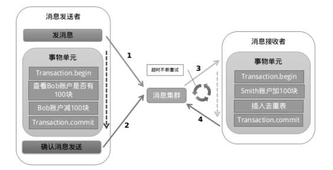

遗憾的是，RocketMQ并没有 .NET 客户端。有关 RocketMQ的更多消息，大家可以查看这篇博客

**优点：** 

实现了最终一致性，不需要依赖本地数据库事务。

**缺点：** 

实现难度大，主流MQ不支持，没有.NET客户端，RocketMQ事务消息部分代码也未开源。

## **9**.说说Sagas事务模型?

Saga模式是一种分布式异步事务，一种最终一致性事务，是一种柔性事务，有两种不同的方式来实现saga事务，最流行的两种方式是：

**一、 事件**/编排Choreography：没有中央协调器（没有单点风险）时，每个服务产生并聆听其他服务的事件，并决定是否应采取行动。该实现第一个服务执行一个事务，然后发布一个事件。该事件被一个或多个服务进行监听，这些服务再执行本地事务并发布（或不发布）新的事件，当最后一个服务执行本地事务并且不发布任何事件时，意味着分布式事务结束，或者它发布的事件没有被任何Saga参与者听到都意味着事务结束。

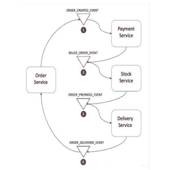

**处理流程说明：**

订单服务保存新订单，将状态设置为pengding挂起状态，并发布名为ORDER_CREATED_EVENT的事件。

支付服务监听ORDER_CREATED_EVENT，并公布事件BILLED_ORDER_EVENT。

库存服务监听BILLED_ORDER_EVENT，更新库存，并发布ORDER_PREPARED_EVENT。

货运服务监听ORDER_PREPARED_EVENT，然后交付产品。最后，它发布

ORDER_DELIVERED_EVENT。

最后，订单服务侦听ORDER_DELIVERED_EVENT并设置订单的状态为concluded完成。

假设库存服务在事务过程中失败了。进行回滚：

库存服务产生PRODUCT_OUT_OF_STOCK_EVENT

订购服务和支付服务会监听到上面库存服务的这一事件：

①支付服务会退款给客户。

②订单服务将订单状态设置为失败。**优点：**事件/编排是实现Saga模式的自然方式; 它很简单，容易理解，不需要太多的努力来构建，所

有参与者都是松散耦合的，因为他们彼此之间没有直接的耦合。如果您的事务涉及2至4个步骤，则可能是非常合适的。

**二、 命令**/协调orchestrator：中央协调器负责集中处理事件的决策和业务逻辑排序。

saga协调器orchestrator以命令/回复的方式与每项服务进行通信，告诉他们应该执行哪些操作。

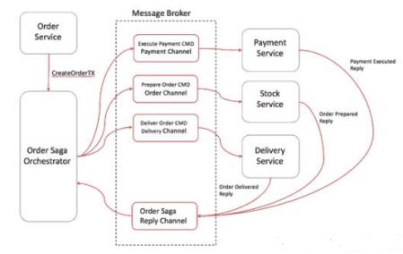

订单服务保存pending状态，并要求订单Saga协调器（简称OSO）开始启动订单事务。

OSO向收款服务发送执行收款命令，收款服务回复Payment Executed消息。

OSO向库存服务发送准备订单命令，库存服务将回复OrderPrepared消息。

OSO向货运服务发送订单发货命令，货运服务将回复Order Delivered消息。

OSO订单Saga协调器必须事先知道执行“创建订单”事务所需的流程(通过读取BPM业务流程XML配置

获得)。如果有任何失败，它还负责通过向每个参与者发送命令来撤销之前的操作来协调分布式的回

滚。当你有一个中央协调器协调一切时，回滚要容易得多，因为协调器默认是执行正向流程，回滚

时只要执行反向流程即可。

**优点：**

避免服务之间的循环依赖关系，因为saga协调器会调用saga参与者，但参与者不会调用协调器。

集中分布式事务的编排。

只需要执行命令/回复(其实回复消息也是一种事件消息)，降低参与者的复杂性。

在添加新步骤时，事务复杂性保持线性，回滚更容易管理。如果在第一笔交易还没有执行完，想改变有第二笔事务的目标对象，则可以轻松地将其暂停在协调

器上，直到第一笔交易结束。

## **10**.分布式ID生成有几种方案？

**分布式ID的特性**

+ 唯一性：确保生成的ID是全网唯一的。

+ 有序递增性：确保生成的ID是对于某个用户或者业务是按一定的数字有序递增的。

+ 高可用性：确保任何时候都能正确的生成ID。

+ 带时间：ID里面包含时间，一眼扫过去就知道哪天的交易。

  **分布式ID生成方案**

  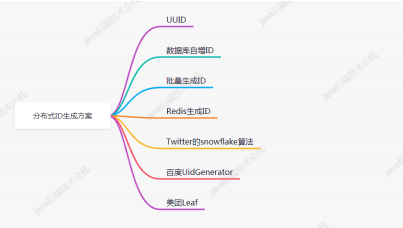

1. **UUID**

算法的核心思想是结合机器的网卡、当地时间、一个随记数来生成UUID。

+ 优点：本地生成，生成简单，性能好，没有高可用风险

+ 缺点：长度过长，存储冗余，且无序不可读，查询效率低

2. **数据库自增ID**

使用数据库的id自增策略，如 MySQL 的 auto_increment。并且可以使用两台数据库分别设置不同步长，生成不重复ID的策略来实现高可用。

+ 优点：数据库生成的ID绝对有序，高可用实现方式简单

+ 缺点：需要独立部署数据库实例，成本高，有性能瓶颈

3. **批量生成ID**一次按需批量生成多个ID，每次生成都需要访问数据库，将数据库修改为最大的ID值，并在内存中记录当前值及最大值。

+ 优点：避免了每次生成ID都要访问数据库并带来压力，提高性能

+ 缺点：属于本地生成策略，存在单点故障，服务重启造成ID不连续

4. **Redis生成ID**

Redis的所有命令操作都是单线程的，本身提供像 incr 和 increby 这样的自增原子命令，所以能保证生成的 ID 肯定是唯一有序的。

+ 优点：不依赖于数据库，灵活方便，且性能优于数据库；数字ID天然排序，对分页或者需要排序的结果很有帮助。

+ 缺点：如果系统中没有Redis，还需要引入新的组件，增加系统复杂度；需要编码和配置的工作量比较大。

考虑到单节点的性能瓶颈，可以使用 Redis 集群来获取更高的吞吐量。假如一个集群中有5台Redis。可以初始化每台 Redis 的值分别是1, 2, 3, 4, 5，然后步长都是 5。

5. **Twitter**的snowflflake算法（重点）

Twitter 利用 zookeeper 实现了一个全局ID生成的服务 Snowflflake

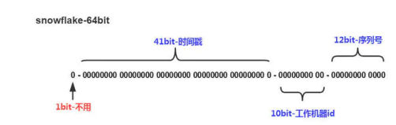

如上图的所示，Twitter 的 Snowflflake 算法由下面几部分组成：

**1位符号位：**

由于 long 类型在 java 中带符号的，最高位为符号位，正数为 0，负数为 1，且实际系统中所使用的ID一般都是正数，所以最高位为 0。

**41位时间戳（毫秒级）：**

需要注意的是此处的 41 位时间戳并非存储当前时间的时间戳，而是存储时间戳的差值（当前时间戳 - 起始时间戳），这里的起始时间戳一般是ID生成器开始使用的时间戳，由程序来指定，所以41位毫秒时间戳最多可以使用 (1 << 41) / (1000x60x60x24x365) = 69年 。

**10位数据机器位：**包括5位数据标识位和5位机器标识位，这10位决定了分布式系统中最多可以部署 1 << 10 = 1024s个节点。超过这个数量，生成的ID就有可能会冲突。

**12位毫秒内的序列：**

这 12 位计数支持每个节点每毫秒（同一台机器，同一时刻）最多生成 1 << 12 = 4096个ID加起来刚好64位，为一个Long型。

+ 优点：高性能，低延迟，按时间有序，一般不会造成ID碰撞

+ 缺点：需要独立的开发和部署，依赖于机器的时钟

6. **百度UidGenerator**

UidGenerator是百度开源的分布式ID生成器，基于于snowflflake算法的实现，看起来感觉还行。不过，国内开源的项目维护性真是担忧。

7. **美团Leaf**

Leaf 是美团开源的分布式ID生成器，能保证全局唯一性、趋势递增、单调递增、信息安全，里面也提到了几种分布式方案的对比，但也需要依赖关系数据库、Zookeeper等中间件。

## 11.常见负载均衡算法有哪些？

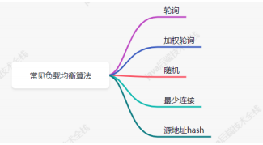

## 12.你知道哪些限流算法？

限流算法有四种常见算法：

+ 计数器算法（固定窗口）

+ 滑动窗口

+ 漏桶算法

+ 令牌桶算法

## 13.说说什么是计数器（固定窗口）算法?

计数器算法是使用计数器在周期内累加访问次数，当达到设定的限流值时，触发限流策略。下一个周期开始时，进行清零，重新计数。

此算法在单机还是分布式环境下实现都非常简单，使用redis的incr原子自增性和线程安全即可轻松实现。

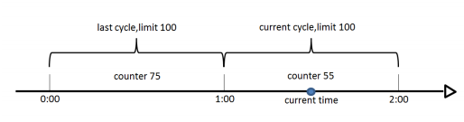

这个算法通常用于QPS限流和统计总访问量，对于秒级以上的时间周期来说，会存在一个非常严重的问题，那就是临界问题，如下图：

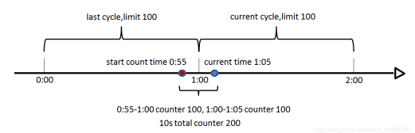

假设1min内服务器的负载能力为100，因此一个周期的访问量限制在100，然而在第一个周期的最后5秒和下一个周期的开始5秒时间段内，分别涌入100的访问量，虽然没有超过每个周期的限制量，但是整体上10秒内已达到200的访问量，已远远超过服务器的负载能力，由此可见，计数器算法方式限流对于周期比较长的限流，存在很大的弊端。

## 14.说说什么是滑动窗口算法?

滑动窗口算法是将时间周期分为N个小周期，分别记录每个小周期内访问次数，并且根据时间滑动删除过期的小周期。

如下图，假设时间周期为1min，将1min再分为2个小周期，统计每个小周期的访问数量，则可以看到，第一个时间周期内，访问数量为75，第二个时间周期内，访问数量为100，超过100的访问则被限流掉了

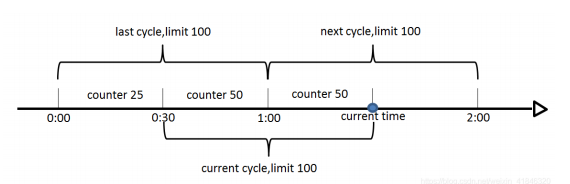

由此可见，当滑动窗口的格子划分的越多，那么滑动窗口的滚动就越平滑，限流的统计就会越精确。

此算法可以很好的解决固定窗口算法的临界问题。

## **16*5.说说什么是漏桶算法?

漏桶算法是访问请求到达时直接放入漏桶，如当前容量已达到上限（限流值），则进行丢弃（触发限流策略）。漏桶以固定的速率进行释放访问请求（即请求通过），直到漏桶为空。


## 16.说说什么是令牌桶算法?

令牌桶算法是程序以r（r=时间周期/限流值）的速度向令牌桶中增加令牌，直到令牌桶满，请求到达时向令牌桶请求令牌，如获取到令牌则通过请求，否则触发限流策略


## 17.数据库如何处理海量数据？

对数据库进行：分库分表，主从架构，读写分离。

水平分库/分表，垂直分库/分表。

+ 水平分库/表，各个库和表的结构一模一样。

+ 垂直分库/表，各个库和表的结构不一样。

+ 读写分离：主机负责写，从机负责读

## 18.如何将长链接转换成短链接，并发送短信？

短 URL 从生成到使用分为以下几步：

+ 有一个服务,将要发送给你的长 URL 对应到一个短 URL 上.例如 www.baidu.com -> www.t.cn/1。

+ 把短 url 拼接到短信等的内容上发送。

+ 用户点击短 URL ,浏览器用 301 / 302 进行重定向,访问到对应的长 URL。

+ 展示对应的内容。

## 19.长链接和短链接如何互相转换？

思路是建立一个发号器。每次有一个新的长 URL 进来，我们就增加一。并且将新的数值返回.第一个来的 url 返回"www.x.cn/0",第二个返回"www.x.cn/1"。

## 20.长链接和短链接的对应关系如何存储？

如果数据量小且 QPS 低，直接使用数据库的自增主键就可以实现。 还可以将最近/最热门的对应关系存储在 K-V 数据库中,这样子可以节省空间的同时,加快响应速度。

## 21.如何提高系统的并发能力？

+ 使用分布式系统。

+ 部署多台服务器，并做负载均衡。

+ 使用缓存（Redis）集群。

+ 数据库分库分表 + 读写分离。

+ 引入消息中间件集群。