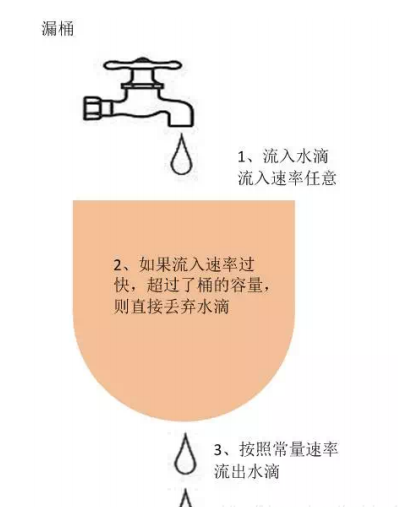

# 1.网络篇

[[toc]]

## **1.HTTP响应码有哪些？分别代表什么含义？**

```sh
200：成功，Web 服务器成功处理了客户端的请求。
301：永久重定向，当客户端请求一个网址的时候，Web 服务器会将当前请求重定向到另一个
网址，搜索引擎会抓取重定向后网页的内容并且将旧的网址替换为重定向后的网址。
302：临时重定向，搜索引擎会抓取重定向后网页的内容而保留旧的网址，因为搜索引擎认为
重定向后的网址是暂时的。
400：客户端请求错误，多为参数不合法导致 Web 服务器验参失败。
404：未找到，Web 服务器找不到资源。
500：Web 服务器错误，服务器处理客户端请求的时候发生错误。
503：服务不可用，服务器停机。
504：网关超时。
```

## **2.Forward和Redirect的区别？**

````java
浏览器 URL 地址：Forward 是服务器内部的重定向，服务器内部请求某个 servlet，然后获取
响应的内容，浏览器的 URL 地址是不会变化的；Redirect 是客户端请求服务器，然后服务器给
客户端返回了一个 302 状态码和新的 location，客户端重新发起 HTTP 请求，服务器给客户端
响应 location 对应的 URL 地址，浏览器的 URL 地址发生了变化。
数据的共享：Forward 是服务器内部的重定向，request 在整个重定向过程中是不变的，
request 中的信息在 servlet 间是共享的。Redirect 发起了两次 HTTP 请求分别使用不同的
request。
请求的次数：Forward 只有一次请求；Redirect 有两次请求。
````

## **3.Get和Post请求有哪些区别？**

````java
用途：
get 请求用来从服务器获取资源
post 请求用来向服务器提交数据
表单的提交方式：
get 请求直接将表单数据以 name1=value1&name2=value2 的形式拼接到 URL 上（http://www.
baidu.com/action?name1=value1&name2=value2），多个参数参数值需要用 & 连接起来并
且用 ? 拼接到 action 后面；
post 请求将表单数据放到请求头或者请求的消息体中。
传输数据的大小限制：
get 请求传输的数据受到 URL 长度的限制，而 URL 长度是由浏览器决定的；
post 请求传输数据的大小理论上来说是没有限制的。
参数的编码：
get 请求的参数会在地址栏明文显示，使用 URL 编码的文本格式传递参数；
post 请求使用二进制数据多重编码传递参数。
缓存：
get 请求可以被浏览器缓存被收藏为标签；
post 请求不会被缓存也不能被收藏为标签。
````

## **4.说说TCP与UDP的区别，以及各自的优缺点**?

1、TCP面向连接（如打电话要先拨号建立连接）：UDP是无连接的，即发送数据之前不需要建立连

接。

2、TCP提供可靠的服务。也就是说，通过TCP连接传送的数据，无差错，不丢失，不重复，且按序

到达;UDP尽最大努力交付，即不保证可靠交付。tcp通过校验和，重传控制，序号标识，滑动窗

口、确认应答实现可靠传输。如丢包时的重发控制，还可以对次序乱掉的分包进行顺序控制。

3、UDP具有较好的实时性，工作效率比TCP高，适用于对高速传输和实时性有较高的通信或广播通

信。

4.每一条TCP连接只能是点到点的;UDP支持一对一，一对多，多对一和多对多的交互通信5、TCP对系统资源要求较多，UDP对系统资源要求较少。

## **5**.说一下 **HTTP** **和** **HTTPS** **的区别**?

端口不同：HTTP和 HTTPS 的连接方式不同没用的端口也不一样，HTTP是80， HTTPS 用的是443

消耗资源：和HTTP相比，HTTPS通信会因为加解密的处理消耗更多的CPU和内存资源。

开销： HTTPS 通信需要证书，这类证书通常需要向认证机构申请或者付费购买。

## **6**.说说HTTP、TCP、Socket **的关系是什么？**

TCP/IP 代表传输控制协议/网际协议，指的是一系列协议族。

HTTP 本身就是一个协议，是从 Web 服务器传输超文本到本地浏览器的传送协议。

Socket 是 TCP/IP 网络的 API ，其实就是一个门面模式，它把复杂的 TCP/IP 协议族隐藏在

Socket 接口后面。对用户来说，一组简单的接口就是全部，让 Socket 去组织数据，以符合指

定的协议。

综上所述：

需要 IP 协议来连接网络

TCP 是一种允许我们安全传输数据的机制，使用 TCP 协议来传输数据的 HTTP 是 Web 服务器

和客户端使用的特殊协议。

HTTP 基于 TCP 协议，所以可以使用 Socket 去建立一个 TCP 连接。

## **7**.说一下HTTP的长连接与短连接的区别?

HTTP协议的长连接和短连接，实质上是TCP协议的长连接和短连接。

**短连接**

在HTTP/1.0中默认使用短链接,也就是说，浏览器和服务器每进行一次HTTP操作，就建立一次连

接，但任务结束就中断连接。如果客户端访问的某个HTML或其他类型的Web资源，如 JavaScript

文件、图像文件、 CSS 文件等。当浏览器每遇到这样一个Web资源，就会建立一个HTTP会话.

**长连接**

从HTTP/1.1起，默认使用长连接，用以保持连接特性。在使用长连接的情况下，当一个网页打开完

成后，客户端和服务器之间用于传输HTTP数据的 TCP连接不会关闭。如果客户端再次访问这个服务

器上的网页，会继续使用这一条已经建立的连接。Keep-Alive不会永久保持连接，它有一个保持时

间，可以在不同的服务器软件（如Apache）中设定这个时间。

## **8**.TCP **为什么要三次握手，两次不行吗？为什么？**

TCP 客户端和服务端建立连接需要三次握手，首先服务端需要开启监听，等待客户端的连接请

求，这个时候服务端处于“收听”状态；

客户端向服务端发起连接，选择 seq=x 的初始序列号，此时客户端处于“同步已发送”的状态；

服务端收到客户端的连接请求，同意连接并向客户端发送确认，确认号是 ack=x+1 表示客户

端可以发送下一个数据包序号从 x+1 开始，同时选择 seq=y 的初始序列号，此时服务端处

于“同步收到”状态；

客户端收到服务端的确认后，向服务端发送确认信息，确认号是 ack=y+1 表示服务端可以发

送下一个数据包序号从 y+1 开始，此时客户端处于“已建立连接”的状态；

服务端收到客户端的确认后，也进入“已建立连接”的状态。

从三次握手的过程可以看出如果只有两次握手，那么客户端的起始序列号可以确认，服务端的起始

序列号将得不到确认。


## **9**.说一下 **TCP** **粘包是怎么产生的？怎么解决粘包问题的？**

上文中讲 TCP 和 UDP 区别的时候提到 TCP 传输数据基于字节流，从应用层到 TCP 传输层的多个数

据包是一连串的字节流是没有边界的，而且 TCP 首部并没有记录数据包的长度，所以 TCP 传输数

据的时候可能会发送粘包和拆包的问题；而 UDP 是基于数据报传输数据的，UDP 首部也记录了数

据报的长度，可以轻易的区分出不同的数据包的边界。

接下来看下 TCP 传输数据的几种情况，首先第一种情况是正常的，既没有发送粘包也没有发生拆

包。


造成粘包和拆包现象的原因：

TCP 发送缓冲区剩余空间不足以发送一个完整的数据包，将发生拆包；

要发送的数据超过了最大报文长度的限制，TCP 传输数据时进行拆包；

要发送的数据包小于 TCP 发送缓冲区剩余空间，TCP 将多个数据包写满发送缓冲区一次发送出

去，将发生粘包；

接收端没有及时读取 TCP 发送缓冲区中的数据包，将会发生粘包。粘包拆包的解决方法：

发送端给数据包添加首部，首部中添加数据包的长度属性，这样接收端通过首部中的长度字段

就可以知道数据包的实际长度啦；

针对发送的数据包小于缓冲区大小的情况，发送端可以将不同的数据包规定成同样的长度，不

足这个长度的补充 0，接收端从缓冲区读取固定的长度数据这样就可以区分不同的数据包；

发送端通过给不同的数据包添加间隔符合确定边界，接收端通过这个间隔符合就可以区分不同

的数据包。

## **10**.TCP **如何保证可靠性**?

**序列号和确认号机制：**

TCP 发送端发送数据包的时候会选择一个 seq 序列号，接收端收到数据包后会检测数据包的完整

性，如果检测通过会响应一个 ack 确认号表示收到了数据包。

**超时重发机制：**

TCP 发送端发送了数据包后会启动一个定时器，如果一定时间没有收到接受端的确认后，将会重新

发送该数据包。

**对乱序数据包重新排序：**

从 IP 网络层传输到 TCP 层的数据包可能会乱序，TCP 层会对数据包重新排序再发给应用层。

**丢弃重复数据：**

从 IP 网络层传输到 TCP 层的数据包可能会重复，TCP 层会丢弃重复的数据包。

**流量控制：**

TCP 发送端和接收端都有一个固定大小的缓冲空间，为了防止发送端发送数据的速度太快导致接收

端缓冲区溢出，发送端只能发送接收端可以接纳的数据，为了达到这种控制效果，TCP 用了流量控

制协议（可变大小的滑动窗口协议）来实现。

## **11**.OSI **的七层模型都有哪些？**

OSI七层模型一般指开放系统互连参考模型 (Open System Interconnect 简称OSI)是国际标准化组

织(ISO)和国际电报电话咨询委员会(CCITT)联合制定的开放系统互连参考模型,为开放式互连信息系

统提供了一种功能结构的框架。

应用层：各种应用程序协议，比如 HTTP、HTTPS、FTP、SOCKS 安全套接字协议、DNS 域名

系统、GDP 网关发现协议等等。

表示层：加密解密、转换翻译、压缩解压缩，比如 LPP 轻量级表示协议。

会话层：不同机器上的用户建立和管理会话，比如 SSL 安全套接字层协议、TLS 传输层安全协

议、RPC 远程过程调用协议等等。传输层：接受上一层的数据，在必要的时候对数据进行分割，并将这些数据交给网络层，保证

这些数据段有效到达对端，比如 TCP 传输控制协议、UDP 数据报协议。

网络层：控制子网的运行：逻辑编址、分组传输、路由选择，比如 IP、IPV6、SLIP 等等。

数据链路层：物理寻址，同时将原始比特流转变为逻辑传输路线，比如 XTP 压缩传输协议、

PPTP 点对点隧道协议等等。

物理层：机械、电子、定时接口通信信道上的原始比特流传输，比如 IEEE802.2 等等。


## **12**.浏览器中输入：“www.woaijava.com”之后都发生了什么？

**请详细阐述**

由域名→IP地址 寻找IP地址的过程依次经过了浏览器缓存、系统缓存、hosts文件、路由器缓

存、 递归搜索根域名服务器。

建立TCP/IP连接（三次握手具体过程）

由浏览器发送一个HTTP请求

经过路由器的转发，通过服务器的防火墙，该HTTP请求到达了服务器

服务器处理该HTTP请求，返回一个HTML文件

浏览器解析该HTML文件，并且显示在浏览器端

这里需要注意：

HTTP协议是一种基于TCP/IP的应用层协议，进行HTTP数据请求必须先建立TCP/IP连接

可以这样理解：HTTP是轿车，提供了封装或者显示数据的具体形式；Socket是发动机，提供了

网络通信的能力。

两个计算机之间的交流无非是两个端口之间的数据通信,具体的数据会以什么样的形式展现是以

不同的应用层协议来定义的。

## **13.如何实现跨域？**

当浏览器执行 JS 脚本的时候，会检测脚本要访问的协议、域名、端口号是不是和当前网址一致，如

果不一致就是跨域。跨域是不允许的，这种限制叫做浏览器的同源策略，简单点的说法就是浏览器

不允许一个源中加载脚本与其他源中的资源进行交互。那么如何实现跨域呢？

JSONP、CORS方式、代理方式

**1 JSONP** **方式**

script、img、iframe、link、video、audio 等带有 src 属性的标签可以跨域请求和执行资源，

JSONP 利用这一点“漏洞”实现跨域。

````javascript
<script>
 var scriptTag = document.createElement('script');
 scriptTag.type = "text/javascript";
 scriptTag.src = "http://10.10.0.101:8899/jsonp?callback=f";
 document.head.appendChild(scriptTag);
</script>
````

再看下 jQuery 的写法。

````javascript
$.ajax({
 // 请求域名
 url:'http://10.10.0.101:8899/login',
````

JSONP 实现跨域很简单但是只支持 GET 请求方式。而且在服务器端接受到 JSONP 请求后需要设置
请求头，添加 Access-Control-Allow-Origin 属性，属性值为 * ，表示允许所有域名访问，这样浏
览器才会正常解析，否则会报 406 错误。

2 CORS 方式
CORS（Cross-Origin Resource Sharing）即跨域资源共享，需要浏览器和服务器同时支持，这种
请求方式分为简单请求和非简单请求。
当浏览器发出的 XMLHttpRequest 请求的请求方式是 POST 或者 GET，请求头中只包含 Accept、
Accept-Language、Content-Language、Last-Event-ID、Content-Type（application/x-wwwform-urlencoded、multipart/form-data、text/plain）时那么这个请求就是一个简单请求。
对于简单的请求，浏览器会在请求头中添加 Origin 属性，标明本次请求来自哪个源（协议 + 域名 +
端口）。

````javascript
GET
// 标明本次请求来自哪个源（协议+域名+端口）
Origin: http://127.0.0.1:8080
// IP
Host: 127.0.0.1:8080
// 长连接
Connection: keep-alive
Content-Type: text/plain

````

如果 Origin 标明的域名在服务器许可范围内，那么服务器就会给出响应：

````javascript
 // 该值上文提到过，表示允许浏览器指定的域名访问，要么为浏览器传入的 origin，要么为 * 表示
所有域名都可以访问
 Access-Control-Allow-Origin: http://127.0.0.1:8080
 // 表示服务器是否同意浏览器发送 cookie
 Access-Control-Allow-Credentials: true
 // 指定 XMLHttpRequest#getResponseHeader() 方法可以获取到的字段
 Access-Control-Expose-Headers: xxx
 Content-Type: text/html; charset=utf-8
````

Access-Control-Allow-Credentials: true 表示服务器同意浏览器发送 cookie，另外浏览器也需要

设置支持发送 cookie，否则就算服务器支持浏览器也不会发送。

````javascript
var xhr = new XMLHttpRequest();
// 设置发送的请求是否带 cookie
xhr.withCredentials = true;
xhr.open('post', 'http://10.10.0.101:8899/login', true);
xhr.setRequestHeader('Content-Type', 'text/plain');
````

另外一种是非简单请求，请求方式是 PUT 或 DELETE，或者请求头中添加了 Content

Type:application/json 属性和属性值的请求。

这种请求在浏览器正式发出 XMLHttpRequest 请求前会先发送一个预检 HTTP 请求，询问服务器当

前网页的域名是否在服务器的许可名单之中，只有得到服务器的肯定后才会正式发出通信请求。

预检请求的头信息：

````javascript
 // 预检请求的请求方式是 OPTIONS
 OPTIONS
 // 标明本次请求来自哪个源（协议+域名+端口）
 Origin: http://127.0.0.1:8080
 // 标明接下来的 CORS 请求要使用的请求方式
 Access-Control-Request-Method: PUT
 // 标明接下来的 CORS 请求要附加发送的头信息属性
 Access-Control-Request-Headers: X-Custom-Header
 // IP
 Host: 127.0.0.1:8080
 // 长连接
 Connection: keep-alive
如果服务器回应预检请求的响应头中没有任何 CORS 相关的头信息的话表示不支持跨域，如果允许
跨域就会做出响应，响应头信息如下：
HTTP/1.1 200 OK
// 该值上文提到过，表示允许浏览器指定的域名访问，要么为浏览器传入的 origin，要么为 * 表示所
有域名都可以访问
Access-Control-Allow-Origin:http://127.0.0.1:8080
// 服务器支持的所有跨域请求方式，为了防止浏览器发起多次预检请求把所有的请求方式返回给浏览器
Access-Control-Allow-Methods: GET, POST, PUT
// 服务器支持预检请求头信息中的 Access-Control-Request-Headers 属性值
Access-Control-Allow-Headers: X-Custom-Header
// 服务器同意浏览器发送 cookie
Access-Control-Allow-Credentials: true
// 指定预检请求的有效期是 20 天，期间不必再次发送另一个预检请求
Access-Control-Max-Age:1728000
Content-Type: text/html; charset=utf-8
Keep-Alive: timeout=2, max=100
// 长连接
Connection: Keep-Alive
Content-Type: text/plain
接着浏览器会像简单请求一样，发送一个 CORS 请求，请求头中一定包含 Origin 属性，服务器的响
应头中也一定得包含 Access-Control-Allow-Origin 属性。
````

**3** **代理方式**

跨域限制是浏览器的同源策略导致的，使用 nginx 当做服务器访问别的服务的 HTTP 接口是不需要

执行 JS 脚步不存在同源策略限制的，所以可以利用 Nginx 创建一个代理服务器，这个代理服务器的

域名跟浏览器要访问的域名一致，然后通过这个代理服务器修改 cookie 中的域名为要访问的 HTTP

接口的域名，通过反向代理实现跨域。

Nginx 的配置信息：

````javascript
server {
 # 代理服务器的端口
 listen 88;
 # 代理服务器的域名
 server_name http://127.0.0.1;
 location / {
 # 反向代理服务器的域名+端口
 proxy_pass http://127.0.0.2:89;
 # 修改cookie里域名
 proxy_cookie_domain http://127.0.0.2 http://127.0.0.1;
 index index.html index.htm;
 # 设置当前代理服务器允许浏览器跨域
 add_header Access-Control-Allow-Origin http://127.0.0.1;
 # 设置当前代理服务器允许浏览器发送 cookie
 add_header Access-Control-Allow-Credentials true;
 }
}
````

前端代码：

````javascript
var xhr = new XMLHttpRequest();
// 设置浏览器允许发送 cookie
xhr.withCredentials = true;
// 访问 nginx 代理服务器
xhr.open('get', 'http://127.0.0.1:88', true);
xhr.send();
````


## 14.HTTP1.0、HTTP1.1、HTTP2.0的关系和区别?

**二、****HTTP1.0****：**

浏览器的每次请求都需要与服务器建立一个TCP连接，服务器处理完成后立即断开TCP连接（无连

接），服务器不跟踪每个客户端也不记录过去的请求（无状态）。

**三、****HTTP1.1****：**

HTTP/1.0中默认使用Connection: close。在HTTP/1.1中已经默认使用Connection: keep-alive，避

免了连接建立和释放的开销，但服务器必须按照客户端请求的先后顺序依次回送相应的结果，以保

证客户端能够区分出每次请求的响应内容。通过Content-Length字段来判断当前请求的数据是否已

经全部接收。不允许同时存在两个并行的响应。

**四、****HTTP2.0****：**

HTTP/2引入二进制数据帧和流的概念，其中帧对数据进行顺序标识，如下图所示，这样浏览器收到

数据之后，就可以按照序列对数据进行合并，而不会出现合并后数据错乱的情况。同样是因为有了

序列，服务器就可以并行的传输数据，这就是流所做的事情。

流（stream） 

已建立连接上的双向字节流 消息 与逻辑消息对应的完整的一系列数据帧 帧 HTTP2.0

通信的最小单位，每个帧包含帧头部，至少也会标识出当前帧所属的流（stream id）。 多路复

用：

1、所有的HTTP2.0通信都在一个TCP连接上完成，这个连接可以承载任意数量的双向数据流。

2、每个数据流以消息的形式发送，而消息由一或多个帧组成。这些帧可以乱序发送，然后再根据

每个帧头部的流标识符（stream id）重新组装。举个例子，每个请求是一个数据流，数据流以消息的方式发送，而消息又分为多个帧，帧头部记录

着stream id用来标识所属的数据流，不同属的帧可以在连接中随机混杂在一起。接收方可以根据

stream id将帧再归属到各自不同的请求当中去。

3、另外，多路复用（连接共享）可能会导致关键请求被阻塞。HTTP2.0里每个数据流都可以设置优

先级和依赖，优先级高的数据流会被服务器优先处理和返回给客户端，数据流还可以依赖其他的子

数据流。

4、可见，HTTP2.0实现了真正的并行传输，它能够在一个TCP上进行任意数量HTTP请求。而这个

强大的功能则是基于“二进制分帧”的特性。

头部压缩

在HTTP1.x中，头部元数据都是以纯文本的形式发送的，通常会给每个请求增加500~800字节的负

荷。

HTTP2.0使用encoder来减少需要传输的header大小，通讯双方各自cache一份header fifields表，

既避免了重复header的传输，又减小了需要传输的大小。高效的压缩算法可以很大的压缩

header，减少发送包的数量从而降低延迟。

服务器推送：

服务器除了对最初请求的响应外，服务器还可以额外的向客户端推送资源，而无需客户端明确的请

求。

## **15**.如何理解HTTP协议是无状态的？

HTTP协议是无状态的，指的是协议对于事务处理没有记忆能力，服务器不知道客户端是什么状态。

也就是说，打开一个服务器上的网页和上一次打开这个服务器上的网页之间没有任何联系。HTTP是

一个无状态的面向连接的协议，无状态不代表HTTP不能保持TCP连接，更不能代表HTTP使用的是

UDP协议（无连接）。

## **16**.说说什么是漏桶算法?

漏桶算法是访问请求到达时直接放入漏桶，如当前容量已达到上限（限流值），则进行丢弃（触发

限流策略）。漏桶以固定的速率进行释放访问请求（即请求通过），直到漏桶为空。



## **17**.说说什么是令牌桶算法?

令牌桶算法是程序以r（r=时间周期/限流值）的速度向令牌桶中增加令牌，直到令牌桶满，请求到

达时向令牌桶请求令牌，如获取到令牌则通过请求，否则触发限流策略


## **18**.数据库如何处理海量数据？

对数据库进行：分库分表，主从架构，读写分离。

水平分库/分表，垂直分库/分表。

水平分库/表，各个库和表的结构一模一样。

垂直分库/表，各个库和表的结构不一样。

读写分离：主机负责写，从机负责读

## **19**.如何将长链接转换成短链接，并发送短信？

短 URL 从生成到使用分为以下几步：

有一个服务,将要发送给你的长 URL 对应到一个短 URL 上.例如 www.baidu.com -> www.t.cn/

1。

把短 url 拼接到短信等的内容上发送。

用户点击短 URL ,浏览器用 301 / 302 进行重定向,访问到对应的长 URL。

展示对应的内容。

## **20**.长链接和短链接如何互相转换？

思路是建立一个发号器。每次有一个新的长 URL 进来，我们就增加一。并且将新的数值返回.第一

个来的 url 返回"www.x.cn/0",第二个返回"www.x.cn/1"。

## **21**.长链接和短链接的对应关系如何存储？

如果数据量小且 QPS 低，直接使用数据库的自增主键就可以实现。 还可以将最近/最热门的对应关

系存储在 K-V 数据库中,这样子可以节省空间的同时,加快响应速度。

## **22**.如何提高系统的并发能力？

