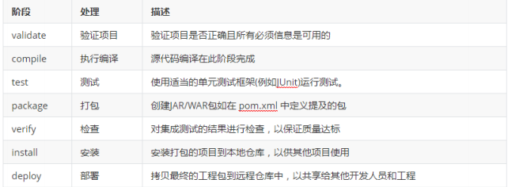

# 1.**maven**篇

[[toc]]

## 1.什么是maven？

maven主要服务于基于java平台的项目构建，依赖管理和项目信息管理。

maven项目对象模型(POM)，可以通过一小段描述信息来管理项目的构建，报告和文档的项目管理工具软件。它包含了一个项目对象模型，一组标准集合，一个项目生命周期，一个依赖管理系统和用来运行定义在生命周期阶段中插件目标的逻辑。当使用Maven的时候，你用一个明确定义的项目对象模型来描述你的项目，然后Maven可以应用横切的逻辑，这些逻辑来自于一组共享的（或自定义的）插件。

## 2.Maven能为我们解决什么问题？

①添加第三方jar包

按照最原始的做法，我们是手动复制jar包到项目WEB-INF/lib下，每个项目都会有一份，造成大量重复文件。而Maven将jar包放在本地仓库中统一管理，需要jar包只需要用坐标的方式引用即可。

②jar包之间的依赖关系

jar包之间往往不是独立的，很多jar需要在其他jar包的支持下才能够正常工作，称为jar包之间的依赖关系。如果我们手动去导入，要知道jar包之间的依赖关系并一一导入是及其麻烦而且容易出错的。如果使用Maven，它能够将当前jar包所依赖的其他所有jar包全部导入。

③获取第三方jar包开发过程中我们需要用到很多jar包，每个jar包在官网获取的方式不尽相同，给工作带来了额外困难。但是使用Maven可以以坐标的方式依赖一个jar包，Maven从中央仓库进行下载，并同时下载这个jar包依赖的其他jar包。

④将项目拆分为多个工程模块

项目的规模越来越大，已经不可能通过package结构来划分模块，必须将项目拆分为多个工程协同开发。

## 3.说说maven有什么优缺点？

优点

+ 简化了项目依赖管理

+ 易于上手，对于新手来说了解几个常用命令即可满足日常工作

+ 便于与持续集成工具（jenkins）整合

+ 便于项目升级，无论是项目本身还是项目使用的依赖

+ maven有很多插件，便于功能扩展，比如生产站点，自动发布版本等

+ 为什么使用Maven中的各点

缺点

+ Maven是一个庞大的构建系统，学习难度大。（很多都可以这样说，入门容易[优点]但是精通难[缺点]）

+ Maven采用约定约定优于配置的策略，虽然上手容易但是一旦出现问题，难于调试中网络环境较差，很多repository无法访问

## 4.什么是Maven的坐标？

Maven其中一个核心的作用就是管理项目的依赖，引入我们所需的各种jar包等。为了能自动化的解析任何一个Java构件，Maven必须将这些Jar包或者其他资源进行唯一标识，这是管理项目的依赖的基础，也就是我们要说的坐标。包括我们自己开发的项目，也是要通过坐标进行唯一标识的，这样才能才其它项目中进行依赖引用。

maven的坐标通过groupId，artifactId，version唯一标志一个构件。groupId通常为公司或组织名字，artifactId通常为项目名称，versionId为版本号。

## 5.**讲一下**maven的生命周期?

Maven的 生命周期：从我们的项目构建，一直到项目发布的这个过程。

每个阶段的说明：

## 6.说说你熟悉哪些maven命令？

mvn archetype:generate 创建Maven项目

mvn compile 编译源代码

mvn deploy 发布项目

mvn test-compile 编译测试源代码

mvn test 运行应用程序中的单元测试

mvn site 生成项目相关信息的网站

mvn clean 清除项目目录中的生成结果

mvn package 根据项目生成的jar

mvn install 在本地Repository中安装jar

mvn eclipse:eclipse 生成eclipse项目文件

mvnjetty:run 启动jetty服务

mvntomcat:run 启动tomcat服务

mvn clean package -Dmaven.test.skip=true:清除以前的包后重新打包，跳过测试类

## **7**.**代理模式和装饰器模式有什么区别？**

答：都是结构型模式，代理模式重在访问权限的控制，而装饰器模式重在功能的加强。

## **8**.**如何解决依赖传递引起的版本冲突？**

可通过dependency的exclusion元素排除掉依赖。

## **9**.**说说**maven的依赖原则？

+ 最短路径原则（依赖传递的路径越短越优先）

+ pom文件申明顺序优先（路径长度一样，则先申明的优先）
+ 覆写原则（当前pom文件里申明的直接覆盖父工程传过来的）

## **10**.**说说依赖的解析机制？**

当依赖的范围是 system 的时候，Maven 直接从本地文件系统中解析构件。

根据依赖坐标计算仓库路径，尝试直接从本地仓库寻找构件，如果发现对应的构件，就解析成功。

如果在本地仓库不存在相应的构件，就遍历所有的远程仓库，发现后，下载并解析使用。

如果依赖的版本是 RELEASE 或 LATEST，就基于更新策略读取所有远程仓库的元数据文件（groupId/artifactId/maven-metadata.xml），将其与本地仓库的对应元合并后，计算出RELEASE 或者 LATEST 真实的值，然后基于该值检查本地仓库，或者从远程仓库下载。

如果依赖的版本是 SNAPSHOT，就基于更新策略读取所有远程仓库的元数据文件，将它与本地仓库对应的元数据合并，得到最新快照版本的值，然后根据该值检查本地仓库，或从远程仓库下载。

如果最后解析得到的构件版本包含有时间戳，先将该文件下载下来，再将文件名中时间戳信息删除，剩下 SNAPSHOT 并使用（以非时间戳的形式使用）。

## **11**.**说说插件的解析机制**？

与依赖的构件一样，插件也是基于坐标保存在Maven仓库中。在用到插件的时候会先从本地仓库查找插件，如果本地仓库没有则从远程仓库查找插件并下载到本地仓库。与普通的依赖构件不同的是，Maven会区别对待普通依赖的远程仓库与插件的远程仓库。前面提到的配置远程仓库只会对普

通的依赖有效果。当Maven需要的插件在本地仓库不存在时是不会去我们以前配置的远程仓库查找插件的，而是需要有专门的插件远程仓库。
