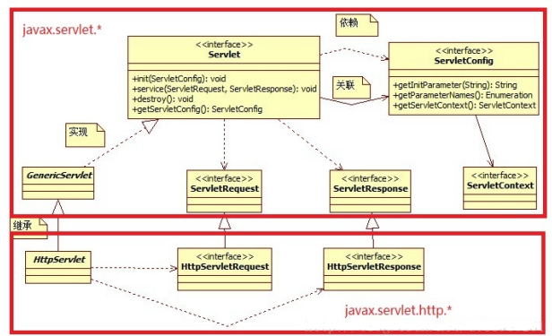

# 1.tomcat篇

[[toc]]

## 1.Tomcat的缺省端口是多少，怎么修改？

默认端口为8080，可以通过在tomcat安装包conf目录下，service.xml中的Connector元素的port属性来修改端口。

## 2.**tomcat** **有哪几种Connector** 运行模式(优化)？

这三种模式的不同之处如下：

``BIO ``：一个线程处理一个请求。缺点：并发量高时，线程数较多，浪费资源。Tomcat7版本或更低版本中，在Linux系统中默认使用这种方式。

``NIO`` ：利用Java的异步IO处理，可以通过少量的线程处理大量的请求。tomcat8.0.x中默认使用的是NIO。Tomcat7必须修改Connector配置来启动：

````xml
<Connector port="8080" protocol="org.apache.coyote.http11.Http11NioProtocol" 

connectionTimeout="20000" redirectPort="8443"/> 
````

``APR ``：即Apache Portable Runtime，从操作系统层面解决io阻塞问题。Tomcat7或Tomcat8在Win7或以上的系统中启动默认使用这种方式。

## 3.**Tomcat**有几种部署方式？

+ 利用Tomcat的自动部署：把web应用拷贝到webapps目录（生产环境不建议放在该目录中）。Tomcat在启动时会加载目录下的应用，并将编译后的结果放入work目录下。

+ 使用Manager App控制台部署：在tomcat主页点击“Manager App” 进入应用管理控制台，可以指定一个web应用的路径或war文件。

+ 修改 conf/server.xml 文件部署：在 server.xml 文件中，增加Context节点可以部署应用。

+ 增加自定义的Web部署文件：在 conf/Catalina/localhost/ 路径下增加 xyz.xml文件，内容是Context节点，可以部署应用。

## **4.tomcat容器是如何创建servlet类实例？用到了什么原理？**

1. 当容器启动时，会读取在webapps目录下所有的web应用中的web.xml文件，然后对 xml文件进行解析，并读取servlet注册信息。然后，将每个应用中注册的servlet类都进行加载，并通过反射的方式实例化。（有时候也是在第一次请求时实例化）

2. 在servlet注册时加上1如果为正数，则在一开始就实例化，如果不写或为负数，则第一次请求实例化。

## 5.**tomcat** **如何优化？**

tomcat作为Web服务器，它的处理性能直接关系到用户体验，下面是几种常见的优化措施：

掉对web.xml的监视，把jsp提前编辑成Servlet。有富余物理内存的情况，加大tomcat使用的jvm的内存

服务器所能提供CPU、内存、硬盘的性能对处理能力有决定性影响。

+ 对于高并发情况下会有大量的运算，那么CPU的速度会直接影响到处理速度。
+ 内存在大量数据处理的情况下，将会有较大的内存容量需求，可以用-Xmx -Xms -XX:MaxPermSize等参数对内存不同功能块进行划分。我们之前就遇到过内存分配不足，导致虚拟机一直处于full GC，从而导致处理能力严重下降。

+ 硬盘主要问题就是读写性能，当大量文件进行读写时，磁盘极容易成为性能瓶颈。最好的办法

还是利用下面提到的缓存。

``利用缓存和压缩``

+ 对于静态页面最好是能够缓存起来，这样就不必每次从磁盘上读。这里我们采用了Nginx作为缓存服务器，将图片、css、js文件都进行了缓存，有效的减少了后端tomcat的访问。

+ 另外，为了能加快网络传输速度，开启gzip压缩也是必不可少的。但考虑到tomcat已经需要处理很多东西了，所以把这个压缩的工作就交给前端的Nginx来完成。

+ 除了文本可以用gzip压缩，其实很多图片也可以用图像处理工具预先进行压缩，找到一个平衡点可以让画质损失很小而文件可以减小很多。曾经我就见过一个图片从300多kb压缩到几十kb，自己几乎看不出来区别。

``采用集群``

单个服务器性能总是有限的，最好的办法自然是实现横向扩展，那么组建tomcat集群是有效提升性能的手段。我们还是采用了Nginx来作为请求分流的服务器，后端多个tomcat共享session来协同工作。可以参考之前写的《利用nginx+tomcat+memcached组建web服务器负载均衡》。

``优化线程数优化``

找到Connector port="8080" protocol="HTTP/1.1"，增加maxThreads和acceptCount属性（使acceptCount大于等于maxThreads），如下：

````xml
<Connector port="8080" protocol="HTTP/1.1"connectionTimeout="20000"
redirectPort="8443"acceptCount="500" maxThreads="400" />
````

其中：

````xml
• maxThreads：tomcat可用于请求处理的最大线程数，默认是200
• minSpareThreads：tomcat初始线程数，即最小空闲线程数
• maxSpareThreads：tomcat最大空闲线程数，超过的会被关闭
• acceptCount：当所有可以使用的处理请求的线程数都被使用时，可以放到处理队列中的请求数，超过这个数的请求将不予处理.默认100
````

``使用线程池优化``

在server.xml中增加executor节点，然后配置connector的executor属性，如下：

````xml
<Executor name="tomcatThreadPool" namePrefix="req-exec-"maxThreads="1000"
minSpareThreads="50"maxIdleTime="60000"/>
<Connector port="8080" protocol="HTTP/1.1"executor="tomcatThreadPool"/>
````

其中：

````xml
• namePrefix：线程池中线程的命名前缀
• maxThreads：线程池的最大线程数
• minSpareThreads：线程池的最小空闲线程数
• maxIdleTime：超过最小空闲线程数时，多的线程会等待这个时间长度，然后关闭
• threadPriority：线程优先级
````

注：当tomcat并发用户量大的时候，单个jvm进程确实可能打开过多的文件句柄，这时会报java.net.SocketException:Too many open fifiles错误。可使用下面步骤检查：

````xml
• ps -ef |grep tomcat 查看tomcat的进程ID，记录ID号，假设进程ID为10001
• lsof -p 10001|wc -l 查看当前进程id为10001的 文件操作数
• 使用命令：ulimit -a 查看每个用户允许打开的最大文件数
````

``启动速度优化``

+ 删除没用的web应用：因为tomcat启动每次都会部署这些应用。

+ 关闭WebSocket： websocket-api.jar和tomcat-websocket.jar 。

+ 随机数优化：设置JVM参数： -Djava.security.egd=file:/dev/./urandom 。

``内存优化``

因为tomcat启动起来后就是一个java进程，所以这块可以参照JVM部分的优化思路。堆内存相关参数，比如说：

````xml
• -Xms：虚拟机初始化时的最小堆内存。
• -Xmx：虚拟机可使用的最大堆内存。-Xms与-Xmx设成一样的值，避免JVM因为频繁的GC导致性能大起大落
• -XX:MaxNewSize：新生代占整个堆内存的最大值。
````

另外还有方法区参数调整（注意：JDK版本）、垃圾收集器等优化。JVM相关参数请看：手把手教你设置JVM调优参数

## 6.熟悉tomcat的哪些配置？

Context (表示一个web应用程序，通常为WAR文件，关于WAR的具体信息见servlet规范)标签。

docBase ：该web应用的文档基准目录（Document Base，也称为Context Root），或者是WAR文件的路径。可以使绝对路径，也可以使用相对于context所属的Host的appBase路径。

path ：表示此web应用程序的url的前缀，这样请求的url为 http://localhost:8080/path/ 。reloadable ：这个属性非常重要，如果为true，则tomcat会自动检测应用程序的/WEB-INF/lib和/WEB-INF/classes目录的变化，自动装载新的应用程序，我们可以在不重启tomcat的情况下改变应用程序。

useNaming ：如果希望Catalina为该web应用使能一个JNDIInitialContext对象，设为true。该InitialialContext符合J2EE平台的约定，缺省值为true。

workDir ：Context提供的临时目录的路径，用于servlet的临时读/写。利用javax.servlet.context.tempdir属性，servlet可以访问该目录。如果没有指定，使用$CATALINA_HOME/work下一个合适的目录。

swallowOutput ：如果该值为true，System.out和System.err的输出被重定向到web应用的logger。如果没有指定，缺省值为false

debug ：与这个Engine关联的Logger记录的调试信息的详细程度。数字越大，输出越详细。如果没有指定，缺省为0。

host (表示一个虚拟主机)标签。

name ：指定主机名。

appBase ：应用程序基本目录，即存放应用程序的目录。

unpackWARs ：如果为true，则tomcat会自动将WAR文件解压，否则不解压，直接从WAR文件中运行应用程序。

Logger (表示日志，调试和错误信息)标签。

className ：指定logger使用的类名，此类必须实现org.apache.catalina.Logger接口。

prefix ：指定log文件的前缀。

suffix ：指定log文件的后缀。

timestamp ：如果为true，则log文件名中要加入时间，如下例：localhost_log.2001-10-04.txt。

## **7**.**Tomcat**是什么？

Tomcat 服务器Apache软件基金会项目中的一个核心项目，是一个免费的开放源代码的Web 应用服务器（Servlet容器），属于轻量级应用服务器，在中小型系统和并发访问用户不是很多的场合下被普遍使用，是开发和调试JSP 程序的首选。

## **8**.什么是Servlet呢？

Servlet是JavaEE规范的一种，主要是为了扩展Java作为Web服务的功能，统一接口。由其他内部厂商如tomcat，jetty内部实现web的功能。如一个http请求到来：容器将请求封装为servlet中的HttpServletRequest对象，调用init()，service()等方法输出response,由容器包装为httpresponse

返回给客户端的过程。


## **9**.**什么是Servlet规范？**

从 Jar 包上来说，Servlet 规范就是两个 Jar 文件。servlet-api.jar 和 jsp-api.jar，Jsp 也是一种Servlet。

从package上来说，就是 javax.servlet 和 javax.servlet.http 两个包。

从接口来说，就是规范了 Servlet 接口、Filter 接口、Listener 接口、ServletRequest 接口、ServletResponse 接口等。类图如下：



## **10**.为什么我们将tomcat称为Web容器或者Servlet容器 ？

我们用一张图来表示他们之间的关系:


简单的理解：启动一个ServerSocket，监听8080端口。Servlet**容器**用来装我们开发的Servlet。

## **11**.**tomcat是如何处理Http请求流程的？**

假设来我们在浏览器上输入

http://localhost:8080/my-web-mave/index.jsp

在tomcat中是如何处理这个请求流程的：

1. 我们的请求被发送到本机端口8080，被在那里侦听的Coyote HTTP/1.1 Connector获得。

2. Connector把该请求交给它所在的Service的Engine来处理，并等待来自Engine的回应 。
3. Engine获得请求localhost/my-web-maven/index.jsp，匹配它所拥有的所有虚拟主机Host ，我们的虚拟主机在server.xml中默认配置的就是localhost。

4. Engine匹配到name=localhost的Host（即使匹配不到也把请求交给该Host处理，因为该Host被定义为该Engine的默认主机）。

5. localhost Host获得请求/my-web-maven/index.jsp，匹配它所拥有的所有Context。

6. Host匹配到路径为/my-web-maven的Context（如果匹配不到就把该请求交给路径名为”"的Context去处理）。

7. path=”/my-web-maven”的Context获得请求/index.jsp，在它的mapping table中寻找对应的servlet 。

8. Context匹配到URL PATTERN为*.jsp的servlet，对应于JspServlet类。

9. 构造HttpServletRequest对象和HttpServletResponse对象，作为参数调用JspServlet的doGet或doPost方法 。

10. Context把执行完了之后的HttpServletResponse对象返回给Host 。

11. Host把HttpServletResponse对象返回给Engine 。

12. Engine把HttpServletResponse对象返回给Connector 。

13. Connector把HttpServletResponse对象返回给客户browser 。

## 12.tomcat结构目录有哪些?


**bin**

启动，关闭和其他脚本。这些 .sh文件（对于Unix系统）是这些.bat文件的功能副本（对于Windows系统）。由于Win32命令行缺少某些功能，因此此处包含一些其他文件。

比如说：windows下启动tomcat用的是startup.bat，另外Linux环境中使用的是startup.sh。对应还有相应的shutdown关闭脚本。

**conf**

tomcat的配置文件和相关的DTD。这里最重要的文件是server.xml。它是容器的主要配置文件。

catalina.policy ：tomcat：安全策略文件，控制JVM相关权限，具体可以参考java.security.Permission。catalina.properties ：tomcat Catalina 行为控制配置文件，比如：Common ClassLoader。

logging.properties ：tomcat日志配置文件。里面的日志采用的是JDK Logging。

server.xml ：tomcat server配置文件(对于我开发人员来说是非常重要)。

context.xml ：全局context配置文件，监视并加载资源文件，当监视的文件发生发生变化时，自动加载 。

tomcat-user.xml ：tomcat角色配置文件。

web.xml ：Servlet标准的web.xml部署文件，tomcat默认实现部分配置 入内：

org.apache.catalina.servlets.DefaultServlet。

org.apache.jasper.servlet.JspServlet

**logs**

日志文件默认位于此处。

localhost 有用，当你们的tomcat启动不了的时候，多看这个文件。比如：

+ NoClassDefFoundError

+ ClassNotFoundException

access 最没用。

catalina.{date} 主要是控制台输出，全部日志都在这里面。

**webapps**

这是您的webapp所在的位置。其实这里面这几个都是一个项目。

简化web部署的方式。在线上环境中我们的应用是不会放在这里的。最好的办法就是外置。

**lib**：tomcat存放共用的类库。比如：

ecj-4.17.jar: eclipse Java编译器

jasper.jar：JSP编译器。

**work**

存放tomcat运行时编译后的文件，比如JSP编译后的文件 。

**temp**

存放运行时产生的临时文件。