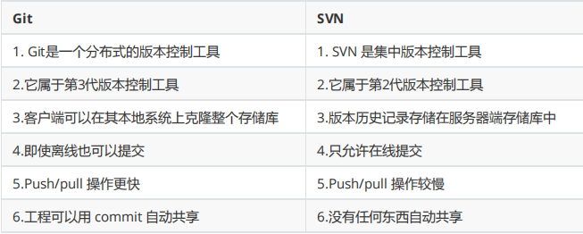
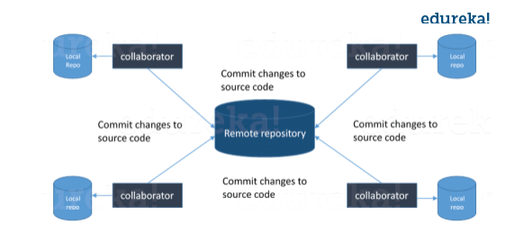

# 1.git篇

[[toc]]

## 1.Git和SVN有什么区别？



## 2.什么是Git？

我建议你先通过了解 git 的架构再来回答这个问题，如下图所示，试着解释一下这个图：

Git 是分布式版本控制系统（DVCS）。它可以跟踪文件的更改，并允许你恢复到任何特定版本的更改。

与 SVN 等其他版本控制系统（VCS）相比，其分布式架构具有许多优势，一个主要优点是它不依赖于中央服务器来存储项目文件的所有版本。

每个开发人员都可以“克隆”我在图中用“Local repository”标注的存储库的副本，并且在他的硬盘驱动器上具有项目的完整历史记录，因此当服务器中断时，你需要的所有恢复数据都在你队友的本地 Git 存储库中。

还有一个中央云存储库，开发人员可以向其提交更改，并与其他团队成员进行共享，如图所示，所有协作者都在提交更改“远程存储库”。



## 3.**在** **Git** 中提交的命令是什么？

答案非常简单。 用于写入提交的命令是 **git commit -a**。

现在解释一下 -a 标志， 通过在命令行上加 -a 指示 git 提交已修改的所有被跟踪文件的新内容。

还要提一下，如果你是第一次需要提交新文件，可以在在 git commit -a 之前先 **git add** 。

## 4.什么是 Git中的“裸存储库”？

1. 你应该说明 “工作目录” 和 “裸存储库” 之间的区别。

   Git 中的 “裸” 存储库只包含版本控制信息而没有工作文件（没有工作树），并且它不包含特殊的``.git ``子目录。相反，它直接在主目录本身包含 .git 子目录中的所有内容，其中工作目录包括：

   1. 一个 .git 子目录，其中包含你的仓库所有相关的 Git 修订历史记录。

   2. 工作树，或签出的项目文件的副本。

## 5. **Git** 是用什么语言编写的？

1. 你需要说明使用它的原因，而不仅仅是说出语言的名称。我建议你这样回答：Git使用 C 语言编写。 GIT 很快，C 语言通过减少运行时的开销来做到这一点。


## 6.在Git中，你如何还原已经 **push **并公开的提交？

There can be two answers to this question and make sure that you include both because any

of the below options can be used depending on the situation: 1 这个问题可以有两个答案，你回答时也要保包含这两个答案，因为根据具体情况可以使用以下选项：

+ 删除或修复新提交中的错误文件，并将其推送到远程存储库。这是修复错误的最自然方式。对文件进行必要的修改后，将其提交到我将使用的远程存储库

````xml
git commit -m "commit message"
````

+ 创建一个新的提交，撤消在错误提交中所做的所有更改。可以使用命令：

````xml
git revert <name of bad commit>
````

## **7**.**git pull** **和** git fetch **有什么区别？**

git pull 命令从中央存储库中提取特定分支的新更改或提交，并更新本地存储库中的目标分支。

git fetch 也用于相同的目的，但它的工作方式略有不同。当你执行 git fetch 时，它会从所需的分支中提取所有新提交，并将其存储在本地存储库中的新分支中。如果要在目标分支中反映这些更改，必须在 git fetch 之后执行 git merge 。只有在对目标分支和获取的分支进行合并后才会更新目标分支。为了方便起见，请记住以下等式：``git pull = git fetch + git merge``

## **8**.git中的“staging area”或“index”是什么？

For this answer try to explain the below diagram as you can see: 可以通过下图进行解释：

在完成提交之前，可以在称为“staging area”或“index”的中间区域中对其进行格式化和审查。从图中可以看出，每个更改首先在暂存区域中进行验证，我将其称为“stage fifile”，然后将更改提交到存储库。


## **9**.**什么是** git stash?

首先应该解释 git stash 的必要性。

通常情况下，当你一直在处理项目的某一部分时，如果你想要在某个时候切换分支去处理其他事情，事情会处于混乱的状态。问题是，你不想把完成了一半的工作的提交，以便你以后就可以回到当前的工作。解决这个问题的答案是 git stash。

再解释什么是git stash。

stash 会将你的工作目录，即修改后的跟踪文件和暂存的更改保存在一堆未完成的更改中，你可以随时重新应用这些更改。

## **10**.什么是git stash drop？

通过说明我们使用 git stash drop 的目的来回答这个问题。

git stash drop 命令用于删除隐藏的项目。默认情况下，它将删除最后添加的存储项，如果提供参数的话，它还可以删除特定项。

下面举个例子。

如果要从隐藏项目列表中删除特定的存储项目，可以使用以下命令：

**git stash list：**它将显示隐藏项目列表，如：

stash@{0}: WIP on master: 049d078 added the index fifile stash@{1}: WIP on master: c264051Revert “added fifile_size” stash@{2}: WIP on master: 21d80a5 added number to log

如果要删除名为 stash@{0} 的项目，请使用命令 **git stash drop stash@{0}**。

## **11**.如何找到特定提交中已更改的文件列表？

对于这个问题，不能仅仅是提供命令，还要解释这个命令究竟做了些什么。

要获取特定提交中已更改的列表文件，请使用以下命令：

**git diffff-tree -r {hash}**

给定提交哈希，这将列出在该提交中更改或添加的所有文件。 -r 标志使命令列出单个文件，而不是仅将它们折叠到根目录名称中。

你还可以包括下面提到的内容，虽然它是可选的，但有助于给面试官留下深刻印象。

输出还将包含一些额外信息，可以通过包含两个标志把它们轻松的屏蔽掉：

**git diffff-tree –no-commit-id –name-only -r {hash}**

这里 -no-commit-id 将禁止提交哈希值出现在输出中，而 -name-only 只会打印文件名而不是它们的路径。

## **12.git confifig** 的功能是什么？

首先说明为什么我们需要 git config 。

git 使用你的用户名将提交与身份相关联。 git config 命令可用来更改你的 git 配置，包括你的用户名。

下面用一个例子来解释。

假设你要提供用户名和电子邮件 ID 用来将提交与身份相关联，以便你可以知道是谁进行了特定提交。为此，我将使用：

**git confifig –global user.name "Your Name":** 此命令将添加用户名。

**git confifig –global user.email "Your E-mail Address":** 此命令将添加电子邮件ID。

## 13.提交对象包含什么？

Commit 对象包含以下组件，你应该提到以下这三点：

+ 一组文件，表示给定时间点的项目状态

+ 引用父提交对象

+ SHAI 名称，一个40个字符的字符串，提交对象的唯一标识。

## 14. 如何在Git中创建存储库？

这可能是最常见的问题，答案很简单。

要创建存储库，先为项目创建一个目录（如果该目录不存在），然后运行命令 **git init**。通过运行此命令，将在项目的目录中创建 .git 目录。

## **15.怎样将** N次提交压缩成一次提交？

将N个提交压缩到单个提交中有两种方式：

+ 如果要从头开始编写新的提交消息，请使用以下命令：

````xml
git reset –soft HEAD~N &&
git commit
````

+ 如果你想在新的提交消息中串联现有的提交消息，那么需要提取这些消息并将它们传给 git commit，可以这样：

````xml
git reset –soft HEAD~N &&
git commit –edit -m"$(git log –format=%B –reverse .HEAD@{N})"
````

## 16.什么是 Git bisect？如何使用它来确定（回归）错误的来源？

我建议你先给出一个Git bisect 的小定义。

Git bisect 用于查找使用二进制搜索引入错误的提交。 Git bisect的命令是

````xml
git bisect <subcommand> <options>
````

既然你已经提到过上面的命令，那就解释一下这个命令会做什么。

此命令用了二进制搜索算法来查找项目历史记录中的哪个提交引入了错误。你可以通过告诉它已知包含该错误的“错误”提交以及在引入错误之前已知的“良好”提交来使用它。然后 git bisect 在这两个端点之间选择一个提交，并询问你所选的提交是“好”还是“坏”。它继续缩小范围，直到找到引入更改的确切提交。

## 17.如果想要在提交之前运行代码性检查工具，并在测试失败时阻止提交，该怎样配置Git存储库？

我建议你先介绍一下完整性检查。

完整性或冒烟测试用来确定继续测试是否可行和合理。

下面解释如何实现这一目标。

这可以通过与存储库的 pre-commit hook 相关的简单脚本来完成。git 会在提交之前触发 pre

commit hook。你可以在这个脚本中运行其他工具，例如 linters，并对提交到存储库中的更改执行

完整性检查。

最后举个例子，你可以参考下面的脚本：

````xml
#!/bin/sh
files=$(git diff –cached –name-only –diff-filter=ACM | grep ‘.go$’)
if [ -z files ]; then
 exit 0
fi
unfmtd=$(gofmt -l $files)
if [ -z unfmtd ]; then
 exit 0
fi
echo “Some .go files are not fmt’d”
exit 1
````

这段脚本检查是否需要通过标准 Go 源代码格式化工具 gofmt 传递所有即将提交的 .go 文件。如果脚步以非 0 状态退出，脚本会有效地阻止提交操作。

## 18.描述一下你所使用的分支策略？

这个问题被要求用Git来测试你的分支经验，告诉他们你在以前的工作中如何使用分支以及它的用途是什么，你可以参考以下提到的要点：

+ 功能分支（Feature branching）要素分支模型将特定要素的所有更改保留在分支内。当通过自动化测试对功能进行全面测试和验证时，该分支将合并到主服务器中。

+ 任务分支（Task branching）在此模型中，每个任务都在其自己的分支上实现，任务键包含在分支名称中。很容易看出哪个代码实现了哪个任务，只需在分支名称中查找任务键。

+ 发布分支（Release branching）一旦开发分支获得了足够的发布功能，你就可以克隆该分支来形成发布分支。创建该分支将会启动下一个发布周期，所以在此之后不能再添加任何新功能，只有错误修复，文档生成和其他面向发布的任务应该包含在此分支中。一旦准备好发布，该版本将合并到主服务器并标记版本号。此外，它还应该再将自发布以来已经取得的进展合并回开发分支。

最后告诉他们分支策略因团队而异，所以我知道基本的分支操作，如删除、合并、检查分支等。

## 19.如果分支是否已合并为master，你可以通过什么手段知道？

答案很直接。

要知道某个分支是否已合并为master，你可以使用以下命令：

``git branch –merged ``它列出了已合并到当前分支的分支。

``git branch –no-merg``它列出了尚未合并的分支。

## 20. 什么是SubGit？

SubGit 是将 SVN 到 Git迁移的工具。它创建了一个可写的本地或远程 Subversion 存储库的 Git 镜像，并且只要你愿意，可以随意使用 Subversion 和 Git。

这样做有很多优点，比如你可以从 Subversion 快速一次性导入到 Git 或者在 Atlassian Bitbucket Server 中使用SubGit。我们可以用 SubGit 创建现有 Subversion 存储库的双向 Git-SVN 镜像。你可以在方便时 push 到 Git 或提交 Subversion。同步由 SubGit 完成。

## 21.列举工作中常用的几个git命令？

新增文件的命令：git add fifile或者git add . 提交文件的命令：git commit –m或者git commit –a 查看工作区状况：git status –s 拉取合并远程分支的操作：git fetch/git merge或者git pull 查看提交记录命令：git reflflog

## 22.如果本次提交误操作，如何撤销？

如果想撤销提交到索引区的文件，可以通过**git reset HEAD fifile**；如果想撤销提交到本地仓库的文件，可以通过**git reset –soft HEAD^n**恢复当前分支的版本库至上一次提交的状态，索引区和工作空间不变更；可以通过**git reset –mixed HEAD^n**恢复当前分支的版本库和索引区至上一次提交的

## 23.你使用过git stash命令吗？你一般什么情况下会使用它？

命令git stash是把工作区修改的内容存储在栈区。 以下几种情况会使用到它：

+ 解决冲突文件时，会先执行git stash，然后解决冲突；

+ 遇到紧急开发任务但目前任务不能提交时，会先执行git stash，然后进行紧急任务的开发，然后通过git stash pop取出栈区的内容继续开发；

+ 切换分支时，当前工作空间内容不能提交时，会先执行git stash再进行分支切换；

## 24.如何查看分支提交的历史记录？查看某个文件的历史记录呢？

查看分支的提交历史记录：

+ 命令git log –number：表示查看当前分支前number个详细的提交历史记录；

+ 命令git log –number –pretty=oneline：在上个命令的基础上进行简化，只显示sha-1码和提交信息；

+ 命令git reflflog –number: 表示查看所有分支前number个简化的提交历史记录；

+ 命令git reflflog –number –pretty=oneline：显示简化的信息历史信息；

+ 如果要查看某文件的提交历史记录，直接在上面命令后面加上文件名即可。

注意：如果没有number则显示全部提交次数。

## 25.使用过git merge和git rebase吗？它们之间有什么区别？

简单的说，git merge和git rebase都是合并分支的命令。 git merge branch会把branch分支的差异内容pull到本地，然后与本地分支的内容一并形成一个committer对象提交到主分支上，合并后的分支与主分支一致； git rebase branch会把branch分支优先合并到主分支，然后把本地分支的commit放到主分支后面，合并后的分支就好像从合并后主分支又拉了一个分支一样，本地分支本身不会保留提交历史。

## 26.使用过git cherry-pick，有什么作用？

命令git cherry-pick可以把branch A的commit复制到branch B上。 在branch B上进行命令操作：

+ 复制单个提交：git cherry-pick commitId

+ 复制多个提交：git cherry-pick commitId1…commitId3

注意：复制多个提交的命令不包含commitId1