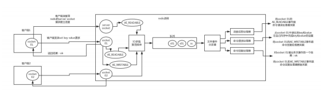
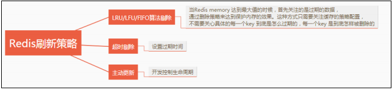

# 1.redis篇

[[toc]]

## 1.什么是Redis？

+ Redis 是一个开源（BSD 许可）、基于内存、支持多种数据结构的存储系统，可以作为数据库、缓存和消息中间件。

+ 它支持的数据结构有字符串（strings）、哈希（hashes）、列表（lists）、集合（sets）、有序集合（sorted sets）等，除此之外还支持 bitmaps、hyperloglogs 和地理空间（geospatial ）索引半径查询等功能。

+ 它内置了复制（Replication）、LUA 脚本（Lua scripting）、LRU 驱动事件（LRU eviction）、事务（Transactions）和不同级别的磁盘持久化（persistence）功能，并通过 Redis 哨兵（哨兵）和集群（Cluster）保证缓存的高可用性（High availability）。

## 2. 为什么 Redis 单线程模型效率也能那么高？

1. C语言实现，效率高。

2. 纯内存操作。

3. 基于非阻塞的IO复用模型机制。

4. 单线程的话就能避免多线程的频繁上下文切换问题。

5. 丰富的数据结构（全称采用hash结构，读取速度非常快，对数据存储进行了一些优化，比如亚索表，跳表等）。

   [扩展说明](https://blog.csdn.net/m0_68885781/article/details/126494452)

## 3.**说说** **Redis** 的线程模型?

``Redis`` 内部使用**文件事件处理器** ``file event handler`` ，这个文件事件处理器是**单线程的**，所以``Redis ``才叫做单线程的模型。它采用 IO 多路复用机制同时监听多个 socket ，根据 socket 上的事件来选择对应的事件处理器进行处理。

文件事件处理器的结构包含 4 个部分：

1. 多个 socket 。

2. IO 多路复用程序。

3. 文件事件分派器。

4. 事件处理器（连接应答处理器、命令请求处理器、命令回复处理器）。

多个 socket 可能会并发产生不同的操作，每个操作对应不同的文件事件，但是 IO 多路复用程序会监听多个 socket，会将 socket 产生的事件放入队列中排队，事件分派器每次从队列中取出一个事件，把该事件交给对应的事件处理器进行处理。

来看客户端与 Redis 的一次通信过程：



下面来大致说一下这个图：

1. 客户端 Socket01 向 Redis 的 Server Socket 请求建立连接，此时 Server Socket 会产生一个AE_READABLE 事件，IO 多路复用程序监听到 server socket 产生的事件后，将该事件压入队列中。文件事件分派器从队列中获取该事件，交给连接应答处理器。连接应答处理器会创建一个能与客户端通信的 Socket01，并将该 Socket01 的 AE_READABLE 事件与命令请求处理器关联。

2. 假设此时客户端发送了一个 set key value 请求，此时 Redis 中的 Socket01 会产生AE_READABLE 事件，IO 多路复用程序将事件压入队列，此时事件分派器从队列中获取到该事件，由于前面 Socket01 的 AE_READABLE 事件已经与命令请求处理器关联，因此事件分派器将事件交给命令请求处理器来处理。命令请求处理器读取 Socket01 的 set key value 并在自己内存中完成 set key value 的设置。操作完成后，它会将 Socket01 的 AE_WRITABLE 事件与令回复处理器关联。

3. 如果此时客户端准备好接收返回结果了，那么 Redis 中的 Socket01 会产生一个AE_WRITABLE 事件，同样压入队列中，事件分派器找到相关联的命令回复处理器，由命令回复处理器对 Socket01 输入本次操作的一个结果，比如 ok ，之后解除 Socket01 的AE_WRITABLE 事件与命令回复处理器的关联。

这样便完成了一次通信。 不要怕这段文字，结合图看，一遍不行两遍，实在不行可以网上查点资料结合着看，一定要搞清楚，否则前面吹的牛逼就白费了。

## 4.Redis的同步机制了解是什么？

Redis 支持主从同步、从从同步。

如果是第一次进行主从同步，主节点需要使用 bgsave 命令，再将后续修改操作记录到内存的缓冲区，等 RDB 文件全部同步到复制节点，复制节点接受完成后将RDB 镜像记载到内存中。

等加载完成后，复制节点通知主节点将复制期间修改的操作记录同步到复制节点，即可完成同步过程。

## 5. **pipeline** 有什么好处，为什么要用 **pipeline**？

使用 pipeline（管道）的好处在于可以将多次 I/O 往返的时间缩短为一次，但是要求管道中执行的指令间没有因果关系。

用 pipeline 的原因在于可以实现请求/响应服务器的功能，当客户端尚未读取旧响应时，它也可以处理新的请求。如果客户端存在多个命令发送到服务器时，那么客户端无需等待服务端的每次响应才能执行下个命令，只需最后一步从服务端读取回复即可。

## 6.说一下Redis有什么优点和缺点？

**优点**

+ 速度快：因为数据存在内存中，类似于 HashMap ， HashMap 的优势就是查找和操作的时间复杂度都是O (1) 。

+ 支持丰富的数据结构：支持 String ，List，Set，Sorted Set，Hash 五种基础的数据结构。

+ 持久化存储：Redis 提供 RDB 和 AOF 两种数据的持久化存储方案，解决内存数据库最担心的万一 Redis 挂掉，数据会消失掉。

+ 高可用：内置 Redis Sentinel ，提供高可用方案，实现主从故障自动转移。 内置 RedisCluster ，提供集群方案，实现基于槽的分片方案，从而支持更大的 Redis 规模。

+ 丰富的特性：Key过期、计数、分布式锁、消息队列等。

**缺点**

+ 由于 Redis 是内存数据库，所以，单台机器，存储的数据量，跟机器本身的内存大小。虽然Redis 本身有 Key 过期策略，但是还是需要提前预估和节约内存。如果内存增长过快，需要定期删除数据。

+ 如果进行完整重同步，由于需要生成 RDB 文件，并进行传输，会占用主机的 CPU ，并会消耗现网的带宽。不过 Redis 2.8 版本，已经有部分重同步的功能，但是还是有可能有完整重同步的。比如，新上线的备机。

+ 修改配置文件，进行重启，将硬盘中的数据加载进内存，时间比较久。在这个过程中， Redis不能提供服务。

## 7.**Redis** **缓存刷新策略有哪些？**



## 8.Redis 持久化方式有哪些？以及有什么区别？

Redis 提供两种持久化机制 ``RDB`` 和 ``AOF`` 机制:

**RDB** **持久化方式**

是指用数据集快照的方式半持久化模式，记录 redis 数据库的所有键值对,在某个时间点将数据写入一个临时文件，持久化结束后，用这个临时文件替换上次持久化的文件，达到数据恢复。

**优点：**

+ 只有一个文件 dump.rdb ，方便持久化。

+ 容灾性好，一个文件可以保存到安全的磁盘。

+ 性能最大化，fork 子进程来完成写操作，让主进程继续处理命令，所以是 IO 最大化。使用单独子进程来进行持久化，主进程不会进行任何 IO 操作，保证了 Redis 的高性能

+ 相对于数据集大时，比 AOF 的启动效率更高。

**缺点：**

数据安全性低。 RDB 是间隔一段时间进行持久化，如果持久化之间 Redis 发生故障，会发生数据丢失。所以这种方式更适合数据要求不严谨的时候

**AOF=Append-only file** **持久化方式**

是指所有的命令行记录以 Redis 命令请求协议的格式完全持久化存储，保存为 AOF 文件。

**优点：**

（1）数据安全， AOF 持久化可以配置 appendfsync 属性，有 always，每进行一次命令操作就记录到 AOF 文件中一次。

（2）通过 append 模式写文件，即使中途服务器宕机，可以通过 redis-check-aof 工具解决数据一致性问题。

（3） AOF 机制的 rewrite 模式。 AOF 文件没被 rewrite 之前（文件过大时会对命令进行合并重写），可以删除其中的某些命令（比如误操作的 flushall )

**缺点：**

（1） AOF 文件比 RDB 文件大，且恢复速度慢。

（2）数据集大的时候，比 RDB 启动效率低。

## 9.**持久化有两种，那应该怎么选择呢？**

1. 不要仅仅使用 RDB ，因为那样会导致你丢失很多数据。

2. 也不要仅仅使用 AOF ，因为那样有两个问题，第一，你通过 AOF 做冷备没有 RDB 做冷备的恢复速度更快; 第二， RDB 每次简单粗暴生成数据快照，更加健壮，可以避免 AOF 这种复杂的备份和恢复机制的 bug 。

3. Redis 支持同时开启开启两种持久化方式，我们可以综合使用 AOF 和 RDB 两种持久化机制，用 AOF 来保证数据不丢失，作为数据恢复的第一选择; 用 RDB 来做不同程度的冷备，在 AOF文件都丢失或损坏不可用的时候，还可以使用 RDB 来进行快速的数据恢复。

4. 如果同时使用 RDB 和 AOF 两种持久化机制，那么在 Redis 重启的时候，会使用 AOF 来重新构建数据，因为 AOF 中的数据更加完整。

## 10. 怎么使用 Redis **实现消息队列？**

一般使用 list 结构作为队列， rpush 生产消息， lpop 消费消息。当 lpop 没有消息的时候，要适当sleep 一会再重试。

+ 面试官可能会问可不可以不用 sleep 呢？list 还有个指令叫 blpop ，在没有消息的时候，它会阻塞住直到消息到来。

+ 面试官可能还问能不能生产一次消费多次呢？使用 pub / sub 主题订阅者模式，可以实现 1:N的消息队列。

+ 面试官可能还问 pub / sub 有什么缺点？在消费者下线的情况下，生产的消息会丢失，得使用专业的消息队列如 rabbitmq 等。
+ 面试官可能还问 Redis 如何**实现延时队列**？我估计现在你很想把面试官一棒打死如果你手上有一根棒球棍的话，怎么问的这么详细。但是你很克制，然后神态自若的回答道：使用sortedset ，拿时间戳作为 score ，消息内容作为 key 调用 zadd 来生产消息，消费者用zrangebyscore 指令获取 N 秒之前的数据轮询进行处理。

**面试扩散**：很多面试官上来就直接这么问： 

Redis 如何**实现延时队列**？

## 11.说说你对Redis事务的理解？

**什么是** **Redis** **事务？原理是什么？**

Redis 中的事务是一组命令的集合，是 Redis 的最小执行单位。它可以保证一次执行多个命令，每个事务是一个单独的隔离操作，事务中的所有命令都会序列化、按顺序地执行。服务端在执行事务的过程中，不会被其他客户端发送来的命令请求打断。

它的原理是先将属于一个事务的命令发送给 Redis，然后依次执行这些命令。

**Redis** **事务的注意点有哪些？**

需要注意的点有：

+ Redis 事务是不支持回滚的，不像 MySQL 的事务一样，要么都执行要么都不执行；

+ Redis 服务端在执行事务的过程中，不会被其他客户端发送来的命令请求打断。直到事务命令全部执行完毕才会执行其他客户端的命令。

**Redis** **事务为什么不支持回滚？**

Redis 的事务不支持回滚，但是执行的命令有语法错误，Redis 会执行失败，这些问题可以从程序层面捕获并解决。但是如果出现其他问题，则依然会继续执行余下的命令。这样做的原因是因为回滚需要增加很多工作，而不支持回滚则可以保持简单、快速的特性。

## 12.Redis为什么设计成单线程的？

多线程处理会涉及到锁，并且多线程处理会涉及到线程切···换而消耗 CPU。采用单线程，避免了不必要的上下文切换和竞争条件。其次 CPU 不是 Redis 的瓶颈，Redis 的瓶颈最有可能是机器内存或者网络带宽。

## 13.什么是 bigkey？会存在什么影响？

bigkey 是指键值占用内存空间非常大的 key。例如一个字符串 a 存储了 200M 的数据。

bigkey 的主要影响有：

+ 网络阻塞；获取 bigkey 时，传输的数据量比较大，会增加带宽的压力。

+ 超时阻塞；因为 bigkey 占用的空间比较大，所以操作起来效率会比较低，导致出现阻塞的可能性增加。
+ 导致内存空间不平衡；一个 bigkey 存储数据量比较大，同一个 key 在同一个节点或服务器中存储，会造成一定影响。

## 14.熟悉哪些Redis集群模式？

1. Redis Sentinel

体量较小时，选择 Redis Sentinel ，单主 Redis 足以支撑业务。

2. Redis Cluster

Redis 官方提供的集群化方案，体量较大时，选择 Redis Cluster ，通过分片，使用更多内存。

3. Twemprox

Twemprox 是 Twtter 开源的一个 Redis 和 Memcached 代理服务器，主要用于管理 Redis 和Memcached 集群，减少与Cache 服务器直接连接的数量。

4. Codis

Codis 是一个代理中间件，当客户端向 Codis 发送指令时， Codis 负责将指令转发到后面的Redis 来执行，并将结果返回给客户端。一个 Codis 实例可以连接多个 Redis 实例，也可以启动多个 Codis 实例来支撑，每个 Codis 节点都是对等的，这样可以增加整体的 QPS 需求，还能起到容灾功能。

5. 客户端分片

在 Redis Cluster 还没出现之前使用较多，现在基本很少热你使用了，在业务代码层实现，起几个毫无关联的 Redis 实例，在代码层，对 Key 进行 hash 计算，然后去对应的 Redis 实例操作数据。这种方式对 hash 层代码要求比较高，考虑部分包括，节点失效后的替代算法方案，数据震荡后的自动脚本恢复，实例的监控，等等。

## 15.Redis Cluster集群的原理是什么？

Redis Cluster集群的原理基于**分片、复制、高可用和自动故障转移**等核心概念。

+ **分片**：Redis Cluster通过散列的方式将数据分布在多个节点上，每个节点负责一部分数据。这种方式称为数据分片，它允许集群存储远超过单个Redis实例多能存储的数据量。
+ **复制**：在Redis Cluster中，每个主节点（master）可以有多个从节点（slave）。从节点复制主节点的数据，这样及时主节点出现故障，从节点也可以继续提供服务，保证数据的高可用性。
+ **高可用**：为了实现高可用，Redis Cluster采用类似于Sentinel系统的心跳检测机制来监控各个节点的状态。如果一个节点被判断为不可用，那么集群会自动进行故障转移，选举出新的主节点来代替失效的节点。
+ **自动故障转移**：当某个主节点出现故障时，Redis Cluster能够自动将从节点升级为主节点，以保证集群中总有足够的主节点来提供服务。

## 16. **Redis Cluster** 集群方案什么情况下会导致整个集群不可用？

Redis 没有使用哈希一致性算法，而是使用哈希槽。Redis 中的哈希槽一共有 16384 个，计算给定密钥的哈希槽，我们只需要对密钥的 CRC16 取摸 16384。假设集群中有 A、B、C 三个集群节点，不存在复制模式下，每个集群的节点包含的哈希槽如下：

+ 节点 A 包含从 0 到 5500 的哈希槽；

+ 节点 B 包含从 5501 到 11000 的哈希槽；

+ 节点 C 包含从 11001 到 16383 的哈希槽；

+ 这时，如果节点 B 出现故障，整个集群就会出现缺少 5501 到 11000 的哈希槽范围而不可用。

## 17.Redis Cluster的数据分片机制是什么？

Redis CLuster的数据分片机制是通过虚拟槽来实现的。

+ Redis Cluster通过预先分配一定数量（默认为16384个）的虚拟哈希槽来进行数据分片。这些槽位覆盖了0到16384的整数范围。每个节点负责一部分槽位，所有的建通过哈希函数映射到这些整数槽位上。
+ 节点角色：在一个健康的Redis Cluster集群中，通常推荐至少有3个主节点和3个从节点，共计6个节点。这样的配置可以保证即使失去一个主节点，仍然有其他主节点可以接管其槽位，从而保持集群的稳定性。
+ 数据分配：当客户端想集群中插入一个键值对时，它会根据键的哈希值来确定该键应该落在哪个槽位上。然后，客户端会将写操作定向到负责该槽位的主节点上。这样，每个节点只负责一部分数据，实现了数据的分片存储。
+ 高可用性：为了提高数据的高可用性和容错性，Redis Cluster采用了主从复制机制。每个主节点可以有一个或者多个从节点，从节点会复制主节点的数据。如果主节点发生故障，集群可以自动将从节点提升为主节点，以此来保证服务的连续性。

## 18.Redis 常见性能问题和解决方案有哪些？

Redis 常见性能问题和解决方案如下：

+ Master 最好不要做任何持久化工作，如 RDB 内存快照和 AOF 日志文件；

+ 如果数据比较重要，某个 Slave 开启 AOF 备份数据，策略设置为每秒同步一次；

+ 为了主从复制的速度和连接的稳定性，Master 和 Slave 最好在同一个局域网内；

+ 尽量避免在压力很大的主库上增加从库；

+ 主从复制不要用图状结构，用单向链表结构更为稳定，即：Master <- Slave1 <- Slave2 <-Slave3….；这样的结构方便解决单点故障问题，实现 Slave 对 Master 的替换。如果 Master 挂了，可以立刻启用 Slave1 做 Master，其他不变。

## 19.假如 **Redis** 里面有 **1** **亿个** key，其中有 **10w** **个** **key** 是以某个固定的已知的前缀开头的，如果将它们全部找出来?

我们可以使用 keys 命令和 scan 命令，但是会发现使用 scan 更好。

**1.** **使用** **keys** **命令**

直接使用 keys 命令查询，但是如果是在生产环境下使用会出现一个问题，keys 命令是遍历查询的，查询的时间复杂度为 O(n)，数据量越大查询时间越长。而且 Redis 是单线程，keys 指令会导致线程阻塞一段时间，会导致线上 Redis 停顿一段时间，直到 keys 执行完毕才能恢复。这在生产环境是不允许的。除此之外，需要注意的是，这个命令没有分页功能，会一次性查询出所有符合条件的 key 值，会发现查询结果非常大，输出的信息非常多。所以不推荐使用这个命令。

**2.** **使用** **scan** **命令**

scan 命令可以实现和 keys 一样的匹配功能，但是 scan 命令在执行的过程不会阻塞线程，并且查找的数据可能存在重复，需要客户端操作去重。因为 scan 是通过游标方式查询的，所以不会导致Redis 出现假死的问题。Redis 查询过程中会把游标返回给客户端，单次返回空值且游标不为 0，则说明遍历还没结束，客户端继续遍历查询。scan 在检索的过程中，被删除的元素是不会被查询出来的，但是如果在迭代过程中有元素被修改，scan 不能保证查询出对应元素。相对来说，scan 指令查找花费的时间会比 keys 指令长。

## 20.什么情况下可能会导致 **Redis** 阻塞？

Redis 产生阻塞的原因主要有内部和外部两个原因导致：

**内部原因**

+ 如果 Redis 主机的 CPU 负载过高，也会导致系统崩溃；

+ 数据持久化占用资源过多；

+ 对 Redis 的 API 或指令使用不合理，导致 Redis 出现问题。

**外部原因**

+ 外部原因主要是服务器的原因，例如服务器的 CPU 线程在切换过程中竞争过大，内存出现问题、网络问题等。

## 21.缓存和数据库谁先更新呢？

**解决方案**

1. 写请求过来，将写请求缓存到缓存队列中，并且开始执行写请求的具体操作（删除缓存中的数据，更新数据库，更新缓存）。

2. 如果在更新数据库过程中，又来了个读请求，将读请求再次存入到缓存队列（可以搞n个队列，采用key的hash值进行队列个数取模hash%n，落到对应的队列中，队列需要保证顺序性）中，顺序性保证等待队列前的写请求执行完成，才会执行读请求之前的写请求删除缓存失败，直接返回，此时数据库中的数据是旧值，并且与缓存中的数据是一致的，不会出现缓存一致性的问题。

3. 写请求删除缓存成功，则更新数据库，如果更新数据库失败，则直接返回，写请求结束，此时数据库中的值依旧是旧值，读请求过来后，发现缓存中没有数据， 则会直接向数据库中请求，同时将数据写入到缓存中，此时也不会出现数据一致性的问题。

4. 更新数据成功之后，再更新缓存，如果此时更新缓存失败，则缓存中没有数据，数据库中是新值 ，写请求结束，此时读请求还是一样，发现缓存中没有数据，同样会从数据库中读取数据，并且存入到缓存中，其实这里不管更新缓存成功还是失败， 都不会出现数据一致性的问题。

上面这方案解决了数据不一致的问题，主要是使用了串行化，每次操作进来必须按照顺序进行。如果某个队列元素积压太多，可以针对读请求进行过滤，提示用户刷新页面，重新请求。

**潜在的问题**，留给大家自己去想吧，因为这个问题属于发散性。

1，请求时间过长，大量的写请求堆压在队列中，一个读请求来得等都写完了才可以获取到数据。

2，读请求并发高。

3，热点数据路由问题，导致请求倾斜。

## 22.怎么提高缓存命中率？

主要常用的手段有：

+ 提前加载数据到缓存中；

+ 增加缓存的存储空间，提高缓存的数据；

+ 调整缓存的存储数据类型；

+ 提升缓存的更新频率。

## 23.Redis 报内存不足怎么处理？

Redis 内存不足可以这样处理：

+ 修改配置文件 redis.conf 的 maxmemory 参数，增加 Redis 可用内存；

+ 设置缓存淘汰策略，提高内存的使用效率；
+ 使用 Redis 集群模式，提高存储量。

## 24.缓存雪崩、缓存穿透、缓存预热、缓存更新、缓存降级等问题?

**一、缓存雪崩**

我们可以简单的理解为：由于原有缓存失效，新缓存未到期间 (例如：我们设置缓存时采用了相同的过期时间，在同一时刻出现大面积的缓存过期)，所有原本应该访问缓存的请求都去查询数据库了，而对数据库CPU和内存造成巨大压力，严重的会造成数据库宕机。从而形成一系列连锁反应，造成整个系统崩溃。 

**解决办法：** 

大多数系统设计者考虑用加锁（ 最多的解决方案）或者队列的方式保证来保证不会有大量的线程对数据库一次性进行读写，从而避免失效时大量的并发请求落到底层存储系统上。还有一个简单方案就时讲缓存失效时间分散开。

**二、缓存穿透** 

缓存穿透是指用户查询数据，在数据库没有，自然在缓存中也不会有。这样就导致用户查询的时候，在缓存中找不到，每次都要去数据库再查询一遍，然后返回空（相当于进行了两次无用的查询）。这样请求就绕过缓存直接查数据库，这也是经常提的缓存命中率问题。

 **解决办法**:

最常见的则是采用**布隆过滤器**，将所有可能存在的数据哈希到一个足够大的bitmap中，一个一定不存在的数据会被这个bitmap拦截掉，从而避免了对底层存储系统的查询压力。 另外也有一个更为**简单粗暴的方法**，如果一个查询返回的数据为空（不管是数据不存在，还是系统故障），我们仍然把这个空结果进行缓存，但它的过期时间会很短，最长不超过五分钟。通过这个直接设置的默认值存放到缓存，这样第二次到缓冲中获取就有值了，而不会继续访问数据库，这种办法最简单粗暴。

5TB的硬盘上放满了数据，请写一个算法将这些数据进行排重。如果这些数据是一些32bit大小的数据该如何解决？如果是64bit的呢？对于空间的利用到达了一种极致，那就是Bitmap和布隆过滤器(Bloom Filter)。Bitmap： 典型的就是哈希表 缺点是，Bitmap对于每个元素只能记录1bit信息，如果还想完成额外的功能，恐怕只能靠牺牲更多的空间、时间来完成了。

**布隆过滤器（推荐）** 

就是引入了k(k>1)k(k>1)个相互独立的哈希函数，保证在给定的空间、误判率下，完成元素判重的过程。 它的优点是空间效率和查询时间都远远超过一般的算法，缺点是有一定的误识别率和删除困难。 Bloom-Filter算法的核心思想就是利用多个不同的Hash函数来解决“冲突”。 Hash存在一个冲突（碰撞）的问题，用同一个Hash得到的两个URL的值有可能相同。为了减少冲突，我们可以多引入几个Hash，如果通过其中的一个Hash值我们得出某元素不在集合中，那么该元素肯定不在集合中。只有在所有的Hash函数告诉我们该元素在集合中时，才能确定该元素存在于集合中。这便是Bloom-Filter的基本思想。 Bloom-Filter一般用于在大数据量的集合中判定某元素是否存在。

**三、缓存预热** 

缓存预热这个应该是一个比较常见的概念，相信很多小伙伴都应该可以很容易的理解，缓存预热就是系统上线后，将相关的缓存数据直接加载到缓存系统。这样就可以避免在用户请求的时候，先查询数据库，然后再将数据缓存的问题！用户直接查询事先被预热的缓存数据！ 

解决思路： 1、直接写个缓存刷新页面，上线时手工操作下； 2、数据量不大，可以在项目启动的时候自动进行加载； 3、定时刷新缓存；

**四、缓存更新** 

除了缓存服务器自带的缓存失效策略之外（Redis默认的有6中策略可供选择），我们还可以根据具体的业务需求进行自定义的缓存淘汰，常见的策略有两种： 

（1）定时去清理过期的缓存； 

（2）当有用户请求过来时，再判断这个请求所用到的缓存是否过期，过期的话就去底层系统得到新数据并更新缓存。 两者各有优劣，第一种的缺点是维护大量缓存的key是比较麻烦的，第二种的缺点就是每次用户请求过来都要判断缓存失效，逻辑相对比较复杂！具体用哪种方案，大家可以根据自己的应用场景来权衡。

**五、缓存降级** 

当访问量剧增、服务出现问题（如响应时间慢或不响应）或非核心服务影响到核心流程的性能时，仍然需要保证服务还是可用的，即使是有损服务。系统可以根据一些关键数据进行自动降级，也可以配置开关实现人工降级。 降级的最终目的是保证核心服务可用，即使是有损的。而且有些服务是无法降级的（如加入购物车、结算）。

 以参考日志级别设置预案： 

（1）一般：比如有些服务偶尔因为网络抖动或者服务正在上线而超时，可以自动降级； 

（2）警告：有些服务在一段时间内成功率有波动（如在95~100%之间），可以自动降级或人工降级，并发送告警； 

（3）错误：比如可用率低于90%，或者数据库连接池被打爆了，或者访问量突然猛增到系统能承受的最大阀值，此时可以根据情况自动降级或者人工降级； 

（4）严重错误：比如因为特殊原因数据错误了，此时需要紧急人工降级。服务降级的目的，是为了防止Redis服务故障，导致数据库跟着一起发生雪崩问题。因此，对于不重要的缓存数据，可以采取服务降级策略，例如一个比较常见的做法就是，Redis出现问题，不去数据库查询，而是直接返回默认值给用户。

## 25.redis的数据类型，以及每种数据类型的使用场景?

主要有五种基本类型。 

+ String:最基本的数据类型，可以存储字符串、整数、浮点数。场景：缓存对象、访问次数、分布式锁、共享session信息等。
+ List:列表类型，适用于存储过个有序的字符串。常用于消息队列，但需要注意生产者需要自行实现全局唯一ID,且不能以消费组形式消费数据。
+ Hash:哈希类型，适合存储对象，可以认为一个字段-值的集合。常用于缓存对象，如用户信息等。
+ Set:集合类型，用于存储无序且唯一的字符串集合。适用于去重需求，社交场景中的好友关系、共同关注的标签等。
+ Sorted Set:有序集合类型，每个成员都有一个分数，根据分数对成员进行排序。适用于排行榜、带权重的标签系统等。
+ 除了基本类型，Redis还提供了启动功能，如发布订阅模式用于消息广播，以及事务用于执行一组命令。 

## 26.redis的过期策略以及内存淘汰机制?

redis采用的是``定期删除+惰性删除``策略。

为什么不用定时删除策略? 

定时删除,用一个定时器来负责监视key,过期则自动删除。虽然内存及时释放，但是十分消耗CPU资源。在大并发请求下，CPU要将时间应用在处理请求，而不是删除key,因此没有采用这一策略。

``定期删除、惰性删除``是如何工作的呢? 定期删除，redis默认每个100ms检查，是否有过期的key,有过期key则删除。

需要说明的是，redis不是每个100ms将所有的key检查一次，而是随机抽取进行检查(如果每隔100ms,全部key进行检查，redis岂不是卡死)。因此，如果只采用定期删除策略，会导致很多key到时间没有删除。 于是，``惰性删除``派上用场。也就是说在你获取某个key的时候，redis会检查一下，这个key如果设置了过期时间那么是否过期了？如果过期了此时就会删除。 

采用定期删除+惰性删除就没其他问题了么?不是的，如果定期删除没删除key。然后你也没即时去请求key，也就是说惰性删除也没生效。这样，redis的内存会越来越高。那么就应该采用``内存淘汰机制``。 在redis.conf中有一行配置

````xml
maxmemory-policy volatile-lru
````

该配置就是配内存淘汰策略的。什么，你没配过？好好反省一下自己

 **volatile-lru**：从已设置过期时间的数据集（server.db[i].expires）中挑选最近最少使用的数据淘汰。

**volatile-ttl**：从已设置过期时间的数据集（server.db[i].expires）中挑选将要过期的数据淘汰。

**volatile-random**：从已设置过期时间的数据（server.db[i].expires）中任意选择数据淘汰。

**allkeys-lru**：从数据集（server.db[i].dict）中挑选最近最少使用的数据淘汰。 

**allkeys-random**：从数据集（server.db[i].dict）中任意选择数据淘汰。

**no-enviction**（驱逐）：禁止驱逐数据，新写入操作会报错。 

ps：如果没有设置 expire 的key, 不满足先决条件(prerequisites); 那么 volatile-lru, volatile-random 和 volatile-ttl 策略的行为, 和 noeviction(不删除) 基本上一致。
