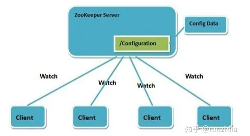
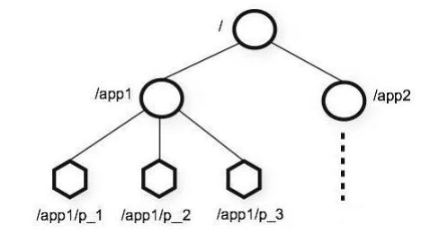
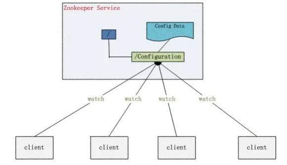
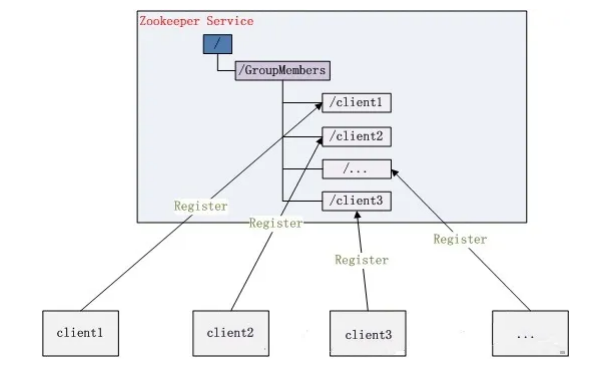
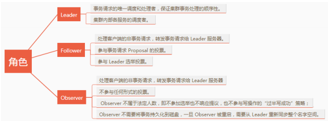
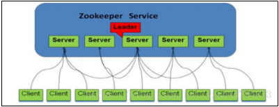
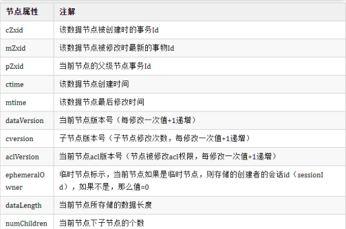
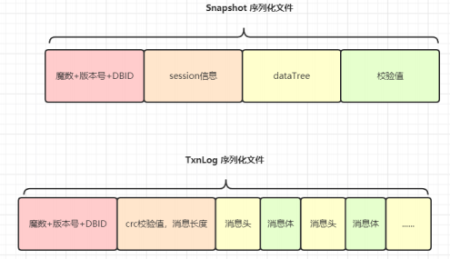

# 1.zookeeper篇

[[toc]]

## 1.**说说** **Zookeeper** **是什么？**

**直译：**从名字上直译就是动物管理员，动物指的是 Hadoop 一类的分布式软件，管理员三个字体现

了 ZooKeeper 的特点：维护、协调、管理、监控。

**简述：**有些软件你想做成集群或者分布式，你可以用 ZooKeeper 帮你来辅助实现。

**特点：**

最终一致性：客户端看到的数据最终是一致的。

可靠性：服务器保存了消息，那么它就一直都存在。

实时性：ZooKeeper 不能保证两个客户端同时得到刚更新的数据。

独立性（等待无关）：不同客户端直接互不影响。

原子性：更新要不成功要不失败，没有第三个状态。

**注意**：回答面试题，切忌只是简单一句话回答，可以将你对概念的理解，特点等多个方面描述一

下，哪怕你自己认为不完全切中题意的也可以说说，面试官不喜欢会打断你的，你的目的是让面试

官认为你是好沟通的。当然了，如果不会可别装作会，说太多不专业的想法。

## 2.**ZooKeeper** **有哪些应用场景？**

**数据发布与订阅**

发布与订阅即所谓的配置管理，顾名思义就是将数据发布到ZooKeeper节点上，供订阅者动态获取

数据，实现配置信息的集中式管理和动态更新。例如全局的配置信息，地址列表等就非常适合使

用。数据发布/订阅的一个常见的场景是配置中心，发布者把数据发布到 ZooKeeper 的一个或一系列的

节点上，供订阅者进行数据订阅，达到动态获取数据的目的。

配置信息一般有几个特点:

1. 数据量小的KV

2. 数据内容在运行时会发生动态变化

3. 集群机器共享，配置一致



ZooKeeper 采用的是推拉结合的方式。

1. 推: 服务端会推给注册了监控节点的客户端 Wathcer 事件通知

2. 拉: 客户端获得通知后，然后主动到服务端拉取最新的数据

**命名服务**

作为分布式命名服务，命名服务是指通过指定的名字来获取资源或者服务的地址，利用ZooKeeper

创建一个全局的路径，这个路径就可以作为一个名字，指向集群中的集群，提供的服务的地址，或

者一个远程的对象等等。

统一命名服务的命名结构图如下所示：



1、在分布式环境下，经常需要对应用/服务进行统一命名，便于识别不同服务。

类似于域名与IP之间对应关系，IP不容易记住，而域名容易记住。

通过名称来获取资源或服务的地址，提供者等信息。

2、按照层次结构组织服务/应用名称。

可将服务名称以及地址信息写到ZooKeeper上，客户端通过ZooKeeper获取可用服务列表类。

**配置管理**

程序分布式的部署在不同的机器上，将程序的配置信息放在ZooKeeper的znode下，当有配置发生

改变时，也就是znode发生变化时，可以通过改变zk中某个目录节点的内容，利用watch通知给各

个客户端 从而更改配置。

ZooKeeper配置管理结构图如下所示：



1、分布式环境下，配置文件管理和同步是一个常见问题。一个集群中，所有节点的配置信息是一致的，比如 Hadoop 集群。

对配置文件修改后，希望能够快速同步到各个节点上。

2、配置管理可交由ZooKeeper实现。

可将配置信息写入ZooKeeper上的一个Znode。

各个节点监听这个Znode。

一旦Znode中的数据被修改，ZooKeeper将通知各个节点。

**集群管理**

所谓集群管理就是：是否有机器退出和加入、选举master。

集群管理主要指集群监控和集群控制两个方面。前者侧重于集群运行时的状态的收集，后者则是对

集群进行操作与控制。开发和运维中，面对集群，经常有如下需求:

1. 希望知道集群中究竟有多少机器在工作

2. 对集群中的每台机器的运行时状态进行数据收集

3. 对集群中机器进行上下线的操作

集群管理结构图如下所示：



1、分布式环境中，实时掌握每个节点的状态是必要的，可根据节点实时状态做出一些调整。

2、可交由ZooKeeper实现。

可将节点信息写入ZooKeeper上的一个Znode。

监听这个Znode可获取它的实时状态变化。

3、典型应用Hbase中Master状态监控与选举。

利用ZooKeeper的强一致性，能够保证在分布式高并发情况下节点创建的全局唯一性，即：同时有

多个客户端请求创建 /currentMaster 节点，最终一定只有一个客户端请求能够创建成功

**分布式通知与协调**

1、分布式环境中，经常存在一个服务需要知道它所管理的子服务的状态。

a）NameNode需知道各个Datanode的状态。

b）JobTracker需知道各个TaskTracker的状态。

2、心跳检测机制可通过ZooKeeper来实现。

3、信息推送可由ZooKeeper来实现，ZooKeeper相当于一个发布/订阅系统。

**分布式锁**

处于不同节点上不同的服务，它们可能需要顺序的访问一些资源，这里需要一把分布式的锁。

分布式锁具有以下特性：写锁、读锁、时序锁。

写锁：在zk上创建的一个临时的无编号的节点。由于是无序编号，在创建时不会自动编号，导致只

能客户端有一个客户端得到锁，然后进行写入。

读锁：在zk上创建一个临时的有编号的节点，这样即使下次有客户端加入是同时创建相同的节点

时，他也会自动编号，也可以获得锁对象，然后对其进行读取。

时序锁：在zk上创建的一个临时的有编号的节点根据编号的大小控制锁。

**分布式队列**

分布式队列分为两种：

1、当一个队列的成员都聚齐时，这个队列才可用，否则一直等待所有成员到达，这种是同步队

列。

a）一个job由多个task组成，只有所有任务完成后，job才运行完成。

b）可为job创建一个/job目录，然后在该目录下，为每个完成的task创建一个临时的Znode，一旦

临时节点数目达到task总数，则表明job运行完成。

2、队列按照FIFO方式进行入队和出队操作，例如实现生产者和消费者模型。

## 3.说说Zookeeper的工作原理？

Zookeeper的核心是原子广播，这个机制保证了各个Server之间的同步。实现这个机制的协议叫做

Zab协议。Zab协议有两种模式，它们 分别是恢复模式（选主）和广播模式（同步）。

Zab协议 的全称是 Zookeeper Atomic Broadcast** （Zookeeper原子广播）。Zookeeper 是通过

Zab 协议来保证分布式事务的最终一致性。Zab协议要求每个 Leader 都要经历三个阶段：发现，同

步，广播。

当服务启动或者在领导者崩溃后，Zab就进入了恢复模式，当领导者被选举出来，且大多数Server

完成了和 leader的状态同步以后，恢复模式就结束了。状态同步保证了leader和Server具有相同的

系统状态。

为了保证事务的顺序一致性，zookeeper采用了递增的事务id号（zxid）来标识事务。所有的提议

（proposal）都在被提出的时候加 上了zxid。实现中zxid是一个64位的数字，它高32位是epoch用

来标识leader关系是否改变，每次一个leader被选出来，它都会有一 个新的epoch，标识当前属于

那个leader的统治时期。低32位用于递增计数。

epoch：可以理解为皇帝的年号，当新的皇帝leader产生后，将有一个新的epoch年号。

每个Server在工作过程中有三种状态：

LOOKING：当前Server不知道leader是谁，正在搜寻。

LEADING：当前Server即为选举出来的leader。

FOLLOWING：leader已经选举出来，当前Server与之同步。

## 4.**请描述一下** **Zookeeper** **的通知机制是什么？**

Zookeeper 允许客户端向服务端的某个 znode 注册一个 Watcher 监听，当服务端的一些指定事件

触发了这个 Watcher ，服务端会向指定客户端发送一个事件通知来实现分布式的通知功能，然后客

户端根据 Watcher 通知状态和事件类型做出业务上的改变。

大致分为三个步骤：

客户端注册 Watcher

1、调用 getData、getChildren、exist 三个 API ，传入Watcher 对象。 2、标记请求

request ，封装 Watcher 到 WatchRegistration 。 3、封装成 Packet 对象，发服务端发送

request 。 4、收到服务端响应后，将 Watcher 注册到 ZKWatcherManager 中进行管理。 5、

请求返回，完成注册。

服务端处理 Watcher

1、服务端接收 Watcher 并存储。 2、Watcher 触发 3、调用 process 方法来触发 Watcher 。

客户端回调 Watcher

1，客户端 SendThread 线程接收事件通知，交由 EventThread 线程回调Watcher 。 2，客户端

的 Watcher 机制同样是一次性的，一旦被触发后，该 Watcher 就失效了。client 端会对某个 znode 建立一个 watcher 事件，当该 znode 发生变化时，这些 client 会收

到 zk 的通知，然后 client 可以根据 znode 变化来做出业务上的改变等。

## 5. **Zookeeper** **对节点的** **watch** **监听通知是永久的吗？**

不是，**一次性**的。无论是服务端还是客户端，一旦一个 Watcher 被触发， Zookeeper 都会将其从

相应的存储中移除。这样的设计有效的减轻了服务端的压力，不然对于更新非常频繁的节点，服务

端会不断的向客户端发送事件通知，无论对于网络还是服务端的压力都非常大。

## 6.**Zookeeper** **集群中有哪些角色？**



在一个集群中，最少需要 3 台。或者保证 2N + 1 台，即奇数。为什么保证奇数？主要是为了选举

算法。

## **7**.Zookeeper集群中Server有哪些工作状态？

**LOOKING**

寻找 Leader 状态；当服务器处于该状态时，它会认为当前集群中没有 Leader ，因此需要进入

Leader 选举状态

**FOLLOWING**

跟随者状态；表明当前服务器角色是 Follower

**LEADING**

领导者状态；表明当前服务器角色是 Leader

**OBSERVING**

观察者状态；表明当前服务器角色是 Observer

## **8**.**Zookeeper**集群中是怎样选举leader的？

当Leader崩溃了，或者失去了大多数的Follower，这时候 Zookeeper 就进入恢复模式，恢复模式需

要重新选举出一个新的Leader，让所有的Server都恢复到一个状态**LOOKING** 。

Zookeeper 有两种选举算法：基于 basic paxos 实现和基于 fast paxos 实现。默认为 fast paxos

由于篇幅问题，这里推荐：选举流程

## **9**. **Zookeeper** **是如何保证事务的顺序一致性的呢？**

Zookeeper 采用了递增的事务 id 来识别，所有的 proposal （提议）都在被提出的时候加上了

zxid 。 zxid 实际上是一个 64 位数字。

高 32 位是 epoch 用来标识 Leader 是否发生了改变，如果有新的 Leader 产生出来， epoch 会自

增。 低 32 位用来递增计数。 当新产生的 proposal 的时候，会依据数据库的两阶段过程，首先会

向其他的 Server 发出事务执行请求，如果超过半数的机器都能执行并且能够成功，那么就会开始

执行。

## **10**.**ZooKeeper** **集群中个服务器之间是怎样通信的？**

Leader 服务器会和每一个 Follower/Observer 服务器都建立 TCP 连接，同时为每个

Follower/Observer 都创建一个叫做 LearnerHandler 的实体。

LearnerHandler 主要负责 Leader 和 Follower/Observer 之间的网络通讯，包括数据同步，

请求转发和 proposal 提议的投票等。

Leader 服务器保存了所有 Follower/Observer 的 LearnerHandler 。

## 11.**ZooKeeper** **分布式锁怎么实现的？**

如果有客户端1、客户端2等N个客户端争抢一个 Zookeeper 分布式锁。大致如下：

\1. 大家都是上来直接创建一个锁节点下的一个接一个的临时有序节点

\2. 如果自己不是第一个节点，就对自己上一个节点加监听器

\3. 只要上一个节点释放锁，自己就排到前面去了，相当于是一个排队机制。而且用临时顺序节点的另外一个用意就是，如果某个客户端创建临时顺序节点之后，不小心自己宕

机了也没关系， Zookeeper 感知到那个客户端宕机，会自动删除对应的临时顺序节点，相当于自动

释放锁，或者是自动取消自己的排队。

本地锁，可以用 JDK 实现，但是分布式锁就必须要用到分布式的组件。比如 ZooKeeper、Redis。

网上代码一大段，面试一般也不要写，我这说一些关键点。

几个需要注意的地方如下。

死锁问题：锁不能因为意外就变成死锁，所以要用 ZK 的临时节点，客户端连接失效了，锁就

自动释放了。

锁等待问题：锁有排队的需求，所以要 ZK 的顺序节点。

锁管理问题：一个使用使用释放了锁，需要通知其他使用者，所以需要用到监听。

监听的羊群效应：比如有 1000 个锁竞争者，锁释放了，1000 个竞争者就得到了通知，然后判

断，最终序号最小的那个拿到了锁。其它 999 个竞争者重新注册监听。这就是羊群效应，出点

事，就会惊动整个羊群。应该每个竞争者只监听自己前面的那个节点。比如 2 号释放了锁，那

么只有 3 号得到了通知。

## 12.了解Zookeeper的系统架构吗？


ZooKeeper 的架构图中我们需要了解和掌握的主要有：

（1）ZooKeeper分为服务器端（Server） 

和客户端（Client），客户端可以连接到整个

ZooKeeper服务的任意服务器上（除非 leaderServes 参数被显式设置， leader 不允许接受客户端

连接）。

（2）客户端使用并维护一个 TCP 连接，通过这个连接发送请求、接受响应、获取观察的事件以及

发送心跳。如果这个 TCP 连接中断，客户端将自动尝试连接到另外的 ZooKeeper服务器。客户端

第一次连接到 ZooKeeper服务时，接受这个连接的 ZooKeeper服务器会为这个客户端建立一个会

话。当这个客户端连接到另外的服务器时，这个会话会被新的服务器重新建立。

（3）上图中每一个Server代表一个安装Zookeeper服务的机器，即是整个提供Zookeeper服务的集

群（或者是由伪集群组成）；

（4）组成ZooKeeper服务的服务器必须彼此了解。它们维护一个内存中的状态图像，以及持久存

储中的事务日志和快照， 

只要大多数服务器可用，ZooKeeper服务就可用；（5）ZooKeeper 启动时，将从实例中选举一个 leader，Leader 负责处理数据更新等操作，一个

更新操作成功的标志是当且仅当大多数Server在内存中成功修改数据。每个Server 在内存中存储了

一份数据。

（6）Zookeeper是可以集群复制的，集群间通过Zab协议（Zookeeper Atomic Broadcast）来保

持数据的一致性；

（7）Zab协议包含两个阶段：leader election阶段和Atomic Brodcast阶段。

a) 集群中将选举出一个leader，其他的机器则称为follower，所有的写操作都被传送给

leader，并通过brodcast将所有的更新告诉给follower。

b) 当leader崩溃或者leader失去大多数的follower时，需要重新选举出一个新的leader，让所

有的服务器都恢复到一个正确的状态。

c) 当leader被选举出来，且大多数服务器完成了 和leader的状态同步后，leadder election 的

过程就结束了，就将会进入到Atomic brodcast的过程。

d) Atomic Brodcast同步leader和follower之间的信息，保证leader和follower具有形同的系统

状态。

## 13.**Zookeeper**为什么要这么设计？

ZooKeeper设计的目的是提供高性能、高可用、顺序一致性的分布式协调服务、保证数据最终一致

性。

高性能（简单的数据模型）

1. 采用树形结构组织数据节点；

2. 全量数据节点，都存储在内存中；

3. Follower 和 Observer 直接处理非事务请求；

高可用（构建集群）

1. 半数以上机器存活，服务就能正常运行

2. 自动进行 Leader 选举

顺序一致性（事务操作的顺序）

1. 每个事务请求，都会转发给 Leader 处理

2. 每个事务，会分配全局唯一的递增id（zxid，64位：epoch + 自增 id）

最终一致性

1. 通过提议投票方式，保证事务提交的可靠性

2. 提议投票方式，只能保证 Client 收到事务提交成功后，半数以上节点能够看到最新数据

## 14. 你知道Zookeeper中有哪些角色？

系统模型：



领导者（leader）

Leader服务器为客户端提供读服务和写服务。负责进行投票的发起和决议，更新系统状态。

学习者（learner）

跟随者（ follower ） Follower服务器为客户端提供读服务，参与Leader选举过程，参与写操

作“过半写成功”策略。

观察者（ observer ） Observer服务器为客户端提供读服务，不参与Leader选举过程，不参与

写操作“过半写成功”策略。用于在不影响写性能的前提下提升集群的读性能。

客户端（client） ：服务请求发起方。

## **15.**你熟悉Zookeeper节点ZNode和相关属性吗？

**节点有哪些类型？**

Znode两种类型 ：

持久的（persistent）：客户端和服务器端断开连接后，创建的节点不删除（默认）。

短暂的（ephemeral）：客户端和服务器端断开连接后，创建的节点自己删除。

Znode有四种形式 ：

持久化目录节点（PERSISTENT）：客户端与Zookeeper断开连接后，该节点依旧存在持久化顺

序编号目录节点（PERSISTENT_SEQUENTIAL）

客户端与Zookeeper断开连接后，该节点依旧存在，只是Zookeeper给该节点名称进行顺序编

号：临时目录节点（EPHEMERAL）

客户端与Zookeeper断开连接后，该节点被删除：临时顺序编号目录节点

（EPHEMERAL_SEQUENTIAL）

客户端与Zookeeper断开连接后，该节点被删除，只是Zookeeper给该节点名称进行顺序编号

**「注意」**：创建ZNode时设置顺序标识，ZNode名称后会附加一个值，顺序号是一个单调递增的计

数器，由父节点维护。**节点属性有哪些**

一个znode节点不仅可以存储数据，还有一些其他特别的属性。接下来我们创建一个/test节点分析

一下它各个属性的含义。

````xml
 [zk: localhost:2181(CONNECTED) 6] get /test
 456
 cZxid = 0x59ac //
 ctime = Mon Mar 30 15:20:08 CST 2020
 mZxid = 0x59ad
 mtime = Mon Mar 30 15:22:25 CST 2020
 pZxid = 0x59ac
 cversion = 0
 dataVersion = 2
 aclVersion = 0
 ephemeralOwner = 0x0
 dataLength = 3
 numChildren = 0
````

属性说明



## **16.**请简述Zookeeper的选主流程?

Zookeeper的核心是原子广播，这个机制保证了各个Server之间的同步。实现这个机制的协议叫做

Zab协议。Zab协议有两种模式，它们分别是恢复模式（选主）和广播模式（同步）。当服务启动或

者在领导者崩溃后，Zab就进入了恢复模式，当领导者被选举出来，且大多数Server完成了和

leader的状态同步以后，恢复模式就结束了。状态同步保证了leader和Server具有相同的系统状

态。leader选举是保证分布式数据一致性的关键。

出现选举主要是两种场景：初始化、leader不可用。

当zk集群中的一台服务器出现以下两种情况之一时，就会开始leader选举。

（1）服务器初始化启动。

（2）服务器运行期间无法和leader保持连接。

而当一台机器进入leader选举流程时，当前集群也可能处于以下两种状态。

（1）集群中本来就已经存在一个leader。

（2）集群中确实不存在leader。

首先第一种情况，通常是集群中某一台机器启动比较晚，在它启动之前，集群已经正常工作，即已

经存在一台leader服务器。当该机器试图去选举leader时，会被告知当前服务器的leader信息，它

仅仅需要和leader机器建立连接，并进行状态同步即可。

重点是leader不可用了，此时的选主制度。

投票信息中包含两个最基本的信息。

sid ：即server id，用来标识该机器在集群中的机器序号。

zxid ：即zookeeper事务id号。

ZooKeeper状态的每一次改变, 都对应着一个递增的Transaction id,，该id称为zxid.，由于zxid的递

增性质, 如果zxid1小于zxid2,，那么zxid1肯定先于zxid2发生。创建任意节点，或者更新任意节点的

数据， 

或者删除任意节点，都会导致Zookeeper状态发生改变，从而导致zxid的值增加。

以（sid，zxid）的形式来标识一次投票信息。

例如：如果当前服务器要推举sid为1，zxid为8的服务器成为leader，那么投票信息可以表示为

（1，8）

集群中的每台机器发出自己的投票后，也会接受来自集群中其他机器的投票。每台机器都会根据一

定的规则，来处理收到的其他机器的投票，以此来决定是否需要变更自己的投票。

规则如下 ：

（1）初始阶段，都会给自己投票。

（2）当接收到来自其他服务器的投票时，都需要将别人的投票和自己的投票进行pk，规则如下：

**节点**     sid

server1 1

server2 2

server3 3

优先检查zxid。zxid比较大的服务器优先作为leader。如果zxid相同的话，就比较sid，sid比较大的

服务器作为leader。

**所有服务启动时候的选举流程**：

三台服务器 server1、server2、server3：

1. server1 启动，一台机器不会选举。

2. server2 启动，server1 和 server2 的状态改为 looking，广播投票

3. server3 启动，状态改为 looking，加入广播投票。

4. 初识状态，互不认识，大家都认为自己是王者，投票也投自己为 Leader。

5. 投票信息说明，票信息本来为五元组，这里为了逻辑清晰，简化下表达。

初识 zxid = 0，sid 是每个节点的名字，这个 sid 在 zoo.cfg 中配置，不会重复。

1. 初始 zxid=0，server1 投票（1，0），server2 投票（2，0），server3 投票（3，0）

2. server1 收到 投票（2，0）时，会先验证投票的合法性，然后自己的票进行 pk，pk 的逻辑是

先比较 zxid，server1（zxid）=server2（zxid）=0，zxid 相等再比较 sid，server1（sid）<

server2(sid)，pk 结果为 server2 的投票获胜。server1 更新自己的投票为 （2，0），server1

重新投票。

3. TODO 这里最终是 2 还是 3，需要做实验确定。

4. server2 收到 server1 投票，会先验证投票的合法性，然后 pk，自己的票获胜，server 不用更

新自己的票，pk 后，重新在发送一次投票。

5. 统计投票，pk 后会统计投票，如果半数以上的节点投出相同的票，确定选出了 Leader。

6. 选举结束，被选中节点的状态由 LOOKING 变成 LEADING，其他参加选举的节点由 LOOKING

变成 FOLLOWING。如果有 Observer 节点，如果 Observer 不参与选举，所以选举前后它的

状态一直是 OBSERVING，没有变化。

**简单地说**

开始投票 -> 节点状态变成 LOOKING -> 每个节点选自己-> 收到票进行 PK -> sid 大的获胜 -> 更新

选票 -> 再次投票 -> 统计选票，选票过半数选举结果 -> 节点状态更新为自己的角色状态。

## **17.**为什么Zookeeper集群的数目，一般为奇数个？

首先需要明确zookeeper选举的规则：leader选举，要求 可用节点数量 > 总节点数量/2 。

比如：标记一个写是否成功是要在超过一半节点发送写请求成功时才认为有效。同样，Zookeeper

选择领导者节点也是在超过一半节点同意时才有效。最后，Zookeeper是否正常是要根据是否超过

一半的节点正常才算正常。这是基于CAP的一致性原理。

zookeeper有这样一个特性：集群中只要有过半的机器是正常工作的，那么整个集群对外就是可用

的。

也就是说如果有2个zookeeper，那么只要有1个死了zookeeper就不能用了，因为1没有过半，所以

2个zookeeper的死亡容忍度为0；

同理，要是有3个zookeeper，一个死了，还剩下2个正常的，过半了，所以3个zookeeper的容忍度

为1；

同理：

2->0；两个zookeeper，最多0个zookeeper可以不可用。

3->1；三个zookeeper，最多1个zookeeper可以不可用。

4->1；四个zookeeper，最多1个zookeeper可以不可用。

5->2；五个zookeeper，最多2个zookeeper可以不可用。

6->2；两个zookeeper，最多0个zookeeper可以不可用。

....

会发现一个规律，2n和2n-1的容忍度是一样的，都是n-1，所以为了更加高效，何必增加那一个不

必要的zookeeper呢。

zookeeper的选举策略也是需要半数以上的节点同意才能当选leader，如果是偶数节点可能导致票

数相同的情况。

## **18.**知道Zookeeper监听器的原理吗？


1. 创建一个Main()线程。

2. 在Main()线程中创建两个线程，一个负责网络连接通信（connect），一个负责监听

（listener）。

3. 通过connect线程将注册的监听事件发送给Zookeeper。

4. 将注册的监听事件添加到Zookeeper的注册监听器列表中。

5. Zookeeper监听到有数据或路径发生变化时，把这条消息发送给Listener线程。

6. Listener线程内部调用process()方法

## **19.**说说Zookeeper中的ACL **权限控制机制**？

UGO（User/Group/Others）

目前在 Linux/Unix 文件系统中使用，也是使用最广泛的权限控制方式。是一种粗粒度的文件系统权

限控制模式。

ACL（Access Control List）访问控制列表

包括三个方面：

权限模式（Scheme）

（1）IP：从 IP 地址粒度进行权限控制

（2）Digest：最常用，用类似于 username:password 的权限标识来进行权限配置，便于区分不同

应用来进行权限控制

（3）World：最开放的权限控制方式，是一种特殊的 digest 模式，只有一个权限标

识“world:anyone”

（4）Super：超级用户

授权对象

授权对象指的是权限赋予的用户或一个指定实体，例如 IP 地址或是机器灯。

权限 Permission

（1）CREATE：数据节点创建权限，允许授权对象在该 Znode 下创建子节点

（2）DELETE：子节点删除权限，允许授权对象删除该数据节点的子节点

（3）READ：数据节点的读取权限，允许授权对象访问该数据节点并读取其数据内容或子节点列表

等

（4）WRITE：数据节点更新权限，允许授权对象对该数据节点进行更新操作

（5）ADMIN：数据节点管理权限，允许授权对象对该数据节点进行 ACL 相关设置操作

## 20. **R**Zookeeper **有哪几种几种部署模式？**

Zookeeper 有三种部署模式：

1. 单机部署：一台集群上运行；

2. 集群部署：多台集群运行；

3. 伪集群部署：一台集群启动多个 Zookeeper 实例运行。

## **21.**Zookeeper集群支持动态添加机器吗？

其实就是水平扩容了，Zookeeper 在这方面不太好。两种方式：

全部重启：关闭所有 Zookeeper 服务，修改配置之后启动。不影响之前客户端的会话。

逐个重启：在过半存活即可用的原则下，一台机器重启不影响整个集群对外提供服务。这是比较常

用的方式。

3.5 版本开始支持动态扩容

## **22.描述一下** **ZAB** **协议**？

ZAB 协议是 ZooKeeper 自己定义的协议，全名 ZooKeeper 原子广播协议。

**ZAB** **协议有两种模式：**Leader 节点崩溃了如何恢复和消息如何广播到所有节点。

整个 ZooKeeper 集群没有 Leader 节点的时候，属于崩溃的情况。比如集群启动刚刚启动，这时节

点们互相不认识。比如运作 Leader 节点宕机了，又或者网络问题，其他节点 Ping 不通 Leader 节

点了。这时就需要 ZAB 中的节点崩溃协议，所有节点进入选举模式，选举出新的 Leader。整个选

举过程就是通过广播来实现的。选举成功后，一切都需要以 Leader 的数据为准，那么就需要进行

数据同步了。

## **23.**ZAB **和** **Paxos** **算法的联系与区别**？

相同点：

（1）两者都存在一个类似于 Leader 进程的角色，由其负责协调多个 Follower 进程的运行

（2）Leader 进程都会等待超过半数的 Follower 做出正确的反馈后，才会将一个提案进行提交

（3）ZAB 协议中，每个 Proposal 中都包含一个 epoch 值来代表当前的 Leader周期，Paxos 中名

字为 Ballot

不同点：

ZAB 用来构建高可用的分布式数据主备系统（Zookeeper），Paxos 是用来构建分布式一致性状态

机系统。

## **24.**ZooKeeper **宕机如何处理？**

ZooKeeper 本身也是集群，推荐配置奇数个服务器。因为宕机就需要选举，选举需要半数 +1 票才

能通过，为了避免打成平手。进来不用偶数个服务器。如果是 Follower 宕机了，没关系不影响任何使用。用户无感知。如果 Leader 宕机，集群就得停止

对外服务，开始选举，选举出一个 Leader 节点后，进行数据同步，保证所有节点数据和 Leader 统

一，然后开始对外提供服务。

为啥投票需要半数 +1，如果半数就可以的话，网络的问题可能导致集群选举出来两个 Leader，各

有一半的小弟支持，这样数据也就乱套了。

## **25.**描述一下 **ZooKeeper** **的** **session** **管理的思想？**

**分桶策略：**

简单地说，就是不同的会话过期可能都有时间间隔，比如 15 秒过期、15.1 秒过期、15.8 秒过期，

ZooKeeper 统一让这些 session 16 秒过期。这样非常方便管理，看下面的公式，过期时间总是

ExpirationInterval 的整数倍。

计算公式：

ExpirationTime = currentTime + sessionTimeout

ExpirationTime = (ExpirationTime / ExpirationInrerval + 1) * ExpirationInterval , 

见图片


## **26.ZooKeeper** **负载均衡和** **Nginx** **负载均衡有什么区别**？

**ZooKeeper****：**

不存在单点问题，zab 机制保证单点故障可重新选举一个 Leader

只负责服务的注册与发现，不负责转发，减少一次数据交换（消费方与服务方直接通信）

需要自己实现相应的负载均衡算法**Nginx****：**

存在单点问题，单点负载高数据量大，需要通过 KeepAlived 辅助实现高可用

每次负载，都充当一次中间人转发角色，本身是个反向代理服务器

自带负载均衡算法

## **27.**说说ZooKeeper **的序列化**？

序列化：

内存数据，保存到硬盘需要序列化。

内存数据，通过网络传输到其他节点，需要序列化。

ZK 使用的序列化协议是 Jute，Jute 提供了 Record 接口。接口提供了两个方法：

serialize 序列化方法

deserialize 反序列化方法

要系列化的方法，在这两个方法中存入到流对象中即可。

## 28.**在Zookeeper**中Zxid **是什么，有什么作用？**

Zxid，也就是事务 id，为了保证事务的顺序一致性，ZooKeeper 采用了递增的事务 Zxid 来标识事

务。proposal 都会加上了 Zxid。Zxid 是一个 64 位的数字，它高 32 位是 Epoch 用来标识朝代变

化，比如每次选举 Epoch 都会加改变。低 32 位用于递增计数。

Epoch：可以理解为当前集群所处的年代或者周期，每个 Leader 就像皇帝，都有自己的年号，所

以每次改朝换代，Leader 变更之后，都会在前一个年代的基础上加 1。这样就算旧的 Leader 崩溃

恢复之后，也没有人听它的了，因为 Follower 只听从当前年代的 Leader 的命令。欢迎关注微信公

众号：Java后端技术全栈

## **29.**讲解一下 **ZooKeeper** **的持久化机制**？

**什么是持久化？**

数据，存到磁盘或者文件当中。

机器重启后，数据不会丢失。内存 -> 磁盘的映射，和序列化有些像。

**ZooKeeper** **的持久化：**

SnapShot 快照，记录内存中的全量数据

TxnLog 增量事务日志，记录每一条增删改记录（查不是事务日志，不会引起数据变化）

**为什么持久化这么麻烦，一个不可用吗？**

快照的缺点，文件太大，而且快照文件不会是最新的数据。 增量事务日志的缺点，运行时间长了，

日志太多了，加载太慢。二者结合最好。**快照模式：**

将 ZooKeeper 内存中以 DataTree 数据结构存储的数据定期存储到磁盘中。

由于快照文件是定期对数据的全量备份，所以快照文件中数据通常不是最新的。

见图片



## **30.**Zookeeper选举中投票信息的五元组是什么？

Leader：被选举的 Leader 的 SID

Zxid：被选举的 Leader 的事务 ID

Sid：当前服务器的 SID

electionEpoch：当前投票的轮次

peerEpoch：当前服务器的 Epoch

**Epoch > Zxid > Sid**

Epoch，Zxid 都可能一致，但是 Sid 一定不一样，这样两张选票一定会 PK 出结果。

## 31.**说说**Zookeeper中的脑裂？

简单点来说，脑裂(Split-Brain) 就是比如当你的 cluster 里面有两个节点，它们都知道在这个

cluster 里需要选举出一个 master。那么当它们两个之间的通信完全没有问题的时候，就会达成共

识，选出其中一个作为 master。但是如果它们之间的通信出了问题，那么两个结点都会觉得现在没

有 master，所以每个都把自己选举成 master，于是 cluster 里面就会有两个 master。对于Zookeeper来说有一个很重要的问题，就是到底是根据一个什么样的情况来判断一个节点死亡

down掉了？在分布式系统中这些都是有监控者来判断的，但是监控者也很难判定其他的节点的状

态，唯一一个可靠的途径就是心跳，Zookeeper也是使用心跳来判断客户端是否仍然活着。

使用ZooKeeper来做Leader HA基本都是同样的方式：每个节点都尝试注册一个象征leader的临时

节点，其他没有注册成功的则成为follower，并且通过watch机制监控着leader所创建的临时节点，

Zookeeper通过内部心跳机制来确定leader的状态，一旦leader出现意外Zookeeper能很快获悉并

且通知其他的follower，其他flflower在之后作出相关反应，这样就完成了一个切换，这种模式也是

比较通用的模式，基本大部分都是这样实现的。但是这里面有个很严重的问题，如果注意不到会导

致短暂的时间内系统出现脑裂，因为心跳出现超时可能是leader挂了，但是也可能是zookeeper节

点之间网络出现了问题，导致leader假死的情况，leader其实并未死掉，但是与ZooKeeper之间的

网络出现问题导致Zookeeper认为其挂掉了然后通知其他节点进行切换，这样follower中就有一个

成为了leader，但是原本的leader并未死掉，这时候client也获得leader切换的消息，但是仍然会有

一些延时，zookeeper需要通讯需要一个一个通知，这时候整个系统就很混乱可能有一部分client已

经通知到了连接到新的leader上去了，有的client仍然连接在老的leader上，如果同时有两个client

需要对leader的同一个数据更新，并且刚好这两个client此刻分别连接在新老的leader上，就会出现

很严重问题。

这里做下小总结： 

**假死**：由于心跳超时（网络原因导致的）认为leader死了，但其实leader还存活

着。 **脑裂**：由于假死会发起新的leader选举，选举出一个新的leader，但旧的leader网络又通了，

导致出现了两个leader ，有的客户端连接到老的leader，而有的客户端则连接到新的leader。

## 32.**Zookeeper**脑裂是什么原因导致的？

主要原因是Zookeeper集群和Zookeeper client判断超时并不能做到完全同步，也就是说可能一前

一后，如果是集群先于client发现，那就会出现上面的情况。同时，在发现并切换后通知各个客户端

也有先后快慢。一般出现这种情况的几率很小，需要leader节点与Zookeeper集群网络断开，但是

与其他集群角色之间的网络没有问题，还要满足上面那些情况，但是一旦出现就会引起很严重的后

果，数据不一致。

## **33.**Zookeeper **是如何解决脑裂问题的？**

要解决Split-Brain脑裂的问题，一般有下面几种种方法： Quorums (法定人数) 方式: 比如3个节点

的集群，Quorums = 2, 也就是说集群可以容忍1个节点失效，这时候还能选举出1个lead，集群还

可用。比如4个节点的集群，它的Quorums = 3，Quorums要超过3，相当于集群的容忍度还是1，

如果2个节点失效，那么整个集群还是无效的。这是zookeeper防止"脑裂"默认采用的方法。

采用Redundant communications (冗余通信)方式：集群中采用多种通信方式，防止一种通信方式

失效导致集群中的节点无法通信。

Fencing (共享资源) 方式：比如能看到共享资源就表示在集群中，能够获得共享资源的锁的就是

Leader，看不到共享资源的，就不在集群中。要想避免zookeeper"脑裂"情况其实也很简单，在follower节点切换的时候不在检查到老的leader节

点出现问题后马上切换，而是在休眠一段足够的时间，确保老的leader已经获知变更并且做了相关

的shutdown清理工作了然后再注册成为master就能避免这类问题了，这个休眠时间一般定义为与

zookeeper定义的超时时间就够了，但是这段时间内系统可能是不可用的，但是相对于数据不一致

的后果来说还是值得的。

1、zooKeeper默认采用了Quorums这种方式来防止"脑裂"现象。即只有集群中超过半数节点投票

才能选举出Leader。这样的方式可以确保leader的唯一性,要么选出唯一的一个leader,要么选举失

败。在zookeeper中Quorums作用如下：

集群中最少的节点数用来选举leader保证集群可用。

通知客户端数据已经安全保存前集群中最少数量的节点数已经保存了该数据。一旦这些节点保

存了该数据，客户端将被通知已经安全保存了，可以继续其他任务。而集群中剩余的节点将会

最终也保存了该数据。

假设某个leader假死，其余的followers选举出了一个新的leader。这时，旧的leader复活并且仍然

认为自己是leader，这个时候它向其他followers发出写请求也是会被拒绝的。因为每当新leader产

生时，会生成一个epoch标号(标识当前属于那个leader的统治时期)，这个epoch是递增的，

followers如果确认了新的leader存在，知道其epoch，就会拒绝epoch小于现任leader epoch的所

有请求。那有没有follower不知道新的leader存在呢，有可能，但肯定不是大多数，否则新leader

无法产生。Zookeeper的写也遵循quorum机制，因此，得不到大多数支持的写是无效的，旧

leader即使各种认为自己是leader，依然没有什么作用。

zookeeper除了可以采用上面默认的Quorums方式来避免出现"脑裂"，还可以可采用下面的预防措

施： 2、添加冗余的心跳线，例如双线条线，尽量减少“裂脑”发生机会。 3、启用磁盘锁。正在服务

一方锁住共享磁盘，"裂脑"发生时，让对方完全"抢不走"共享磁盘资源。但使用锁磁盘也会有一个

不小的问题，如果占用共享盘的一方不主动"解锁"，另一方就永远得不到共享磁盘。现实中假如服

务节点突然死机或崩溃，就不可能执行解锁命令。后备节点也就接管不了共享资源和应用服务。于

是有人在HA中设计了"智能"锁。即正在服务的一方只在发现心跳线全部断开（察觉不到对端）时才

启用磁盘锁。平时就不上锁了。 4、设置仲裁机制。例如设置参考IP（如网关IP），当心跳线完全

断开时，2个节点都各自ping一下 参考IP，不通则表明断点就出在本端，不仅"心跳"、还兼对外"服

务"的本端网络链路断了，即使启动（或继续）应用服务也没有用了，那就主动放弃竞争，让能够

ping通参考IP的一端去起服务。更保险一些，ping不通参考IP的一方干脆就自我重启，以彻底释放

有可能还占用着的那些共享资源。

## 34.**说说** **Zookeeper** **的** **CAP** **问题上做的取舍？**

**一致性** **C：**Zookeeper 是强一致性系统，为了保证较强的可用性，

“一半以上成功即成功”的数据同

步方式可能会导致部分节点的数据不一致。所以 Zookeeper 还提供了 sync() 操作来做所有节点的

数据同步，这就关于 C 和 A 的选择问题交给了用户，因为使用 sync()势必会延长同步时间，可用性

会有一些损失。**可用性** **A****：**Zookeeper 数据存储在内存中，且各个节点都可以相应读请求，具有好的响应性能。

Zookeeper 保证了数据总是可用的，没有锁。并且有一大半的节点所拥有的数据是最新的。

**分区容忍性** **P****：**Follower 节点过多会导致增大数据同步的延时（需要半数以上 follower 写完提

交）。同时选举过程的收敛速度会变慢，可用性降低。Zookeeper 通过引入 observer 节点缓解了

这个问题，增加 observer 节点后集群可接受 client 请求的节点多了，而且 observer 不参与投票，

可以提高可用性和扩展性，但是节点多数据同步总归是个问题，所以一致性会有所降低。

## **35.**watch **监听为什么是一次性的？**

如果服务端变动频繁，而监听的客户端很多情况下，每次变动都要通知到所有的客户端，给网络和

服务器造成很大压力。

一般是客户端执行 getData(节点 A,true) ，如果节点 A 发生了变更或删除，客户端会得到它的

watch 事件，但是在之后节点 A 又发生了变更，而客户端又没有设置 watch 事件，就不再给客户端

发送。

在实际应用中，很多情况下，我们的客户端不需要知道服务端的每一次变动，我只要最新的数据即

可。