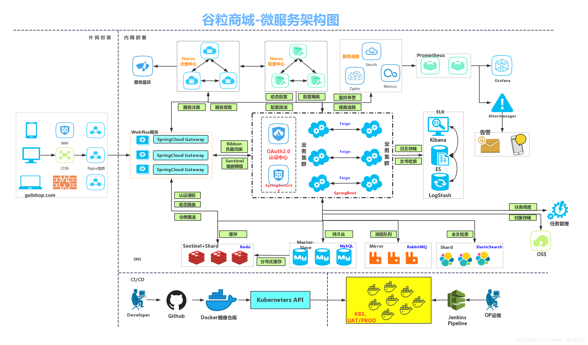
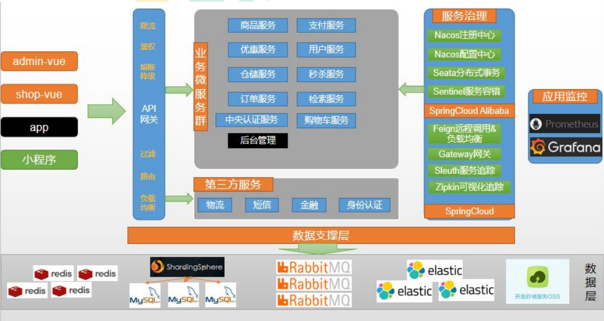
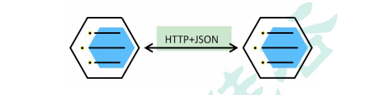
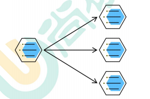
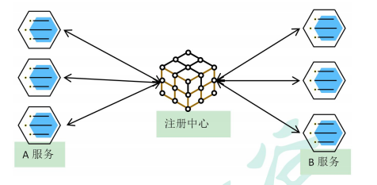
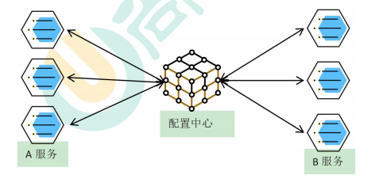
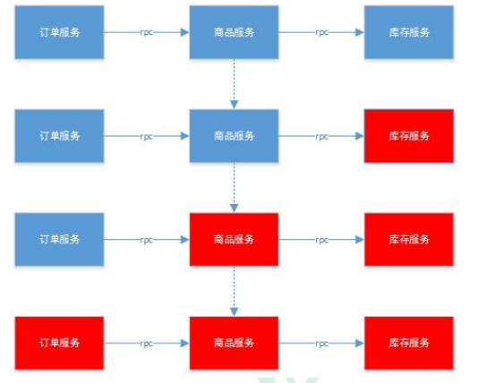
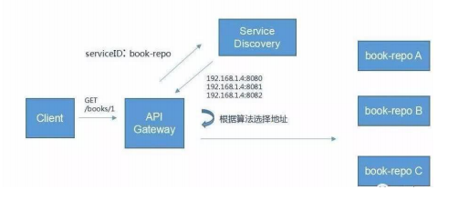

# 1.谷粒商城-项目概述

[[toc]]

## 1.项目背景

### 1.1.电商模式

```sh
市面上有 5 种常见的电商模式 B2B、B2C、C2B、C2C、O2O；
1、B2B 模式
B2B (Business to Business)， 是指商家与商家建立的商业关系。 如：阿里巴巴
2、B2C 模式
B2C (Business to Consumer)， 就是我们经常看到的供应商直接把商品卖给用户，即“商对客” 模式，也就是通常说的商业零售，直接面向消费者销售产品和服务。如：苏宁易购、京东、
天猫、小米商城
3、C2B 模式
C2B (Customer to Business)，即消费者对企业。先有消费者需求产生而后有企业生产，即先
有消费者提出需求，后有生产企业按需求组织生产
4、C2C 模式
C2C (Customer to Consumer) ，客户之间自己把东西放上网去卖，如：淘宝，闲鱼
5、O2O 模式
O2O 即 Online To Offline，也即将线下商务的机会与互联网结合在了一起，让互联网成为线
下交易的前台。线上快速支付，线下优质服务。如：饿了么，美团，淘票票，京东到家
```

### 1.2.谷粒商城

```sh
谷粒商城是一个 B2C 模式的电商平台，销售自营商品给客户。
```

## 2.项目架构图

### 1.项目微服务架构图



### 2.微服务划分图



## 3.项目技术&特色

```sh
 前后分离开发，并开发基于 vue 的后台管理系统
 SpringCloud 全新的解决方案
 应用监控、限流、网关、熔断降级等分布式方案 全方位涉及
 透彻讲解分布式事务、分布式锁等分布式系统的难点
 分析高并发场景的编码方式，线程池，异步编排等使用
 压力测试与性能优化
 各种集群技术的区别以及使用
 CI/CD 使用
 ...
```

## 4.项目前置要求

```sh
学习项目的前置知识
 熟悉 SpringBoot 以及常见整合方案
 了解 SpringCloud
 熟悉 git，maven
 熟悉 linux，redis，docker 基本操作
 了解 html，css，js，vue
 熟练使用 idea 开发项目
```

## 5.分布式基础概念

### 5.1.微服务

```sh
微服务架构风格，就像是把一个单独的应用程序开发为一套小服务，每个小服务运行在自
己的进程中，并使用轻量级机制通信，通常是 HTTP API。这些服务围绕业务能力来构建，
并通过完全自动化部署机制来独立部署。这些服务使用不同的编程语言书写，以及不同数据
存储技术，并保持最低限度的集中式管理。
简而言之：拒绝大型单体应用，基于业务边界进行服务微化拆分，各个服务独立部署运行。
```

### 5.2.集群&分布式&节点

```sh
集群是个物理形态，分布式是个工作方式。
只要是一堆机器，就可以叫集群，他们是不是一起协作着干活，这个谁也不知道；
《分布式系统原理与范型》定义：
“分布式系统是若干独立计算机的集合，这些计算机对于用户来说就像单个相关系统”
分布式系统（distributed system）是建立在网络之上的软件系统。
分布式是指将不同的业务分布在不同的地方。
集群指的是将几台服务器集中在一起，实现同一业务。
例如：京东是一个分布式系统，众多业务运行在不同的机器，所有业务构成一个大型的业
务集群。每一个小的业务，比如用户系统，访问压力大的时候一台服务器是不够的。我们就
应该将用户系统部署到多个服务器，也就是每一个业务系统也可以做集群化；
分布式中的每一个节点，都可以做集群。 而集群并不一定就是分布式的。
节点：集群中的一个服务器
```

### 5.3.远程调用

```sh
在分布式系统中，各个服务可能处于不同主机，但是服务之间不可避免的需要互相调用，我
们称为远程调用。
SpringCloud 中使用 HTTP+JSON 的方式完成远程调用
```



### 5.4.负载均衡

```sh
分布式系统中，A 服务需要调用 B 服务，B 服务在多台机器中都存在，A 调用任意一个
服务器均可完成功能。
为了使每一个服务器都不要太忙或者太闲，我们可以负载均衡的调用每一个服务器，提
升网站的健壮性。
常见的负载均衡算法：
轮询：为第一个请求选择健康池中的第一个后端服务器，然后按顺序往后依次选择，直
到最后一个，然后循环。
最小连接：优先选择连接数最少，也就是压力最小的后端服务器，在会话较长的情况下
可以考虑采取这种方式。
散列：根据请求源的 IP 的散列（hash）来选择要转发的服务器。这种方式可以一定程
度上保证特定用户能连接到相同的服务器。如果你的应用需要处理状态而要求用户能连接到
和之前相同的服务器，可以考虑采取这种方式。
```




### 5.5.服务注册发现&注册中心

```sh
A 服务调用 B 服务，A 服务并不知道 B 服务当前在哪几台服务器有，哪些正常的，哪些服务
已经下线。解决这个问题可以引入注册中心；
如果某些服务下线，我们其他人可以实时的感知到其他服务的状态，从而避免调用不可用的
服务
```



### 5.6.配置中心

```sh
每一个服务最终都有大量的配置，并且每个服务都可能部署在多台机器上。我们经常需要变
更配置，我们可以让每个服务在配置中心获取自己的配置。
配置中心用来集中管理微服务的配置信息
```



### 5.7.服务熔断&服务降级

```sh
在微服务架构中，微服务之间通过网络进行通信，存在相互依赖，当其中一个服务不可用时，
有可能会造成雪崩效应。要防止这样的情况，必须要有容错机制来保护服务。
1）、服务熔断
a. 设置服务的超时，当被调用的服务经常失败到达某个阈值，我们可以开
启断路保护机制，后来的请求不再去调用这个服务。本地直接返回默认
的数据
2）、服务降级
a. 在运维期间，当系统处于高峰期，系统资源紧张，我们可以让非核心业
务降级运行。降级：某些服务不处理，或者简单处理【抛异常、返回 NULL、
调用 Mock 数据、调用 Fallback 处理逻辑】。
```



### 5.8.API网关

```sh
在微服务架构中，API Gateway 作为整体架构的重要组件，它抽象了微服务中都需要的公共
功能，同时提供了客户端负载均衡，服务自动熔断，灰度发布，统一认证，限流流控，日
志统计等丰富的功能，帮助我们解决很多 API 管理难题。
```


