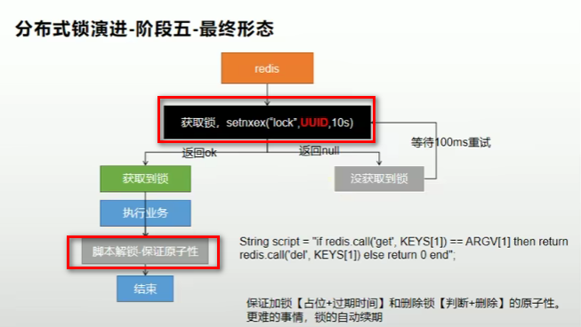
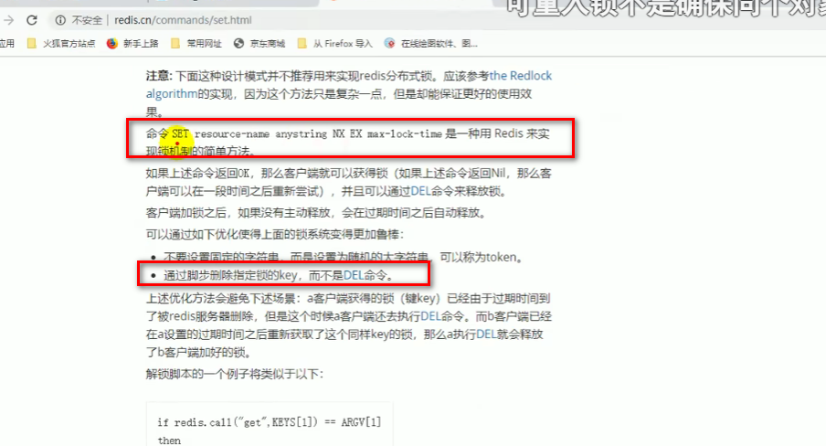
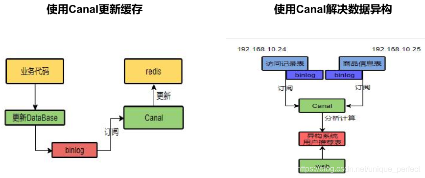
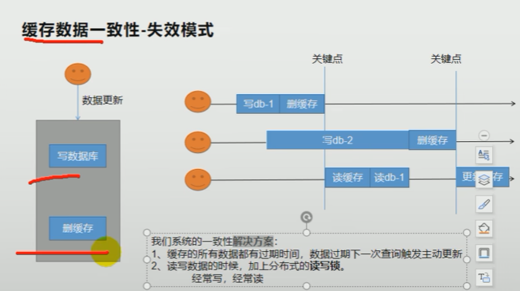
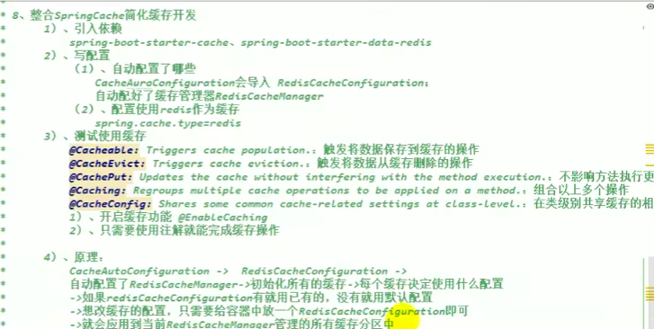

## 1.整合redis

[[toc]]

缓存 本地缓存：和微服务同一个进程。缺点：分布式时本都缓存不能共享 分布式缓存：缓存中间件 1. 本地缓存 category、brand、product 安装docker-redis product导入依赖

```pom
<dependency>
    <groupId>org.springframework.boot</groupId>
    <artifactId>spring-boot-starter-data-redis</artifactId>
</dependency
```

配置redis主机地址

```yaml
spring:
  redis:
    host: 192.168.56.11
    port: 6379
```

​	自动注入了RedisTemplate 优化菜单获取业务getCatalogJson

```java
ValueOperations<String, String> ops = stringRedisTemplate.opsForValue();
String catalogJson = ops.get("catalogJson");
if (catalogJson == null) {
    Map<String, List<Catalog2Vo>> categoriesDb = getCategoriesDb();
    String toJSONString = JSON.toJSONString(categoriesDb);
    ops.set("catalogJson",toJSONString);
    return categoriesDb;
}
Map<String, List<Catalog2Vo>> listMap = JSON.parseObject(catalogJson, new TypeReference<Map<String, List<Catalog2Vo>>>() {});
return listMap;
```

lettuce堆外内存溢出bug
当进行压力测试时后期后出现堆外内存溢出OutOfDirectMemoryError

产生原因：

1)、springboot2.0以后默认使用lettuce作为操作redis的客户端，它使用netty进行
网络通信

2)、lettuce的bug导致netty堆外内存溢出。netty如果没有指定堆外内存，默认使
用Xms的值，可以使用-Dio.netty.maxDirectMemory进行设置

解决方案：由于是lettuce的bug造成，不要直接使用-Dio.netty.maxDirectMemory
去调大虚拟机堆外内存，治标不治本。

1)、升级lettuce客户端。但是没有解决的
2)、切换使用jedis

```pom
<dependency>
    <groupId>org.springframework.boot</groupId>
    <artifactId>spring-boot-starter-data-redis</artifactId>
    <exclusions>
        <exclusion>
            <groupId>io.lettuce</groupId>
            <artifactId>lettuce-core</artifactId>
        </exclusion>
    </exclusions>
</dependency>
<dependency>
    <groupId>redis.clients</groupId>
    <artifactId>jedis</artifactId>
</dependency>
```


lettuce和jedis是操作redis的底层客户端，RedisTemplate是再次封装

3) 缓存失效
缓存穿透

缓存穿透是指缓存和数据库中都没有的数据，而用户不断发起请求，如发起为id
为“-1”的数据或id为特别大不存在的数据。这时的用户很可能是攻击者，攻击会导
致数据库压力过大。

解决：缓存空对象、布隆过滤器、mvc拦截器

缓存雪崩

缓存雪崩是指在我们设置缓存时key采用了相同的过期时间，导致缓存在某一时刻
同时失效，请求全部转发到DB，DB瞬时压力过重雪崩。

解决方案：

规避雪崩：缓存数据的过期时间设置随机，防止同一时间大量数据过期现象发生。
如果缓存数据库是分布式部署，将热点数据均匀分布在不同缓存数据库中。
设置热点数据永远不过期。
出现雪崩：降级 熔断
事前：尽量保证整个 redis 集群的高可用性，发现机器宕机尽快补上。选择合适的内存淘汰策略。
事中：本地ehcache缓存 + hystrix限流&降级，避免MySQL崩掉
事后：利用 redis 持久化机制保存的数据尽快恢复缓存
缓存击穿

缓存雪崩和缓存击穿不同的是：

缓存击穿 指 并发查同一条数据。缓存击穿是指缓存中没有但数据库中有的数据
（一般是缓存时间到期），这时由于并发用户特别多，同时读缓存没读到数据，
又同时去数据库去取数据，引起数据库压力瞬间增大，造成过大压力
缓存雪崩是不同数据都过期了，很多数据都查不到从而查数据库。
解决方案：

设置热点数据永远不过期。
加互斥锁：业界比较常用的做法，是使用mutex。简单地来说，就是在缓存失效
的时候（判断拿出来的值为空），不是立即去load db去数据库加载，而是先使用
缓存工具的某些带成功操作返回值的操作（比如Redis的SETNX或者Memcache
的ADD）去set一个mutex key，当操作返回成功时，再进行load db的操作并回设
缓存；否则，就重试整个get缓存的方法。
4) 缓存击穿:加锁
不好的方法是synchronized(this)，肯定不能这么写 ，不具体写了

锁时序问题：之前的逻辑是查缓存没有，然后取竞争锁查数据库，这样就造成多
次查数据库。

解决方法：竞争到锁后，再次确认缓存中没有，再去查数据库。

## 2.redis分布式缓存

本地缓存问题：每个微服务都要有缓存服务、数据更新时只更新自己的缓存，造
成缓存数据不一致

解决方案：分布式缓存，微服务共用 缓存中间件


分布式锁
分布式项目时，但本地锁只能锁住当前服务，需要分布式锁

redis分布式锁的原理：setnx，同一时刻只能设置成功一个
前提，锁的key是一定的，value可以变

没获取到锁阻塞或者sleep一会

设置好了锁，玩意服务出现宕机，没有执行删除锁逻辑，这就造成了死锁

解决：设置过期时间
业务还没执行完锁就过期了，别人拿到锁，自己执行完去删了别人的锁

解决：锁续期（redisson有看门狗），。删锁的时候明确是自己的锁。如uuid
判断uuid对了，但是将要删除的时候锁过期了，别人设置了新值，那删除了别人
的锁

解决：删除锁必须保证原子性（保证判断和删锁是原子的）。使用redis+Lua脚本
完成，脚本是原子的

```java
if redis.call("get",KEYS[1]) == ARGV[1] 
then
	return redis.call("del",KEYS[1])
else
    return 0
end;

if redis.call("get",KEYS[1]) == ARGV[1] 
then
	return redis.call("del",KEYS[1])
else
    return 0
end;


stringRedisTemplate.execute(
    new DefaultRedisScript<Long返回值类型>(script脚本支付非常, Long.class返回值类型), 
    Arrays.asList("lock"), // 键key的集合
    lockValue);
```

最终代码：

```java
public Map<String, List<Catalog2Vo>> getCatalogJsonDbWithRedisLock() {
    String uuid = UUID.randomUUID().toString();
    ValueOperations<String, String> ops = stringRedisTemplate.opsForValue();
    Boolean lock = ops.setIfAbsent("lock", uuid,500, TimeUnit.SECONDS);
    if (lock) {
        Map<String, List<Catalog2Vo>> categoriesDb = getCategoryMap();
        String lockValue = ops.get("lock");
        // get和delete原子操作
        String script = "if redis.call(\"get\",KEYS[1]) == ARGV[1] then\n" +
            "    return redis.call(\"del\",KEYS[1])\n" +
            "else\n" +
            "    return 0\n" +
            "end";
        stringRedisTemplate.execute(
            new DefaultRedisScript<Long>(script, Long.class), // 脚本和返回类型
            Arrays.asList("lock"), // 参数
            lockValue); // 参数值，锁的值
        return categoriesDb;
    }else {
        try {
            Thread.sleep(100);
        } catch (InterruptedException e) {
            e.printStackTrace();
        }
        // 睡眠0.1s后，重新调用 //自旋
        return getCatalogJsonDbWithRedisLock();
    }
}
```

上面的lua脚本写法每次用分布式锁时比较麻烦，我们可以采用redisson现有框架



```sh
http://redis.cn/commands/set.html
```



## 3.redisson

https://redis.io/topics/distlock

Redisson
https://github.com/redisson/redisson

Redisson是一个在Redis的基础上实现的Java驻内存数据网格（In-Memory Data 
Grid）。它不仅提供了一系列的分布式的Java常用对象，还提供了许多分布式服
务。其中包括(BitSet, Set, Multimap, SortedSet, Map, List, Queue, 
BlockingQueue, Deque, BlockingDeque, Semaphore, Lock, AtomicLong, 
CountDownLatch, Publish / Subscribe, Bloom filter, Remote service, Spring 
cache, Executor service, Live Object service, Scheduler service) Redisson提供
了使用Redis的最简单和最便捷的方法。Redisson的宗旨是促进使用者对Redis的
关注分离（Separation of Concern），从而让使用者能够将精力更集中地放在处
理业务逻辑上。

### (1) 环境搭建

导入依赖

```pom
<dependency>
    <groupId>org.redisson</groupId>
    <artifactId>redisson</artifactId>
    <version>3.13.4</version>
</dependency>
```

这个用作连续，后面可以使用redisson-spring-boot-starter

开启配置

https://github.com/redisson/redisson/wiki/

```java
@Configuration
public class MyRedisConfig {

    @Value("${ipAddr}")
    private String ipAddr;

    // redission通过redissonClient对象使用 // 如果是多个redis集群，可以配置
    @Bean(destroyMethod = "shutdown")
    public RedissonClient redisson() {
        Config config = new Config();
        // 创建单例模式的配置
        config.useSingleServer().setAddress("redis://" + ipAddr + ":6379");
        return Redisson.create(config);
    }
}
```

### (2) 可重入锁（Reentrant Lock）

分布式锁：github.com/redisson/redisson/wiki/8.-分布式锁和同步器

A调用B。AB都需要同一锁，此时可重入锁就可以重入，A就可以调用B。不可重入锁时，A调用B将死锁

```java
// 参数为锁名字
RLock lock = redissonClient.getLock("CatalogJson-Lock");//该锁实现了JUC.locks.lock接口
lock.lock();//阻塞等待
// 解锁放到finally // 如果这里宕机：有看门狗，不用担心
lock.unlock();
```

```java
	@ResponseBody
    @GetMapping(value = "/hello")
    public String hello() {

        //1、获取一把锁，只要锁的名字一样，就是同一把锁
        RLock myLock = redisson.getLock("my-lock");

        //2、加锁
        myLock.lock();      //阻塞式等待。默认加的锁都是30s
        //1）、锁的自动续期，如果业务超长，运行期间自动锁上新的30s。不用担心业务时间长，锁自动过期被删掉
        //2）、加锁的业务只要运行完成，就不会给当前锁续期，即使不手动解锁，锁默认会在30s内自动过期，不会产生死锁问题
        // myLock.lock(10,TimeUnit.SECONDS);   //10秒钟自动解锁,自动解锁时间一定要大于业务执行时间
        //问题：在锁时间到了以后，不会自动续期
        //1、如果我们传递了锁的超时时间，就发送给redis执行脚本，进行占锁，默认超时就是 我们制定的时间
        //2、如果我们指定锁的超时时间，就使用 lockWatchdogTimeout = 30 * 1000 【看门狗默认时间】
        //只要占锁成功，就会启动一个定时任务【重新给锁设置过期时间，新的过期时间就是看门狗的默认时间】,每隔10秒都会自动的再次续期，续成30秒
        // internalLockLeaseTime 【看门狗时间】 / 3， 10s
        try {
            System.out.println("加锁成功，执行业务..." + Thread.currentThread().getId());
            try { TimeUnit.SECONDS.sleep(20); } catch (InterruptedException e) { e.printStackTrace(); }
        } catch (Exception ex) {
            ex.printStackTrace();
        } finally {
            //3、解锁  假设解锁代码没有运行，Redisson会不会出现死锁
            System.out.println("释放锁..." + Thread.currentThread().getId());
            myLock.unlock();
        }

        return "hello";
    }
```

基于Redis的Redisson分布式可重入锁RLock Java对象实现了java.util.concurrent.locks.Lock接口。同时还提供了异步（Async）、反射式（Reactive）和RxJava2标准的接口。

锁的续期：大家都知道，如果负责储存这个分布式锁的Redisson节点宕机以后，而且这个锁正好处于锁住的状态时，这个锁会出现锁死的状态。为了避免这种情况的发生，Redisson内部提供了一个监控锁的看门狗，它的作用是在Redisson实例被关闭前，不断的延长锁的有效期。默认情况下，看门狗的检查锁的超时时间是30秒钟（每到20s就会自动续借成30s，是1/3的关系），也可以通过修改Config.lockWatchdogTimeout来另行指定。

```java
// 加锁以后10秒钟自动解锁，看门狗不续命
// 无需调用unlock方法手动解锁
lock.lock(10, TimeUnit.SECONDS);

// 尝试加锁，最多等待100秒，上锁以后10秒自动解锁
boolean res = lock.tryLock(100, 10, TimeUnit.SECONDS);
if (res) {
   try {
     ...
   } finally {
       lock.unlock();
   }
}
```

如果传递了锁的超时时间，就执行脚本，进行占锁;
如果没传递锁时间，使用看门狗的时间，占锁。如果返回占锁成功future，调用future.onComplete();
没异常的话调用scheduleExpirationRenewal(threadId);
重新设置过期时间，定时任务;
看门狗的原理是定时任务：重新给锁设置过期时间，新的过期时间就是看门狗的默认时间;
锁时间/3是定时任务周期;

Redisson同时还为分布式锁提供了异步执行的相关方法：

```java
RLock lock = redisson.getLock("anyLock");
lock.lockAsync();
lock.lockAsync(10, TimeUnit.SECONDS);
Future<Boolean> res = lock.tryLockAsync(100, 10, TimeUnit.SECONDS);
```

RLock对象完全符合Java的Lock规范。也就是说只有拥有锁的进程才能解锁，其他进程解锁则会抛出IllegalMonitorStateException错误。但是如果遇到需要其他进程也能解锁的情况，请使用分布式信号量Semaphore 对象.

```java
public Map<String, List<Catalog2Vo>> getCatalogJsonDbWithRedisson() {
    Map<String, List<Catalog2Vo>> categoryMap=null;
    RLock lock = redissonClient.getLock("CatalogJson-Lock");
    lock.lock();
    try {
        Thread.sleep(30000);
        categoryMap = getCategoryMap();
    } catch (InterruptedException e) {
        e.printStackTrace();
    }finally {
        lock.unlock();
        return categoryMap;
    }
}
```

### (3) 读写锁（ReadWriteLock）

基于Redis的Redisson分布式可重入读写锁RReadWriteLock Java对象实现了
java.util.concurrent.locks.ReadWriteLock接口。其中读锁和写锁都继承了RLock
接口。

分布式可重入读写锁允许同时有多个读锁和一个写锁处于加锁状态。

```java
RReadWriteLock rwlock = redisson.getReadWriteLock("anyRWLock");
// 最常见的使用方法
rwlock.readLock().lock();
// 或
rwlock.writeLock().lock();

// 10秒钟以后自动解锁
// 无需调用unlock方法手动解锁
rwlock.readLock().lock(10, TimeUnit.SECONDS);
// 或
rwlock.writeLock().lock(10, TimeUnit.SECONDS);

// 尝试加锁，最多等待100秒，上锁以后10秒自动解锁
boolean res = rwlock.readLock().tryLock(100, 10, TimeUnit.SECONDS);
// 或
boolean res = rwlock.writeLock().tryLock(100, 10, TimeUnit.SECONDS);
...
lock.unlock();
```

上锁时在redis的状态

```java
HashWrite-Lock
key:mode  value:read
key:sasdsdffsdfsdf... value:1
```

代码:

```java
/**
     * 保证一定能读到最新数据，修改期间，写锁是一个排它锁（互斥锁、独享锁），读锁是一个共享锁
     * 写锁没释放读锁必须等待
     * 读 + 读 ：相当于无锁，并发读，只会在Redis中记录好，所有当前的读锁。他们都会同时加锁成功
     * 写 + 读 ：必须等待写锁释放
     * 写 + 写 ：阻塞方式
     * 读 + 写 ：有读锁。写也需要等待
     * 只要有读或者写的存都必须等待
     * @return
     */
    @GetMapping(value = "/write")
    @ResponseBody
    public String writeValue() {
        String s = "";
        RReadWriteLock readWriteLock = redisson.getReadWriteLock("rw-lock");
        RLock rLock = readWriteLock.writeLock();
        try {
            //1、改数据加写锁，读数据加读锁
            rLock.lock();
            s = UUID.randomUUID().toString();
            ValueOperations<String, String> ops = stringRedisTemplate.opsForValue();
            ops.set("writeValue",s);
            TimeUnit.SECONDS.sleep(10);
        } catch (InterruptedException e) {
            e.printStackTrace();
        } finally {
            rLock.unlock();
        }

        return s;
    }

@GetMapping(value = "/read")
    @ResponseBody
    public String readValue() {
        String s = "";
        RReadWriteLock readWriteLock = redisson.getReadWriteLock("rw-lock");
        //加读锁
        RLock rLock = readWriteLock.readLock();
        try {
            rLock.lock();
            ValueOperations<String, String> ops = stringRedisTemplate.opsForValue();
            s = ops.get("writeValue");
            try { TimeUnit.SECONDS.sleep(10); } catch (InterruptedException e) { e.printStackTrace(); }
        } catch (Exception e) {
            e.printStackTrace();
        } finally {
            rLock.unlock();
        }

        return s;
    }
```

### (4) 信号量（Semaphore）

信号量为存储在redis中的一个数字，当这个数字大于0时，即可以调用acquire()方法增加数量，也可以调用release()方法减少数量，但是当调用release()之后小于0的话方法就会阻塞，直到数字大于0

基于Redis的Redisson的分布式信号量（Semaphore）Java对象RSemaphore采用了与java.util.concurrent.Semaphore相似的接口和用法。同时还提供了异步（Async）、反射式（Reactive）和RxJava2标准的接口。

```java
RSemaphore semaphore = redisson.getSemaphore("semaphore");
semaphore.acquire();
//或
semaphore.acquireAsync();
semaphore.acquire(23);
semaphore.tryAcquire();
//或
semaphore.tryAcquireAsync();
semaphore.tryAcquire(23, TimeUnit.SECONDS);
//或
semaphore.tryAcquireAsync(23, TimeUnit.SECONDS);
semaphore.release(10);
semaphore.release();
//或
semaphore.releaseAsync();

@GetMapping("/park")
@ResponseBody
public String park() {
    RSemaphore park = redissonClient.getSemaphore("park");
    try {
        park.acquire(2);
    } catch (InterruptedException e) {
        e.printStackTrace();
    }
    return "停进2";
}

@GetMapping("/go")
@ResponseBody
public String go() {
    RSemaphore park = redissonClient.getSemaphore("park");
    park.release(2);
    return "开走2";
}
```

### (5) 闭锁（CountDownLatch）

基于Redisson的Redisson分布式闭锁（CountDownLatch）Java对象RCountDownLatch采用了与java.util.concurrent.CountDownLatch相似的接口和用法。

以下代码只有offLatch()被调用5次后 setLatch()才能继续执行

```java
RCountDownLatch latch = redisson.getCountDownLatch("anyCountDownLatch");
latch.trySetCount(1);
latch.await();

// 在其他线程或其他JVM里
RCountDownLatch latch = redisson.getCountDownLatch("anyCountDownLatch");
latch.countDown();
```

缓存和数据库一致性
双写模式：写数据库后，写缓存
问题：并发时，2写进入，写完DB后都写缓存。有暂时的脏数据
失效模式：写完数据库后，删缓存
问题：还没存入数据库呢，线程2又读到旧的DB了
解决：缓存设置过期时间，定期更新
解决：写数据写时，加分布式的读写锁。
解决方案：

如果是用户纬度数据（订单数据、用户数据），这种并发几率非常小，不用考虑这个问题，缓存数据加上过期时间，每隔一段时间触发读的主动更新即可
如果是菜单，商品介绍等基础数据，也可以去使用canal订阅binlog的方式
缓存数据+过期时间也足够解决大部分业务对于缓存的要求。
通过加锁保证并发读写，写写的时候按顺序排好队。读读无所谓。所以适合使用读写锁。（业务不关心脏数据，允许临时脏数据可忽略）；

### (6)总结

```java
//代码位置
com.xunqi.gulimall.product.web.IndexController
```

我们能放入缓存的数据本就不应该是实时性、一致性要求超高的。所以缓存数据的时候加上过期时间，保证每天拿到当前最新数据即可。
我们不应该过度设计，增加系统的复杂性
遇到实时性、一致性要求高的数据，就应该查数据库，即使慢点。




最终解决方案



## 4. SpringCache

每次都那样写缓存太麻烦了，spring从3.1开始定义了Cache、CacheManager接口来统一不同的缓存技术。并支持使用JCache(JSR-107)注解简化我们的开发Cache接口的实现包括RedisCache、EhCacheCache、ConcurrentMapCache等每次调用需要缓存功能的方法时，spring会检查检查指定参数的指定的目标方法是否已经被调用过；如果有就直接从缓存中获取方法调用后的结果，如果没有就调用方法并缓存结果后返回给用户。下次调用直接从缓存中获取。

使用Spring缓存抽象时我们需要关注以下两点：

1、确定方法需要缓存以及他们的缓存策略
2、从缓存中读取之前缓存存储的数据

### 1) 配置依赖

```pom
<dependency>
    <groupId>org.springframework.b oot</groupId>
    <artifactId>spring-boot-starter-cache</artifactId>
</dependency>
```

指定缓存类型并在主配置类上加上注解@EnableCaching

```yaml
spring:
  cache:
  	#指定缓存类型为redis
    type: redis
    redis:
      # 指定redis中的过期时间为1h
      time-to-live: 3600000
```

```properties
spring.cache.type=redis
#spring.cache.cache-names=qq,毫秒为单位
spring.cache.redis.time-to-live=3600000

#如果指定了前缀就用我们指定的前缀，如果没有就默认使用缓存的名字作为前缀
#spring.cache.redis.key-prefix=CACHE_
spring.cache.redis.use-key-prefix=true

#是否缓存空值，防止缓存穿透
spring.cache.redis.cache-null-values=true
```




默认使用jdk进行序列化（可读性差），默认ttl为-1永不过期，自定义序列化方式需要编写配置类

```java
@Configuration
public class MyCacheConfig {
    /**
     * 配置文件的配置没有用上
     * 1. 原来和配置文件绑定的配置类为：@ConfigurationProperties(prefix = "spring.cache")
     *                                public class CacheProperties
     * <p>
     * 2. 要让他生效，要加上 @EnableConfigurationProperties(CacheProperties.class)
     */
    @Bean
    public RedisCacheConfiguration redisCacheConfiguration( CacheProperties cacheProperties) {
        
        CacheProperties.Redis redisProperties = cacheProperties.getRedis();
        org.springframework.data.redis.cache.RedisCacheConfiguration config = org.springframework.data.redis.cache.RedisCacheConfiguration
            .defaultCacheConfig();
        //指定缓存序列化方式为json
        config = config.serializeValuesWith(
            RedisSerializationContext.SerializationPair.fromSerializer(new GenericJackson2JsonRedisSerializer()));
        //设置配置文件中的各项配置，如过期时间
        //将配置文件中所有的配置都生效
        if (redisProperties.getTimeToLive() != null) {
            config = config.entryTtl(redisProperties.getTimeToLive());
        }

        if (redisProperties.getKeyPrefix() != null) {
            config = config.prefixKeysWith(redisProperties.getKeyPrefix());
        }
        if (!redisProperties.isCacheNullValues()) {
            config = config.disableCachingNullValues();
        }
        if (!redisProperties.isUseKeyPrefix()) {
            config = config.disableKeyPrefix();
        }
        return config;
    }
}
```

### 2) 缓存自动配置源码

```java
@Configuration(proxyBeanMethods = false)
@ConditionalOnClass(CacheManager.class)
@ConditionalOnBean(CacheAspectSupport.class)
@ConditionalOnMissingBean(value = CacheManager.class, name = "cacheResolver")
@EnableConfigurationProperties(CacheProperties.class)
@AutoConfigureAfter({ CouchbaseAutoConfiguration.class, HazelcastAutoConfiguration.class,
                     HibernateJpaAutoConfiguration.class, RedisAutoConfiguration.class })
@Import({ CacheConfigurationImportSelector.class, // 看导入什么CacheConfiguration
         CacheManagerEntityManagerFactoryDependsOnPostProcessor.class })
public class CacheAutoConfiguration {

    @Bean
    @ConditionalOnMissingBean
    public CacheManagerCustomizers cacheManagerCustomizers(ObjectProvider<CacheManagerCustomizer<?>> customizers) {
        return new CacheManagerCustomizers(customizers.orderedStream().collect(Collectors.toList()));
    }

    @Bean
    public CacheManagerValidator cacheAutoConfigurationValidator(CacheProperties cacheProperties,
                                                                 ObjectProvider<CacheManager> cacheManager) {
        return new CacheManagerValidator(cacheProperties, cacheManager);
    }

    @ConditionalOnClass(LocalContainerEntityManagerFactoryBean.class)
    @ConditionalOnBean(AbstractEntityManagerFactoryBean.class)
    static class CacheManagerEntityManagerFactoryDependsOnPostProcessor
        extends EntityManagerFactoryDependsOnPostProcessor {

        CacheManagerEntityManagerFactoryDependsOnPostProcessor() {
            super("cacheManager");
        }

    }


@Configuration(proxyBeanMethods = false)
@ConditionalOnClass(RedisConnectionFactory.class)
@AutoConfigureAfter(RedisAutoConfiguration.class)
@ConditionalOnBean(RedisConnectionFactory.class)
@ConditionalOnMissingBean(CacheManager.class)
@Conditional(CacheCondition.class)
class RedisCacheConfiguration {

    @Bean // 放入缓存管理器
    RedisCacheManager cacheManager(CacheProperties cacheProperties, 
                                   CacheManagerCustomizers cacheManagerCustomizers,
                                   ObjectProvider<org.springframework.data.redis.cache.RedisCacheConfiguration> redisCacheConfiguration,
                                   ObjectProvider<RedisCacheManagerBuilderCustomizer> redisCacheManagerBuilderCustomizers,
                                   RedisConnectionFactory redisConnectionFactory, ResourceLoader resourceLoader) {
        RedisCacheManagerBuilder builder = RedisCacheManager.builder(redisConnectionFactory).cacheDefaults(
            determineConfiguration(cacheProperties, redisCacheConfiguration, resourceLoader.getClassLoader()));
        List<String> cacheNames = cacheProperties.getCacheNames();
        if (!cacheNames.isEmpty()) {
            builder.initialCacheNames(new LinkedHashSet<>(cacheNames));
        }
        redisCacheManagerBuilderCustomizers.orderedStream().forEach((customizer) -> customizer.customize(builder));
        return cacheManagerCustomizers.customize(builder.build());
    }
```

### 3) 缓存使用@Cacheable@CacheEvict

```java
第一个方法存放缓存，第二个方法清空缓存
// 调用该方法时会将结果缓存，缓存名为category，key为方法名
// sync表示该方法的缓存被读取时会加锁 // value等同于cacheNames // key如果是字符串"''"
@Cacheable(value = {"category"},key = "#root.methodName",sync = true)
public Map<String, List<Catalog2Vo>> getCatalogJsonDbWithSpringCache() {
    return getCategoriesDb();
}

//调用该方法会删除缓存category下的所有cache，如果要删除某个具体，用key="''"
@Override
@CacheEvict(value = {"category"},allEntries = true)
public void updateCascade(CategoryEntity category) {
    this.updateById(category);
    if (!StringUtils.isEmpty(category.getName())) {
        categoryBrandRelationService.updateCategory(category);
    }
}

如果要清空多个缓存，用@Caching(evict={@CacheEvict(value="")})
```

### 4）常用注解

- @Cacheable  ：触发将数据保存到缓存的操作；
- @CacheEvict  : 触发将数据从缓存删除的操作；
- @CachePut ：不影响方法执行更新缓存；
- @Cacheing：组合以上多个操作；
- @CacheConfig：在类级别共享缓存的相同配置；

代码位置：

```java
com.xunqi.gulimall.product.service.impl.CategoryServiceImpl
```

### 5) SpringCache原理与不足

1）读模式
	a.缓存穿透：查询一个null数据。解决方案：缓存空数据，可通过`spring.cache.redis.cache-null-values=true`
	b.缓存击穿：大量并发进来同时查询一个正好过期的数据。解决方案：加锁 ? 默认是无加锁的;使用sync = true来解决击穿问题
	c.缓存雪崩：大量的key同时过期。解决：加随机时间。
2) 写模式：（缓存与数据库一致）
	a.读写加锁。
	b.引入Canal，感知到MySQL的更新去更新Redis
	c.读多写多，直接去数据库查询就行
3）总结：
	常规数据（读多写少，即时性，一致性要求不高的数据，完全可以使用Spring-Cache）;写模式(只要缓存的数据有过期时间就足够了)
特殊数据：特殊设计
