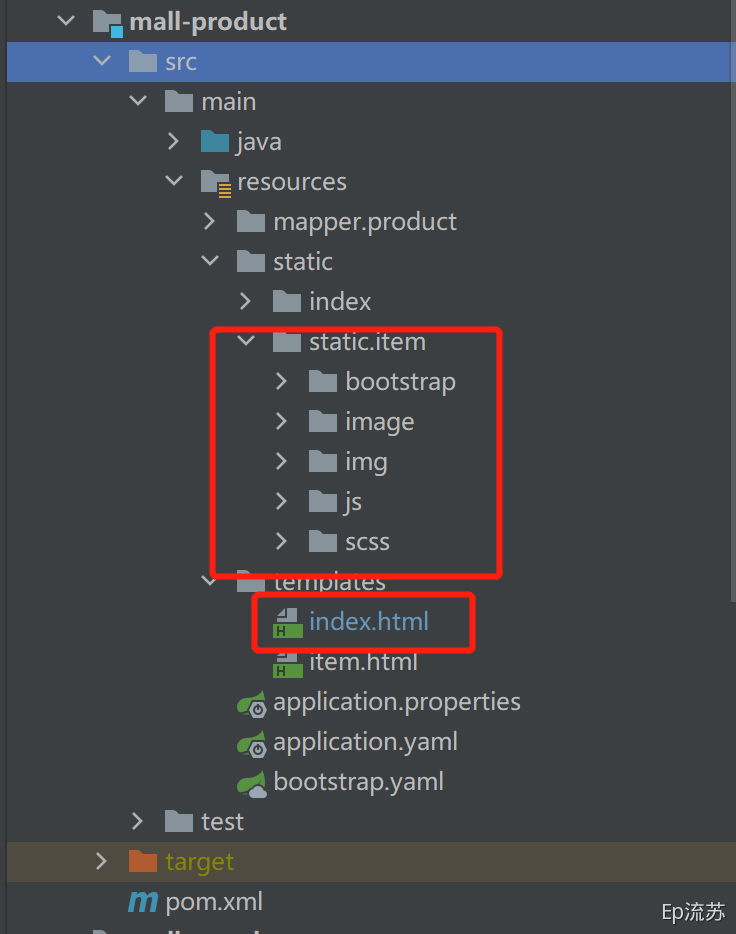

## 1.检索服务

### 1.添加模板页面

[[toc]]

```pom
<!-- 模板引擎 -->
<dependency>
  <groupId>org.springframework.boot</groupId>
  <artifactId>spring-boot-starter-thymeleaf</artifactId>
</dependency>
```

将资料中的前端页面放到 search 服务模块下的 resource/templates 下；

### 2.配置请求跳转

配置 Nginx 转发

配置 Windows hosts 文件：

```host
192.168.163.131		search.gulimall.com
```

找到 Nginx 的配置文件，编辑 gulimall.conf，将所有 *.gulimall.com 的请求都经由 Nginx 转发给网关；

```conf
server {
    listen       80;
    server_name  gulimall.com *.gulimall.com;
		...
 }
```

然后重启 Nginx 

```sh
docker restart nginx
```

配置网关服务转发到 search 服务

```yaml
- id: mall_search_route
  uri: lb://mall-search
  predicates:
  - Host=search.gulimall.com
```

配置页面跳转

配置 /list.html 请求转发到 list 模板

```java
/**
 * 自动将页面提交过来的所有请求参数封装成我们指定的对象
 *
 * @param param
 * @return
 */
@GetMapping(value = "/list.html")
public String listPage(SearchParam param, Model model, HttpServletRequest request) {
    return "list";
}
```

检索功能

详细检索逻辑实现的代码请参考：[Github ](https://github.com/zsy0216/guli-mall)

ES mall-product 映射 mapping修改

这里由于之前设置的映射 设置一些字段的 doc_value 为 false，导致后面聚合查询时报错！

修改完映射 mapping 要同步修改检索服务中的常量类中的 es 索引常量，二者要求对应。

```sh
# 查看原来的映射规则
GET gulimall_product/_mapping
# 修改为新的映射 并创建新的索引，下面进行数据迁移
PUT /mall_product
{
  "mappings": {
    "properties": {
      "skuId": {
        "type": "long"
      },
      "spuId": {
        "type": "long"
      },
      "skuTitle": {
        "type": "text",
        "analyzer": "ik_smart"
      },
      "skuPrice": {
        "type": "keyword"
      },
      "skuImg": {
        "type": "keyword"
      },
      "saleCount": {
        "type": "long"
      },
      "hosStock": {
        "type": "boolean"
      },
      "hotScore": {
        "type": "long"
      },
      "brandId": {
        "type": "long"
      },
      "catalogId": {
        "type": "long"
      },
      "brandName": {
        "type": "keyword"
      },
      "brandImg": {
        "type": "keyword"
      },
      "catalogName": {
        "type": "keyword"
      },
      "attrs": {
        "type": "nested",
        "properties": {
          "attrId": {
            "type": "long"
          },
          "attrName": {
            "type": "keyword"
          },
          "attrValue": {
            "type": "keyword"
          }
        }
      }
    }
  }
}
# 数据迁移
POST _reindex
{
  "source": {
    "index": "gulimall_product"
  },
  "dest": {
    "index": "mall_product"
  }
}
```

ES 检索 DSL语句分析

```sh
GET mall_product/_search
{
  "query": {
    "bool": {
      "must": [ {"match": {  "skuTitle": "华为" }} ], # 检索出华为
      "filter": [ # 过滤
        { "term": { "catalogId": "225" } },
        { "terms": {"brandId": [ "2"] } }, 
        { "term": { "hasStock": "false"} },
        {
          "range": {
            "skuPrice": { # 价格1K~7K
              "gte": 1000,
              "lte": 7000
            }
          }
        },
        {
          "nested": {
            "path": "attrs", # 聚合名字
            "query": {
              "bool": {
                "must": [
                  {
                    "term": { "attrs.attrId": { "value": "6"} }
                  }
                ]
              }
            }
          }
        }
      ]
    }
  },
  "sort": [ {"skuPrice": {"order": "desc" } } ],
  "from": 0,
  "size": 5,
  "highlight": {  
    "fields": {"skuTitle": {}}, # 高亮的字段
    "pre_tags": "<b style='color:red'>",  # 前缀
    "post_tags": "</b>"
  },
  "aggs": { # 查完后聚合
    "brandAgg": {
      "terms": {
        "field": "brandId",
        "size": 10
      },
      "aggs": { # 子聚合
        "brandNameAgg": {  # 每个商品id的品牌
          "terms": {
            "field": "brandName",
            "size": 10
          }
        },
      
        "brandImgAgg": {
          "terms": {
            "field": "brandImg",
            "size": 10
          }
        }
        
      }
    },
    "catalogAgg":{
      "terms": {
        "field": "catalogId",
        "size": 10
      },
      "aggs": {
        "catalogNameAgg": {
          "terms": {
            "field": "catalogName",
            "size": 10
          }
        }
      }
    },
    "attrs":{
      "nested": {"path": "attrs" },
      "aggs": {
        "attrIdAgg": {
          "terms": {
            "field": "attrs.attrId",
            "size": 10
          },
          "aggs": {
            "attrNameAgg": {
              "terms": {
                "field": "attrs.attrName",
                "size": 10
              }
            }
          }
        }
      }
    }
  }
}
```

## 2.异步与线程池

### 1.线程池

线程池的七大参数

1. corePoolSize: 池中一直保持的线程的数量，即使线程空闲。除非设置了 allowCoreThreadTimeOut

2. maximumPoolSize: 池中允许的最大的线程数

3. keepAliveTime: 当线程数大于核心线程数的时候，超出核心线程数的线程在最大多长时间没有接到新任务就会终止释放 ，最终线程池维持在 corePoolSize 大小

4. unit: 时间单位

5. workQueue: 阻塞队列，用来存储等待执行的任务，如果当前对线程的需求超过了 corePoolSize大小， 就 会放在这里 等待空闲线程执行.

6. threadFactory：创建线程的工厂，比如指定线程名等

7. handler：拒绝策略，如果线程满了，线程池就会使用拒绝策略。

   

运行流程

1、线程池创建，准备好 core 数量的核心线程，准备接受任务

2、新的任务进来，用 core 准备好的空闲线程执行。

(1) 、core 满了，就将再进来的任务放入阻塞队列中。空闲的 core 就会自己去阻塞队列获取任务执行

(2) 、阻塞队列满了，就直接开新线程执行，最大只能开到 max 指定的数量

(3) 、max 都执行好了。Max-core 数量空闲的线程会在 keepAliveTime 指定的时间后自动销毁。最终保持到core 大小

(4) 、如果线程数开到了 max 的数量，还有新任务进来，就会使用 reject 指定的拒绝策略进行处理

3、所有的线程创建都是由指定的 factory 创建的。


面试：

一个线程池 core 7； ； max 20  ，queue ：50 ，100 并发进来怎么分配的；

先有 7 个能直接得到执行，接下来 50 个进入队列排队，在多开 13 个继续执行。现在 70 个

被安排上了。剩下 30 个使用拒绝策略。

### 2.异步编排

看课件

## 3.商品详情

修改本机 hosts 文件：

```sh
# guli mall #
192.168.163.131		gulimall.com
192.168.163.131		search.gulimall.com
192.168.163.131		item.gulimall.com
```

### 1.配置网关

```yaml
        - id: mall_host_route 
          uri: lb://mall-product
          predicates:
            - Host=gulimall.com, item.gulimall.com
```

### 2.静态页面

将 item.html 放在templates 目录下，静态文件可以选择放在 nginx 目录下实现动静分离，我这里还选择放在项目的 static 目录下



详细详情页实现代码请参考：[Github ](https://github.com/zsy0216/guli-mall)
