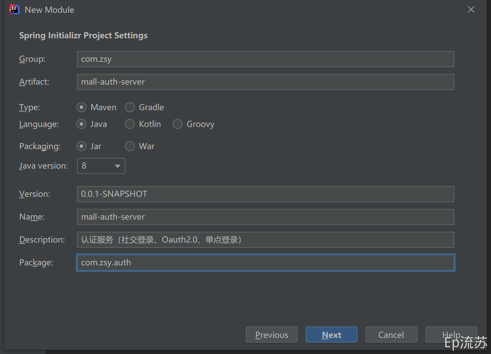
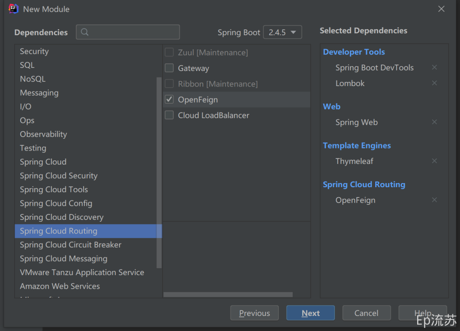
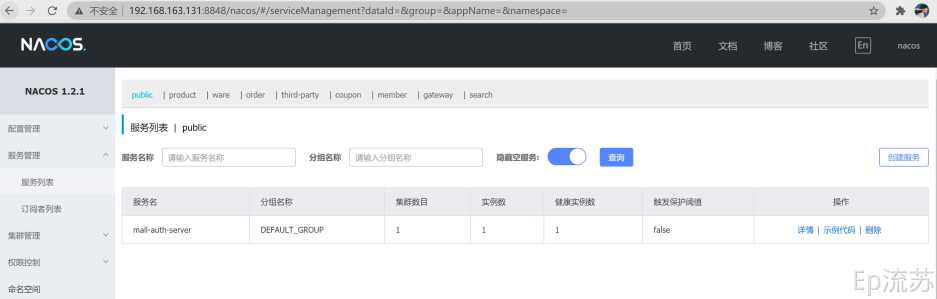

## 1.认证服务

### 1.初始化

[[toc]]





pom.xml

```pom
<?xml version="1.0" encoding="UTF-8"?>
<project xmlns="http://maven.apache.org/POM/4.0.0" xmlns:xsi="http://www.w3.org/2001/XMLSchema-instance"
         xsi:schemaLocation="http://maven.apache.org/POM/4.0.0 https://maven.apache.org/xsd/maven-4.0.0.xsd">
    <modelVersion>4.0.0</modelVersion>
    <parent>
        <artifactId>guli-mall</artifactId>
        <groupId>com.zsy</groupId>
        <version>0.0.1-SNAPSHOT</version>
    </parent>
    <artifactId>mall-auth-server</artifactId>
    <version>0.0.1-SNAPSHOT</version>
    <name>mall-auth-server</name>
    <description>认证服务（社交登录、Oauth2.0、单点登录）</description>
    <dependencies>
        <dependency>
            <groupId>com.zsy</groupId>
            <artifactId>mall-common</artifactId>
            <exclusions>
                <exclusion>
                    <groupId>com.baomidou</groupId>
                    <artifactId>mybatis-plus-boot-starter</artifactId>
                </exclusion>
            </exclusions>
        </dependency>
        <dependency>
            <groupId>org.springframework.boot</groupId>
            <artifactId>spring-boot-starter-thymeleaf</artifactId>
        </dependency>
        <dependency>
            <groupId>org.springframework.boot</groupId>
            <artifactId>spring-boot-devtools</artifactId>
            <scope>runtime</scope>
            <optional>true</optional>
        </dependency>
    </dependencies>
</project>
```

application.yaml

```yaml
spring:
  application:
    name: mall-auth-server
  cloud:
    nacos:
      discovery:
        server-addr: 192.168.163.131:8848
  thymeleaf:
    cache: false
server:
  port: 20000
```

主启动类

```java
package com.zsy.auth;

import org.springframework.boot.SpringApplication;
import org.springframework.boot.autoconfigure.SpringBootApplication;
import org.springframework.cloud.client.discovery.EnableDiscoveryClient;
import org.springframework.cloud.openfeign.EnableFeignClients;

@EnableFeignClients
@EnableDiscoveryClient
@SpringBootApplication
public class MallAuthServerApplication {
    public static void main(String[] args) {
        SpringApplication.run(MallAuthServerApplication.class, args);
    }
}
```

启动验证

启动服务，发现服务注册进 Nacos 



### 2.页面及域名访问初始化

修改hosts实现域名访问

```host
# guli mall #
192.168.163.131		gulimall.com
192.168.163.131		search.gulimall.com
192.168.163.131		item.gulimall.com
192.168.163.131		auth.gulimall.com
```

配置网关转发域名

```yaml
        - id: mall_auth_route
          uri: lb://mall-auth-server
          predicates:
            - Host=auth.gulimall.com
```

引入登录页面

将资料高级篇登录页面和注册页面放到 templates 下，静态文件可以选择 Nginx 动静分离配置，这里采用直接引用的方式。最终目录：


## 2.短信验证码

### 1.阿里云短信服务

https://www.aliyun.com/product/sms?spm=5176.159202.J_8058803260.68.64ae6a56APLp1H

### 2.工具类 HttpUtils

HttpUtils 请从 https://github.com/aliyun/api-gateway-demo-sign-java/blob/master/src/main/java/com/aliyun/api/gateway/demo/util/HttpUtils.java

或者直接下载：http://code.fegine.com/HttpUtils.zip

下载相应的依赖请参照 https://github.com/aliyun/api-gateway-demo-sign-java/blob/master/pom.xml

相关jar包（非pom）直接下载：http://code.fegine.com/aliyun-jar.zip

### 3.相关配置

```yaml
spring:
  cloud:
    nacos:
      discovery:
        server-addr: 192.168.163.131:8848
    alicloud:
      sms:
        host: https://fesms.market.alicloudapi.com
        path: /sms/
        skin: 1
        sign: 175622
        appcode: 93b7e19861a24c519a7548b17dc16d75
```

### 4.发送验证码组件

```java
package com.zsy.third.party.component;

import com.zsy.common.utils.HttpUtils;
import lombok.Data;
import org.apache.http.HttpResponse;
import org.apache.http.util.EntityUtils;
import org.springframework.boot.context.properties.ConfigurationProperties;
import org.springframework.stereotype.Component;

import java.util.HashMap;
import java.util.Map;

/**
 * @Description:
 * @author: zhangshuaiyin
 * @createTime: 2020-06-27 09:39
 **/
@ConfigurationProperties(prefix = "spring.cloud.alicloud.sms")
@Data
@Component
public class SmsComponent {

    private String host;
    private String path;
    private String skin;
    private String sign;
    private String appcode;

    public void sendCode(String phone, String code) {
        String method = "GET";
        Map<String, String> headers = new HashMap<>();
        // 最后在header中的格式(中间是英文空格)为 Authorization:APPCODE 93b7e19861a24c519a7548b17dc16d75
        headers.put("Authorization", "APPCODE " + appcode);
        Map<String, String> queries = new HashMap<String, String>();
        queries.put("code", code);
        queries.put("phone", phone);
        queries.put("skin", skin);
        queries.put("sign", sign);
        //JDK 1.8示例代码请在这里下载：  http://code.fegine.com/Tools.zip
        try {
            HttpResponse response = HttpUtils.doGet(host, path, method, headers, queries);
            //System.out.println(response.toString());如不输出json, 请打开这行代码，打印调试头部状态码。
            //状态码: 200 正常；400 URL无效；401 appCode错误； 403 次数用完； 500 API网管错误
            //获取response的body
            System.out.println(EntityUtils.toString(response.getEntity()));
        } catch (Exception e) {
            e.printStackTrace();
        }
    }
}
```

### 5.测试

```java
@Test
    public void sendSmsCode() {
        smsComponent.sendCode("13838383838", "134531");
    }
```

### 6.发送短信接口

```java
/**
 * @author: zhangshuaiyin
 * @createTime: 2020-06-27 10:04
 **/
@Controller
@RequestMapping(value = "/sms")
public class SmsSendController {

    @Resource
    private SmsComponent smsComponent;

    /**
     * 提供给别的服务进行调用
     * @param phone
     * @param code
     * @return
     */
    @GetMapping(value = "/sendCode")
    public R sendCode(@RequestParam("phone") String phone, @RequestParam("code") String code) {
        //发送验证码
        smsComponent.sendCode(phone,code);
        return R.ok();
    }
}
```

### 7.接口防刷和验证码再次校验

```java
@ResponseBody
@GetMapping(value = "/sms/sendCode")
public R sendCode(@RequestParam("phone") String phone) {

    //1、接口防刷
    String redisCode = stringRedisTemplate.opsForValue().get(AuthServerConstant.SMS_CODE_CACHE_PREFIX + phone);
    if (!StringUtils.isEmpty(redisCode)) {
        //活动存入redis的时间，用当前时间减去存入redis的时间，判断用户手机号是否在60s内发送验证码
        long currentTime = Long.parseLong(redisCode.split("_")[1]);
        if (System.currentTimeMillis() - currentTime < 60000) {
            //60s内不能再发
            return R.error(BizCodeEnum.SMS_CODE_EXCEPTION.getCode(), BizCodeEnum.SMS_CODE_EXCEPTION.getMsg());
        }
    }

    //2、验证码的再次效验 redis.存key-phone,value-code
    int code = (int) ((Math.random() * 9 + 1) * 100000);
    String codeNum = String.valueOf(code);
    String redisStorage = codeNum + "_" + System.currentTimeMillis();

    //存入redis，防止同一个手机号在60秒内再次发送验证码
    stringRedisTemplate.opsForValue().set(AuthServerConstant.SMS_CODE_CACHE_PREFIX + phone,
                                          redisStorage, 10, TimeUnit.MINUTES);

    thirdPartFeignService.sendCode(phone, codeNum);

    return R.ok();
}
```

## 3.登录注册功能

### 1.参数校验补充

通过注解可以给前端传递过来的值进行校验，例如：


但是这个注解必须配合 @Valid 使用，完成对参数的校验：


而校验的结果，也会自动封装到 BindingResult 类型中，通过这个参数可以很方便的对错误的参数进行处理。

hasErrors() 可以判断是否有参数校验错误，如果有，可以通过 getFieldsErrors() 方法获取错误列表。


注意：@Valid 和 BindingResult 是一一对应的，多个 @Valid 标注的参数实体后面要对应各自的 BindingResult.

### 2.SpringMVC 重定向携带数据


### 3.MD5&MD5盐值加密

#### 1.MD5

Message Digest algorithm 5，信息摘要算法

- 压缩性：任意长度的数据，算出的 MD5 值长度都是固定的；

- 容易计算：从原数据计算出 MD5 值很容易；

- 抗修改性：对原数据进行任何改动，哪怕只修改 1 个字节，所得到的 MD5 值都有很大区别；

- 强抗碰撞：想找到两个不同的数据，使它们具有相同的 MD5 值是非常困难的；

- 不可逆

  ```java
  @Test
  void contextLoads() {
      String s = DigestUtils.md5Hex("123456");
      System.out.println(s);
      // 盐值加密
      System.out.println(Md5Crypt.md5Crypt("123456".getBytes()));
      System.out.println(Md5Crypt.md5Crypt("123456".getBytes(), "$1$qqqqqqqq"));
  
      // Spring 盐值加密 spring自己创建出了盐值，自己加密和解析，道理和在数据库加个盐值是一样的，不过是spring自己来计算，这样就不用在数据库中加盐值字段了
      BCryptPasswordEncoder bCryptPasswordEncoder = new BCryptPasswordEncoder();
      //$2a$10$GT0TjB5YK5Vx77Y.2N7hkuYZtYAjZjMlE6NWGE2Aar/7pk/Rmhf8S
      //$2a$10$cR3lis5HQQsQSSh8/c3L3ujIILXkVYmlw28vLA39xz4mHDN/NBVUi
      String encode = bCryptPasswordEncoder.encode("123456");
      boolean matches = bCryptPasswordEncoder.matches("123456", "$2a$10$GT0TjB5YK5Vx77Y.2N7hkuYZtYAjZjMlE6NWGE2Aar/7pk/Rmhf8S");
  
      System.out.println(encode + "==>" + matches);
  }
  ```

## 4.Oauth2.0

- OAuth： ： OAuth（开放授权）是一个开放标准，允许用户授权第三方网站访问他们存储在另外的服务提供者上的信息，而不需要将用户名和密码提供给第三方网站或分享他们数据的所有内容。

- OAuth2.0 ：对于用户相关的 OpenAPI（例如获取用户信息，动态同步，照片，日志，分享等），为了保护用户数据的安全和隐私，第三方网站访问用户数据前都需要显式的向用户征求授权。
- 授权流程图示：


### 1.接入步骤

以微博为例：

1. 引导用户到微博的认证地址：`https://api.weibo.com/oauth2/authorize?client_id=YOUR_CLIENT_ID&response_type=code&redirect_uri=YOUR_REGISTERED_REDIRECT_URI`

- client_id：微博网站接入提供的 APP KEY；
- redirect_uri：认证后重定向的地址；

​    2.用户同意授权重定向到上面设置的地址并携带 code：`http://www.gulimall.com/success?code=CODE`；

   3.使用 code 请求微博提供的地址换取 access_token：`https://api.weibo.com/oauth2/access_token?client_id=YOUR_CLIENT_ID&client_secret=YOUR_CLIENT_SECRET&grant_type=authorization_code&redirect_uri=YOUR_REGISTERED_REDIRECT_URI&code=CODE`

- client_id：APP KEY；

- client_secret：APP SECRET；

- redirect_uri：认证后重定向的地址 `http://www.gulimall.com/success`

- code：第二步返回的 code 值；

- 返回响应报文：

  ```java
  {
  	"access_token": "2.00pDpxyGd3J5bEef6b98778e0ZKsu4",
  	"remind_in": "157679999",
  	"expires_in": 157679999,
  	"uid": "6397634785",
  	"isRealName": "true"
  }
  ```

    4.根据 access_token 可以获取微博提供的公共接口数据；


代码: [Github guli-mall](https://github.com/zsy0216/guli-mall/blob/main/mall-auth-server/src/main/java/com/zsy/auth/controller/OAuth2Controller.java)

## 5.分布式 Session

Session 共享问题

### 1.Session 原理


### 2.分布式下 Session 共享问题


### 3.Session 共享问题解决

Session 复制


客户端存储


hash一致性


统一存储


## 6.整合SpringSession

### 1.SpringBoot 整合 SpringSession

https://docs.spring.io/spring-session/docs/2.5.0/reference/html5/#samples

auth 服务、product 服务、 search 服务 pom文件

```xml
<!-- 整合 spring session 实现 session 共享-->
<dependency>
  <groupId>org.springframework.session</groupId>
  <artifactId>spring-session-data-redis</artifactId>
</dependency>
```

配置文件 application.yaml

```yam
spring:
  session:
    store-type: redis
```

主启动类增加注解：@EnableRedisHttpSession 

配置类：

```java
@Configuration
public class GulimallSessionConfig {
    @Bean
    public CookieSerializer cookieSerializer() {
        DefaultCookieSerializer cookieSerializer = new DefaultCookieSerializer();
        //放大作用域
        cookieSerializer.setDomainName("gulimall.com");
        cookieSerializer.setCookieName("GULISESSION");
        return cookieSerializer;
    }

    @Bean
    public RedisSerializer<Object> springSessionDefaultRedisSerializer() {
        return new GenericJackson2JsonRedisSerializer();
    }
}
```

### 2.SpringSession 核心原理

@EnableRedisHttpSession 导入 RedisHttpSessionConfiguration 配置

1、给容器中添加了一个组件 RedisOperationsSessionRepository：Redis操作session，session的增删改查封装类；

2、继承 SpringHttpSessionConfiguration 初始化了一个 SessionRepositoryFilter：session 存储过滤器；每个请求过来都必须经过 Filter 组件；创建的时候，自动从容器中获取到了 SessionRepository；

 SessionRepositoryFilter：

- 将原生的 HttpServletRequest Response 包装成 SessionRepositoryRequestWrapper ResponseWrapper；包装后的对象应用到了后面整个执行链；
- 以后获取 request.getSession(); 都会调用 wrappedRequesr.getSession(); 从SessionRepository获取；

3、装饰者模式

```java
protected void doFilterInternal(HttpServletRequest request, HttpServletResponse response, FilterChain filterChain) throws ServletException, IOException {
    request.setAttribute(SESSION_REPOSITORY_ATTR, this.sessionRepository);
    SessionRepositoryFilter<S>.SessionRepositoryRequestWrapper wrappedRequest = new SessionRepositoryFilter.SessionRepositoryRequestWrapper(request, response);
    SessionRepositoryFilter.SessionRepositoryResponseWrapper wrappedResponse = new SessionRepositoryFilter.SessionRepositoryResponseWrapper(wrappedRequest, response);

    try {
        filterChain.doFilter(wrappedRequest, wrappedResponse);
    } finally {
        wrappedRequest.commitSession();
    }

}
```

## 7.SSO-单点登录

Single Sign On 一处登陆、处处可用

参考：https://gitee.com/xuxueli0323/xxl-sso


### 1.单点登录流程


