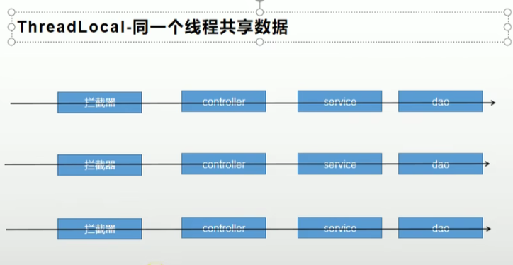
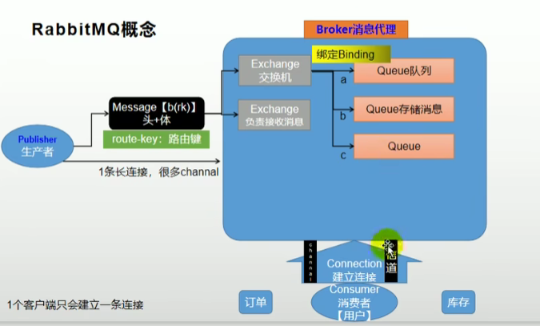
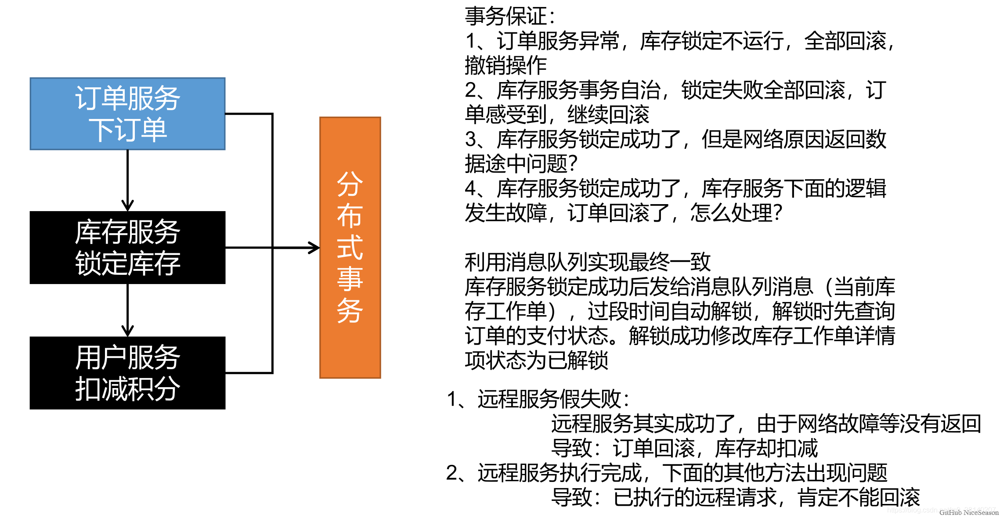
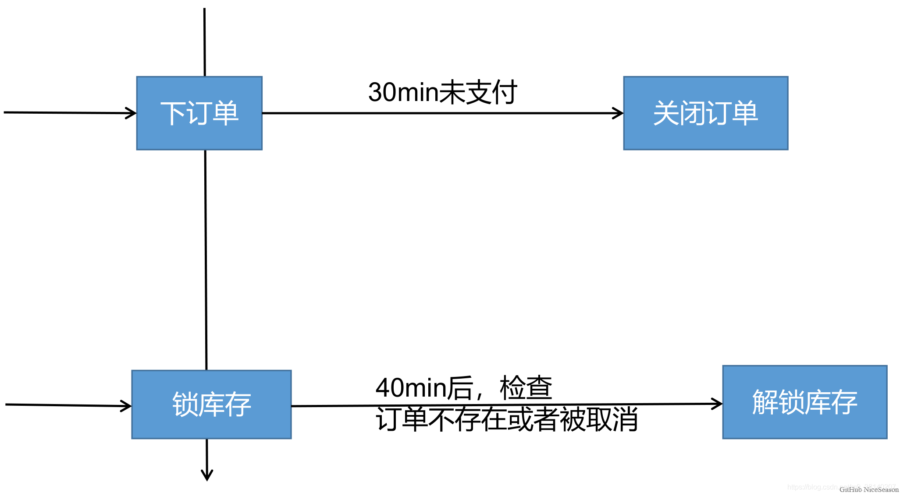
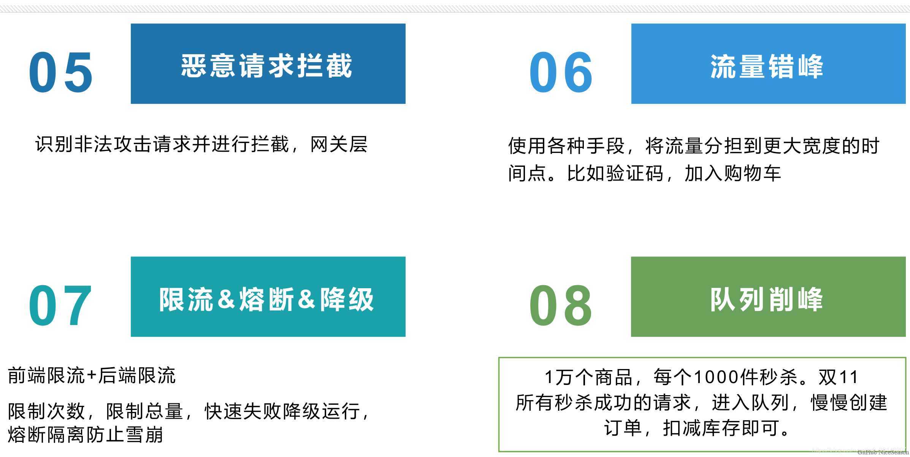
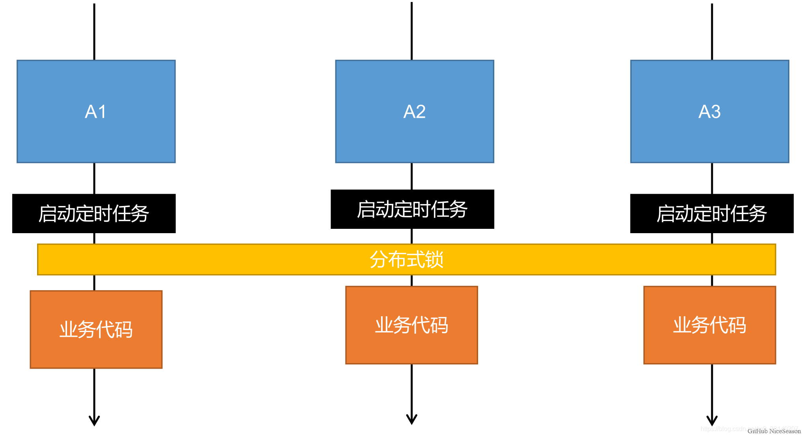
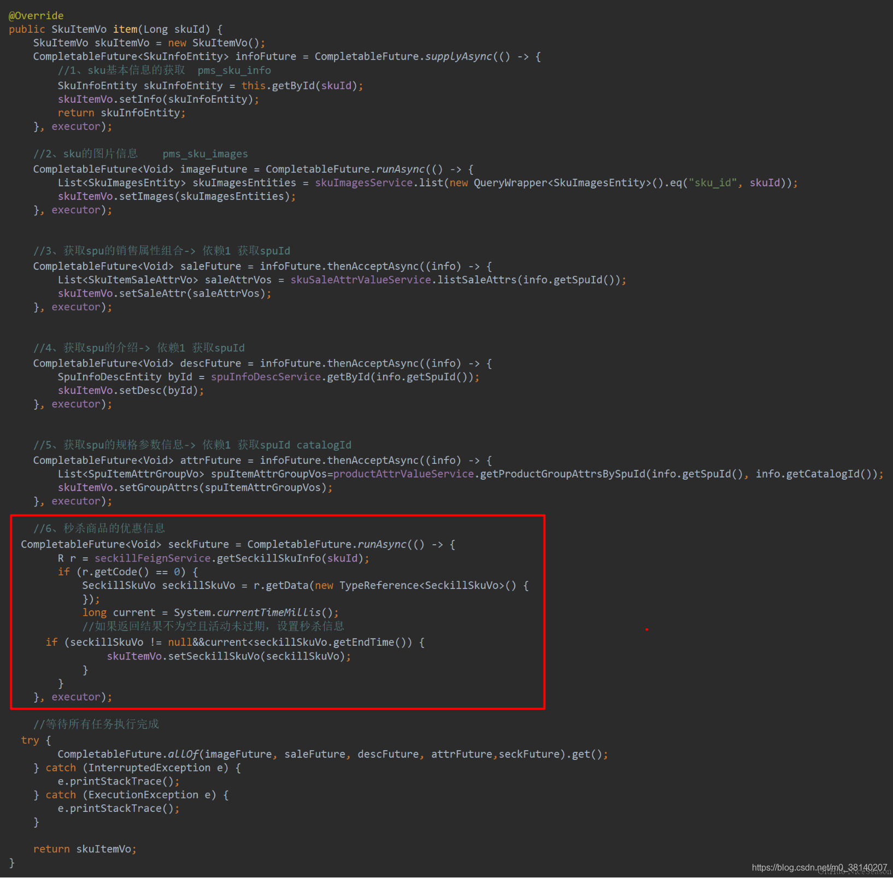

## 1.购物车

### 1.1 ThreadLocal

Thread类有一个类型为ThreadLocal.ThreadLocalMap的实例变量threadLocals，也就是说每个线程有一个自己的ThreadLocalMap。

ThreadLocalMap有自己的独立实现，可以简单地将它的key视作ThreadLocal，value为代码中放入的值（它的key实际上是一个弱引用）。

每个线程在往某个ThreadLocal里塞值的时候，都会往自己的ThreadLocalMap里存，读也是以某个ThreadLocal作为引用，在自己的map里找对应的key，从而实现了线程隔离。

### 1.2 ThreadLocal 同一个线程共享数据



代码逻辑

```java
/**
     * Controller
     * auth:login
     * 添加购物车
     */
    @GetMapping("/addToCart")
    public String addToCart(@RequestParam("skuId") Long skuId, @RequestParam("num") Integer num) {
        cartService.addToCart(skuId, num, CartInterceptor.loginUser.get());
        return "redirect:http://cart.projectdemo.top/cart/getItem.html?skuId=" + skuId;
    }
/**
     * Service
     * 添加到购物车，但实际可能是修改操作
     */
    @Override
    public CartItem addToCart(Long skuId, Integer num, Long memberId) {
        // key  prefix-memberId -> cart:8 |  hash-key -> skuId  hash-value -> cartItem-Json 
        BoundHashOperations<String, String, String> bound =
                redisTemplate.boundHashOps(CartConstant.CART_MEMBER_PREFIX + memberId);

        CartItem cartItem = new CartItem();

        String o = bound.get(skuId.toString());
        if (StringUtils.isEmpty(o)) {
            // 添加，fillItem方法就是查询数据库并封装 cartItem（需要数据库的商品info等信息）
            fillItem(skuId, num, cartItem);
            bound.put(skuId.toString(), JSON.toJSONString(cartItem));
        } else {
            // 修改，把redis中的json取出来改一遍就行了
            cartItem = JSON.parseObject(o, CartItem.class);
            int i = cartItem.getCount() + num;
            cartItem.setCount(i);
            bound.put(skuId.toString(), JSON.toJSONString(cartItem));
        }
        return cartItem;
    }
```

## 2.RabbitMQ

### 2.1 消息代理规范（AMQP和JMS）

JMS（Java Message Service）JAVA消息服务基于JVM消息代理的规范。ActiveMQ、HornetMQ是 JMS 实现。
AMQP（Advanced Message Queuing Protocol）高级消息队列协议，也是一个消息代理的规范，兼容JMS。
RabbitMQ 是 AMQP 的实现。

### 2.2 应用场景

异步处理：消息发送的时间取决于业务执行的最长的时间
应用解耦：即使下单时库存系统不能正常使用，也不影响正常下单。因为下单后，订单系统写入消息队列就不再关心其他的后续操作了。实现订单系统与库存系统的应用解耦
流量消峰：服务器接收用户的请求后，先写入消息队列。假如消息队列长度超过最大数量，则直接抛弃用户请求或跳转到错误页面
秒杀业务中根据消息队列中的请求信息，再做后续处理

### 2.3 RabbitMQ核心概念

Message

消息，消息是不具名的，它由消息头和消息体组成
消息头，包括routing-key（路由键）、priority（相对于其他消息的优先权）、delivery-mode（指出该消息可能需要持久性存储）等
Publisher

消息的生产者，也是一个向交换器发布消息的客户端应用程序
Exchange

交换器，将生产者消息路由给服务器中的队列
类型有direct(默认)，fanout，topic，和headers。具有不同转发策略
Queue

消息队列，保存消息直到发送给消费者
Binding

绑定，用于消息队列和交换器之间的关联
Connection

网络连接，比如一个 TCP 连接
Consumer

消息的消费者，表示一个从消息队列中取得消息的客户端应用程序
Virtual Host

虚拟主机，表示一批交换器、消息队列和相关对象。
vhost 是 AMQP 概念的基础，必须在连接时指定
RabbitMQ 默认的 vhost 是 /
Broker

消息队列服务器实体



### 2.4 RabbitMQ运行机制

消息路由：AMQP 中增加了 Exchange 和 Binding 的角色， Binding 决定交换器的消息应该发送到那个队列

#### 1.Exchange 类型：

direct
`点对点模式`消息中的路由键（routing key）如果和 Binding 中的 binding 的 key 完全一致， 交换器就将消息发到对应的队列中。

fanout
广播模式，每个发到 fanout 类型交换器的消息都会分到所有绑定的队列上去

topic
将路由键和某个模式进行匹配，此时队列需要绑定到一个模式上。它将路由键和绑定键的字符串切分成单词，这些单词之间用点隔开。
识别通配符： #匹配 0 个或多个单词， *匹配一个单词

### 2.5 下载和安装

#### 1.下载

RabbitMQ是基于AMQP的一款消息管理系统

官网： http://www.rabbitmq.com/

官方教程：http://www.rabbitmq.com/getstarted.html

官网下载地址：http://www.rabbitmq.com/download.html

#### 2.安装

```sh
#下载镜像
docker pull rabbitmq:management
#创建实例并启动
docker run -d --name rabbitmq -p 5671:5671 -p 5672:5672 -p 4369:4369 -p 25672:25672 -p 15671:15671 -p 15672:15672 rabbitmq:management
```

```sh
注：
4369, 25672 (Erlang发现&集群端口)
5672, 5671 (AMQP端口)
15672 (web管理后台端口)
61613, 61614 (STOMP协议端口)
1883, 8883 (MQTT协议端口)
https://www.rabbitmq.com/networking.html
```

报错处理

```sh
#错误信息
Error response from daemon: driver failed programming external connectivity on endpoint rabbitmq (e9ad857ebf963bc02859ea56d2ee841c5589a04170130c68f43b1a7406e9ba54): Error starting userland proxy: listen tcp4 0.0.0.0:25672: bind: address already in use
Error: failed to start containers: 503fa35e84bd
#启动netstat -tanlp可查看进程
netstat -tanlp
#找到占用端口号的进程
tcp        0      0 0.0.0.0:25672           0.0.0.0:*               LISTEN      58205/beam.smp
#杀掉进程
kill -9 58205
#是在不信的话就换个端口号吧
#更改端口执行 -p 4370:4369 -p 25673:25672
docker run -d --name rabbitmq -p 5671:5671 -p 5672:5672 -p 4370:4369 -p 25673:25672 -p 15671:15671 -p 15672:15672 rabbitmq:management
```

设置开机启动

```SH
docker update rabbitmq --restart=always
```

#### 3.测试

在web浏览器中输入地址：http://虚拟机ip:15672/

```sh
http://192.168.233.129:15672
```

输入默认账号: guest:guest

overview：概览

connections：无论生产者还是消费者，都需要与RabbitMQ建立连接后才可以完成消息的生产和消费，在这里可以查看连接情况

channels：通道，建立连接后，会形成通道，消息的投递获取依赖通道。

Exchanges：交换机，用来实现消息的路由

Queues：队列，即消息队列，消息存放在队列中，等待消费，消费后被移除队列。

端口：

5672: rabbitMq的编程语言客户端连接端口

15672：rabbitMq管理界面端口

25672：rabbitMq集群的端口


### 2.6 springboot整合rabbitmq

引入依赖

```pom
<dependency>
	<groupId>org.springframework.boot</groupId>
	<artifactId>spring-boot-starter-amqp</artifactId>
</dependency>
```

RabbitMQ连接的工具类

```java
public class ConnectionUtil {
    /**
     * 建立与RabbitMQ的连接
     * @return
     * @throws Exception
     */
    public static Connection getConnection() throws Exception {
        //定义连接工厂
        ConnectionFactory factory = new ConnectionFactory();
        //设置服务地址
        factory.setHost("172.16.116.100");
        //端口
        factory.setPort(5672);
        //设置账号信息，用户名、密码、vhost
        factory.setVirtualHost("/fengge");
        factory.setUsername("fengge");
        factory.setPassword("fengge");
        // 通过工程获取连接
        Connection connection = factory.newConnection();
        return connection;
    }
}
```

 配置文件

```yaml
spring:
  rabbitmq:
    host: 172.16.116.100
    username: fengge
    password: fengge
    virtual-host: /fengge
    template:
      exchange: gmall.item.exchange
    publisher-confirms: true
```

- template：有关`AmqpTemplate`的配置
  - exchange：缺省的交换机名称，此处配置后，发送消息如果不指定交换机就会使用这个
- publisher-confirms：生产者确认机制，确保消息会正确发送，如果发送失败会有错误回执，从而触发重试

### 2.7 RabbitMQ消息确认机制 - 可靠到达

为了保证消息不丢失，可靠抵达而此引入消息确认机制


① ConfirmCallback

消息只要被 broker 接收到就会执行 confirmCallback，如果 cluster 模式，需要所有 broker 接收到才会调用 confirmCallback

被 broker 接收到只能表示 message 已经到达服务器，并不能保证消息一定会被投递到目标 queue 里，所以需要用到接下来的 returnCallback

② ReturnCallback

confirm 模式只能保证消息到达 broker，不能保证消息准确投递到目标 queue 里。在有些模式业务场景下，我们需要保证消息一定要投递到目标 queue 里，此时就需要用到 return 退回模式

③ Ack消息确认机制

消费者获取到消息，成功处理，可以回复 Ack 给 Broker
basic.ack用于肯定确认：broker 将移除此消息
basic.nack用于否定确认：可以指定 beoker 是否丢弃此消息，可以批量
basic.reject用于否定确认，同上，但不能批量
默认消息被消费者收到后是自动确认的，即消息会从 queue 中移除
消费者收到消息，默认自动ack，但是如果无法确定此消息是否被成功处理，我们可以开启手动ack模式
消息处理成功，ack()，接受下一条消息，此消息broker就会移除
消息处理失败，nack()/reject() 重新发送给其他人进行处理，或者容错处理后ack
消息一直没有调用ack/nack方法，brocker认为此消息正在被处理，不会投递给别人，此时客户端断开，消息不会被broker移除，会投递给别人

```properties
# 开启发送端确认
spring.rabbitmq.publisher-confirms=true

# 开启发送端消息抵达队列的确认
spring.rabbitmq.publisher-returns=true

# 只要抵达队列，以异步发送优先回调 publisher-returns
spring.rabbitmq.template.mandatory=true

# 手动ack消息
spring.rabbitmq.listener.simple.acknowledge-mode=manual

```

## 3.订单服务

### 1.接口幂等性

查询购物项、库存和收货地址都要调用远程服务，串行会浪费大量时间，因此我们使用CompletableFuture进行异步编排
可能由于延迟，订单提交按钮可能被点击多次。为了防止重复提交（保证幂等性），我们在返回订单确认页时，在Redis中放入一个随机生成的令牌，过期时间为 30mi；，提交的订单时会携带这个令牌，我们将会在订单提交的处理页面核验此令牌

```java
@RequestMapping("/toTrade")
public String toTrade(Model model) {
    OrderConfirmVo confirmVo = orderService.confirmOrder();
    model.addAttribute("confirmOrder", confirmVo);
    return "confirm";
}

```

```java
	@Override
    public OrderConfirmVo confirmOrder() throws ExecutionException, InterruptedException {
        OrderConfirmVo confirmVo = new OrderConfirmVo();
        MemberResponseVo memberResponseVo = LoginUserInterceptor.loginUser.get();

        RequestAttributes requestAttributes = RequestContextHolder.getRequestAttributes();

        CompletableFuture<Void> getAddressFuture = CompletableFuture.runAsync(() -> {
            //1.远程调用：查询所有的收货地址列表

            //每个线程都共享之前的request数据
            RequestContextHolder.setRequestAttributes(requestAttributes);
            List<MemberAddressVo> addresses = memberFeignService.getAddress(memberResponseVo.getId());
            confirmVo.setAddresses(addresses);
        }, executor);

        CompletableFuture<Void> cartItemFuture = CompletableFuture.runAsync(() -> {
            //2.远程调用：查询购物车中所有选中的购物项
			RequestContextHolder.setRequestAttributes(requestAttributes);
			//cartFeignService是 Feign Client的代理对象
            List<OrderItemVo> cartItems = cartFeignService.getCurrentUserCartItems();
            confirmVo.setItems(cartItems);
        }, executor).thenRunAsync(()->{
            RequestContextHolder.setRequestAttributes(requestAttributes);
            List<OrderItemVo> items = confirmVo.getItems();
            List<Long> skuIds = items.stream().map(OrderItemVo::getSkuId).collect(Collectors.toList());
            //3.远程调用：查询库存
            R skuHasStock = wmsFeignService.getSkuHasStock(skuIds);
            List<SkuStockVo> data = skuHasStock.getData("data", new TypeReference<List<SkuStockVo>>() {
            });
            if(data!=null){
                Map<Long, Boolean> map = data.stream().collect(Collectors.toMap(SkuStockVo::getSkuId, SkuStockVo::getHasStock));
                confirmVo.setStocks(map);
            }
        },executor);

        //4.查询用户积分
        Integer integration = memberResponseVo.getIntegration();
        confirmVo.setIntegration(integration);

		//5.总价自动计算
        //6.设置一个30min过期的防重令牌 放入Redis
        String token = UUID.randomUUID().toString().replace("-", "");
        confirmVo.setOrderToken(token);
        //redis放一份
        redisTemplate.opsForValue().
                set(OrderConstant.USER_ORDER_TOEKN_PREFIX+memberResponseVo.getId(),token,30, TimeUnit.MINUTES);

        CompletableFuture.allOf(getAddressFuture,cartItemFuture).get();
        return confirmVo;
    }

```

### 2.Feign远程调用丢失请求头问题

Feign 远程调用的请求头中没有含有 JSESSIONID 的 Cookie，所以也就不能得到服务端的 Session 数据，Cart（远程服务）认为没登录，也就获取不了用户信息

分析：

Feign 会创建一个新的 Request（没有任何请求头）
在 Feign 的调用过程中，会使用容器中的RequestInterceptor对RequestTemplate进行处理，因此我们可以通过向容器中导入定制的RequestInterceptor为请求加上 Cookie。

```java
Feign 远程调用的请求头中没有含有 JSESSIONID 的 Cookie，所以也就不能得到服务端的 Session 数据，Cart（远程服务）认为没登录，也就获取不了用户信息

分析：

Feign 会创建一个新的 Request（没有任何请求头）
在 Feign 的调用过程中，会使用容器中的RequestInterceptor对RequestTemplate进行处理，因此我们可以通过向容器中导入定制的RequestInterceptor为请求加上 Cookie。
```

```java
@Configuration
public class KedaFeignConfig {
    //每次远程调用，都会触发拦截器
    @Bean("requestInterceptor")
    public RequestInterceptor requestInterceptor(){
        return new RequestInterceptor() {
            @Override
            public void apply(RequestTemplate requestTemplate) {
                //拦截器和原生请求都在同一个线程
                //RequestContextHolder拿到刚进来的请求
                
                ServletRequestAttributes requestAttributes = (ServletRequestAttributes) RequestContextHolder.getRequestAttributes();
                HttpServletRequest request = requestAttributes.getRequest();
                //同步请求头信息
                if(request!=null){
                    requestTemplate.header("Cookie",request.getHeader("Cookie"));
                    System.out.println("feign之前进行的requestInterceptor");
                }
            }
        };
    }
}
```

其中，`RequestContextHolder`为 SpingMVC 中共享`request`数据的上下文，底层由`ThreadLocal`实现。

### 3.Feign 异步情况丢失上下文问题

- 由于`RequestContextHolder`使用`ThreadLocal`共享数据，所以在开启异步时获取不到老请求的信息，自然也就无法共享 Cookie 了
- 在这种情况下，我们需要在开启异步的时候将老请求的`RequestContextHolder`的数据设置进去


## 4.分布式事务



### 1.使用消息队列实现最终一致性

#### 1.场景

比如未付款的订单，超过一定时间后，系统自动取消订单并释放占有物品



**常用解决方案：**
Spring 的 Schedule 定时任务轮询数据库、消息队列

**缺点：**
如果恰好在一次扫描后完成业务逻辑，那么就会等待两个扫描周期才能扫到过期的订单，不能保证时效性

**最终解决方案：** RabbitMQ 的消息 TTL 和死信 Exchange 结合

8.3.2 RabbitMQ实现延迟队列
定义：延迟队列存储的对象肯定是对应的延时消息；所谓"延时消息"是指当消息被发送以后，并不想让消费者立即拿到消息，而是等待指定时间后，消费者才拿到这个消息进行消费。

实现：RabbitMQ可以通过设置队列的TTL和 死信路由 实现延迟队列

TTL：
RabbitMQ 可以针对 Queue 设置x-expires或者针对 Message 设置x-message-ttl，来控制消息的生存时间；如果超时(两者同时设置以最先到期的时间为准)，则消息变为 Dead Letter(死信)

死信路由 DLX
RabbitMQ 的 Queue 可以配置x-dead-letter-exchange和x-dead-letter-routing-key（可选）两个参数，如果队列内出现了 Dead Letter，则按照这两个参数重新路由转发到指定的队列。

x-dead-letter-exchange：出现dead letter之后将 Dead Letter 重新发送到指定 exchange
x-dead-letter-routing-key：出现dead letter之后将 Dead Letter 重新按照指定的 routing-key 发送
8.3.3 定时关单与库存解锁主体逻辑
① 订单超时未支付触发订单过期状态修改与库存解锁
创建订单时消息会被发送至队列order.delay.queue，经过 TTL 的时间后消息会变成死信以order.release.order的路由键经交换机转发至队列order.release.order.queue，再通过监听该队列的消息来实现过期订单的处理

如果该订单已支付，则无需处理
否则说明该订单已过期，修改该订单的状态并通过路由键order.release.other发送消息至队列stock.release.stock.queue进行库存解锁
② 库存锁定后延迟检查是否需要解锁库存
在库存锁定后通过路由键stock.locked发送至延迟队列stock.delay.queue，延迟时间到，死信通过路由键stock.release转发至stock.release.stock.queue，通过监听该队列进行判断当前订单状态，来确定库存是否需要解锁

由于关闭订单和库存解锁都有可能被执行多次，因此要保证业务逻辑的幂等性，在执行业务时重新查询当前的状态进行判断
订单关闭和库存解锁都会进行库存解锁的操作，来确保业务异常或者订单过期时库存会被可靠解锁
实现：

kedamall-order：

```java
	//提交订单
	@PostMapping("/submitOrder")
    public String submitOrder(OrderSubmitVo vo, Model model, RedirectAttributes redirectAttributes){
        try {
            //创建订单、验令牌、验价格、锁库存等等.......
            SubmitOrderResponseVo responseVo = orderService.submitOrder(vo);
            //成功则来到支付页
            if(responseVo.getCode()==0) {
                //成功则来到支付页
                model.addAttribute("submitOrderResponse", responseVo);
                return "pay";
            }else {
                //失败回到失败页
                String msg = "下单失败；";
                switch (responseVo.getCode()){
                    case 1:msg+="令牌校验失败";break;
                    case 2:msg+="库存锁定失败（库存不足）";
                }
                redirectAttributes.addFlashAttribute("msg",msg);
                return "redirect:http://order.kedamall.com/toTrade";
            }

        } catch (Exception e){
            if (e instanceof NoStockException) {
                String message = e.getMessage();
                redirectAttributes.addFlashAttribute("msg", message);
            }
            return "redirect:http://order.kedamall.com/toTrade";
        }
    }

```

```java
	@Override
    @Transactional
    //@GlobalTransactional Seata不适用与高并发
    /**
     * 通过异常机制控制事务回滚
     * 如果在锁定库存失败则抛出 NoStockExceptions
     * 订单服务和库存服务都会回滚。
     */
    public SubmitOrderResponseVo submitOrder(OrderSubmitVo vo) {
        MemberResponseVo memberResponseVo = LoginUserInterceptor.loginUser.get();
        
        SubmitOrderResponseVo responseVo = new SubmitOrderResponseVo();
        responseVo.setCode(0);
        submitVoThreadLocal.set(vo);
        //1.验令牌 保证原子性
        String orderToken = vo.getOrderToken();
        String sciprt = "if redis.call('get', KEYS[1]) == ARGV[1] then return redis.call('del', KEYS[1]) else return 0 end";
        Long result = redisTemplate.execute(new DefaultRedisScript<Long>(sciprt, Long.class),
                Arrays.asList(OrderConstant.USER_ORDER_TOEKN_PREFIX + memberResponseVo.getId()),
                orderToken);
        if(result == 1L){
            //令牌校验成功啦
            OrderCreateTo order = createOrder();
            
            //保存订单
            saveOrder(order);
            
            //远程调用：锁定库存,有异常就回滚
            WareSkuLockVo lockVo = new WareSkuLockVo();
            lockVo.setOrderSn(order.getOrderEntity().getOrderSn());
            List<OrderItemVo> orderItemVos = order.getOrderItems().stream().map(item -> {
                OrderItemVo orderItemVo = new OrderItemVo();
                orderItemVo.setSkuId(item.getSkuId());
                orderItemVo.setCount(item.getSkuQuantity());
                orderItemVo.setTitle(item.getSkuName());
                return orderItemVo;
            }).collect(Collectors.toList());
            lockVo.setLocks(orderItemVos);
            R r = wmsFeignService.orderLockStock(lockVo);
            if(r.getCode()==0){
                //库存锁定成功
                responseVo.setOrderEntity(order.getOrderEntity());
                //TODO 远程扣减积分
                //int i=1/0;
                // 订单创建成功，发送消息给MQ
                rabbitTemplate.convertAndSend("order-event-exchange","order.create.order",order.getOrderEntity());
                return responseVo;
            }else {
                //库存锁定失败
                throw new NoStockException((String) r.get("msg"));
            }
        }else {
            //令牌校验失败
            responseVo.setCode(1);
            return responseVo;
        }
    }

```

```java
	@Transactional
    @Override
    public void closeOrder(OrderEntity entity) {
        OrderEntity orderEntity = this.getById(entity.getId());
        if (orderEntity.getStatus().equals(OrderStatusEnum.CREATE_NEW.getCode())) {
            // 关闭订单
            OrderEntity update = new OrderEntity();
            update.setId(entity.getId());
            update.setStatus(OrderStatusEnum.CANCLED.getCode());
            this.updateById(update);
            OrderTo orderTo = new OrderTo();
            BeanUtils.copyProperties(orderEntity, orderTo);
            rabbitTemplate.convertAndSend("order-event-exchange", "order.release.other", orderTo);
        }
    }

```

kedamall-ware：

```java
	/**
     * 为某个订单锁定库存
     * 默认运行时异常都回滚
     * @param vo
     * @return
     */
    @Override
    @Transactional(rollbackFor = NoStockException.class)
    public Boolean orderLockStock(WareSkuLockVo vo) {

        /**
         * 保存库存工作单的详情
         * 用于追溯
         */
        WareOrderTaskEntity taskEntity = new WareOrderTaskEntity();
        taskEntity.setOrderSn(vo.getOrderSn());
        wareOrderTaskService.save(taskEntity);


        //1.找到每个商品在哪个仓库有库存
        List<OrderItemVo> locks = vo.getLocks();
        List<SkuWareHasStock> collect = locks.stream().map(item -> {
            SkuWareHasStock stock = new SkuWareHasStock();
            Long skuId = item.getSkuId();
            stock.setSkuId(skuId);
            stock.setNum(item.getCount());
            //查询这个商品在哪里有库存
            List<Long> wareId = wareSkuDao.listWareIdHasSkuStock(skuId);
            stock.setWareId(wareId);
            return stock;
        }).collect(Collectors.toList());

        //2.锁定库存
        Boolean allLock = true;
        for (SkuWareHasStock hasStock : collect) {
            Boolean skuStock = false;
            Long skuId = hasStock.getSkuId();
            List<Long> wareIds = hasStock.getWareId();
            if(wareIds==null && wareIds.size()==0){
                throw new NoStockException(skuId);
            }
            for (Long wareId : wareIds) {
                Long count = wareSkuDao.lockSkuStock(skuId, wareId,hasStock.getNum());
                if(count==0){
                    //当前仓库锁失败
                }else {
                    //锁成功
                    skuStock=true;
                    //TODO 告诉MQ库存锁定成功
                    /**
                     * 保存锁定成功的详情
                     * 用于追溯
                     */
                    WareOrderTaskDetailEntity taskDetailEntity = new WareOrderTaskDetailEntity(null,skuId,"",hasStock.getNum(),taskEntity.getId(),wareId,1);
                    wareOrderTaskDetailService.save(taskDetailEntity);

                    StockLockedTo stockLockedTo = new StockLockedTo();
                    stockLockedTo.setId(taskEntity.getId());
                    //只发detail的id不行 防止taskDetail回滚后找不到数据
                    StockDetailTo stockDetailTo = new StockDetailTo();
                    BeanUtils.copyProperties(taskDetailEntity,stockDetailTo);
                    stockLockedTo.setDetail(stockDetailTo);
                    rabbitTemplate.convertAndSend("stock-event-exchange","stock.locked",stockLockedTo);
                    break;
                }
            }
            if(skuStock==false){
                throw new NoStockException(skuId);
            }
        }
        //全部锁定成功
        return true;
    }

```

```java
@Service
@RabbitListener(queues = "stock.release.stock.queue")
public class StockReleaseListener {

    @Autowired
    WareSkuService wareSkuService;

    @RabbitHandler
    public void handleStockLockedRelease(StockLockedTo to, Message message, Channel channel) throws IOException{
        System.out.println("收到解锁库存的消息...");
        try {
            wareSkuService.unlockStock(to);
            channel.basicAck(message.getMessageProperties().getDeliveryTag(), false);
        } catch (Exception e) {
            channel.basicReject(message.getMessageProperties().getDeliveryTag(), true);
        }
    }
    @RabbitHandler
    public void handleOrderCloseRelease(OrderTo orderTo, Message message, Channel channel) throws IOException {
        System.out.println("订单关闭，准备解锁库存...");
        try {
            wareSkuService.unlockStock(orderTo);
            channel.basicAck(message.getMessageProperties().getDeliveryTag(), false);
        } catch (Exception e) {
            channel.basicReject(message.getMessageProperties().getDeliveryTag(), true);
        }
    }
}

```

## 5.秒杀服务

### 1.秒杀（高并发）系统关注的问题



### 2 秒杀架构设计

① 项目独立部署，独立秒杀模块 kedamall-seckill

② 使用定时任务每天三点上架最新秒杀商品，削减高峰期压力

③ 秒杀链接加密，为秒杀商品添加唯一商品随机码，在开始秒杀时才暴露接口

在 Redis 中保存秒杀商品信息时，为redisTo 保存一个随机码并保存在Redis中;加载商品页（Item）的时候，如果在秒杀时间内，就可携带随机码；否则不显示随机码。
④ 库存预热，先从数据库中扣除一部分库存以 Redisson 信号量的形式存储在 Redis 中

在 Redis 中保存秒杀商品信息时，商品可以秒杀的数量作为分布式信号量
⑤ 队列削峰，秒杀成功后立即返回，然后以发送消息的形式创建订单

只要通过校验并信号量获取成功，就发送消息给 kedamall-order 服务
⑥ Nginx 做好动静分离。保证秒杀和商品详情页的动态请求才打到后端的服务集群。

### 3.存储模型设计

秒杀场次存储的`List`可以当做`hash key`在`SECKILL_CHARE_PREFIX`中获得对应的商品数据（Sku）

```java
//存储的秒杀场次对应数据
//K: SESSION_CACHE_PREFIX + startTime + "_" + endTime
//V: sessionId+"-"+skuId 的一个List
private final String SESSION_CACHE_PREFIX = "seckill:sessions:";


//存储的秒杀商品数据
//K: 固定值SECKILL_CHARE_PREFIX
//V: hash，k为sessionId+"-"+skuId，v为对应的商品信息SeckillSkuRedisTo
private final String SECKILL_CHARE_PREFIX = "seckill:skus";


//K: SKU_STOCK_SEMAPHORE+商品随机码
//V: 秒杀的库存件数
private final String SKU_STOCK_SEMAPHORE = "seckill:stock:";    //+商品随机码

```

### 4 商品上架

#### 1 定时上架（Redisson分布式锁、Redisson信号量、随机码）

① 开启对定时任务的支持

```java
@EnableAsync //开启对异步的支持，防止定时任务之间相互阻塞
@EnableScheduling //开启对定时任务的支持
@Configuration
public class ScheduledConfig {
}
```

每天凌晨三点**远程调用**coupon服务上架最近三天的秒杀商品

由于在分布式情况下该方法可能同时被调用多次，因此加入 **Redisson 分布式锁**，同时只有一个服务可以调用该方法：

```java
	//秒杀商品上架功能的锁
    private final String upload_lock = "seckill:upload:lock";

    /**
     * 定时任务
     * 每天三点上架最近三天的秒杀商品
     */
    @Async
    @Scheduled(cron = "0 0 3 * * ?")
    public void uploadSeckillSkuLatest3Days() {
        //为避免分布式情况下多服务同时上架的情况，使用分布式锁
        RLock lock = redissonClient.getLock(upload_lock);
        try {
            lock.lock(10, TimeUnit.SECONDS);
            secKillService.uploadSeckillSkuLatest3Days();
        }catch (Exception e){
            e.printStackTrace();
        }finally {
            lock.unlock();
        }
    }

```

```java
@Override
    public void uploadSeckillSkuLatest3Days() {
        //1.远程调用：最近三天需要参与秒杀的活动
        R r = couponFeignService.getLatest3DaySession();
        if(r.getCode()==0){

            //1.上架商品;
            List<SeckillSessionsWithSkus> sessionData = r.getData(new TypeReference<List<SeckillSessionsWithSkus>>() {
            });
            if(!CollectionUtils.isEmpty(sessionData)){
                //2.商品缓存到redis
                //2.1缓存活动信息
                saveSessionInfos(sessionData);

                //2.2缓存活动的关联商品信息
                saveSessionSkuInfo(sessionData);
            }
        }
    }

```

在 Redis 中保存秒杀商品信息（使用Redisson信号量、随机码）

```java
	private void saveSessionSkuInfo(List<SeckillSessionsWithSkus> sessions){
        sessions.stream().forEach(session->{
            //准备哈希操作
            BoundHashOperations<String, Object, Object> hashOps = redisTemplate.boundHashOps(SKUKILL_CACHE_PREFIX);

            session.getRelationSkus().stream().forEach(seckillSkuVo -> {
                Boolean hasKey = hashOps.hasKey(seckillSkuVo.getPromotionId() + "_" + seckillSkuVo.getSkuId().toString());
                if(!hasKey){
                    SecKillSkuRedisTo redisTo = new SecKillSkuRedisTo();
                    //远程调用：获取sku的基本数据
                    R r = productFeignService.getSkuInfo(seckillSkuVo.getSkuId());
                    if(r.getCode()==0){
                        SkuInfoVo skuInfo = r.getData("skuInfo", new TypeReference<SkuInfoVo>() {
                        });
                        redisTo.setSkuInfo(skuInfo);
                    }
                    //sku的秒杀信息
                    BeanUtils.copyProperties(seckillSkuVo,redisTo);

                    //设置当前秒杀商品的的开始、结束时间
                    redisTo.setStartTime(session.getStartTime().getTime());
                    redisTo.setEndTime(session.getEndTime().getTime());

                    //设置商品的随机码，防止恶意攻击
                    String token = UUID.randomUUID().toString().replace("-", "");
                    redisTo.setRandomCode(token);

                    String s = JSON.toJSONString(redisTo);
                    hashOps.put(seckillSkuVo.getPromotionId() + "_" + seckillSkuVo.getSkuId().toString(),s);

                    //商品可以秒杀的数量作为分布式信号量（限流）
                    RSemaphore semaphore = redissonClient.getSemaphore(SKU_STOCK_SEMAPHORE + token);
                    semaphore.trySetPermits(seckillSkuVo.getSeckillCount().intValue());
                }
            });
        });
    }

```



#### 2 获取当前商品的秒杀信息



```java
@ResponseBody
@GetMapping(value = "/getSeckillSkuInfo/{skuId}")
public R getSeckillSkuInfo(@PathVariable("skuId") Long skuId) {
    SeckillSkuRedisTo to = secKillService.getSeckillSkuInfo(skuId);
    return R.ok().setData(to);
}

```

```java
	@Override
    public SecKillSkuRedisTo getSkuSeckillInfo(Long skuId) {
        //找到所有需要参与秒杀的商品的Key信息（seckill:skus是一个 Hash结构）
        BoundHashOperations<String, String, String> hashOps = redisTemplate.boundHashOps(SKUKILL_CACHE_PREFIX);
        Set<String> keys = hashOps.keys();
        if(!CollectionUtils.isEmpty(keys)){
            //正则表达式匹配：数字_当前skuid的商品
            String reg = "\\d_" + skuId;
            for (String key : keys) {
                boolean matches = Pattern.matches(reg, key);
                if(matches){
                    String json = hashOps.get(key);
                    SecKillSkuRedisTo redisTo = JSON.parseObject(json, SecKillSkuRedisTo.class);
                    //处理随机码：
                    //如果在秒杀时间内：则不处理；否则不显示随机码
                    long time = new Date().getTime();
                    if(time<redisTo.getStartTime() && time>redisTo.getEndTime()){
                        redisTo.setRandomCode(null);
                    }
                    return redisTo;
                }
            }
        }
        return null;
    }

```

### 5 秒杀

(1) 秒杀接口

- 点击立即抢购时，会发送请求

- 秒杀请求会对请求校验**时效、商品随机码、当前用户是否已经抢购过当前商品、库存和购买量**，通过校验的则秒杀成功，发送消息创建订单

  ```java
  	$("#seckillA").click(function () {
          const isLogin = [[${session.loginUser != null}]]; // 已登录
          if (isLogin) {
              const killId = $(this).attr("sessionId") + "_" + $(this).attr("skuId");
  
              const key = $(this).attr("code");//随机码
              const num = $("#numInput").val();
              location.href = "http://seckill.kedamall.com/kill?killId=" + killId + "&key=" + key + "&num=" + num;
          } else {
              alert("想要进行秒杀的话请先进行登录");
          }
  
          return false;
      })
  
  ```

  ```java
  @GetMapping("/kill")
  public String kill(@RequestParam("killId") String killId,
                     @RequestParam("key")String key,
                     @RequestParam("num")Integer num,
                     Model model) {
      String orderSn= null;
      try {
          orderSn = secKillService.kill(killId, key, num);
          model.addAttribute("orderSn", orderSn);
      } catch (InterruptedException e) {
          e.printStackTrace();
      }
      return "success";
  }
  
  ```

  ```java
  	@Override
      public String kill(String killId, String key, Integer num) {
          //绑定哈希操作
          BoundHashOperations<String, String, String> hashOps = redisTemplate.boundHashOps(SKUKILL_CACHE_PREFIX);
  		
  		//1.获取秒杀商品的详细信息
          String s = hashOps.get(killId);
          if(StringUtils.isEmpty(s)){
          	//非空判断
              return null;
          }else {
              SecKillSkuRedisTo redisTo = JSON.parseObject(s, SecKillSkuRedisTo.class);
              //2.合法性校验
              //2.1秒杀时间校验
              Long startTime = redisTo.getStartTime();
              Long endTime = redisTo.getEndTime();
              long time = new Date().getTime();
              long ttl = endTime - startTime;
              if(time<startTime && time>endTime){
                  return null;
              }
              //2.2随机码校验和商品ID
              String randomCode = redisTo.getRandomCode();
              String id = redisTo.getPromotionSessionId() + "_" + redisTo.getSkuId();
              if(!key.equals(randomCode) || !killId.equals(id)){
                  return null;
              }
              //2.3购买数量是否超过限购数量
              if(num>redisTo.getSeckillLimit().intValue())return null;
              
              //2.4验证这个人是否购买过了（幂等性）==》只要秒杀成功就去redis占位；数据格式 userId_sessionId_skuId
              MemberResponseVo memberResponseVo = LoginUserInterceptor.loginUser.get();
              String occupyKey = memberResponseVo.getId() + "_" + id;
              Boolean absent = redisTemplate.opsForValue().setIfAbsent(occupyKey, num.toString(), ttl, TimeUnit.MILLISECONDS);
              if(!absent){
                  //占位失败：已买过
                  return null;
              }
  
              //TODO 3.开始秒杀！！！！
              RSemaphore semaphore = redissonClient.getSemaphore(SKU_STOCK_SEMAPHORE + randomCode);
              boolean acquire = semaphore.tryAcquire(num);
              //只要信号量获取成功
              if(acquire){
                  // 秒杀成功 快速下单 发送消息到 MQ 整个操作时间在 10ms 左右
                  String timeId = IdWorker.getTimeId();
                  SeckillOrderTo seckillOrderTo = new SeckillOrderTo();
                  seckillOrderTo.setOrderSn(timeId);
                  seckillOrderTo.setMemberId(memberResponseVo.getId());
                  seckillOrderTo.setNum(num);
                  seckillOrderTo.setPromotionSessionId(redisTo.getPromotionSessionId());
                  seckillOrderTo.setSkuId(redisTo.getSkuId());
                  seckillOrderTo.setSeckillPrice(redisTo.getSeckillPrice());
                  rabbitTemplate.convertAndSend("order-event-exchange", "order.seckill.order", seckillOrderTo);
                  return timeId;
              }
          }
          return null;
      }
  
  ```

  kedamall-order：

  ```java
  //监听器
  @RabbitListener(queues = "order.seckill.order.queue")
  @Component
  @Slf4j
  public class OrderSeckillListener {
      @Autowired
      private OrderService orderService;
  
      @RabbitHandler
      public void listener(SeckillOrderTo seckillOrder, Channel channel, Message message) throws IOException {
          try {
              log.info("准备创建秒杀订单的详细信息...");
              orderService.createSeckillOrder(seckillOrder);
              channel.basicAck(message.getMessageProperties().getDeliveryTag(), false);
          } catch (Exception e) {
              channel.basicReject(message.getMessageProperties().getDeliveryTag(), true);
          }
      }
  }
  
  ```

