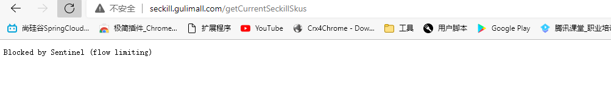

## 1 熔断降级限流

[[toc]]

### 1.1 什么是熔断

A 服务调用 B 服务的某个功能， 由于网络不稳定问题， 或者 B 服务卡机， 导致功能时间超长。 如果这样子的次数太多。 我们就可以直接将 B 断路了（A 不再请求 B 接口） ， 凡是调用 B 的直接返回降级数据， 不必等待 B 的超长执行。 这样 B 的故障问题， 就不会级联影响到 A。

### 1.2 什么是降级

整个网站处于流量高峰期， 服务器压力剧增， 根据当前业务情况及流量， 对一些服务和页面进行有策略的降级[停止服务， 所有的调用直接返回降级数据]。 以此缓解服务器资源的的压力， 以保证核心业务的正常运行， 同时也保持了客户和大部分客户的得到正确的相应。

### 1.3 异同

​	相同点：

- 为了保证集群大部分服务的可用性和可靠性， 防止崩溃， 牺牲小我

- 用户最终都是体验到某个功能不可用

  不同点：

- 熔断是被调用方故障， 触发的系统主动规则

- 降级是基于全局考虑， 停止一些正常服务， 释放资源

### 1.4 什么是限流

对打入服务的请求流量进行控制， 使服务能够承担不超过自己能力的流量压力

## 2. Sentinel简介

官方文档： https://github.com/alibaba/Sentinel/wiki/%E4%BB%8B%E7%BB%8D
项目地址： https://github.com/alibaba/Sentinel
随着微服务的流行， 服务和服务之间的稳定性变得越来越重要。 Sentinel 以流量为切入点，从流量控制、 熔断降级、 系统负载保护等多个维度保护服务的稳定性。

### 2.1 特征

- 丰富的应用场景： Sentinel 承接了阿里巴巴近 10 年的双十一大促流量的核心场景， 例如秒杀（即突发流量控制在系统容量可以承受的范围） 、 消息削峰填谷、 集群流量控制、 实时熔断下游不可用应用等。
- 完备的实时监控： Sentinel 同时提供实时的监控功能。 您可以在控制台中看到接入应用的单台机器秒级数据， 甚至 500 台以下规模的集群的汇总运行情况。
- 广泛的开源生态： Sentinel 提供开箱即用的与其它开源框架/库的整合模块， 例如与 Spring Cloud、 Dubbo、 gRPC 的整合。 您只需要引入相应的依赖并进行简单的配置即可快速地接入 Sentinel。
- 完善的 SPI 扩展点： Sentinel 提供简单易用、 完善的 SPI 扩展接口。 您可以通过实现扩展接口来快速地定制逻辑。 例如定制规则管理、 适配动态数据源等。
  

Sentinel 分为两个部分 :

核心库（Java 客户端） 不依赖任何框架/库， 能够运行于所有 Java 运行时环境， 同时对 Dubbo / Spring Cloud 等框架也有较好的支持。

控制台（ Dashboard） 基于 Spring Boot 开发， 打包后可以直接运行， 不需要额外的Tomcat 等应用容器。

### 2.2 基本概念

#### 2.2.1 资源

资源是 Sentinel 的关键概念。 它可以是 Java 应用程序中的任何内容， 例如， 由应用程序提供的服务， 或由应用程序调用的其它应用提供的服务， 甚至可以是一段代码。 在接下来的文档中， 我们都会用资源来描述代码块。

只要通过 Sentinel API 定义的代码， 就是资源， 能够被 Sentinel 保护起来。 大部分情况下，可以使用方法签名， URL， 甚至服务名称作为资源名来标示资源。

#### 2.2.2 规则

围绕资源的实时状态设定的规则， 可以包括**流量控制规则**、 **熔断降级规则**以及**系统保护规则**。 所有规则可以动态实时调整。

### 2.3 Sentinel与Hystrix比较


## 3. 基本使用 - 资源与规则

官方文档:https://sentinelguard.io/zh-cn/docs/basic-api-resource-rule.html

我们说的资源，可以是任何东西，服务，服务里的方法，甚至是一段代码。使用 Sentinel 来进行资源保护，主要分为几个步骤:

定义资源
定义规则
检验规则是否生效
先把可能需要保护的资源定义好，之后再配置规则。也可以理解为，只要有了资源，我们就可以在任何时候灵活地定义各种流量控制规则。在编码的时候，只需要考虑这个代码是否需要保护，如果需要保护，就将之定义为一个资源。

对于主流的框架，我们提供适配，只需要按照适配中的说明配置，Sentinel 就会默认定义提供的服务，方法等为资源。

### 3.1 资源定义【多用方式1、2、4】

#### 方式一：主流框架的默认适配

为了减少开发的复杂程度，我们对大部分的主流框架，例如 Web Servlet、Dubbo、Spring Cloud、gRPC、Spring WebFlux、Reactor 等都做了适配。您只需要引入对应的依赖即可方便地整合 Sentinel。可以参见：

[主流框架的文档](https://sentinelguard.io/zh-cn/docs/open-source-framework-integrations.html)

#### 方式二：抛出异常的方式定义资源

`SphU` 包含了 try-catch 风格的 API。用这种方式，当资源发生了限流之后会抛出 `BlockException`。这个时候可以捕捉异常，进行限流之后的逻辑处理。示例代码如下:

```java
// 1.5.0 版本开始可以利用 try-with-resources 特性
// 资源名可使用任意有业务语义的字符串，比如方法名、接口名或其它可唯一标识的字符串。
try (Entry entry = SphU.entry("resourceName")) {
  // 被保护的业务逻辑
  // do something here...
} catch (BlockException ex) {
  // 资源访问阻止，被限流或被降级
  // 在此处进行相应的处理操作
}
```

特别地，若 entry 的时候传入了热点参数，那么 exit 的时候也一定要带上对应的参数（exit(count, args)），否则可能会有统计错误。这个时候不能使用 try-with-resources 的方式。另外通过 Tracer.trace(ex) 来统计异常信息时，由于 try-with-resources 语法中 catch 调用顺序的问题，会导致无法正确统计异常数，因此统计异常信息时也不能在 try-with-resources 的 catch 块中调用 Tracer.trace(ex)。
1.5.0 之前的版本的示例：

```java
Entry entry = null;
// 务必保证finally会被执行
try {
  // 资源名可使用任意有业务语义的字符串
  entry = SphU.entry("自定义资源名");
  // 被保护的业务逻辑
  // do something...
} catch (BlockException e1) {
  // 资源访问阻止，被限流或被降级
  // 进行相应的处理操作
} finally {
  if (entry != null) {
    entry.exit();
  }
}
```

**注意**： SphU.entry(xxx) 需要与 entry.exit() 方法成对出现，匹配调用，否则会导致调用链记录异常，抛出 ErrorEntryFreeException 异常。

#### 方式三：返回布尔值方式定义资源

SphO 提供 if-else 风格的 API。用这种方式，当资源发生了限流之后会返回 false，这个时候可以根据返回值，进行限流之后的逻辑处理。示例代码如下:

```java
  // 资源名可使用任意有业务语义的字符串
  if (SphO.entry("自定义资源名")) {
    // 务必保证finally会被执行
    try {
      /**
      * 被保护的业务逻辑
      */
    } finally {
      SphO.exit();
    }
  } else {
    // 资源访问阻止，被限流或被降级
    // 进行相应的处理操作
  }
```

#### 方式四：注解方式定义资源

Sentinel 支持通过 `@SentinelResource` 注解定义资源并配置 `blockHandler` 和 `fallback` 函数来进行限流之后的处理。示例：

```java
// 原本的业务方法.
@SentinelResource(blockHandler = "blockHandlerForGetUser")
public User getUserById(String id) {
    throw new RuntimeException("getUserById command failed");
}

// blockHandler 函数，原方法调用被限流/降级/系统保护的时候调用
public User blockHandlerForGetUser(String id, BlockException ex) {
    return new User("admin");
}
```

注意 `blockHandler` 函数会在原方法被限流/降级/系统保护的时候调用，而 `fallback` 函数会针对所有类型的异常。请注意 `blockHandler` 和 `fallback` 函数的形式要求，更多指引可以参见 [Sentinel 注解支持文档](https://sentinelguard.io/zh-cn/docs/annotation-support.html)。

#### 方式五：异步调用支持

Sentinel 支持异步调用链路的统计。在异步调用中，需要通过 `SphU.asyncEntry(xxx)` 方法定义资源，并通常需要在异步的回调函数中调用 `exit` 方法。以下是一个简单的示例：

```java
try {
    AsyncEntry entry = SphU.asyncEntry(resourceName);

    // 异步调用.
    doAsync(userId, result -> {
        try {
            // 在此处处理异步调用的结果.
        } finally {
            // 在回调结束后 exit.
            entry.exit();
        }
    });
} catch (BlockException ex) {
    // Request blocked.
    // Handle the exception (e.g. retry or fallback).
}
```

`SphU.asyncEntry(xxx)` 不会影响当前（调用线程）的 Context，因此以下两个 entry 在调用链上是平级关系（处于同一层），而不是嵌套关系：

```java
// 调用链类似于：
// -parent
// ---asyncResource
// ---syncResource
asyncEntry = SphU.asyncEntry(asyncResource);
entry = SphU.entry(normalResource);
```

若在异步回调中需要嵌套其它的资源调用（无论是 entry 还是 asyncEntry），只需要借助 Sentinel 提供的上下文切换功能，在对应的地方通过 ContextUtil.runOnContext(context, f) 进行 Context 变换，将对应资源调用处的 Context 切换为生成的异步 Context，即可维持正确的调用链路关系。示例如下：

```java
public void handleResult(String result) {
    Entry entry = null;
    try {
        entry = SphU.entry("handleResultForAsync");
        // Handle your result here.
    } catch (BlockException ex) {
        // Blocked for the result handler.
    } finally {
        if (entry != null) {
            entry.exit();
        }
    }
}

public void someAsync() {
    try {
        AsyncEntry entry = SphU.asyncEntry(resourceName);

        // Asynchronous invocation.
        doAsync(userId, result -> {
            // 在异步回调中进行上下文变换，通过 AsyncEntry 的 getAsyncContext 方法获取异步 Context
            ContextUtil.runOnContext(entry.getAsyncContext(), () -> {
                try {
                    // 此处嵌套正常的资源调用.
                    handleResult(result);
                } finally {
                    entry.exit();
                }
            });
        });
    } catch (BlockException ex) {
        // Request blocked.
        // Handle the exception (e.g. retry or fallback).
    }
}
```

此时的调用链就类似于：

```java
-parent
---asyncInvocation
-----handleResultForAsync
```

更详细的示例可以参考 Demo 中的 [AsyncEntryDemo](https://github.com/alibaba/Sentinel/blob/master/sentinel-demo/sentinel-demo-basic/src/main/java/com/alibaba/csp/sentinel/demo/AsyncEntryDemo.java)，里面包含了普通资源与异步资源之间的各种嵌套示例。

### 3.2 定义规则

#### 3.2.1 规则的种类

Sentinel 的所有规则都可以在内存态中动态地查询及修改，修改之后立即生效。同时 Sentinel 也提供相关 API，供您来定制自己的规则策略。

Sentinel 支持以下几种规则：流量控制规则、熔断降级规则、系统保护规则、来源访问控制规则 和 热点参数规则。

##### 3.2.1.1 流量控制规则 (FlowRule)

流量规则的定义
重要属性：

| Field           | 说明                                                         | 默认值                        |
| --------------- | ------------------------------------------------------------ | ----------------------------- |
| resource        | 资源名，资源名是限流规则的作用对象                           |                               |
| count           | 限流阈值                                                     |                               |
| grade           | 限流阈值类型，QPS 或线程数模式                               | QPS 模式                      |
| limitApp        | 流控针对的调用来源                                           | `default`，代表不区分调用来源 |
| strategy        | 调用关系限流策略：直接、链路、关联                           | 根据资源本身（直接）          |
| controlBehavior | 流控效果（直接拒绝 / 排队等待 / 慢启动模式），不支持按调用关系限流 | 直接拒绝                      |

同一个资源可以同时有多个限流规则。

**通过代码定义流量控制规则**

理解上面规则的定义之后，我们可以通过调用 `FlowRuleManager.loadRules()` 方法来用硬编码的方式定义流量控制规则，比如：

```java
private static void initFlowQpsRule() {
    List<FlowRule> rules = new ArrayList<>();
    FlowRule rule1 = new FlowRule();
    rule1.setResource(resource);
    // Set max qps to 20
    rule1.setCount(20);
    rule1.setGrade(RuleConstant.FLOW_GRADE_QPS);
    rule1.setLimitApp("default");
    rules.add(rule1);
    FlowRuleManager.loadRules(rules);
}
```

更多详细内容可以参考 [流量控制](https://sentinelguard.io/zh-cn/docs/flow-control.html)。

##### 3.2.1.2 熔断降级规则 (DegradeRule)

熔断降级规则包含下面几个重要的属性：

| Field              | 说明                                                         | 默认值     |
| ------------------ | ------------------------------------------------------------ | ---------- |
| resource           | 资源名，即规则的作用对象                                     |            |
| grade              | 熔断策略，支持慢调用比例/异常比例/异常数策略                 | 慢调用比例 |
| count              | 慢调用比例模式下为慢调用临界 RT（超出该值计为慢调用）；异常比例/异常数模式下为对应的阈值 |            |
| timeWindow         | 熔断时长，单位为 s                                           |            |
| minRequestAmount   | 熔断触发的最小请求数，请求数小于该值时即使异常比率超出阈值也不会熔断（1.7.0 引入） | 5          |
| statIntervalMs     | 统计时长（单位为 ms），如 60*1000 代表分钟级（1.8.0 引入）   | 1000 ms    |
| slowRatioThreshold | 慢调用比例阈值，仅慢调用比例模式有效（1.8.0 引入）           |            |

同一个资源可以同时有多个降级规则。

理解上面规则的定义之后，我们可以通过调用 `DegradeRuleManager.loadRules()` 方法来用硬编码的方式定义流量控制规则。

```java
private static void initDegradeRule() {
    List<DegradeRule> rules = new ArrayList<>();
    DegradeRule rule = new DegradeRule(resource);
        .setGrade(CircuitBreakerStrategy.ERROR_RATIO.getType());
        .setCount(0.7); // Threshold is 70% error ratio
        .setMinRequestAmount(100)
        .setStatIntervalMs(30000) // 30s
        .setTimeWindow(10);
    rules.add(rule);
    DegradeRuleManager.loadRules(rules);
}
```

更多详情可以参考 [熔断降级](https://sentinelguard.io/zh-cn/docs/circuit-breaking.html)。

##### 3.2.1.3 系统保护规则 (SystemRule)

Sentinel 系统自适应限流从整体维度对应用入口流量进行控制，结合应用的 Load、CPU 使用率、总体平均 RT、入口 QPS 和并发线程数等几个维度的监控指标，通过自适应的流控策略，让系统的入口流量和系统的负载达到一个平衡，让系统尽可能跑在最大吞吐量的同时保证系统整体的稳定性。

系统规则包含下面几个重要的属性：


| Field             | 说明                                   | 默认值      |
| ----------------- | -------------------------------------- | ----------- |
| highestSystemLoad | `load1` 触发值，用于触发自适应控制阶段 | -1 (不生效) |
| avgRt             | 所有入口流量的平均响应时间             | -1 (不生效) |
| maxThread         | 入口流量的最大并发数                   | -1 (不生效) |
| qps               | 所有入口资源的 QPS                     | -1 (不生效) |
| highestCpuUsage   | 当前系统的 CPU 使用率（0.0-1.0）       | -1 (不生效) |

理解上面规则的定义之后，我们可以通过调用 `SystemRuleManager.loadRules()` 方法来用硬编码的方式定义流量控制规则：

```java
private void initSystemProtectionRule() {
  List<SystemRule> rules = new ArrayList<>();
  SystemRule rule = new SystemRule();
  rule.setHighestSystemLoad(10);
  rules.add(rule);
  SystemRuleManager.loadRules(rules);
}
```

更多详情可以参考 [系统自适应保护](https://sentinelguard.io/zh-cn/docs/system-adaptive-protection.html)。

##### 3.2.1.4 访问控制规则 (AuthorityRule)

很多时候，我们需要根据调用方来限制资源是否通过，这时候可以使用 Sentinel 的访问控制（黑白名单）的功能。黑白名单根据资源的请求来源（origin）限制资源是否通过，若配置白名单则只有请求来源位于白名单内时才可通过；若配置黑名单则请求来源位于黑名单时不通过，其余的请求通过。

授权规则，即黑白名单规则（AuthorityRule）非常简单，主要有以下配置项：
授权规则，即黑白名单规则（AuthorityRule）非常简单，主要有以下配置项：

- resource：资源名，即限流规则的作用对象
- limitApp：对应的黑名单/白名单，不同 origin 用 , 分隔，如 appA,appB
- strategy：限制模式，AUTHORITY_WHITE 为白名单模式，AUTHORITY_BLACK 为黑名单模式，默认为白名单模式

更多详情可以参考 [来源访问控制](https://sentinelguard.io/zh-cn/docs/origin-authority-control.html)。

##### 3.2.1.5 热点规则 (ParamFlowRule)

详情可以参考 [热点参数限流](https://sentinelguard.io/zh-cn/docs/parameter-flow-control.html)。

#### 3.2.2 查询更改规则

引入了 transport 模块后，可以通过以下的 HTTP API 来获取所有已加载的规则：

```java
http://localhost:8719/getRules?type=<XXXX>
```

其中，`type=flow` 以 JSON 格式返回现有的限流规则，degrade 返回现有生效的降级规则列表，system 则返回系统保护规则。

获取所有热点规则：

```java
http://localhost:8719/getParamRules
```

其中，type 可以输入 `flow`、`degrade` 等方式来制定更改的规则种类，`data` 则是对应的 JSON 格式的规则。

#### 3.2.3 定制自己的持久化规则

上面的规则配置，都是存在内存中的。即如果应用重启，这个规则就会失效。因此我们提供了开放的接口，您可以通过实现 DataSource 接口的方式，来自定义规则的存储数据源。通常我们的建议有：

- 整合动态配置系统，如 ZooKeeper、Nacos 等，动态地实时刷新配置规则
- 结合 RDBMS、NoSQL、VCS 等来实现该规则
- 配合 Sentinel Dashboard 使用
  更多详情请参考 [动态规则配置](https://sentinelguard.io/zh-cn/docs/dynamic-rule-configuration.html)。

#### 3.2.4 规则生效的效果

##### 3.2.4.1 判断限流降级异常

通过以下方法判断是否为 Sentinel 的流控降级异常：

```java
BlockException.isBlockException(Throwable t);
```

除了在业务代码逻辑上看到规则生效，我们也可以通过下面简单的方法，来校验规则生效的效果：

- **暴露的 HTTP 接口**：通过运行下面命令 curl http://localhost:8719/cnode?id=<资源名称>，观察返回的数据。如果规则生效，在返回的数据栏中的 block 以及 block(m) 中会有显示
- **日志**：Sentinel 提供秒级的资源运行日志以及限流日志，详情可以参考 [日志文档](https://sentinelguard.io/zh-cn/docs/logs.html)

##### 3.2.4.2 block 事件

Sentinel 提供以下扩展接口，可以通过 StatisticSlotCallbackRegistry 向 StatisticSlot 注册回调函数：

- ProcessorSlotEntryCallback: callback when resource entry passed (onPass) or blocked (onBlocked)
- ProcessorSlotExitCallback: callback when resource entry successfully completed (onExit)
  可以利用这些回调接口来实现报警等功能，实时的监控信息可以从 ClusterNode 中实时获取。


## 4. 其它 API

### 4.1 业务异常统计 Tracer

业务异常记录类 Tracer 用于记录业务异常。相关方法：

- trace(Throwable e)：记录业务异常（非 BlockException 异常），对应的资源为当前线程 context 下 entry 对应的资源。
- trace(Throwable e, int count)：记录业务异常（非 BlockException 异常），异常数目为传入的 count。
- traceEntry(Throwable, int, Entry)：向传入 entry 对应的资源记录业务异常（非 BlockException 异常），异常数目为传入的 count。
  如果用户通过 SphU 或 SphO 手动定义资源，则 Sentinel 不能感知上层业务的异常，需要手动调用 Tracer.trace(ex) 来记录业务异常，否则对应的异常不会统计到 Sentinel 异常计数中。注意不要在 try-with-resources 形式的 SphU.entry(xxx) 中使用，否则会统计不上。

从 1.3.1 版本开始，注解方式定义资源支持自动统计业务异常，无需手动调用 Tracer.trace(ex) 来记录业务异常。Sentinel 1.3.1 以前的版本需要手动记录。


### 4.2 上下文工具类 ContextUtil

相关静态方法：

**标识进入调用链入口（上下文）：**

以下静态方法用于标识调用链路入口，用于区分不同的调用链路：

- public static Context enter(String contextName)
- public static Context enter(String contextName, String origin)

其中 `contextName` 代表调用链路入口名称（上下文名称），`origin` 代表调用来源名称。默认调用来源为空。返回值类型为 `Context`，即生成的调用链路上下文对象。

**注意**：`ContextUtil.enter(xxx) `方法仅在调用链路入口处生效，即仅在当前线程的初次调用生效，后面再调用不会覆盖当前线程的调用链路，直到 exit。`Context` 存于 ThreadLocal 中，因此切换线程时可能会丢掉，如果需要跨线程使用可以结合 `runOnContext` 方法使用。

流控规则中若选择“流控方式”为“链路”方式，则入口资源名即为上面的 `contextName`。

**退出调用链（清空上下文）：**

- `public static void exit()`：该方法用于退出调用链，清理当前线程的上下文。

**获取当前线程的调用链上下文：**

- `public static Context getContext()`：获取当前线程的调用链路上下文对象。

**在某个调用链上下文中执行代码：**

- `public static void runOnContext(Context context, Runnable f)`：常用于异步调用链路中 context 的变换。

### 4.3 指标统计配置

Sentinel 底层采用高性能的滑动窗口数据结构来统计实时的秒级指标数据，并支持对滑动窗口进行配置。主要有以下两个配置：

- `windowIntervalMs`：滑动窗口的总的时间长度，默认为 1000 ms
- `sampleCount`：滑动窗口划分的格子数目，默认为 2；格子越多则精度越高，但是内存占用也会越多


我们可以通过 `SampleCountProperty` 来动态地变更滑动窗口的格子数目，通过 `IntervalProperty` 来动态地变更滑动窗口的总时间长度。注意这两个配置都是**全局生效**的，会影响所有资源的所有指标统计。

## 5. Dashboard

详情请参考：[Sentinel Dashboard 文档](https://sentinelguard.io/zh-cn/docs/dashboard.html)。

## 6. Sentinel整合SpringBoot

### 6.1 开源框架适配

https://sentinelguard.io/zh-cn/docs/open-source-framework-integrations.html

### 6.2 官方示例Sentinel整合SpringBoot

https://github.com/alibaba/spring-cloud-alibaba/wiki/Sentinel

### 6.3 导入依赖

>所有服务都需要被监控,所以在common导入sentinel
>
>gulimall-common/pom.xml

```pom
        <dependency>
            <groupId>com.alibaba.cloud</groupId>
            <artifactId>spring-cloud-starter-alibaba-sentinel</artifactId>
        </dependency>	
```

>查看导入sentinel-core版本,下载对应版本的jar包


### 6.4 启动sentinel

sentinel默认占用8080端口,启动时换个端口

```sh
java -jar sentinel-dashboard-1.6.3.jar --server.port=8333
```

> 访问localhost:8333


> 默认账号密码都是:sentinel

>登录成功后
>
>懒加载，访问的时候才会加载
>
>在Dashboard中的配置是保存在内存中，重启后失效


### 6.5 相关配置 

```yaml
spring:
  cloud:
    sentinel:
      transport:
      #控制台地址
        dashboard: localhost:8333
        #端口
        port: 8791
```

### 6.6 懒加载，访问的时候才会加载

跑一边业务流程


### 6.7 实时监控图标显示

> 未配置时,事实监控没有数据


#### 6.7.1 为需要监控的服务导入依赖

```pom
		<!--springboot 收集健康状况信息，提供给sentinel使用-->
        <dependency>
            <groupId>org.springframework.boot</groupId>
            <artifactId>spring-boot-starter-actuator</artifactId>
        </dependency>
```

#### 6.7.2 配置事实监控

```yaml
management:
  endpoints:
    web:
      exposure:
        include: '*'
```

#### 6.7.3 配置相关流控规则


> 访问被流控的资源


### 6.8 流控规则与效果


#### 6.8.1 流控模式

```java
1、直接
2、关联
	A限流，A关联B，如果B的流量大就对A限流，否则不限
3、链路
	入口限流，只有从这个入口开始的请求，才会被限制
```

#### 6.8.2 流控效果

```java
1、快速失败
	直接拒绝抛出异常
2、Warm Up
	预热启动，例如给定10S，10S内才将请求增加到阈值500，不会一次性放行500个
3、排队等待
	如果限制阈值500，此时来了700个请求，500个直接放行，剩下200排队【可以设置超时时间，3S内得不到处理也是失败】
```

> 快速失败的效果



#### 6.8.3 自定义流控响应

> gulimall-seckill/src/main/java/site/zhourui/gulimall/seckill/config/SeckillSentinelConfig.java

```java
package site.zhourui.gulimall.seckill.config;

import com.alibaba.csp.sentinel.adapter.servlet.callback.UrlBlockHandler;
import com.alibaba.csp.sentinel.adapter.servlet.callback.WebCallbackManager;
import com.alibaba.csp.sentinel.slots.block.BlockException;
import com.alibaba.fastjson.JSON;
import org.springframework.context.annotation.Configuration;
import site.zhourui.common.exception.BizCodeEnume;
import site.zhourui.common.utils.R;

import javax.servlet.http.HttpServletRequest;
import javax.servlet.http.HttpServletResponse;
import java.io.IOException;

/**
 * @author zr
 * @date 2022/1/11 10:40
 */
@Configuration
public class SeckillSentinelConfig {
    public SeckillSentinelConfig(){
        WebCallbackManager.setUrlBlockHandler(new UrlBlockHandler() {
            @Override
            public void blocked(HttpServletRequest httpServletRequest, HttpServletResponse httpServletResponse, BlockException e) throws IOException {
                R error = R.error(BizCodeEnume.TO_MANY_REQUEST.getCode(), BizCodeEnume.TO_MANY_REQUEST.getMsg());
                httpServletResponse.setCharacterEncoding("UTF-8");//解决中文乱码
                httpServletResponse.setContentType("application/json");
                httpServletResponse.getWriter().write(JSON.toJSONString(error));
            }
        });
    }
}
```

> 测试效果


## 7. 熔断降级

### 7.1 使用sentinel来保护feign远程调用(熔断)

#### 7.1.1 在服务的调用方指定降级策略

##### 7.1.1.1 开启调用方的熔断保护

**场景：gulimall-product服务调用gulimall-seckill服务**

> 开启sentinel监控并熔断feign调用
>
> gulimall-product/src/main/resources/application.yml

```yaml
feign:
  sentinel:
    enabled: true
```

> 在控制台就可以看到feign远程调用的链路信息


##### 7.1.1.2 编写熔断方法的具体实现

> 熔断方法的具体实现，也可以是降级方法的具体实现
>
> gulimall-product/src/main/java/site/zhourui/gulimall/product/fallback/SeckillFeignServiceFallBack.java

```java
package site.zhourui.gulimall.product.fallback;

import lombok.extern.slf4j.Slf4j;
import org.springframework.stereotype.Component;
import site.zhourui.common.exception.BizCodeEnume;
import site.zhourui.common.utils.R;
import site.zhourui.gulimall.product.feign.SeckillFeignService;

/**
 * 熔断方法的具体实现，也可以是降级方法的具体实现
 * @author zr
 * @date 2022/1/11 11:50
 */
@Component
@Slf4j
public class SeckillFeignServiceFallBack implements SeckillFeignService {
    @Override
    public R getSkuSeckilInfo(Long skuId) {
        log.info("熔断方法调用...getSkuSeckilInfo");
        return R.error(BizCodeEnume.TO_MANY_REQUEST.getCode(),BizCodeEnume.TO_MANY_REQUEST.getMsg());
    }
}
```

##### 7.1.1.3 远程接口指定熔断后的本地默认实现


> gulimall-product/src/main/java/site/zhourui/gulimall/product/feign/SeckillFeignService.java

```java
package site.zhourui.gulimall.product.feign;

import org.springframework.cloud.openfeign.FeignClient;
import org.springframework.web.bind.annotation.GetMapping;
import org.springframework.web.bind.annotation.PathVariable;
import site.zhourui.common.utils.R;
import site.zhourui.gulimall.product.fallback.SeckillFeignServiceFallBack;

/**
 * @author zr
 * @date 2022/1/9 17:15
 */
@FeignClient(value = "gulimall-seckill",fallback = SeckillFeignServiceFallBack.class)
public interface SeckillFeignService {

    /**
     * 根据skuId查询商品是否参加秒杀活动
     * @param skuId
     * @return
     */
    @GetMapping(value = "/sku/seckill/{skuId}")
    R getSkuSeckilInfo(@PathVariable("skuId") Long skuId);

}
```


##### 7.1.1.4 调用方手动指定远程服务的降级策略

7.1.1.4.1 RT

> RT指定1ms
> 如果1S内进来5个请求，每个对应的平均响应时间都超过阈值1ms，则在接下来的10s内会熔断该资源
> 并且回调本地的熔断回调方法


##### 7.1.1.5 测试熔断

> 疯狂刷新商品详情页(模拟高并发),直到控制台出现熔断日志后停止,大概在10s后再次慢速刷新几次(模拟正常访问)


#### 7.1.2 在服务的提供方（远程服务）指定降级策略

> 超大浏览的时候，必须牺牲一些远程服务。在服务的提供方（远程服务）指定降级策略；
>
> 提供方是在运行，但是不允许自己的业务逻辑，返回的是默认的降级数据（限流的数据）

**降级一般是主动【调用自定义返回数据】**

```java
例如商品详情页查询秒杀商品信息，秒杀系统对资源做了降级处理，返回的是本地默认实现

降级与熔断的区别就是，降级是主动的，提供方未宕机
				  熔断是被动的，提供方宕机
				  
因为降级的回调方法与熔断不同，与限流的自定义返回是一致的，所以这里复制SentinelConfig类给每一个微服务
```

##### 7.1.2.1 对服务提供方进行降级


##### 7.1.2.2 自定义配置降级策略

> 之前配置过就不用配置了


##### 7.1.2.3 测试

>疯狂刷新,模拟大访问量,直到出现降级返回结果
>
>http://seckill.gulimall.com/getCurrentSeckillSkus


> 等待大概10s,再次刷新,服务正常


## 8. 自定义受保护资源

### 8.1 主流框架的默认适配

>以下资源我们都没有定义,这些就是默认适配的资源
>
>Spring Cloud Alibaba 默认为 Sentinel 整合了 Servlet、RestTemplate、FeignClient 和 Spring WebFlux。Sentinel 在 Spring Cloud 生态中，不仅补全了 Hystrix 在 Servlet 和 RestTemplate 这一块的空白，而且还完全兼容了 Hystrix 在 FeignClient 中限流降级的用法，并且支持运行时灵活地配置和调整限流降级规则


### 8.2 抛出异常的方式定义资源

`SphU` 包含了 try-catch 风格的 API。用这种方式，当资源发生了限流之后会抛出 `BlockException`。这个时候可以捕捉异常，进行限流之后的逻辑处理。示例代码如下:

```java
// 1.5.0 版本开始可以利用 try-with-resources 特性
// 资源名可使用任意有业务语义的字符串，比如方法名、接口名或其它可唯一标识的字符串。
try (Entry entry = SphU.entry("resourceName")) {
  // 被保护的业务逻辑
  // do something here...
} catch (BlockException ex) {
  // 资源访问阻止，被限流或被降级
  // 在此处进行相应的处理操作
}
```

**特别地**，若 entry 的时候传入了热点参数，那么 exit 的时候也一定要带上对应的参数（`exit(count, args`)），否则可能会有统计错误。这个时候不能使用 try-with-resources 的方式。另外通过 `Tracer.trace(ex)` 来统计异常信息时，由于 try-with-resources 语法中 catch 调用顺序的问题，会导致无法正确统计异常数，因此统计异常信息时也不能在 try-with-resources 的 catch 块中调用 `Tracer.trace(ex)`。

#### 8.2.1 测试


> 控制台中展示了我们自定义的受保护资源


### 8.3 注解方式定义资源

**@SentinelResource 注解**

> 注意：注解方式埋点不支持 private 方法。

@SentinelResource 用于定义资源，并提供可选的异常处理和 fallback 配置项。 @SentinelResource 注解包含以下属性：

- value：资源名称，必需项（不能为空）

- entryType：entry 类型，可选项（默认为 EntryType.OUT）

- blockHandler / blockHandlerClass: blockHandler 对应处理 BlockException 的函数名称，可选项。

- blockHandler 函数访问范围需要是 public，返回类型需要与原方法相匹配，参数类型需要和原方法相匹配并且最后加一个额外的参数，类型为 BlockException。blockHandler 函数默认需要和原方法在同一个类中。若希望使用其他类的函数，则可以指定 blockHandlerClass 为对应的类的 Class 对象，注意对应的函数必需为 static 函数，否则无法解析。

- fallback：fallback 函数名称，可选项，用于在抛出异常的时候提供 fallback 处理逻辑。fallback 函数可以针对所有类型的异常（除了exceptionsToIgnore里面排除掉的异常类型）进行处理。fallback 函数签名和位置要求：
  返回值类型必须与原函数返回值类型一致；
  方法参数列表需要和原函数一致，或者可以额外多一个 Throwable 类型的参数用于接收对应的异常。
  fallback 函数默认需要和原方法在同一个类中。若希望使用其他类的函数，则可以指定 fallbackClass 为对应的类的 Class 对象，注意对应的函数必需为 static 函数，否则无法解析。

- defaultFallback（since 1.6.0）：默认的 fallback 函数名称，可选项，通常用于通用的 fallback 逻辑（即可以用于很多服务或方法）。默认 fallback 函数可以针对所以类型的异常（除了exceptionsToIgnore里面排除掉的异常类型）进行处理。若同时配置了 fallback 和 defaultFallback，则只有 fallback 会生效。defaultFallback 函数签名要求：

  返回值类型必须与原函数返回值类型一致；
  方法参数列表需要为空，或者可以额外多一个 Throwable 类型的参数用于接收对应的异常。
  defaultFallback 函数默认需要和原方法在同一个类中。若希望使用其他类的函数，则可以指定 fallbackClass 为对应的类的 Class 对象，注意对应的函数必需为 static 函数，否则无法解析。
  exceptionsToIgnore（since 1.6.0）：用于指定哪些异常被排除掉，不会计入异常统计中，也不会进入 fallback 逻辑中，而是会原样抛出。

> 注：1.6.0 之前的版本 fallback 函数只针对降级异常（`DegradeException`）进行处理，**不能针对业务异常进行处理**。

特别地，若 blockHandler 和 fallback 都进行了配置，则被限流降级而抛出 `BlockException` 时只会进入 `blockHandler` 处理逻辑。若未配置 `blockHandler`、`fallback` 和 `defaultFallback`，则被限流降级时会将` BlockException` 直接抛出。

示例：

```java
public class TestService {

    // 对应的 `handleException` 函数需要位于 `ExceptionUtil` 类中，并且必须为 static 函数.
    @SentinelResource(value = "test", blockHandler = "handleException", blockHandlerClass = {ExceptionUtil.class})
    public void test() {
        System.out.println("Test");
    }

    // 原函数
    @SentinelResource(value = "hello", blockHandler = "exceptionHandler", fallback = "helloFallback")
    public String hello(long s) {
        return String.format("Hello at %d", s);
    }
    
    // Fallback 函数，函数签名与原函数一致或加一个 Throwable 类型的参数.
    public String helloFallback(long s) {
        return String.format("Halooooo %d", s);
    }

    // Block 异常处理函数，参数最后多一个 BlockException，其余与原函数一致.
    public String exceptionHandler(long s, BlockException ex) {
        // Do some log here.
        ex.printStackTrace();
        return "Oops, error occurred at " + s;
    }
}
```

从 1.4.0 版本开始，注解方式定义资源支持自动统计业务异常，无需手动调用 `Tracer.trace(ex)` 来记录业务异常。Sentinel 1.4.0 以前的版本需要自行调用 `Tracer.trace(ex)` 来记录业务异常。

#### 3.3.1 测试


> 加上`@SentinelResource`后就被找到了


#### 3.3.2 自定义保护资源限流后报错问题

> 对自定义保护资源限流


>疯狂刷新,出现以下错误
>
>http://seckill.gulimall.com/getCurrentSeckillSkus


##### 3.3.2.1 解决方案(设置blockHandler)


>再次限流测试


### 8.4 注意(以上三种方式一定要配置被限流后的默认返回) SentinelConfig

```java
/**
 * @author zr
 * @date 2022/1/11 10:40
 */
@Configuration
public class SentinelConfig {
    public SeckillSentinelConfig(){
        WebCallbackManager.setUrlBlockHandler(new UrlBlockHandler() {
            @Override
            public void blocked(HttpServletRequest httpServletRequest, HttpServletResponse httpServletResponse, BlockException e) throws IOException {
                R error = R.error(BizCodeEnume.TO_MANY_REQUEST.getCode(), BizCodeEnume.TO_MANY_REQUEST.getMsg());
                httpServletResponse.setCharacterEncoding("UTF-8");
                httpServletResponse.setContentType("application/json");
                httpServletResponse.getWriter().write(JSON.toJSONString(error));
            }
        });
    }
}
```

## 9. 网关控流

Sentinel 支持对 Spring Cloud Gateway、Zuul 等主流的 API Gateway 进行限流。


Sentinel 1.6.0 引入了 Sentinel API Gateway Adapter Common 模块，此模块中包含网关限流的规则和自定义 API 的实体和管理逻辑：

GatewayFlowRule：网关限流规则，针对 API Gateway 的场景定制的限流规则，可以针对不同 route 或自定义的 API 分组进行限流，支持针对请求中的参数、Header、来源 IP 等进行定制化的限流。
ApiDefinition：用户自定义的 API 定义分组，可以看做是一些 URL 匹配的组合。比如我们可以定义一个 API 叫 my_api，请求 path 模式为 /foo/** 和 /baz/** 的都归到 my_api 这个 API 分组下面。限流的时候可以针对这个自定义的 API 分组维度进行限流。
其中网关限流规则 GatewayFlowRule 的字段解释如下：

resource：资源名称，可以是网关中的 route 名称或者用户自定义的 API 分组名称。
resourceMode：规则是针对 API Gateway 的 route（RESOURCE_MODE_ROUTE_ID）还是用户在 Sentinel 中定义的 API 分组（RESOURCE_MODE_CUSTOM_API_NAME），默认是 route。
grade：限流指标维度，同限流规则的 grade 字段。
count：限流阈值
intervalSec：统计时间窗口，单位是秒，默认是 1 秒。
controlBehavior：流量整形的控制效果，同限流规则的 controlBehavior 字段，目前支持快速失败和匀速排队两种模式，默认是快速失败。
burst：应对突发请求时额外允许的请求数目。
maxQueueingTimeoutMs：匀速排队模式下的最长排队时间，单位是毫秒，仅在匀速排队模式下生效。
paramItem：参数限流配置。若不提供，则代表不针对参数进行限流，该网关规则将会被转换成普通流控规则；否则会转换成热点规则。其中的字段：
parseStrategy：从请求中提取参数的策略，目前支持提取来源 IP（PARAM_PARSE_STRATEGY_CLIENT_IP）、Host（PARAM_PARSE_STRATEGY_HOST）、任意 Header（PARAM_PARSE_STRATEGY_HEADER）和任意 URL 参数（PARAM_PARSE_STRATEGY_URL_PARAM）四种模式。
fieldName：若提取策略选择 Header 模式或 URL 参数模式，则需要指定对应的 header 名称或 URL 参数名称。
pattern：参数值的匹配模式，只有匹配该模式的请求属性值会纳入统计和流控；若为空则统计该请求属性的所有值。（1.6.2 版本开始支持）
matchStrategy：参数值的匹配策略，目前支持精确匹配（PARAM_MATCH_STRATEGY_EXACT）、子串匹配（PARAM_MATCH_STRATEGY_CONTAINS）和正则匹配（PARAM_MATCH_STRATEGY_REGEX）。（1.6.2 版本开始支持）
用户可以通过 GatewayRuleManager.loadRules(rules) 手动加载网关规则，或通过 GatewayRuleManager.register2Property(property) 注册动态规则源动态推送（推荐方式）。

### 9.1 为什么要网关控流?

**如果能在网关层就进行流控，可以避免请求流入业务，减小服务压力**

### 9.2 为网关服务整合网关流控

#### 9.2.1 导入依赖

>gulimall-gateway/pom.xml

```pom
        <!-- 引入sentinel网关限流 -->
        <dependency>
            <groupId>com.alibaba.cloud</groupId>
            <artifactId>spring-cloud-alibaba-sentinel-gateway</artifactId>
            <version>2.1.0.RELEASE</version>
        </dependency>
```

#### 9.2.2 配置网关限流

> 此处需要安装sentinel1.7.1.jar客户端才能看到效果

> 对gulimall_seckill_route进行限制


> 疯狂访问http://seckill.gulimall.com/getCurrentSeckillSkus测试


#### 9.2.3 针对请求属性限流

> 开启针对参数属性限流


#### 9.2.4 定制网关流控返回

> gulimall-gateway/src/main/java/site/zhourui/gulimall/gateway/config/SentinelGatewayConfig.java

```java
package site.zhourui.gulimall.gateway.config;

import com.alibaba.csp.sentinel.adapter.gateway.sc.callback.BlockRequestHandler;
import com.alibaba.csp.sentinel.adapter.gateway.sc.callback.GatewayCallbackManager;
import com.alibaba.fastjson.JSON;
import org.springframework.stereotype.Component;
import org.springframework.web.reactive.function.server.ServerResponse;
import org.springframework.web.server.ServerWebExchange;
import reactor.core.publisher.Mono;
import site.zhourui.common.exception.BizCodeEnume;
import site.zhourui.common.utils.R;

/**
 * 自定义阻塞返回方法
 * @author zr
 * @date 2022/1/11 16:30
 */
@Component
public class SentinelGatewayConfig {

    // TODO 响应式编程
    public SentinelGatewayConfig() {
        GatewayCallbackManager.setBlockHandler(new BlockRequestHandler(){
            // 网关限流了请求，就会调用此回调
            @Override
            public Mono<ServerResponse> handleRequest(ServerWebExchange serverWebExchange, Throwable throwable) {
                R error = R.error(BizCodeEnume.TO_MANY_REQUEST.getCode(), BizCodeEnume.TO_MANY_REQUEST.getMsg());
                String errJson = JSON.toJSONString(error);
                return ServerResponse.ok().body(Mono.just(errJson), String.class);
            }
        });
    }
}
```

> 测试结果


