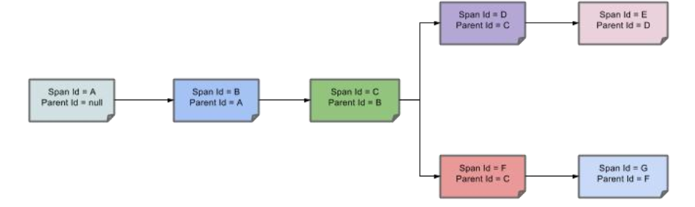

## 1.Sleuth+Zipkin 服务链路追踪

### 1.1为什么使用

微服务架构是一个分布式架构， 它按业务划分服务单元， 一个分布式系统往往有很多个服务单元。 由于服务单元数量众多， 业务的复杂性， 如果出现了错误和异常， 很难去定位。 主要体现在， 一个请求可能需要调用很多个服务， 而内部服务的调用复杂性， 决定了问题难以定位。 所以微服务架构中， 必须实现分布式链路追踪， 去跟进一个请求到底有哪些服务参与，参与的顺序又是怎样的， 从而达到每个请求的步骤清晰可见， 出了问题， 很快定位。

链路追踪组件有 Google 的 Dapper， Twitter 的 Zipkin， 以及阿里的 Eagleeye （鹰眼） 等， 它们都是非常优秀的链路追踪开源组件。

### 1.2 基本术语

Span（跨度） ： 基本工作单元， 发送一个远程调度任务 就会产生一个 Span， Span 是一个 64 位 ID 唯一标识的， Trace 是用另一个 64 位 ID 唯一标识的， Span 还有其他数据信息， 比如摘要、 时间戳事件、 Span 的 ID、 以及进度 ID。
Trace（跟踪） ： 一系列 Span 组成的一个树状结构。 请求一个微服务系统的 API 接口，这个 API 接口， 需要调用多个微服务， 调用每个微服务都会产生一个新的 Span， 所有由这个请求产生的 Span 组成了这个 Trace。
Annotation（标注） ： 用来及时记录一个事件的， 一些核心注解用来定义一个请求的开始和结束 。 这些注解包括以下：
cs - Client Sent -客户端发送一个请求， 这个注解描述了这个 Span 的开始
sr - Server Received -服务端获得请求并准备开始处理它， 如果将其 sr 减去 cs 时间戳便可得到网络传输的时间。
ss - Server Sent （服务端发送响应） –该注解表明请求处理的完成(当请求返回客户端)， 如果 ss 的时间戳减去 sr 时间戳， 就可以得到服务器请求的时间。
cr - Client Received （客户端接收响应） -此时 Span 的结束， 如果 cr 的时间戳减去cs 时间戳便可以得到整个请求所消耗的时间。


Span 之间的父子关系如下：



### 1.3 整合 Zipkin 链路追踪+可视化

zipkin 依赖也同时包含了 sleuth， 可以省略 sleuth 的引用

#### 1.3.1 安装zipkin服务器

```sh
docker run -d -p 9411:9411 openzipkin/zipkin
```

#### 1.3.2 导入依赖

>gulimall-common/pom.xml

```pom
        <!--链路追踪+可视化-->
        <dependency>
            <groupId>org.springframework.cloud</groupId>
            <artifactId>spring-cloud-starter-zipkin</artifactId>
            <version>2.2.3.RELEASE</version>
        </dependency>
```

#### 1.3.3 配置Sleuth与Zipkin

> 所有需要链路追踪的服务都需要一下配置

```y
spring:
  zipkin:
  #链路追踪可视化zipkin服务器
    base-url: http://192.168.157.128:9411/
    #关闭服务发现，否则spring cloud会把zipkin的url当做服务名称
    discovery-client-enabled: false
    #设置使用http的方式传输数据
    sender:
      type: web
  sleuth:
    sampler:
    #设置抽样采集率为100%，默认0.1
      probability: 1
```

#### 1.3.4 访问http://192.168.157.128:9411/zipkin/


#### 1.3.5 懒加载跑一遍流程

>查看超过100ms的请求，是否可以优化
>结合zipkin找到慢请求，该降级的降级，该限流的限流


> 细节信息


## 2.高级篇完结,撒花!!!
