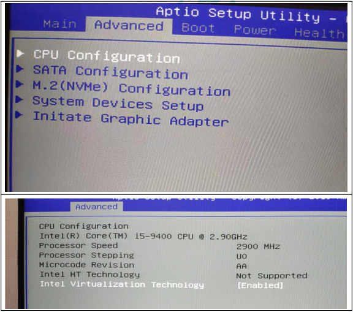
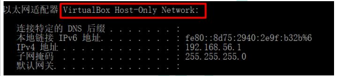
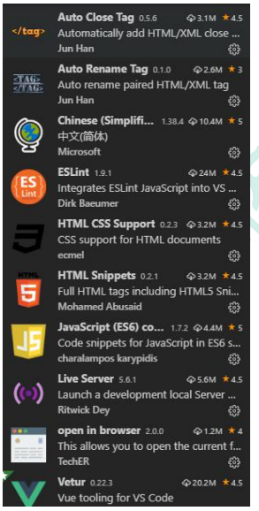
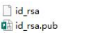
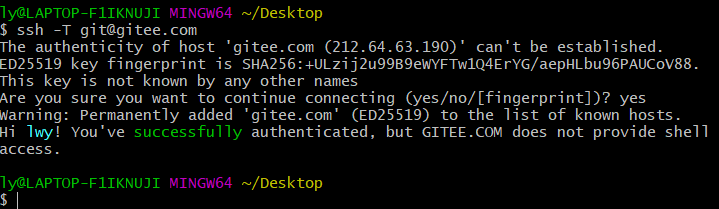
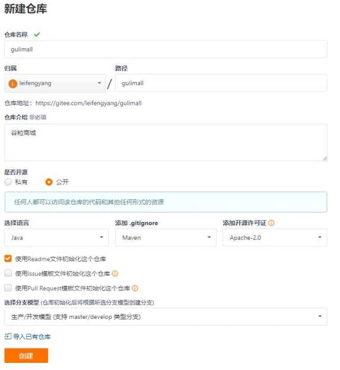
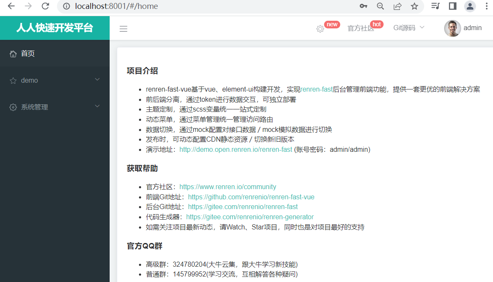
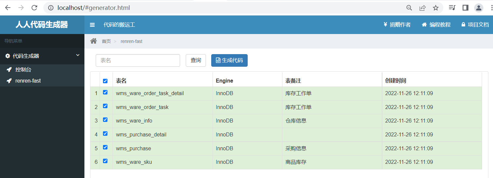

# 1.环境搭建

[[toc]]

## 1.安装linux虚拟机

1.下载&安装 VirtualBox https://www.virtualbox.org/，要开启 CPU 虚拟化



2.下载&安装 Vagrant

```sh
https://app.vagrantup.com/boxes/search Vagrant 官方镜像仓库
https://www.vagrantup.com/downloads.html Vagrant 下载
```

3.打开 window cmd 窗口，运行 Vagrant init centos/7，即可初始化一个 centos7 系统

4.运行 vagrant up 即可启动虚拟机。系统 root 用户的密码是 vagrant

5.vagrant 其他常用命令

```sh
vagrant ssh：自动使用 vagrant 用户连接虚拟机。
vagrant upload source [destination] [name|id]：上传文件
https://www.vagrantup.com/docs/cli/init.html Vagrant 命令行
```

6.默认虚拟机的 ip 地址不是固定 ip，开发不方便

```sh
修改 Vagrantfile
config.vm.network "private_network", ip: "192.168.56.10" 这里的 ip 需要在物理机下使用 ipconfig 命令找到
```



改为这个指定的子网地址

重新使用 vagrant up 启动机器即可。然后再 vagrant ssh 连接机器

7.默认只允许 ssh 登录方式，为了后来操作方便，文件上传等，我们可以配置允许账号密码登录

```sh
Vagrant ssh 进去系统之后
vi /etc/ssh/sshd_config
修改 PasswordAuthentication yes/no
重启服务 service sshd restart
```

8.以后可以使用提供的 ssh 连接工具直接连接

注意：VirtualBox 会与包括但不限于如下软件冲突，需要卸载这些软件，然后重启电脑；

冲突的软件：红蜘蛛，360，净网大师（有可能）等

```sh
修改 linux 的 yum 源
1）、备份原 yum 源
mv /etc/yum.repos.d/CentOS-Base.repo /etc/yum.repos.d/CentOS-Base.repo.backup
2）、使用新 yum 源
curl -o /etc/yum.repos.d/CentOS-Base.repo
http://mirrors.163.com/.help/CentOS7-Base-163.repo
3）、生成缓存
yum makecache
```

## 2.安装docker

Docker 安装文档：https://docs.docker.com/install/linux/docker-ce/centos/

1.卸载系统之前的 docker

```sh
sudo yum remove docker \
docker-client \
docker-client-latest \
docker-common \
docker-latest \
docker-latest-logrotate \
docker-logrotate \
docker-engine
```

2.安装 Docker-CE

```sh
安装必须的依赖
sudo yum install -y yum-utils device-mapper-persistent-data lvm2
```

```sh
设置 docker repo 的 yum 位置
sudo yum-config-manager --add-repo https://download.docker.com/linux/centos/docker-ce.repo
```

```sh
安装 docker，以及 docker-cli
sudo yum install docker-ce docker-ce-cli containerd.io
```

3.启动docker

```sh
sudo systemctl start docker
```

4.设置 docker 开机自启

```sh
sudo systemctl enable docker
```

5.测试 docker 常用命令，注意切换到 root 用户下

```sh
https://docs.docker.com/engine/reference/commandline/docker/
```

6.配置 docker 镜像加速

```sh
阿里云，容器镜像服务
针对 Docker 客户端版本大于 1.10.0 的用户
您可以通过修改 daemon 配置文件/etc/docker/daemon.json 来使用加速器
sudo mkdir -p /etc/docker
sudo tee /etc/docker/daemon.json <<-'EOF' { "registry-mirrors": ["https://82m9ar63.mirror.aliyuncs.com"]
}
EOF
sudo systemctl daemon-reload
sudo systemctl restart docker
```

## 3.docker 安装mysql

1.下载镜像文件

```sh
docker pull mysql:5.7
```

2.创建实例并启动

```sh
docker run -p 3306:3306 --name mysql \
-v /mydata/mysql/log:/var/log/mysql \
-v /mydata/mysql/data:/var/lib/mysql \
-v /mydata/mysql/conf:/etc/mysql \
-e MYSQL_ROOT_PASSWORD=root \
-d mysql:5.7
```

参数说明

-p 3306:3306：将容器的 3306 端口映射到主机的 3306 端口

-v /mydata/mysql/conf:/etc/mysql：将配置文件夹挂载到主机

-v /mydata/mysql/log:/var/log/mysql：将日志文件夹挂载到主机

-v /mydata/mysql/data:/var/lib/mysql/：将配置文件夹挂载到主机

-e MYSQL_ROOT_PASSWORD=root：初始化 root 用户的密码

**MySQL配置**

```sh
vi /mydata/mysql/conf/my.cnf
```

```sh
[client]
default-character-set=utf8
[mysql]
default-character-set=utf8
[mysqld]
init_connect='SET collation_connection = utf8_unicode_ci' 
init_connect='SET NAMES utf8' 
character-set-server=utf8
collation-server=utf8_unicode_ci
skip-character-set-client-handshake
skip-name-resolve
```

**注意：解决MySQL连接慢的问题**

在配置文件中加入如下，并重启 mysql

```sh
[mysqld]

skip-name-resolve
```

解释：

skip-name-resolve：跳过域名解析

3.通过容器的mysql命令行工具连接

```sh
docker exec -it mysql mysql -uroot -proot
```

4.设置root远程访问

```sh
grant all privileges on *.* to 'root'@'%' identified by 'root' with grant option;
flush privileges;
```

5.进入容器文件系统

```sh
docker exec -it mysql /bin/bash
```

## 4.docker安装redis

1.下载镜像文件

```sh
docker pull redis
```

2.创建实例并启动

```sh
mkdir -p /mydata/redis/conf
touch /mydata/redis/conf/redis.conf
docker run -p 6379:6379 --name redis -v /mydata/redis/data:/data \
-v /mydata/redis/conf/redis.conf:/etc/redis/redis.conf \
-d redis redis-server /etc/redis/redis.conf
```

redis 自描述文件：

https://raw.githubusercontent.com/antirez/redis/4.0/redis.conf

3.使用redis镜像执行redis-cli命令连接

```sh
docker exec -it redis redis-cli
```

4.持久化

```sh
vi /etc/redis/redis.conf
#添加
appendonly yes
```

5.重启redis

```sh
docker restart redis
```

## 5.开机重启

每次开机之后自动重启mysql和redis

```sh
sudo docker update mysql --restart=always
sudo docker update redis --restart=always
```


## 6.开发环境统一

```xml
配置阿里云镜像
<mirrors>
<mirror>
<id>nexus-aliyun</id>
<mirrorOf>central</mirrorOf>
<name>Nexus aliyun</name>
<url>http://maven.aliyun.com/nexus/content/groups/public</url>
</mirror>
</mirrors>
```

```pom
配置 jdk1.8 编译项目
<profiles>
<profile>
<id>jdk-1.8</id>
<activation>
<activeByDefault>true</activeByDefault>
<jdk>1.8</jdk>
</activation>
<properties>
<maven.compiler.source>1.8</maven.compiler.source>
<maven.compiler.target>1.8</maven.compiler.target>
<maven.compiler.compilerVersion>1.8</maven.compiler.compilerVersion>
</properties>
</profile>
</profiles>
```

2.Idea&VsCode

```sh
1.idea 安装 lombok、mybatisx 插件

2.Vscode 安装开发必备插件
Vetur —— 语法高亮、智能感知、Emmet 等
包含格式化功能， Alt+Shift+F （格式化全文），Ctrl+K Ctrl+F（格式化选中代码，两个 Ctrl
需要同时按着）
EsLint —— 语法纠错
Auto Close Tag —— 自动闭合 HTML/XML 标签
Auto Rename Tag —— 自动完成另一侧标签的同步修改
JavaScript(ES6) code snippets — — ES6 语 法 智 能 提 示 以 及 快 速 输 入 ， 除 js 外 还 支
持.ts，.jsx，.tsx，.html，.vue，省去了配置其支持各种包含 js 代码文件的时间
HTML CSS Support —— 让 html 标签上写 class 智能提示当前项目所支持的样式
HTML Snippets —— html 快速自动补全
Open in browser —— 浏览器快速打开
Live Server —— 以内嵌服务器方式打开
Chinese (Simplified) Language Pack for Visual Studio Code —— 中文语言包
```



3.安装配置git

​	1.下载 git；https://git-scm.com

​	2、配置 git，进入 git bash

```sh
# 配置用户名
git config --global user.name "username" //（名字）
# 配置邮箱
git config --global user.email "username@email.com" //(注册账号时用的邮箱)
```

​	3.配置 ssh 免密登录

https://gitee.com/help/articles/4181#article-header0

进入 git bash；使用：ssh-keygen -t rsa -C "xxxxx@xxxxx.com"命令。 连续三次回车。

```sh
ssh-keygen -t rsa -C "502051565@qq.com
```


一般用户目录下会有



或者 cat ~/.ssh/id_rsa.pub

登录进入 gitee，在设置里面找到 SSH KEY 将.pub 文件的内容粘贴进去

使用 ssh -T git@gitee.com 测试是否成功即可



Git+码云教程 https://gitee.com/help/articles/4104

4.逆向工程使用

1、导入项目逆向工程

2、下载人人开源后台管理系统脚手架工程

(1) 导入工程，创建数据库

(2) 修改工程 shiro 依赖为 SpringSecurity

(3) 删除部分暂时不需要的业务

3、下载人人开源后台管理系统 vue 端脚手架工程

(1) vscode 导入前端项目

(2) 前后端联调测试基本功能

## 7.创建项目微服务

商品服务、仓储服务、订单服务、优惠券服务、用户服务

共同：

```sh
1).web、openfeign
2).每一个服务，包名 **com.atguigu.gulimall**.xxx(product/order/ware/coupon/member)
3).模块名：gulimall-coupon
```

1.从gitee初始化一个项目



2.创建各个微服务项目

​	1).了解人人开源项目，快速搭建后台脚手架

人人脚手架的地址

```sh
https://gitee.com/renrenio
```

```sh
创建以下模块
商品服务product
存储服务ware
订单服务order
优惠券服务coupon
用户服务member
每个模块导入web和openFeign
```

​	2).修改代码调整为我们的业务逻辑

​	3).创建各个微服务以及数据库

```sh
创建数据库
gulimall_oms
gulimall_pms
gulimall_sms
gulimall_ums
gulimall_wms
所有的数据库数据再复杂也不建立外键，因为在电商系统里，数据量大，做外键关联很耗性能。
创建表
```

4).启动人人开源前端和后端的项目

账号：admin 密码：admin



## 8.逆向工程

人人开发下载renren-generator逆向工程

1.修改application.yml中的数据库链接信息

2.修改generator.properties的包和表的信息

运行RenrenApplication，

访问`http://localhost:80/`来进行代码生成



将生成的代码放在对于的项目模块里面