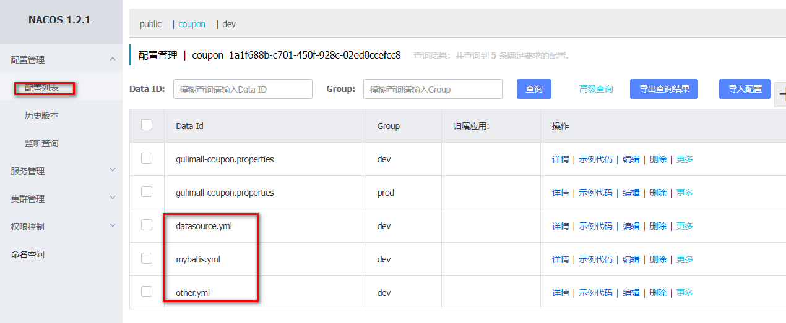

# 1.SpringCloud

[[toc]]

## 1.SpringCloud Alibaba

### 1.简介

Spring Cloud Alibaba 致力于提供**微服务开发的****一站式解决方案**。此项目包含开发分布式应用

微服务的必需组件，方便开发者通过 Spring Cloud 编程模型轻松使用这些组件来开发分布

式应用服务。

依托 Spring Cloud Alibaba，您只需要添加一些注解和少量配置，就可以将 Spring Cloud 应用

接入阿里微服务解决方案，通过阿里中间件来迅速搭建分布式应用系统。

https://github.com/alibaba/spring-cloud-alibaba

**结合SpringCloud Alibaba我们最终的技术搭配方案：**

```sh
SpringCloud Alibaba - Nacos：注册中心（服务发现/注册）
SpringCloud Alibaba - Nacos：配置中心（动态配置管理）
SpringCloud - Ribbo：负载均衡
SpringCloud - Feign：声明式HTTP客户端（调用远程服务）
SpringCloud Alibaba - Sentinel：服务容错（限流、降级、熔断）
SpringCloud - Gateway：API网关（webflux编程模式）
SpringCloud - Sleuth：调用链监控
SpringCloud Alibaba - Seata：原Fescar，即分布式事务解决方案
```

### 2.版本选择

由于 Spring Boot 1 和 Spring Boot 2 在 Actuator 模块的接口和注解有很大的变更，且spring-cloud-commons 从 1.x.x 版本升级到 2.0.0 版本也有较大的变更，因此我们采取跟SpringBoot 版本号一致的版本:

```sh
1.5.x 版本适用于 Spring Boot 1.5.x
2.0.x 版本适用于 Spring Boot 2.0.x
2.1.x 版本适用于 Spring Boot 2.1.x
```

### 3.项目中的依赖

```xml
在 common 项目中引入如下。进行统一管理
<dependencyManagement>
<dependencies>
<dependency>
<groupId>com.alibaba.cloud</groupId>
<artifactId>spring-cloud-alibaba-dependencies</artifactId>
<version>2.1.0.RELEASE</version>
<type>pom</type>
<scope>import</scope>
</dependency>
</dependencies>
</dependencyManagement>
```

### 4.SpringCloud Alibaba-Nacos[作为注册中心]

Nacos 是阿里巴巴开源的一个更易于构建云原生应用的动态服务发现、配置管理和服务管理平台。他是使用 java 编写。需要依赖 java 环境

Nacos 文档地址： https://nacos.io/zh-cn/docs/quick-start.html

`1.下载nacos-server`

```sh
https://github.com/alibaba/nacos/releases
```

`2.启动nacos-server`

```sh
双击 bin 中的 startup.cmd 文件
 访问 http://localhost:8848/nacos/
 使用默认的 nacos/nacos 进行登录
```

`3.将微服务注册到nacos中`

**1.首先，修改 pom.xml文件，引入 Nacos Discovery Starter**

```sh
<dependency>
<groupId>com.alibaba.cloud</groupId>
<artifactId>spring-cloud-starter-alibaba-nacos-discovery</artifactId>
</dependency>
```

**2.在应用的/src/main/resources/application.properties配置文**

**件配置** **Nacos Server** **地址**

```sh
cloud:
    nacos:
      discovery:
        server-addr: 127.0.0.1:8848
```

**3.使用@EnableDiscoveryClient开启服务注册发现功能**

```java
@SpringBootApplication
@EnableDiscoveryClient
public class ProviderApplication {
public static void main(String[] args) {
SpringApplication.run(Application.class, args);
}
}
```

**4.启动应用，观察** **nacos** **服务列表是否已经注册上服务**

```sh
#注意：每一个应用都应该有名字，这样才能注册上去。修改 application.properties 文件
spring:
  datasource:
    username: root
    password: root
    url: jdbc:mysql://192.168.233.129:3306/gulimall_sms
    driver-class-name: com.mysql.jdbc.Driver
  cloud:
    nacos:
      discovery:
        server-addr: 127.0.0.1:8848
  application:
    name: gulimall-coupon
```

**5.注册更多的服务上去，测试使用** **feign** **远程调用**

```sh
Nacos 使用三步
1、导包 nacos-discovery
2、写配置，指定 nacos 地址，指定应用的名字
3、开启服务注册发现功能@EnableDiscoveryClient
Feign 使用三步
1、导包 openfeign
2、开启@EnableFeignClients 功能
3、编写接口，进行远程调用
```

```sh
/**
 * 这是一个声明式的远程调用
 */
@FeignClient("gulimall-coupon")
public interface CouponFeignService {
    @RequestMapping("/coupon/coupon/member/list")
    public R membercoupons();
}
```

**6.更多配置**

```sh
https://github.com/alibaba/spring-cloud-alibaba/blob/master/spring-cloud-alibaba-examples/na
cos-example/nacos-discovery-example/readme-zh.md#more
```

### 5.SpringCloud Alibaba-Nacos[作为配置中心]

`1.pom.xml引入Nacos Config Starter`

```xml
<dependency>
<groupId>com.alibaba.cloud</groupId>
<artifactId>spring-cloud-starter-alibaba-nacosconfig</artifactId>
</dependency>
```

`2.在应用的 /src/main/resources/bootstrap.properties配置文件中配置Nacos Config元数据,主要配置应用名和配置中心地址`

```sh
spring.application.name=gulimall-coupon
spring.cloud.nacos.config.server-addr=127.0.0.1:8848
```

`3.在nacos中添加配置`

在 nacos 中创建一个 **应用名****.properties** 配置文件并编写配置


```sh
Nacos Config 数据结构
Nacos Config 主要通过 dataId 和 group 来唯一确定一条配置。
Nacos Client 从 Nacos Server 端获取数据时，调用的是此接口 ConfigService.getConfig(String
dataId, String group, long timeoutMs)。
Spring Cloud 应用获取数据
dataID：
在 Nacos Config Starter 中，dataId 的拼接格式如下
 ${prefix} - ${spring.profiles.active} . ${file-extension} prefix 默认为 spring.application.name
的值，也可以通过配置项 spring.cloud.nacos.config.prefix 来配置。
 spring.profiles.active 即为当前环境对应的 profile
注意，当 activeprofile 为空时，对应的连接符 - 也将不存在，dataId 的拼接格式变成
${prefix}.${file-extension}
file-extension 为配置内容的数据格式，可以通过配置项
spring.cloud.nacos.config.file-extension 来配置。 目前只支持 properties 类型。
Group：
Group 默认为 DEFAULT_GROUP，可以通过 spring.cloud.nacos.config.group 配置。
```

`4.在应用中使用@Value和@RefreshScope`

```xml
@Value("${coupon.user.name}")
    private String name;
    @Value("${coupon.user.age}")
    private Integer age;

    @RequestMapping("/test")
    public R test(){
        return R.ok().put("name",name).put("age",age);
    }
```

`5.命名空间：配置隔离`

```
默认：public(保留空间)；默认新增的所有配置都在public空间。
1、开发，测试，生产：利用命名空间来做环境隔离。
	注意：在bootstrap.properties；配置上，需要使用哪个命名空间下的配置，
	spring.cloud.nacos.config.namespace=9de62e44-cd2a-4a82-bf5c-95878bd5e871
2、每一个微服务之间互相隔离配置，每一个微服务都创建自己的命名空间，只加载自己命名空间下的所有配置
```

1.添加命名空间


2.添加配置


3.在项目中指定使用的配置


`6.命名空间：每一个微服务之间互相隔离配置`

每一个微服务都创建主机的命名空间，只加载自己命名空间下的所有配置

1.配置优惠卷命名空间


2.添加配置


3.在代码中修改


`7.配置分组`

```
配置分组：
	默认所有的配置集都属于：DEFAULT_GROUP；
	比如配置 1111，618，1212 分组
```

1.添加分组


2.修改代码


```sh
项目中的使用：每个微服务创建自己的命名空间，使用配置分组区分环境，dev，test，prod
```

`8.同时加载多个配置集`

1.先把配置文件改成dev和pro两种分组


2.将配置信息分成多个配置文件


3.创建多个配置文件



4.更改代码


5.重启项目，看日志已经读取了我们的配置文件


`9.原理`

```sh
自动注入：
NacosConfigStarter 实现了 org.springframework.cloud.bootstrap.config.PropertySourceLocator
接口，并将优先级设置成了最高。
在 Spring Cloud 应用启动阶段，会主动从 Nacos Server 端获取对应的数据，并将获取到的数据转换成 PropertySource 且注入到 Environment 的PropertySources 属性中，所以使用@Value 注解也能直接获取 Nacos Server 端配置的内容。 
动态刷新：
Nacos Config Starter 默认为所有获取数据成功的 Nacos 的配置项添加了监听功能，在监听到服务端配置发生变化时会实时触发
org.springframework.cloud.context.refresh.ContextRefresher 的 refresh 方法 。
如果需要对 Bean 进行动态刷新，请参照 Spring 和 Spring Cloud 规范。推荐给类添加@RefreshScope 或 @ConfigurationProperties 注解
```

`9.总结`

```
* 1)、微服务任何配置信息，任何配置文件都可以放在配置中心中
* 2）、只需要在bootstrap.properties说明加载配置中心中哪些配置文件即可
* 3）、@Value，@ConfigurationProperties。。。
* 以前SpringBoot任何方法从配置文件中获取值，都能使用。
* 配置中心有的优先使用配置中心中的，
```

## 2.服务网关Gateway

### 1.简介

​	网关作为流量的入口，常用功能包括路由转发、权限校验、限流控制等。而 springcloud gateway作为 SpringCloud 官方推出的第二代网关框架，取代了 Zuul 网关。

​	网关提供 API 全托管服务，丰富的 API 管理功能，辅助企业管理大规模的 API，以降低管理成本和安全风险，包括协议适配、协议转发、安全策略、防刷、流量、监控日志等功能。

​	Spring Cloud Gateway 旨在提供一种简单而有效的方式来对 API 进行路由，并为他们提供切面，例如：安全性，监控/指标 和弹性等。

官方文档地址：

https://cloud.spring.io/spring-cloud-static/spring-cloud-gateway/2.1.3.RELEASE/single/spring-cloud-gateway.html

### 2.注册“gulimall-gateway”到Nacos

1）创建“gulimall-gateway”

2）添加依赖

```xml
        <dependency>
            <groupId>com.bigdata.gulimall</groupId>
            <artifactId>gulimall-common</artifactId>
            <version>1.0-SNAPSHOT</version>
        </dependency>
        <dependency>
            <groupId>org.springframework.cloud</groupId>
            <artifactId>spring-cloud-starter-gateway</artifactId>
        </dependency>
```

3）“GulimallGatewayApplication”类上加上“@EnableDiscoveryClient”注解

4) 在Nacos中创建“gateway”命名空间，同时在该命名空间中创建“gulimall-gateway.yml”


5) 创建“bootstrap.properties”文件，添加如下配置，指明配置中心地址和所属命名空间

```properties
spring.application.name=gulimall-gateway
spring.cloud.nacos.config.server-addr=127.0.0.1:8848
spring.cloud.nacos.config.namespace=7e910a1b-3362-48d4-99a7-8a2e0d1ba03c
```

6）创建“application.properties”文件，指定服务名和注册中心地址

```properties
spring.application.name=gulimall-gateway
spring.cloud.nacos.discovery.server-addr=127.0.0.1:8848
server.port=88
```

7）启动“gulimall-gateway”

```verilog
Description:

Failed to configure a DataSource: 'url' attribute is not specified and no embedded datasource could be configured.

Reason: Failed to determine a suitable driver class
```

解决方法：在“GulimallGatewayApplication”中排除和数据源相关的配置

``` java
@SpringBootApplication(exclude = {DataSourceAutoConfiguration.class})
```

重新启动

访问：<http://127.0.0.1:8848/nacos/#>，查看到该服务已经注册到了Nacos中


### 3.案例

现在想要实现:

对于“http://localhost:88/hello?url=baidu”，转发到“https://www.baidu.com”

对于“http://localhost:88/hello?url=qq”的请求，转发到“https://www.qq.com/”

1）创建“application.yml”

```yaml
spring:
  cloud:
    gateway:
      routes:
        - id: baidu_route
          uri: https://www.baidu.com
          predicates:
            - Query=url, baidu
        - id: qq_route
          uri: https://www.qq.com/
          predicates:
            - Query=url, qq
```

2)启动“gulimall-gateway”

3）测试

访问：http://localhost:88/hello?url=baidu

访问：http://localhost:88/hello?url=qq
