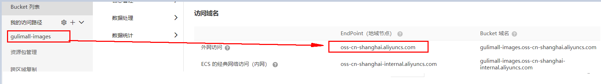
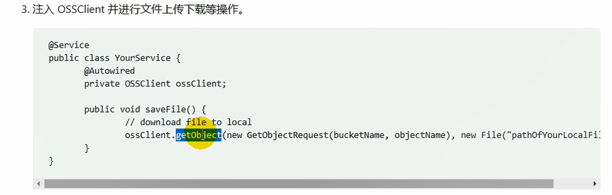

# 1.商品服务

[[toc]]

## 1. 递归树形结构获取数据

在注册中心中“product”命名空间中，创建“gulimall-product.yml”配置文件：


将“application.yml”内容拷贝到该配置文件中

```yaml
server:
  port: 1000
spring:
  datasource:
    #MySQL配置
    driverClassName: com.mysql.jdbc.Driver
    url: jdbc:mysql://192.168.233.129:3306/gulimall_pms?useUnicode=true&characterEncoding=UTF-8&useSSL=false
    username: root
    password: root
  application:
    name: gulimall-product
  cloud:
    nacos:
      discovery:
        server-addr: 127.0.0.1:8848
mybatis-plus:
  global-config:
    db-config:
      id-type: auto
  mapper-locations: classpath:/mapper/**/*.xml

```

在本地创建“bootstrap.properties”文件，指明配置中心的位置和使用到的配置文件：

```properties
spring.application.name=gulimall-product
spring.cloud.nacos.config.server-addr=127.0.0.1:8848
spring.cloud.nacos.config.namespace=3c50ffaa-010b-4b59-9372-902e35059232
spring.cloud.nacos.config.extension-configs[0].data-id=gulimall-product.yml
spring.cloud.nacos.config.extension-configs[0].group=DEFAULT_GROUP
spring.cloud.nacos.config.extension-configs[0].refresh=true
```

然后启动gulimall-product，查看到该服务已经出现在了nacos的注册中心中了

修改“com.bigdata.gulimall.product.service.CategoryService”类，添加如下代码：

```java
    /**
     * 列表
     */
    @RequestMapping("/list/tree")
    public List<CategoryEntity> list(){
        List<CategoryEntity> categoryEntities = categoryService.listWithTree();

        return categoryEntities;
    }
```

测试：http://localhost:1000/product/category/list/tree


如何区别是哪种分类级别？

答：可以通过分类的parent_cid来进行判断，如果是一级分类，其值为0.

```java
     /**
     * 列表
     */
    @RequestMapping("/list/tree")
    public List<CategoryEntity> list(){
        List<CategoryEntity> categoryEntities = categoryService.listWithTree();
        //找到所有的一级分类
        List<CategoryEntity> level1Menus = categoryEntities.stream()
                .filter(item -> item.getParentCid() == 0)
                .map(menu->{
                    menu.setChildCategoryEntity(getChildrens(menu,categoryEntities));
                    return menu;
                })
                .sorted((menu1, menu2) -> {

                  return (menu1.getSort() ==null ? 0:menu1.getSort())- (menu2.getSort()==null?0:menu2.getSort());

                })
                .collect(Collectors.toList());


        return level1Menus;
    }

    public List<CategoryEntity> getChildrens(CategoryEntity root,List<CategoryEntity> all){

        List<CategoryEntity> childrens = all.stream().filter(item -> {
            return item.getParentCid() == root.getCatId();
        }).map(item -> {
            item.setChildCategoryEntity(getChildrens(item, all));
            return item;
        }).sorted((menu1, menu2) -> {
            return (menu1.getSort() ==null ? 0:menu1.getSort())- (menu2.getSort()==null?0:menu2.getSort());
        }).collect(Collectors.toList());

        return childrens;
    }

```

启动后端项目renren-fast

启动前端项目renren-fast-vue：

```
npm run dev
```


访问： http://localhost:8001/#/login 

创建一级菜单：


创建完成后，在后台的管理系统中会创建一条记录：


然后创建子菜单：


创建renren-fast-vue\src\views\modules\product目录，之所以是这样来创建，是因为product/category，对应于product-category

在该目录下，新建“category.vue”文件：

刷新页面出现404异常，查看请求发现，请求的是“http://localhost:8080/renren-fast/product/category/list/tree”


这个请求是不正确的，正确的请求是：http://localhost:10000/product/category/list/tree，

修正这个问题：

替换“static\config\index.js”文件中的“window.SITE_CONFIG['baseUrl']”

替换前：

```
window.SITE_CONFIG['baseUrl'] = 'http://localhost:8080/renren-fast';
```

替换后：

```
 window.SITE_CONFIG['baseUrl'] = 'http://localhost:88/api';
```

http://localhost:88，这个地址是我们网关微服务的接口。

这里我们需要通过网关来完成路径的映射，因此将renren-fast注册到nacos注册中心中，并添加配置中心

```yaml
application:
    name: renren-fast
  cloud:
    nacos:
      discovery:
        server-addr: 127.0.0.1:8848

      config:
        name: renren-fast
        server-addr: 127.0.0.1
        namespace: ee409c3f-3206-4a3b-ba65-7376922a886d
```


配置网关路由，前台的所有请求都是经由“http://localhost:88/api”来转发的，在“gulimall-gateway”中添加路由规则：

```yaml
        - id: admin_route
          uri: lb://renren-fast
          predicates:
            - Path=/api/**
```


但是这样做也引入了另外的一个问题，再次访问：http://localhost:8001/#/login，发现验证码不再显示：

分析原因：

1. 现在的验证码请求路径为，http://localhost:88/api/captcha.jpg?uuid=69c79f02-d15b-478a-8465-a07fd09001e6
2. 原始的验证码请求路径：http://localhost:8001/renren-fast/captcha.jpg?uuid=69c79f02-d15b-478a-8465-a07fd09001e6

在admin_route的路由规则下，在访问路径中包含了“api”，因此它会将它转发到renren-fast，网关在转发的时候，会使用网关的前缀信息，为了能够正常的取得验证码，我们需要对请求路径进行重写


关于请求路径重写：

```sh
[6.16. The `RewritePath` `GatewayFilter` Factory](https://cloud.spring.io/spring-cloud-static/spring-cloud-gateway/2.2.2.RELEASE/reference/html/#the-rewritepath-gatewayfilter-factory)

The `RewritePath` `GatewayFilter` factory takes a path `regexp` parameter and a `replacement` parameter. This uses Java regular expressions for a flexible way to rewrite the request path. The following listing configures a `RewritePath` `GatewayFilter`:

Example 41. application.yml
```

```yaml
spring:
  cloud:
    gateway:
      routes:
      - id: rewritepath_route
        uri: https://example.org
        predicates:
        - Path=/foo/**
        filters:
        - RewritePath=/red(?<segment>/?.*), $\{segment}
```

```sh
For a request path of `/red/blue`, this sets the path to `/blue` before making the downstream request. Note that the `$` should be replaced with `$\` because of the YAML specification.
```


修改“admin_route”路由规则：

```yaml
        - id: admin_route
          uri: lb://renren-fast
          predicates:
            - Path=/api/**
          filters:
            - RewritePath=/api/(?<segment>/?.*), /renren-fast/$\{segment}
```


再次访问：http://localhost:8001/#/login，验证码能够正常的加载了。

但是很不幸新的问题又产生了，访问被拒绝了


 问题描述：已拦截跨源请求：同源策略禁止读取位于 http://localhost:88/api/sys/login 的远程资源。（原因：CORS 头缺少 'Access-Control-Allow-Origin'）。 

问题分析：这是一种跨域问题。访问的域名和端口和原来的请求不同，请求就会被限制


跨域流程：


解决方法：在网关中定义“GulimallCorsConfiguration”类，该类用来做过滤，允许所有的请求跨域。

```java
@Configuration
public class GulimallCorsConfiguration {

    @Bean
    public CorsWebFilter corsWebFilter(){
        UrlBasedCorsConfigurationSource source=new UrlBasedCorsConfigurationSource();
        CorsConfiguration corsConfiguration = new CorsConfiguration();
        corsConfiguration.addAllowedHeader("*");
        corsConfiguration.addAllowedMethod("*");
        corsConfiguration.addAllowedOrigin("*");
        corsConfiguration.setAllowCredentials(true);
        
        source.registerCorsConfiguration("/**",corsConfiguration);
        return new CorsWebFilter(source);
    }
}
```


再次访问：http://localhost:8001/#/login


http://localhost:8001/renre已拦截跨源请求：同源策略禁止读取位于 http://localhost:88/api/sys/login 的远程资源。（原因：不允许有多个 'Access-Control-Allow-Origin' CORS 头）n-fast/captcha.jpg?uuid=69c79f02-d15b-478a-8465-a07fd09001e6

出现了多个请求，并且也存在多个跨源请求。

为了解决这个问题，需要修改renren-fast项目，注释掉“io.renren.config.CorsConfig”类。然后再次进行访问。

在显示分类信息的时候，出现了404异常，请求的http://localhost:88/api/product/category/list/tree不存在


这是因为网关上所做的路径映射不正确，映射后的路径为http://localhost:8001/renren-fast/product/category/list/tree

但是只有通过http://localhost:10000/product/category/list/tree路径才能够正常访问，所以会报404异常。

解决方法就是定义一个product路由规则，进行路径重写：

```yaml
        - id: product_route
          uri: lb://gulimall-product
          predicates:
            - Path=/api/product/**
          filters:
            - RewritePath=/api/(?<segment>/?.*),/$\{segment}
```

在路由规则的顺序上，将精确的路由规则放置到模糊的路由规则的前面，否则的话，精确的路由规则将不会被匹配到，类似于异常体系中try catch子句中异常的处理顺序。


## 2. 删除数据

添加delete和append标识，并且增加复选框

```vue
 <el-tree
    :data="menus"
    show-checkbox  //显示复选框
    :props="defaultProps"  
    :expand-on-click-node="false" //设置节点点击时不展开
    node-key="catId"   
  >
    <span class="custom-tree-node" slot-scope="{ node, data }">
      <span>{{ node.label }}</span>
      <span>
        <el-button v-if="node.level <= 2" type="text" size="mini" @click="() => append(data)">Append</el-button>
        <el-button
          v-if="node.childNodes.length == 0"
          type="text"
          size="mini"
          @click="() => remove(node, data)"
        >Delete</el-button>
      </span>
    </span>
  </el-tree>
```


测试删除数据，打开postman输入“ http://localhost:88/api/product/category/delete ”，请求方式设置为POST，为了比对效果，可以在删除之前查询数据库的pms_category表

由于delete请求接收的是一个数组，所以这里使用JSON方式，传入了一个数组：


再次查询数据库能够看到cat_id为1000的数据已经被删除了。


修改“com.bigdata.gulimall.product.controller.CategoryController”类，添加如下代码：

```java
 @RequestMapping("/delete")
    public R delete(@RequestBody Long[] catIds){
        //删除之前需要判断待删除的菜单那是否被别的地方所引用。
//		categoryService.removeByIds(Arrays.asList(catIds));

        categoryService.removeMenuByIds(Arrays.asList(catIds));
        return R.ok();
    }
```


com.bigdata.gulimall.product.service.impl.CategoryServiceImpl

```java
    @Override
    public   void removeMenuByIds(List<Long> asList) {
        //TODO 检查当前的菜单是否被别的地方所引用
        categoryDao.deleteBatchIds(asList);
    }
```


然而多数时候，我们并不希望删除数据，而是标记它被删除了，这就是逻辑删除；

可以设置show_status为0，标记它已经被删除。


mybatis-plus的逻辑删除：


配置全局的逻辑删除规则，在“src/main/resources/application.yml”文件中添加如下内容：

```yaml
mybatis-plus:
  global-config:
    db-config:
      id-type: auto
      logic-delete-value: 1
      logic-not-delete-value: 0
```

修改“com.bigdata.gulimall.product.entity.CategoryEntity”类，添加上@TableLogic，表明使用逻辑删除：

```java
	/**
	 * 是否显示[0-不显示，1显示]
	 */
	@TableLogic(value = "1",delval = "0")
	private Integer showStatus;
```

然后在POSTMan中测试一下是否能够满足需要。另外在“src/main/resources/application.yml”文件中，设置日志级别，打印出SQL语句：

```yaml
logging:
  level:
    com.bigdata.gulimall.product: debug
```

打印的日志：

```verilog
 ==>  Preparing: UPDATE pms_category SET show_status=0 WHERE cat_id IN ( ? ) AND show_status=1 
 ==> Parameters: 1431(Long)
 <==    Updates: 1
 get changedGroupKeys:[]
```


## 3. 菜单拖动

|                                  |      |
| -------------------------------- | ---- |
| 同一个菜单内拖动                 | 正常 |
| 拖动到父菜单的前面或后面         | 正常 |
| 拖动到父菜单同级的另外一个菜单中 | 正常 |
|                                  |      |

关注的焦点在于，拖动到目标节点中，使得目标节点的catlevel+deep小于3即可。拖动到目标节点前后的条件是，使得


###    1.拖动菜单时需要修改顺序和级别         

需要考虑两种类型节点的catLevel

一种关系是：如果是同一个节点下的子节点的前后移动，则不需要修改其catLevel

如果是拖动到另外一个节点内或父节点中，则要考虑修改其catLevel

如果拖动到与父节点平级的节点关系中，则要将该拖动的节点的catLevel，设置为兄弟节点的Level，


先考虑parentCid还是先考虑catLevel?

两种关系在耦合

另外还有一种是前后拖动的情况

哪个范围最大？

肯定是拖动类型关系最大，

如果是前后拖动，则拖动后需要看待拖动节点的层级和设置待拖动节点的parentId，

​       如果待拖动节点和目标节点的层级相同，则认为是同级拖动，只需要修改节点的先后顺序即可；

​       否则认为是跨级拖动，则需要修改层级和重新设置parentID

​              如果

​      以拖动类型来分，并不合适，比较合适的是跨级拖动和同级拖动


如何判断是跨级拖动还是同级拖动，根据拖动的层级来看，如果是同一级的拖动，只需要修改先后顺序即可，但是这样也会存在一个问题，就是当拖动到另外一个分组下的同级目录中，显然也需要修改parentID，究竟什么样的模型最好呢？

  另外也可以判断在跨级移动时，跨级后的parentID是否相同，如果不相同，则认为是在不同目录下的跨级移动需要修改parentID。

顺序、catLevel和parentID

同级移动：

（1）首先判断待移动节点和目标节点的catLevel是否相同，

 （2）相同则认为是同级移动，

​          如果此时移动后目标节点的parentID和待移动节点的相同，但是移动类型是前后移动，只需要调整顺序即可，此时移动类型是inner，则需要修改catLevel和parentId和顺序

​         如果此时移动后目标节点的parentID和待移动节点的不相同，但是移动类型是前后移动，则需要调整顺序和parentId，此时移动类型是inner，则需要修改catLevel和parentId和顺序

通过这两步的操作能看到一些共性，如果抽取移动类型作为大的分类，则在这种分类下，

如果是前后移动，则分为下面几种情况：

​    同级别下的前后移动：界定标准为catLevel相同，但是又可以分为parentID相同和parentID不同，parent相同时，只需要修改顺序即可；parentID不同时，需要修改parentID和顺序

​    不同级别下的前后移动：界定标准为catLevel不同，此时无论如何都要修改parentID，顺序和catLevel

如果是inner类型移动，则分为一下的几种情况。

​     此时不论是同级inner，还是跨级innner，都需要修改parentID，顺序和catLevel

哪种情况需要更新子节点呢？

那就要看要拖拽的节点是否含有子节点，如果有子节点，则需要更新子节点的catLevel，不需要更新它之间的顺序和parentId，只需要更新catLevel即可。这种更新子节点的Level应该归类，目前的目标是只要有子节点就更新它的catLevel，

（2）如果待移动节点和目标节点的catLevel不同，则认为是跨级移动。如果是移动到父节点中，则需要设置catLevel，parentID和顺序。此时需要分两种情况来考虑，如果是移动到父节点中，则需要设置catLevel，parentID和顺序，如果是移动到兄弟节点中，则需要设置

包含移动到父节点同级目录，兄弟节点中。

### 2.设置菜单拖动开关

```vue
 <el-switch v-model="draggable" active-text="开启拖拽" inactive-text="关闭拖拽"></el-switch>
```

但是现在存在的一个问题是每次拖拽的时候，都会发送请求，更新数据库这样频繁的与数据库交互，现在想要实现一个拖拽过程中不更新数据库，拖拽完成后，统一提交拖拽后的数据。

现在还存在一个问题，如果是将一个菜单连续的拖拽，最终还放到了原来的位置，但是updateNode中却出现了很多节点更新信息，这样显然也是一个问题。

### 3.批量删除

```vue
  <el-button type="danger" plain size="small" @click="batchDelete">批量删除</el-button>
```

```javascript
 //批量删除
    batchDelete() {
      let checkNodes = this.$refs.menuTree.getCheckedNodes();

      //  console.log("被选中的节点：",checkNodes);

      let catIds = [];
      for (let i = 0; i < checkNodes.length; i++) {
        catIds.push(checkNodes[i].catId);
      }

      this.$confirm(`确定要删除?`, "提示", {
        confirmButtonText: "确定",
        cancelButtonText: "取消",
        type: "warning"
      })
        .then(() => {
          this.$http({
            url: this.$http.adornUrl("/product/category/delete"),
            method: "post",
            data: this.$http.adornData(catIds, false)
          }).then(({ data }) => {
            this.$message({
              message: "菜单批量删除成功",
              type: "success"
            });

            //重新刷新页面
            this.getMeus();
          });


        })
        .catch(() => {
          //取消删除
        });
    },
```


## 4. 品牌管理菜单


（2）将“”逆向工程得到的resources\src\views\modules\product文件拷贝到gulimall/renren-fast-vue/src/views/modules/product目录下，也就是下面的两个文件

brand.vue  brand-add-or-update.vue

但是显示的页面没有新增和删除功能，这是因为权限控制的原因，


```vue
<el-button v-if="isAuth('product:brand:save')" type="primary" @click="addOrUpdateHandle()">新增</el-button>
<el-button v-if="isAuth('product:brand:delete')" type="danger" @click="deleteHandle()" :disabled="dataListSelections.length <= 0">批量删除</el-button>
      
```

查看“isAuth”的定义位置：


它是在“index.js”中定义，现在将它设置为返回值为true，即可显示添加和删除功能。

再次刷新页面能够看到，按钮已经出现了：


### 4.1.添加“显示状态按钮”

brand.vue

```vue
<template slot-scope="scope">
  <el-switch
    v-model="scope.row.showStatus"
    active-color="#13ce66"
    inactive-color="#ff4949"
    @change="updateBrandStatus(scope.row)"
    :active-value = "1"
    :inactive-value	= "0"
  ></el-switch>
</template>
```

brand-add-or-update.vue

```vue
 <el-form-item label="显示状态" prop="showStatus">
    <el-switch v-model="dataForm.showStatus" active-color="#13ce66" inactive-color="#ff4949"></el-switch>
 </el-form-item>
```

```javascript
//更新开关的状态
    updateBrandStatus(data) {
      console.log("最新状态", data);
      let {brandId,showStatus} = data;
      this.$http({
        url: this.$http.adornUrl("/product/brand/update"),
        method: "post",
        data: this.$http.adornData({brandId,showStatus}, false)
      }).then(({ data }) => {

        this.$message({
          message: "状态更新成功",
          type: "success"
        });

      });
    },
```

### 4.2.添加上传

和传统的单体应用不同，这里我们选择将数据上传到分布式文件服务器上。

这里我们选择将图片放置到阿里云上，使用对象存储。

阿里云上使使用对象存储方式：


创建Bucket


 

上传文件：


上传成功后，取得图片的URL


这种方式是手动上传图片，实际上我们可以在程序中设置自动上传图片到阿里云对象存储。

上传模型：


查看阿里云关于文件上传的帮助： https://help.aliyun.com/document_detail/32009.html?spm=a2c4g.11186623.6.768.549d59aaWuZMGJ 

#### 1）添加依赖包

在Maven项目中加入依赖项（推荐方式）


```xml
在 Maven 工程中使用 OSS Java SDK，只需在 pom.xml 中加入相应依赖即可。以 3.8.0 版本为例，在 <dependencies> 内加入如下内容：
<dependency>
    <groupId>com.aliyun.oss</groupId>
    <artifactId>aliyun-sdk-oss</artifactId>
    <version>3.8.0</version>
</dependency>
```

#### 2）上传文件流

以下代码用于上传文件流：

```java
// Endpoint以杭州为例，其它Region请按实际情况填写。
String endpoint = "http://oss-cn-hangzhou.aliyuncs.com";
// 云账号AccessKey有所有API访问权限，建议遵循阿里云安全最佳实践，创建并使用RAM子账号进行API访问或日常运维，请登录 https://ram.console.aliyun.com 创建。
String accessKeyId = "<yourAccessKeyId>";
String accessKeySecret = "<yourAccessKeySecret>";

// 创建OSSClient实例。
OSS ossClient = new OSSClientBuilder().build(endpoint, accessKeyId, accessKeySecret);

// 上传文件流。
InputStream inputStream = new FileInputStream("<yourlocalFile>");
ossClient.putObject("<yourBucketName>", "<yourObjectName>", inputStream);

// 关闭OSSClient。
ossClient.shutdown();
```

endpoint的取值：




accessKeyId和accessKeySecret需要创建一个RAM账号：


创建用户完毕后，会得到一个“AccessKey ID”和“AccessKeySecret”，然后复制这两个值到代码的“AccessKey ID”和“AccessKeySecret”。

另外还需要添加访问控制权限：


```java
@Test
    public void testUpload() throws FileNotFoundException {
        // Endpoint以杭州为例，其它Region请按实际情况填写。
        String endpoint = "oss-cn-shanghai.aliyuncs.com";
        // 云账号AccessKey有所有API访问权限，建议遵循阿里云安全最佳实践，创建并使用RAM子账号进行API访问或日常运维，请登录 https://ram.console.aliyun.com 创建。
        String accessKeyId = "LTAI4G4W1RA4JXz2QhoDwHhi";
        String accessKeySecret = "R99lmDOJumF2x43ZBKT259Qpe70Oxw";

        // 创建OSSClient实例。
        OSS ossClient = new OSSClientBuilder().build(endpoint, accessKeyId, accessKeySecret);

        // 上传文件流。
        InputStream inputStream = new FileInputStream("C:\\Users\\Administrator\\Pictures\\timg.jpg");
        ossClient.putObject("gulimall-images", "time.jpg", inputStream);

        // 关闭OSSClient。
        ossClient.shutdown();
        System.out.println("上传成功.");
    }
```


更为简单的使用方式，是使用SpringCloud Alibaba


详细使用方法，见： https://help.aliyun.com/knowledge_detail/108650.html  

（1）添加依赖

```xml
        <dependency>
            <groupId>com.alibaba.cloud</groupId>
            <artifactId>spring-cloud-starter-alicloud-oss</artifactId>
            <version>2.2.0.RELEASE</version>
        </dependency>
```

（2）创建“AccessKey ID”和“AccessKeySecret”

（3）配置key，secret和endpoint相关信息

```yaml
      access-key: LTAI4G4W1RA4JXz2QhoDwHhi
      secret-key: R99lmDOJumF2x43ZBKT259Qpe70Oxw
      oss:
        endpoint: oss-cn-shanghai.aliyuncs.com
```

（4）注入OSSClient并进行文件上传下载等操作



但是这样来做还是比较麻烦，如果以后的上传任务都交给gulimall-product来完成，显然耦合度高。最好单独新建一个Module来完成文件上传任务。

### 4.3.其他方式

#### 1）新建gulimall-third-party

#### 2）添加依赖，将原来gulimall-common中的“spring-cloud-starter-alicloud-oss”依赖移动到该项目中

```xml
        <dependency>
            <groupId>com.alibaba.cloud</groupId>
            <artifactId>spring-cloud-starter-alicloud-oss</artifactId>
            <version>2.2.0.RELEASE</version>
        </dependency>

        <dependency>
            <groupId>com.bigdata.gulimall</groupId>
            <artifactId>gulimall-common</artifactId>
            <version>1.0-SNAPSHOT</version>
            <exclusions>
                <exclusion>
                    <groupId>com.baomidou</groupId>
                    <artifactId>mybatis-plus-boot-starter</artifactId>
                </exclusion>
            </exclusions>
        </dependency>
```

 另外也需要在“pom.xml”文件中，添加如下的依赖管理

```xml
<dependencyManagement>

        <dependencies>
            <dependency>
                <groupId>org.springframework.cloud</groupId>
                <artifactId>spring-cloud-dependencies</artifactId>
                <version>${spring-cloud.version}</version>
                <type>pom</type>
                <scope>import</scope>
            </dependency>
            <dependency>
                <groupId>com.alibaba.cloud</groupId>
                <artifactId>spring-cloud-alibaba-dependencies</artifactId>
                <version>2.2.1.RELEASE</version>
                <type>pom</type>
                <scope>import</scope>
            </dependency>
        </dependencies>
    </dependencyManagement>
```

#### 3）在主启动类中开启服务的注册和发现

```java
@EnableDiscoveryClient
```


#### 4）在nacos中注册

（1）创建命名空间“ gulimall-third-party ”


（2）在“ gulimall-third-party”命名空间中，创建“ gulimall-third-party.yml”文件

```yaml
spring:
  cloud:
    alicloud:
      access-key: LTAI4G4W1RA4JXz2QhoDwHhi
      secret-key: R99lmDOJumF2x43ZBKT259Qpe70Oxw
      oss:
        endpoint: oss-cn-shanghai.aliyuncs.com
```


#### 5）编写配置文件

application.yml

```yaml
server:
  port: 30000

spring:
  application:
    name: gulimall-third-party
  cloud:
    nacos:
      discovery:
        server-addr: 192.168.137.14:8848

logging:
  level:
    com.bigdata.gulimall.product: debug

```


bootstrap.properties

```properties
spring.cloud.nacos.config.name=gulimall-third-party
spring.cloud.nacos.config.server-addr=192.168.137.14:8848
spring.cloud.nacos.config.namespace=f995d8ee-c53a-4d29-8316-a1ef54775e00
spring.cloud.nacos.config.extension-configs[0].data-id=gulimall-third-party.yml
spring.cloud.nacos.config.extension-configs[0].group=DEFAULT_GROUP
spring.cloud.nacos.config.extension-configs[0].refresh=true
```


#### 6） 编写测试类

```java
package com.bigdata.gulimall.thirdparty;

import com.aliyun.oss.OSS;
import com.aliyun.oss.OSSClient;
import com.aliyun.oss.OSSClientBuilder;
import org.junit.jupiter.api.Test;
import org.springframework.beans.factory.annotation.Autowired;
import org.springframework.boot.test.context.SpringBootTest;

import java.io.FileInputStream;
import java.io.FileNotFoundException;
import java.io.InputStream;

@SpringBootTest
class GulimallThirdPartyApplicationTests {


    @Autowired
    OSSClient ossClient;

    @Test
    public void testUpload() throws FileNotFoundException {
        // Endpoint以杭州为例，其它Region请按实际情况填写。
        String endpoint = "oss-cn-shanghai.aliyuncs.com";
        // 云账号AccessKey有所有API访问权限，建议遵循阿里云安全最佳实践，创建并使用RAM子账号进行API访问或日常运维，请登录 https://ram.console.aliyun.com 创建。
        String accessKeyId = "LTAI4G4W1RA4JXz2QhoDwHhi";
        String accessKeySecret = "R99lmDOJumF2x43ZBKT259Qpe70Oxw";

        // 创建OSSClient实例。
        OSS ossClient = new OSSClientBuilder().build(endpoint, accessKeyId, accessKeySecret);

         //上传文件流。
        InputStream inputStream = new FileInputStream("C:\\Users\\Administrator\\Pictures\\timg.jpg");
        ossClient.putObject("gulimall-images", "time3.jpg", inputStream);

        // 关闭OSSClient。
        ossClient.shutdown();
        System.out.println("上传成功.");
    }

}

```

 https://help.aliyun.com/document_detail/31926.html?spm=a2c4g.11186623.6.1527.228d74b8V6IZuT 

**背景**

采用JavaScript客户端直接签名（参见[JavaScript客户端签名直传](https://help.aliyun.com/document_detail/31925.html#concept-frd-4gy-5db)）时，AccessKeyID和AcessKeySecret会暴露在前端页面，因此存在严重的安全隐患。因此，OSS提供了服务端签名后直传的方案。

**原理介绍**

[](http://static-aliyun-doc.oss-cn-hangzhou.aliyuncs.com/assets/img/6875011751/p1472.png)

服务端签名后直传的原理如下：

1. 用户发送上传Policy请求到应用服务器。
2. 应用服务器返回上传Policy和签名给用户。
3. 用户直接上传数据到OSS。

编写“com.bigdata.gulimall.thirdparty.controller.OssController”类：

```java
package com.bigdata.gulimall.thirdparty.controller;

import com.aliyun.oss.OSS;
import com.aliyun.oss.common.utils.BinaryUtil;
import com.aliyun.oss.model.MatchMode;
import com.aliyun.oss.model.PolicyConditions;
import org.springframework.beans.factory.annotation.Autowired;
import org.springframework.beans.factory.annotation.Value;
import org.springframework.web.bind.annotation.RequestMapping;
import org.springframework.web.bind.annotation.RestController;

import java.text.SimpleDateFormat;
import java.util.Date;
import java.util.LinkedHashMap;
import java.util.Map;

@RestController
public class OssController {

    @Autowired
    OSS ossClient;
    @Value ("${spring.cloud.alicloud.oss.endpoint}")
    String endpoint ;

    @Value("${spring.cloud.alicloud.oss.bucket}")
    String bucket ;

    @Value("${spring.cloud.alicloud.access-key}")
    String accessId ;
    @Value("${spring.cloud.alicloud.secret-key}")
    String accessKey ;
    @RequestMapping("/oss/policy")
    public Map<String, String> policy(){

        String host = "https://" + bucket + "." + endpoint; // host的格式为 bucketname.endpoint

        String format = new SimpleDateFormat("yyyy-MM-dd").format(new Date());
        String dir = format; // 用户上传文件时指定的前缀。

        Map<String, String> respMap=null;
        try {
            long expireTime = 30;
            long expireEndTime = System.currentTimeMillis() + expireTime * 1000;
            Date expiration = new Date(expireEndTime);
            PolicyConditions policyConds = new PolicyConditions();
            policyConds.addConditionItem(PolicyConditions.COND_CONTENT_LENGTH_RANGE, 0, 1048576000);
            policyConds.addConditionItem(MatchMode.StartWith, PolicyConditions.COND_KEY, dir);

            String postPolicy = ossClient.generatePostPolicy(expiration, policyConds);
            byte[] binaryData = postPolicy.getBytes("utf-8");
            String encodedPolicy = BinaryUtil.toBase64String(binaryData);
            String postSignature = ossClient.calculatePostSignature(postPolicy);

            respMap= new LinkedHashMap<String, String>();
            respMap.put("accessid", accessId);
            respMap.put("policy", encodedPolicy);
            respMap.put("signature", postSignature);
            respMap.put("dir", dir);
            respMap.put("host", host);
            respMap.put("expire", String.valueOf(expireEndTime / 1000));

        } catch (Exception e) {
            // Assert.fail(e.getMessage());
            System.out.println(e.getMessage());
        } finally {
            ossClient.shutdown();
        }
        return respMap;
    }
}
```


测试： http://localhost:30000/oss/policy 

```
{"accessid":"LTAI4G4W1RA4JXz2QhoDwHhi","policy":"eyJleHBpcmF0aW9uIjoiMjAyMC0wNC0yOVQwMjo1ODowNy41NzhaIiwiY29uZGl0aW9ucyI6W1siY29udGVudC1sZW5ndGgtcmFuZ2UiLDAsMTA0ODU3NjAwMF0sWyJzdGFydHMtd2l0aCIsIiRrZXkiLCIyMDIwLTA0LTI5LyJdXX0=","signature":"s42iRxtxGFmHyG40StM3d9vOfFk=","dir":"2020-04-29/","host":"https://gulimall-images.oss-cn-shanghai.aliyuncs.com","expire":"1588129087"}
```

以后在上传文件时的访问路径为“ http://localhost:88/api/thirdparty/oss/policy”，

在“gulimall-gateway”中配置路由规则：

```yaml
        - id: third_party_route
          uri: lb://gulimall-gateway
          predicates:
            - Path=/api/thirdparty/**
          filters:
            - RewritePath=/api/thirdparty/(?<segment>/?.*),/$\{segment}
```


测试是否能够正常跳转： http://localhost:88/api/thirdparty/oss/policy 


### 上传组件

放置项目提供的upload文件夹到components目录下，一个是单文件上传，另外一个是多文件上传

```shell
PS D:\Project\gulimall\renren-fast-vue\src\components\upload> ls

    目录: D:\Project\gulimall\renren-fast-vue\src\components\upload


Mode                LastWriteTime         Length Name
----                -------------         ------ ----
-a----  2020/4/29 星期三     12:0           3122 multiUpload.vue
                                2
-a----  2019/11/11 星期一     21:            343 policy.js
                               20
-a----  2020/4/29 星期三     12:0           3053 singleUpload.vue
                                1


PS D:\Project\gulimall\renren-fast-vue\src\components\upload>
```


修改这两个文件的配置后

开始执行上传，但是在上传过程中，出现了如下的问题：


```
Access to XMLHttpRequest at 'http://gulimall-images.oss-cn-shanghai.aliyuncs.com/' from origin 'http://localhost:8001' has been blocked by CORS policy: Response to preflight request doesn't pass access control check: No 'Access-Control-Allow-Origin' header is present on the requested resource.
```

这又是一个跨域的问题，解决方法就是在阿里云上开启跨域访问：


再次执行文件上传。

## 5. JSR303校验

### 5.1.步骤1：使用校验注解

在Java中提供了一系列的校验方式，它这些校验方式在“javax.validation.constraints”包中，提供了如@Email，@NotNull等注解。

在非空处理方式上提供了@NotNull，@Blank和@

（1）@NotNull

The annotated element must not be null. Accepts any type.
注解元素禁止为null，能够接收任何类型

（2）@NotEmpty

the annotated element must not be null nor empty.

该注解修饰的字段不能为null或""

Supported types are:

支持以下几种类型

CharSequence (length of character sequence is evaluated)

字符序列（字符序列长度的计算）

Collection (collection size is evaluated)
集合长度的计算

Map (map size is evaluated)
map长度的计算

Array (array length is evaluated)
数组长度的计算

（3）@NotBlank

The annotated element must not be null and must contain at least one non-whitespace character. Accepts CharSequence.
该注解不能为null，并且至少包含一个非空白字符。接收字符序列。


### 5.2.步骤2：在请求方法种，使用校验注解@Valid，开启校验，

```java
    @RequestMapping("/save")
    public R save(@Valid @RequestBody BrandEntity brand){
		brandService.save(brand);

        return R.ok();
    }
```


测试： http://localhost:88/api/product/brand/save 

在postman种发送上面的请求

```json
{
    "timestamp": "2020-04-29T09:20:46.383+0000",
    "status": 400,
    "error": "Bad Request",
    "errors": [
        {
            "codes": [
                "NotBlank.brandEntity.name",
                "NotBlank.name",
                "NotBlank.java.lang.String",
                "NotBlank"
            ],
            "arguments": [
                {
                    "codes": [
                        "brandEntity.name",
                        "name"
                    ],
                    "arguments": null,
                    "defaultMessage": "name",
                    "code": "name"
                }
            ],
            "defaultMessage": "不能为空",
            "objectName": "brandEntity",
            "field": "name",
            "rejectedValue": "",
            "bindingFailure": false,
            "code": "NotBlank"
        }
    ],
    "message": "Validation failed for object='brandEntity'. Error count: 1",
    "path": "/product/brand/save"
}
```

能够看到"defaultMessage": "不能为空"，这些错误消息定义在“hibernate-validator”的“\org\hibernate\validator\ValidationMessages_zh_CN.properties”文件中。在该文件中定义了很多的错误规则：

```properties
javax.validation.constraints.AssertFalse.message     = 只能为false
javax.validation.constraints.AssertTrue.message      = 只能为true
javax.validation.constraints.DecimalMax.message      = 必须小于或等于{value}
javax.validation.constraints.DecimalMin.message      = 必须大于或等于{value}
javax.validation.constraints.Digits.message          = 数字的值超出了允许范围(只允许在{integer}位整数和{fraction}位小数范围内)
javax.validation.constraints.Email.message           = 不是一个合法的电子邮件地址
javax.validation.constraints.Future.message          = 需要是一个将来的时间
javax.validation.constraints.FutureOrPresent.message = 需要是一个将来或现在的时间
javax.validation.constraints.Max.message             = 最大不能超过{value}
javax.validation.constraints.Min.message             = 最小不能小于{value}
javax.validation.constraints.Negative.message        = 必须是负数
javax.validation.constraints.NegativeOrZero.message  = 必须是负数或零
javax.validation.constraints.NotBlank.message        = 不能为空
javax.validation.constraints.NotEmpty.message        = 不能为空
javax.validation.constraints.NotNull.message         = 不能为null
javax.validation.constraints.Null.message            = 必须为null
javax.validation.constraints.Past.message            = 需要是一个过去的时间
javax.validation.constraints.PastOrPresent.message   = 需要是一个过去或现在的时间
javax.validation.constraints.Pattern.message         = 需要匹配正则表达式"{regexp}"
javax.validation.constraints.Positive.message        = 必须是正数
javax.validation.constraints.PositiveOrZero.message  = 必须是正数或零
javax.validation.constraints.Size.message            = 个数必须在{min}和{max}之间

org.hibernate.validator.constraints.CreditCardNumber.message        = 不合法的信用卡号码
org.hibernate.validator.constraints.Currency.message                = 不合法的货币 (必须是{value}其中之一)
org.hibernate.validator.constraints.EAN.message                     = 不合法的{type}条形码
org.hibernate.validator.constraints.Email.message                   = 不是一个合法的电子邮件地址
org.hibernate.validator.constraints.Length.message                  = 长度需要在{min}和{max}之间
org.hibernate.validator.constraints.CodePointLength.message         = 长度需要在{min}和{max}之间
org.hibernate.validator.constraints.LuhnCheck.message               = ${validatedValue}的校验码不合法, Luhn模10校验和不匹配
org.hibernate.validator.constraints.Mod10Check.message              = ${validatedValue}的校验码不合法, 模10校验和不匹配
org.hibernate.validator.constraints.Mod11Check.message              = ${validatedValue}的校验码不合法, 模11校验和不匹配
org.hibernate.validator.constraints.ModCheck.message                = ${validatedValue}的校验码不合法, ${modType}校验和不匹配
org.hibernate.validator.constraints.NotBlank.message                = 不能为空
org.hibernate.validator.constraints.NotEmpty.message                = 不能为空
org.hibernate.validator.constraints.ParametersScriptAssert.message  = 执行脚本表达式"{script}"没有返回期望结果
org.hibernate.validator.constraints.Range.message                   = 需要在{min}和{max}之间
org.hibernate.validator.constraints.SafeHtml.message                = 可能有不安全的HTML内容
org.hibernate.validator.constraints.ScriptAssert.message            = 执行脚本表达式"{script}"没有返回期望结果
org.hibernate.validator.constraints.URL.message                     = 需要是一个合法的URL

org.hibernate.validator.constraints.time.DurationMax.message        = 必须小于${inclusive == true ? '或等于' : ''}${days == 0 ? '' : days += '天'}${hours == 0 ? '' : hours += '小时'}${minutes == 0 ? '' : minutes += '分钟'}${seconds == 0 ? '' : seconds += '秒'}${millis == 0 ? '' : millis += '毫秒'}${nanos == 0 ? '' : nanos += '纳秒'}
org.hibernate.validator.constraints.time.DurationMin.message        = 必须大于${inclusive == true ? '或等于' : ''}${days == 0 ? '' : days += '天'}${hours == 0 ? '' : hours += '小时'}${minutes == 0 ? '' : minutes += '分钟'}${seconds == 0 ? '' : seconds += '秒'}${millis == 0 ? '' : millis += '毫秒'}${nanos == 0 ? '' : nanos += '纳秒'}

```

 


想要自定义错误消息，可以覆盖默认的错误提示信息，如@NotBlank的默认message是

```java
public @interface NotBlank {

	String message() default "{javax.validation.constraints.NotBlank.message}";
```

可以在添加注解的时候，修改message：

```java
	@NotBlank(message = "品牌名必须非空")
	private String name;
```

当再次发送请求时，得到的错误提示信息：

```json
{
    "timestamp": "2020-04-29T09:36:04.125+0000",
    "status": 400,
    "error": "Bad Request",
    "errors": [
        {
            "codes": [
                "NotBlank.brandEntity.name",
                "NotBlank.name",
                "NotBlank.java.lang.String",
                "NotBlank"
            ],
            "arguments": [
                {
                    "codes": [
                        "brandEntity.name",
                        "name"
                    ],
                    "arguments": null,
                    "defaultMessage": "name",
                    "code": "name"
                }
            ],
            "defaultMessage": "品牌名必须非空",
            "objectName": "brandEntity",
            "field": "name",
            "rejectedValue": "",
            "bindingFailure": false,
            "code": "NotBlank"
        }
    ],
    "message": "Validation failed for object='brandEntity'. Error count: 1",
    "path": "/product/brand/save"
}
```


但是这种返回的错误结果并不符合我们的业务需要。

### 5.3.步骤3：给校验的Bean后，紧跟一个BindResult，就可以获取到校验的结果。拿到校验的结果，就可以自定义的封装。

```java
 @RequestMapping("/save")
    public R save(@Valid @RequestBody BrandEntity brand, BindingResult result){
        if( result.hasErrors()){
            Map<String,String> map=new HashMap<>();
            //1.获取错误的校验结果
            result.getFieldErrors().forEach((item)->{
                //获取发生错误时的message
                String message = item.getDefaultMessage();
                //获取发生错误的字段
                String field = item.getField();
                map.put(field,message);
            });
            return R.error(400,"提交的数据不合法").put("data",map);
        }else {

        }
		brandService.save(brand);

        return R.ok();
    }

```

这种是针对于该请求设置了一个内容校验，如果针对于每个请求都单独进行配置，显然不是太合适，实际上可以统一的对于异常进行处理。

### 5.4.步骤4：统一异常处理

可以使用SpringMvc所提供的@ControllerAdvice，通过“basePackages”能够说明处理哪些路径下的异常。

（1）抽取一个异常处理类

```java
package com.bigdata.gulimall.product.exception;

import com.bigdata.common.utils.R;
import lombok.extern.slf4j.Slf4j;
import org.springframework.validation.BindingResult;
import org.springframework.web.bind.MethodArgumentNotValidException;
import org.springframework.web.bind.annotation.ControllerAdvice;
import org.springframework.web.bind.annotation.ExceptionHandler;
import org.springframework.web.bind.annotation.ResponseBody;
import org.springframework.web.bind.annotation.RestControllerAdvice;

import java.util.HashMap;
import java.util.Map;

/**
 * 集中处理所有异常
 */
@Slf4j
@RestControllerAdvice(basePackages = "com.bigdata.gulimall.product.controller")
public class GulimallExceptionAdvice {


    @ExceptionHandler(value = Exception.class)
    public R handleValidException(MethodArgumentNotValidException exception){
        Map<String,String> map=new HashMap<>();
        BindingResult bindingResult = exception.getBindingResult();
        bindingResult.getFieldErrors().forEach(fieldError -> {
            String message = fieldError.getDefaultMessage();
            String field = fieldError.getField();
            map.put(field,message);
        });

        log.error("数据校验出现问题{},异常类型{}",exception.getMessage(),exception.getClass());
        return R.error(400,"数据校验出现问题").put("data",map);
    }

}

```

（2）测试： http://localhost:88/api/product/brand/save 


（3）默认异常处理

```java
   @ExceptionHandler(value = Throwable.class)
    public R handleException(Throwable throwable){
        log.error("未知异常{},异常类型{}",throwable.getMessage(),throwable.getClass());
        return R.error(BizCodeEnum.UNKNOW_EXEPTION.getCode(),BizCodeEnum.UNKNOW_EXEPTION.getMsg());
    }
```

（4）错误状态码

上面代码中，针对于错误状态码，是我们进行随意定义的，然而正规开发过程中，错误状态码有着严格的定义规则，如该在项目中我们的错误状态码定义


为了定义这些错误状态码，我们可以单独定义一个常量类，用来存储这些错误状态码

```java
package com.bigdata.common.exception;

/***
 * 错误码和错误信息定义类
 * 1. 错误码定义规则为5为数字
 * 2. 前两位表示业务场景，最后三位表示错误码。例如：100001。10:通用 001:系统未知异常
 * 3. 维护错误码后需要维护错误描述，将他们定义为枚举形式
 * 错误码列表：
 *  10: 通用
 *      001：参数格式校验
 *  11: 商品
 *  12: 订单
 *  13: 购物车
 *  14: 物流
 */
public enum BizCodeEnum {

    UNKNOW_EXEPTION(10000,"系统未知异常"),

    VALID_EXCEPTION( 10001,"参数格式校验失败");

    private int code;
    private String msg;

    BizCodeEnum(int code, String msg) {
        this.code = code;
        this.msg = msg;
    }

    public int getCode() {
        return code;
    }

    public String getMsg() {
        return msg;
    }
}

```

（5）测试： http://localhost:88/api/product/brand/save 


## 6. 分组校验功能（完成多场景的复杂校验）

### 1、给校验注解，标注上groups，指定什么情况下才需要进行校验

如：指定在更新和添加的时候，都需要进行校验

```java
	@NotEmpty
	@NotBlank(message = "品牌名必须非空",groups = {UpdateGroup.class,AddGroup.class})
	private String name;
```

在这种情况下，没有指定分组的校验注解，默认是不起作用的。想要起作用就必须要加groups。

### 2、业务方法参数上使用@Validated注解

@Validated的value方法：

Specify one or more validation groups to apply to the validation step kicked off by this annotation.
 指定一个或多个验证组以应用于此注释启动的验证步骤。 

JSR-303 defines validation groups as custom annotations which an application declares for the sole purpose of using 
them as type-safe group arguments, as implemented in SpringValidatorAdapter.

 JSR-303 将验证组定义为自定义注释，应用程序声明的唯一目的是将它们用作类型安全组参数，如 SpringValidatorAdapter 中实现的那样。 

Other SmartValidator implementations may support class arguments in other ways as well.

 其他SmartValidator 实现也可以以其他方式支持类参数。 

### 3、默认情况下，在分组校验情况下，没有指定指定分组的校验注解，将不会生效，它只会在不分组的情况下生效。


## 7. 自定义校验功能

### 1、编写一个自定义的校验注解

```java
@Documented
@Constraint(validatedBy = { ListValueConstraintValidator.class})
@Target({ METHOD, FIELD, ANNOTATION_TYPE, CONSTRUCTOR, PARAMETER, TYPE_USE })
@Retention(RUNTIME)
public @interface ListValue {
    String message() default "{com.bigdata.common.valid.ListValue.message}";

    Class<?>[] groups() default { };

    Class<? extends Payload>[] payload() default { };

    int[] value() default {};
}
```

### 2、编写一个自定义的校验器

```java
public class ListValueConstraintValidator implements ConstraintValidator<ListValue,Integer> {
    private Set<Integer> set=new HashSet<>();
    @Override
    public void initialize(ListValue constraintAnnotation) {
        int[] value = constraintAnnotation.value();
        for (int i : value) {
            set.add(i);
        }

    }

    @Override
    public boolean isValid(Integer value, ConstraintValidatorContext context) {


        return  set.contains(value);
    }
}

```


### 3、关联自定义的校验器和自定义的校验注解

```java
@Constraint(validatedBy = { ListValueConstraintValidator.class})
```

### 4、使用实例

```java
	/**
	 * 显示状态[0-不显示；1-显示]
	 */
	@ListValue(value = {0,1},groups ={AddGroup.class})
	private Integer showStatus;
```

 

## 8. 商品SPU和SKU管理

重新执行“sys_menus.sql”


## 9. 点击子组件，父组件触发事件

现在想要实现点击菜单的左边，能够实现在右边展示数据


父子组件传递数据：

1）子组件给父组件传递数据，事件机制；

在category中绑定node-click事件，

```vue
  <el-tree :data="menus" :props="defaultProps" node-key="catId" ref="menuTree" @node-click="nodeClick"	></el-tree>
```

2）子组件给父组件发送一个事件，携带上数据；

```javascript
    nodeClick(data,Node,component){
       console.log("子组件",data,Node,component);
       this.$emit("tree-node-click",data,Node,component);
    }, 
```

this.$emit(事件名,"携带的数据");

3）父组件中的获取发送的事件

```vue
<category @tree-node-click="treeNodeClick"></category>
```

```javascript
    //获取发送的事件数据
    treeNodeClick(data,Node,component){
     console.log("attgroup感知到的category的节点被点击",data,Node,component);
     console.log("刚才被点击的菜单ID",data.catId);
    },
```


## 10. 规格参数新增与VO

规格参数新增时，请求的URL：Request URL: 

http://localhost:88/api/product/attr/base/list/0?t=1588731762158&page=1&limit=10&key=

当有新增字段时，我们往往会在entity实体类中新建一个字段，并标注数据库中不存在该字段，然而这种方式并不规范


比较规范的做法是，新建一个vo文件夹，将每种不同的对象，按照它的功能进行了划分。在java中，涉及到了这几种类型


Request URL: http://localhost:88/api/product/attr/save，现在的情况是，它在保存的时候，只是保存了attr，并没有保存attrgroup，为了解决这个问题，我们新建了一个vo/AttrVo，在原AttrEntity基础上增加了attrGroupId字段，使得保存新增数据的时候，也保存了它们之间的关系。

通过" BeanUtils.copyProperties(attr,attrEntity);"能够实现在两个Bean之间拷贝数据，但是两个Bean的字段要相同

```java 
   @Override
    public void saveAttr(AttrVo attr) {
        AttrEntity attrEntity = new AttrEntity();
        BeanUtils.copyProperties(attr,attrEntity);
        this.save(attrEntity);
    }
```

问题：现在有两个查询，一个是查询部分，另外一个是查询全部，但是又必须这样来做吗？还是有必要的，但是可以在后台进行设计，两种查询是根据catId是否为零进行区分的。


## 11. 查询分组关联属性和删除关联

获取属性分组的关联的所有属性

API：<https://easydoc.xyz/doc/75716633/ZUqEdvA4/LnjzZHPj>

发送请求：/product/attrgroup/{attrgroupId}/attr/relation


获取当前属性分组所关联的属性


如何查找：既然给出了attr_group_id，那么到中间表中查询出来所关联的attr_id，然后得到最终的所有属性即可。

可能出现null值的问题

## 12. 查询分组未关联的属性

/product/attrgroup/{attrgroupId}/noattr/relation

API：<https://easydoc.xyz/doc/75716633/ZUqEdvA4/d3EezLdO>

获取属性分组里面还没有关联的本分类里面的其他基本属性，方便添加新的关联


Request URL: http://localhost:88/api/product/attrgroup/1/noattr/relation?t=1588780783441&page=1&limit=10&key=


属性分组，对应于“pms_attr_group”表，每个分组下，需要查看到关联了哪些属性信息，销售属性不需要和分组进行关联，但是规格参数要和属性分组进行关联。

规格参数：对应于`pms_attr`表，attr_type=1，需要显示分组信息

销售属性：对应于pms_attr`表，attr_type=0，不需要显示分组信息


分组ID为9的分组：Request URL: http://localhost:88/api/product/attrgroup/9/noattr/relation?t=1588822258669&page=1&limit=10&key=

对应的数据库字段

attr_group_id  attr_group_name    sort  descript                icon    catelog_id  

-------------  ---------------  ------  ----------------------  ------  ------------

            9  主体                    1  型号 平台                   wu               454
           10  显卡                    1  显存容量                    wu               454
           11  输入设备                  1  鼠标 键盘                   wu               454
           12  主板                    1  显卡类型 芯片组                wu               454
           13  规格                    1  尺寸                      wu               454


查询attrgroupId=9的属性分组：

``` java
AttrGroupEntity attrGroupEntity = attrGroupDao.selectById(attrgroupId);
```

获取到分类信息：

```
 Long catelogId = attrGroupEntity.getCatelogId();
```


目标：获取属性分组没有关联的其他属性

也就是获取attrgroupId=9的属性分组中，关联的分类catelog_id =454 （台式机），其他基本属性

在该属性分组中，现在已经关联的属性：


本分类下，存在哪些基本属性？

没有关联的其他属性

已经关联的属性，这些属性是如何关联上的？

答：在创建规格参数的时候，已经设置了需要关联哪些属性分组。

想要知道还没有关联哪些，先查看关联了哪些，如何排除掉这些就是未关联的

在中间表中显示了属性和属性分组之间的关联关系，在属性表中显示了所有的属性，

先查询中间表，得到所有已经关联的属性的id，然后再次查询属性表，排除掉已经建立关联的属性ID，将剩下的属性ID和属性建立起关联关系


## 13. 添加属性和分组的关联关系

请求类型：Request URL: http://localhost:88/api/product/attrgroup/attr/relation

请求方式：POST

请求数据：[{"attrId":10,"attrGroupId":9}]

API：<https://easydoc.xyz/doc/75716633/ZUqEdvA4/VhgnaedC>

响应数据：

```json
{
	"msg": "success",
	"code": 0
}
```


本质就是在中间表pms_attr_attrgroup_relation中，添加一条记录的过程


## 14. 发布商品

获取所有会员等级：/member/memberlevel/list

API：<https://easydoc.xyz/doc/75716633/ZUqEdvA4/jCFganpf>


在“gulimall-gateway”中修改“”文件，添加对于member的路由

```yaml
        - id: gulimall-member
          uri: lb://gulimall-member
          predicates:
            - Path=/api/member/**
          filters:
            - RewritePath=/api/(?<segment>/?.*),/$\{segment}
```


在“gulimall-member”中，创建“bootstrap.properties”文件，内容如下：

```properties
spring.cloud.nacos.config.name=gulimall-member
spring.cloud.nacos.config.server-addr=192.168.137.14:8848
spring.cloud.nacos.config.namespace=795521fa-77ef-411e-a8d8-0889fdfe6964
spring.cloud.nacos.config.extension-configs[0].data-id=gulimall-member.yml
spring.cloud.nacos.config.extension-configs[0].group=DEFAULT_GROUP
spring.cloud.nacos.config.extension-configs[0].refresh=true
```


获取分类关联的品牌：/product/categorybrandrelation/brands/list

API：<https://easydoc.xyz/doc/75716633/ZUqEdvA4/HgVjlzWV>


遇到PubSub问题

1. 首先安装pubsub-js

```
`npm install --save pubsub-js`
```

2. 订阅方组件

```
`import PubSub from 'pubsub-js'`
```

该this.PubSub为PubSub。


获取分类下所有分组&关联属性

```sh
请求类型：/product/attrgroup/{catelogId}/withattr
```

请求方式：GET

请求URL：http://localhost:88/api/product/attrgroup/225/withattr?t=1588864569478


mysql默认的隔离级别为读已提交，为了能够在调试过程中，获取到数据库中的数据信息，可以调整隔离级别为读未提交：

```sql
SET SESSION TRANSACTION ISOLATION LEVEL READ UNCOMMITTED;
```

但是它对于当前的事务窗口生效，如果想要设置全局的，需要加上global字段。

## 15. 商品管理

当新建时：

```
t: 1588983621569
status: 0
key: 
brandId: 0
catelogId: 0
page: 1
limit: 10
```

当上架时：

```
t: 1588983754030
status: 1
key: 
brandId: 0
catelogId: 0
page: 1
limit: 10
```

当下架时：

```
t: 1588983789089
status: 2
key: 
brandId: 0
catelogId: 0
page: 1
limit: 10
```


在SPU中，写出的日期数据都不符合规则：


想要符合规则，可以设置写出数据的规则：

spring.jackson

```yaml
  jackson:
    date-format: yyyy-MM-dd HH:mm:ss
```


SKU检索：

Request URL: http://localhost:88/api/product/skuinfo/list?t=1588989437944&page=1&limit=10&key=&catelogId=0&brandId=0&min=0&max=0

请求体：

```
t: 1588989437944
page: 1
limit: 10
key: 
catelogId: 0
brandId: 0
min: 0
max: 0
```

API： https://easydoc.xyz/doc/75716633/ZUqEdvA4/ucirLq1D 