# 1.仓储服务

[[toc]]

## 1. 仓库管理

 库存信息表：wms_ware_info

【1】仓库列表功能： 

【2】查询商品库存：

【3】查询采购需求：

【4】 合并采购需求：

合并整单选中parcharseID：Request URL: http://localhost:88/api/ware/purchase/merge

请求数据：

```json
{purchaseId: 1, items: [1, 2]}
items: [1, 2]
```


合并整单未选择parcharseID :Request URL: http://localhost:88/api/ware/purchase/merge


```
items: [1, 2]
```


涉及到两张表：wms_purchase_detail，wms_purchase

现在采购单中填写数据，然后关联用户，关联用户后，

总的含义，就是根据采购单中的信息，更新采购需求，在采购单中填写采购人员，采购单号，采购的时候，更新采购细节表中的采购人员ID和采购状态。

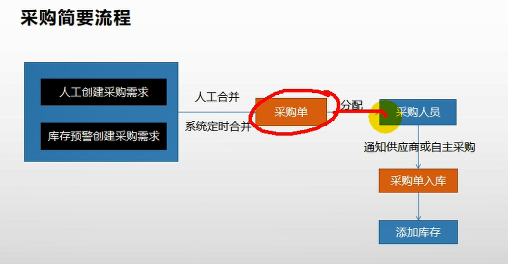


领取采购单

http://localhost:88/api/ware/purchase/received

（1）某个人领取了采购单后，先看采购单是否处于未分配状态，只有采购单是新建或以领取状态时，才更新采购单的状态

（2）

【1】仓库列表功能： https://easydoc.xyz/doc/75716633/ZUqEdvA4/mZgdqOWe 

【2】查询商品库存： https://easydoc.xyz/doc/75716633/ZUqEdvA4/hwXrEXBZ 

【3】查询采购需求： https://easydoc.xyz/doc/75716633/ZUqEdvA4/Ss4zsV7R 

【4】 合并采购需求：https://easydoc.xyz/doc/75716633/ZUqEdvA4/cUlv9QvK 

【5】查询未领取的采购单： https://easydoc.xyz/doc/75716633/ZUqEdvA4/hI12DNrH 

【6】领取采购单： https://easydoc.xyz/doc/75716633/ZUqEdvA4/vXMBBgw1 


完成采购，在完成采购过程中，需要涉及到设置SKU的name信息到仓库中，这是通过远程调用“gulimall-product”来实现根据sku_id查询得到sku_name的，如果这个过程发生了异常，事务不想要回滚，目前采用的方式是通过捕获异常的方式，防止事务回滚，是否还有其他的方式呢？这个问题留待以后解决。

```java
 @Override
    public void addStock(Long skuId, Long wareId, Integer skuNum) {

        List<WareSkuEntity> wareSkuEntities = wareSkuDao.selectList(new QueryWrapper<WareSkuEntity>().eq("sku_id", skuId).eq("ware_id", wareId));

        if(wareSkuEntities == null || wareSkuEntities.size() ==0 ){
             //新增
            WareSkuEntity wareSkuEntity = new WareSkuEntity();
            wareSkuEntity.setSkuId(skuId);
            wareSkuEntity.setWareId(wareId);
            wareSkuEntity.setStock(skuNum);
            wareSkuEntity.setStockLocked(0);

            //远程查询SKU的name，若失败无需回滚
            try {
                R info = productFeignService.info(skuId);
                if(info.getCode() == 0){
                    Map<String,Object> data=(Map<String,Object>)info.get("skuInfo");
                    wareSkuEntity.setSkuName((String) data.get("skuName"));
                }
            } catch (Exception e) {

            }

            wareSkuDao.insert(wareSkuEntity);
        }else{
            //插入
            wareSkuDao.addStock(skuId,wareId,skuNum);
        }

    }
```


## 2. 获取spu规格

在SPU管理页面，获取商品规格的时候，出现400异常，浏览器显示跳转不了

问题现象：


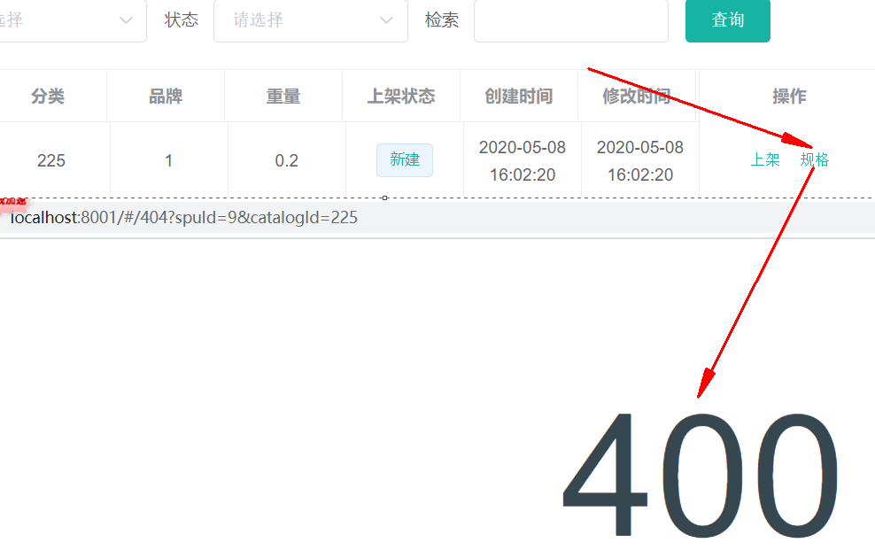

出现问题的代码：

```javascript
    attrUpdateShow(row) {
      console.log(row);
      this.$router.push({
        path: "/product-attrupdate",
        query: { spuId: row.id, catalogId: row.catalogId }
      });
    },
```


暂时不知道如何解决问题。只能留待以后解决。

经过测试发现，问题和上面的代码没有关系，问题出现在“attrupdate.vue”上，该vue页面无法通过浏览器访问，当输入访问URL（ http://localhost:8001/#/product-attrupdate ）的时候，就会出现404，而其他的请求则不会出现这种情况，不知为何。

通过POSTMAN进行请求的时候，能够请求到数据。


经过分析发现，是因为在数据库中没有该页面的导航所导致的，为了修正这个问题，可以在“sys-menu”表中添加一行，内容位：

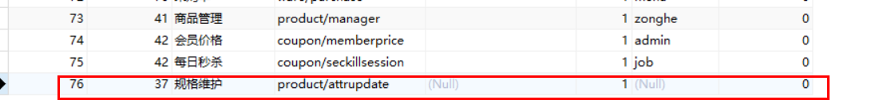

这样当再次访问的时候，在“平台属性”下，会出现“规格维护”菜单，

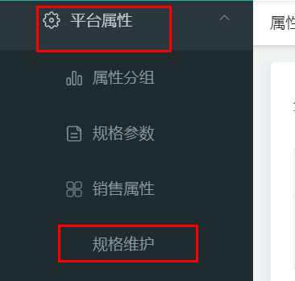

当再次点击“规格”的时候，显示出菜单

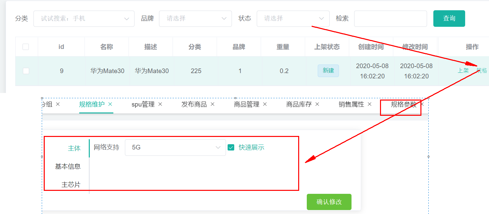

不过这种菜单并不符合我们的需要，我们需要让它以弹出框的形式出现。


## 3. 修改商品规格

API： https://easydoc.xyz/doc/75716633/ZUqEdvA4/GhnJ0L85 

URL：/product/attr/update/{spuId}


## 4.小结：

### 1.  在open fen中会将调用的数据转换为JSON，接收方接收后，将JSON转换为对象，此时调用方和被调用方的处理JSON的对象不一定都是同一个类，只要它们的字段类型吻合即可。

调用方：

```java
@FeignClient(value = "gulimall-coupon")
public interface CouponFenService {

    @PostMapping("/coupon/spubounds/save")
    R saveSpuBounds(@RequestBody SpuBoundTo spuBoundTo);

    @PostMapping("/coupon/skufullreduction/saveInfo")
    R saveSkuReduction(@RequestBody SkuReductionTo skuReductionTo);
}
```

被调用方：

```java
    @PostMapping("/save")
    public R save(@RequestBody SpuBoundsEntity spuBounds){
		spuBoundsService.save(spuBounds);

        return R.ok();
    }

    @PostMapping("/saveInfo")
    public R saveInfo(@RequestBody SkuReductionTo skuReductionTo){
        skuFullReductionService.saveSkuReduction(skuReductionTo);
        return R.ok();
    }
```

调用方JSON化时的对象SpuBoundTo：

```
@Data
public class SpuBoundTo {
    private Long spuId;
    private BigDecimal buyBounds;
    private BigDecimal growBounds;
}
```

被调用方JSON数据对象化时的对象SpuBoundsEntity：

```java
/**
 * 商品spu积分设置
 * 
 * @author cosmoswong
 * @email cosmoswong@sina.com
 * @date 2020-04-23 23:38:48
 */
@Data
@TableName("sms_spu_bounds")
public class SpuBoundsEntity implements Serializable {
	private static final long serialVersionUID = 1L;

	/**
	 * id
	 */
	@TableId
	private Long id;
	/**
	 * 
	 */
	private Long spuId;
	/**
	 * 成长积分
	 */
	private BigDecimal growBounds;
	/**
	 * 购物积分
	 */
	private BigDecimal buyBounds;
	/**
	 * 优惠生效情况[1111（四个状态位，从右到左）;0 - 无优惠，成长积分是否赠送;1 - 无优惠，购物积分是否赠送;2 - 有优惠，成长积分是否赠送;3 - 有优惠，购物积分是否赠送【状态位0：不赠送，1：赠送】]
	 */
	private Integer work;

}
```

### 2. 事务究竟要如何加上？

存在Batch操作的时候，才需要加上事务，单个操作无需添加事务控制。

SpringBoot中的是事务

批量操作的时候，才需要事务

一个事务标注的方法上，方法内存在这些操作：

（1）批量更新一个表中字段

（2）更新多张表中的操作

实际上不论是哪种类型，方法中所有对于数据库的写操作，都会被整体当做一个事务，在这个事务过程中，如果某个操作出现了异常，则整体都不会被提交。这就是对于SpringBoot中的@Transactional的理解。

@EnableTransactionManagement和@Transactional的区别？

 https://blog.csdn.net/abysscarry/article/details/80189232 
 https://blog.csdn.net/Driver_tu/article/details/99679145 

 https://www.cnblogs.com/leaveast/p/11765503.html 

## 5.其他

### 1. 文档参考地址

 [http://www.jayh.club/#/02.PassJava%E6%9E%B6%E6%9E%84%E7%AF%87/01.%E5%88%9B%E5%BB%BA%E9%A1%B9%E7%9B%AE%E5%92%8C%E6%B7%BB%E5%8A%A0%E6%A8%A1%E5%9D%97](http://www.jayh.club/#/02.PassJava架构篇/01.创建项目和添加模块) 


 https://blog.csdn.net/ok_wolf/article/details/105400748 

<https://www.cnblogs.com/javalbb/p/12690862.html>

 https://blog.csdn.net/ok_wolf/article/details/105456170 

 https://easydoc.xyz/doc/75716633/ZUqEdvA4/jCFganpf 

### 2. 开机启动docker

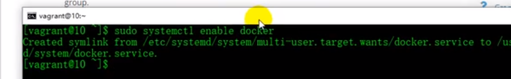


在Docker中设置开机启动容器


```shell
#查看防火墙状态
[root@hadoop-104 module]# systemctl status firewalld
  firewalld.service - firewalld - dynamic firewall daemon
   Loaded: loaded (/usr/lib/systemd/system/firewalld.service; enabled; vendor preset: enabled)
   Active: active (running) since Wed 2020-04-22 21:26:23 EDT; 10min ago
     Docs: man:firewalld(1)
 Main PID: 5947 (firewalld)
   CGroup: /system.slice/firewalld.service
           └─5947 /usr/bin/python -Es /usr/sbin/firewalld --nofork --nopid

Apr 22 21:26:20 hadoop-104 systemd[1]: Starting firewalld - dynamic firewall daemon...
Apr 22 21:26:23 hadoop-104 systemd[1]: Started firewalld - dynamic firewall daemon.
#查看防火墙是否是开机启动
[root@hadoop-104 module]# systemctl list-unit-files|grep firewalld
firewalld.service                             enabled 
#关闭开机启动防火墙
[root@hadoop-104 module]# systemctl disable firewalld             
Removed symlink /etc/systemd/system/multi-user.target.wants/firewalld.service.
Removed symlink /etc/systemd/system/dbus-org.fedoraproject.FirewallD1.service.
#停止防火墙
[root@hadoop-104 module]# systemctl stop firewalld         
#再次查看防火墙
[root@hadoop-104 module]# systemctl list-unit-files|grep firewalld
firewalld.service                             disabled
[root@hadoop-104 module]# 
```


### 3. 查看命令的安装位置

whereis mysql：查看mysql的安装位置

### 4. vscode中生成代码片段

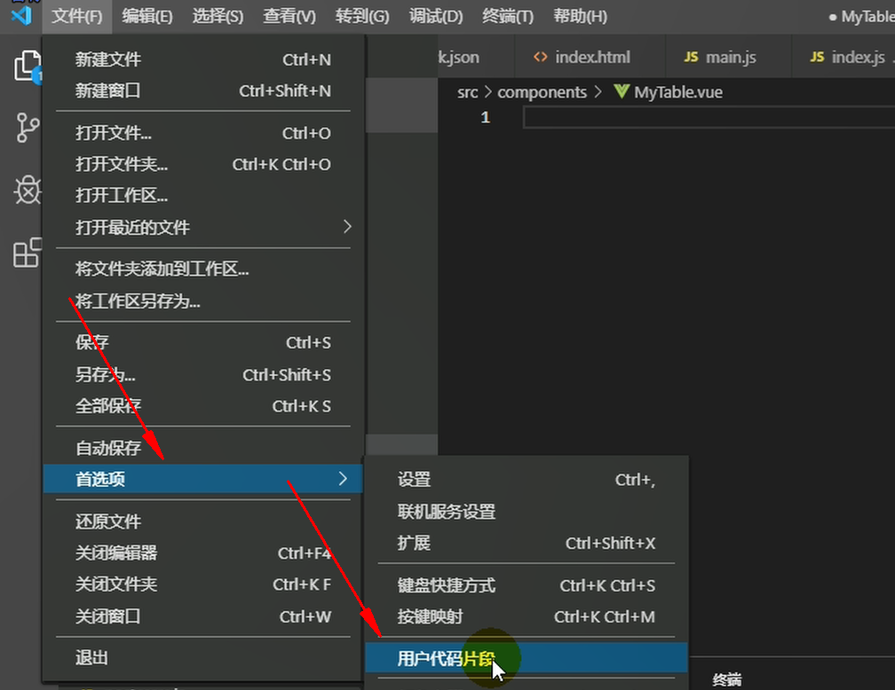

新建一个全局的代码片段，名字为vue，然后回车：

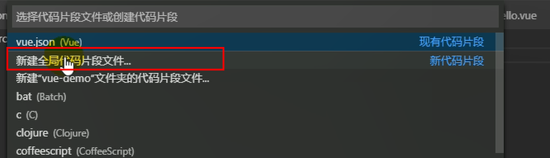

将下面的代码片段粘贴到“vue.code-snippets”

```json
{
    // Place your 全局 snippets here. Each snippet is defined under a snippet name and has a scope, prefix, body and 
    // description. Add comma separated ids of the languages where the snippet is applicable in the scope field. If scope 
    // is left empty or omitted, the snippet gets applied to all languages. The prefix is what is 
    // used to trigger the snippet and the body will be expanded and inserted. Possible variables are: 
    // $1, $2 for tab stops, $0 for the final cursor position, and ${1:label}, ${2:another} for placeholders. 
    // Placeholders with the same ids are connected.
    // Example:
    // "Print to console": {
    // 	"scope": "javascript,typescript",
    // 	"prefix": "log",
    // 	"body": [
    // 		"console.log('$1');",
    // 		"$2"
    // 	],
    // 	"description": "Log output to console"
    // }
    "生成vue模板": {
        "prefix": "vue",
        "body": [
            "<!-- $1 -->",
            "<template>",
            "<div class='$2'>$5</div>",
            "</template>",
            "",
            "<script>",
            "//这里可以导入其他文件（比如：组件，工具js，第三方插件js，json文件，图片文件等等）",
            "//例如：import 《组件名称》 from '《组件路径》';",
            "",
            "export default {",
            "//import引入的组件需要注入到对象中才能使用",
            "components: {},",
            "data() {",
            "//这里存放数据",
            "return {",
            "",
            "};",
            "},",
            "//监听属性 类似于data概念",
            "computed: {},",
            "//监控data中的数据变化",
            "watch: {},",
            "//方法集合",
            "methods: {",
            "",
            "},",
            "//生命周期 - 创建完成（可以访问当前this实例）",
            "created() {",
            "",
            "},",
            "//生命周期 - 挂载完成（可以访问DOM元素）",
            "mounted() {",
            "",
            "},",
            "beforeCreate() {}, //生命周期 - 创建之前",
            "beforeMount() {}, //生命周期 - 挂载之前",
            "beforeUpdate() {}, //生命周期 - 更新之前",
            "updated() {}, //生命周期 - 更新之后",
            "beforeDestroy() {}, //生命周期 - 销毁之前",
            "destroyed() {}, //生命周期 - 销毁完成",
            "activated() {}, //如果页面有keep-alive缓存功能，这个函数会触发",
            "}",
            "</script>",
            "<style lang='scss' scoped>",
            "//@import url($3); 引入公共css类",
            "$4",
            "</style>"
        ],
        "description": "生成VUE模板"
    },
    "http-get请求": {
        "prefix": "httpget",
        "body": [
            "this.\\$http({",
            "url: this.\\$http.adornUrl(''),",
            "method: 'get',",
            "params: this.\\$http.adornParams({})",
            "}).then(({ data }) => {",
            "})"
        ],
        "description": "httpGET请求"
    },
    "http-post请求": {
        "prefix": "httppost",
        "body": [
            "this.\\$http({",
            "url: this.\\$http.adornUrl(''),",
            "method: 'post',",
            "data: this.\\$http.adornData(data, false)",
            "}).then(({ data }) => { });"
        ],
        "description": "httpPOST请求"
    }
}
```

更多详细说明见： https://blog.csdn.net/z772330927/article/details/105730430/ 

### 5. vscode快捷键

ctrl+shift+f 全局搜索

alt+shift+f 格式化代码

### 6.  关闭eslint的语法检查

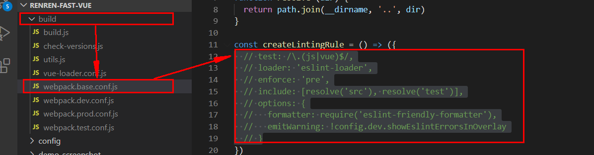


```json

```


### 7. 安装mybatisx插件

在Marketplace中搜索“mybatisx”，安装后重启IDEA，使用时会自动在@Mapper标注的接口上，产生小图标，然后alt+enter，generate statement，就会自动的在xml文件中生成SQL。

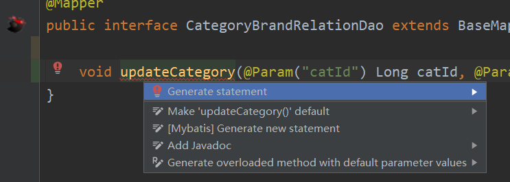


### 8. mysql的批量删除

```sql
DELETE FROM  `pms_attr_attrgroup_relation` WHERE (attr_id= ? AND attr_group_id ) OR (attr_id= ? AND attr_group_id )
```


### 9. String.join

```java
java.lang.String @NotNull 
public static String join(@NotNull CharSequence delimiter,
                          @NotNull Iterable<? extends CharSequence> elements)
```

Returns a new String composed of copies of the CharSequence elements joined together with a copy of the specified delimiter.

 返回一个由CharSequence元素的副本和指定分隔符的副本组成的新字符串。 

For example,

     List<String> strings = new LinkedList<>();
     strings.add("Java");strings.add("is");
     strings.add("cool");
     String message = String.join(" ", strings);
     //message returned is: "Java is cool"
    
     Set<String> strings = new LinkedHashSet<>();
     strings.add("Java"); strings.add("is");
     strings.add("very"); strings.add("cool");
     String message = String.join("-", strings);
     //message returned is: "Java-is-very-cool"

Note that if an individual element is null, then "null" is added.

 注意，如果单个元素为null，则添加“null”。 

Params:
delimiter – a sequence of characters that is used to separate each of the elements in the resulting String
               用于分隔结果字符串中的每个元素的字符序列 

elements – an Iterable that will have its elements joined together.
                  将其元素连接在一起的可迭代的。 

Returns:
a new String that is composed from the elements argument
 由elements参数组成的新字符串 


Throws:
NullPointerException – If delimiter or elements is null


```java
    public static String join(CharSequence delimiter,
            Iterable<? extends CharSequence> elements) {
        Objects.requireNonNull(delimiter);
        Objects.requireNonNull(elements);
        StringJoiner joiner = new StringJoiner(delimiter);
        for (CharSequence cs: elements) {
            joiner.add(cs);
        }
        return joiner.toString();
    }
```

能够看到实际上它就是通过创建StringJoiner，然后遍历elements，加入每个元素来完成的。

StringJoiner

```java
java.util public final class StringJoiner
extends Object
```

StringJoiner is used to construct a sequence of characters separated by a delimiter and optionally starting with a supplied prefix and ending with a supplied suffix.
 tringJoiner用于构造由分隔符分隔的字符序列，可以选择以提供的前缀开始，以提供的后缀结束。 

Prior to adding something to the StringJoiner, its sj.toString() method will, by default, return prefix + suffix. However, if the setEmptyValue method is called, the emptyValue supplied will be returned instead. This can be used, for example, when creating a string using set notation to indicate an empty set, i.e. "{}", where the prefix is "{", the suffix is "}" and nothing has been added to the StringJoiner.
 在向StringJoiner添加内容之前，它的sj.toString()方法在默认情况下会返回前缀+后缀。但是，如果调用setEmptyValue方法，则返回所提供的emptyValue。例如，当使用set符号创建一个字符串来表示一个空集时，可以使用这种方法。“{}”，其中前缀是“{”，后缀是“}”，没有向StringJoiner添加任何内容。 


apiNote:
The String "[George:Sally:Fred]" may be constructed as follows:

```java
 StringJoiner sj = new StringJoiner(":", "[", "]");
 sj.add("George").add("Sally").add("Fred");
 String desiredString = sj.toString();
```

A StringJoiner may be employed to create formatted output from a java.util.stream.Stream using java.util.stream.Collectors.joining(CharSequence). For example:
 使用StringJoiner从java.util.stream创建格式化输出流，使用java.util.stream.Collectors.joining (CharSequence进行)。例如: 

```
 List<Integer> numbers = Arrays.asList(1, 2, 3, 4);
 String commaSeparatedNumbers = numbers.stream()
     .map(i -> i.toString())
     .collect(Collectors.joining(", "));
```


通过分析源码发现，在“”内部维护了一个StringBuilder，所有加入到它内部的元素都会先拼接上分割符，然后再拼接上加入的元素

```java
 public StringJoiner add(CharSequence newElement) {
        prepareBuilder().append(newElement);
        return this;
 }
```


```java
   private StringBuilder prepareBuilder() {
        if (value != null) {
            value.append(delimiter);
        } else {
            value = new StringBuilder().append(prefix);
        }
        return value;
    }
```

### 10. 在Service中微服务比较多的时候，可以配置将一些微服务放置到compound中，组成一个小组

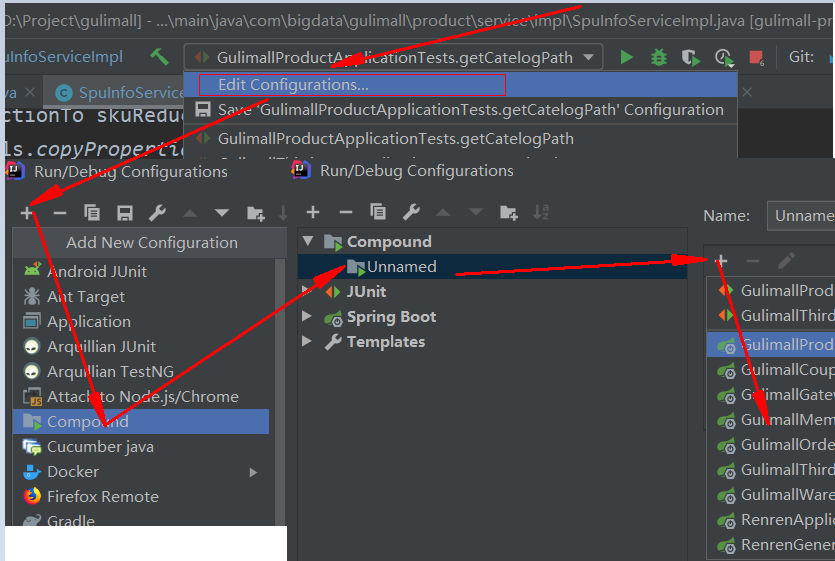

以后再运行时，直接选择这个compound即可很方便的运行或停止一组微服务：

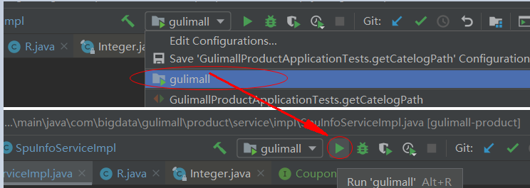

另外可以单独为每个微服务，设置需要的运行时最大堆内存大小：

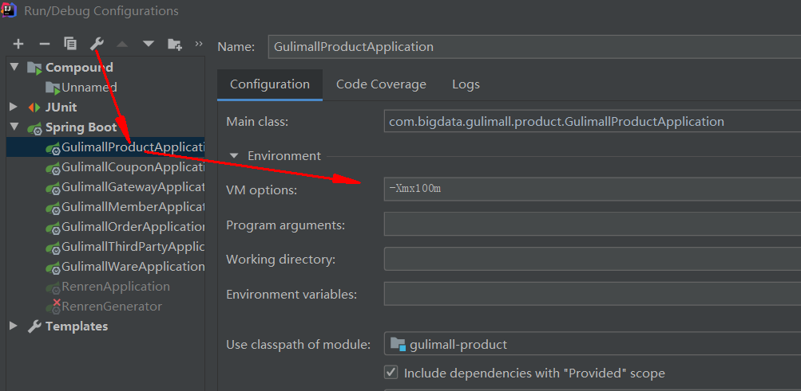


### 11. mysql的dateTime和timestamp的区别？

[MySQL中datetime和timestamp的区别及使用](https://www.cnblogs.com/mxwz/p/7520309.html)

**TIMESTAMP和DATETIME的相同点：**

1> 两者都可用来表示YYYY-MM-DD HH:MM:SS[.fraction]类型的日期。

**TIMESTAMP和DATETIME的不同点：**

1> 两者的存储方式不一样

对于TIMESTAMP，它把客户端插入的时间从当前时区转化为UTC（世界标准时间）进行存储。查询时，将其又转化为客户端当前时区进行返回。

而对于DATETIME，不做任何改变，基本上是原样输入和输出。

2> 两者所能存储的时间范围不一样

timestamp所能存储的时间范围为：'1970-01-01 00:00:01.000000' 到 '2038-01-19 03:14:07.999999'。

datetime所能存储的时间范围为：'1000-01-01 00:00:00.000000' 到 '9999-12-31 23:59:59.999999'。

总结：TIMESTAMP和DATETIME除了存储范围和存储方式不一样，没有太大区别。当然，对于跨时区的业务，TIMESTAMP更为合适。

 https://www.cnblogs.com/Jashinck/p/10472398.html 

### 12. SpringBoot中的事务

 https://blog.csdn.net/Z__Sheng/article/details/89489053 

### 13. IDEA RESTFUll clinet

[IntelliJ IDEA 使用 rest client](https://blog.csdn.net/qq_37502106/article/details/103183492)

### 

## 6.FAQ

### 1. TypeError: _vm.previewHandle is not a function
