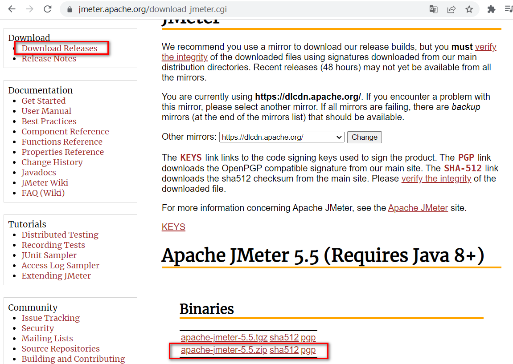
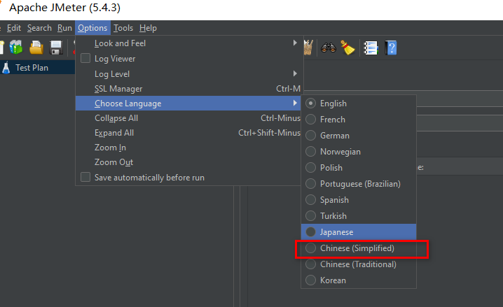
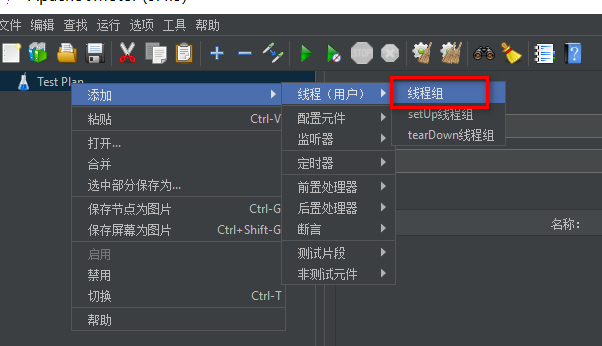
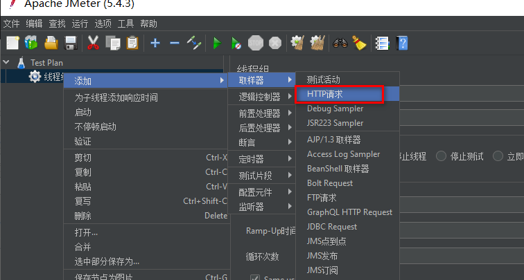
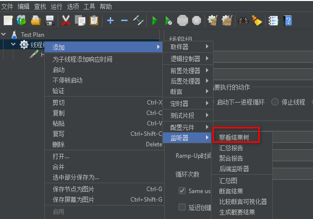
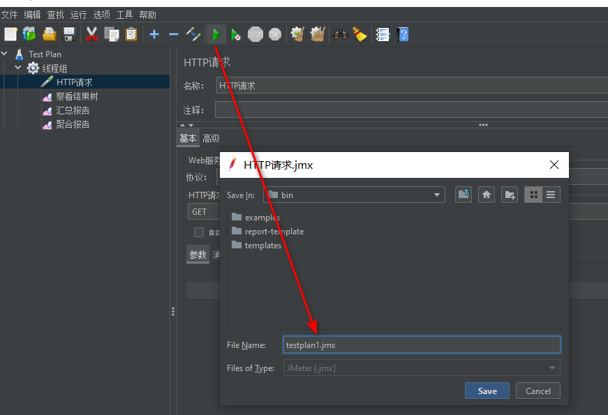
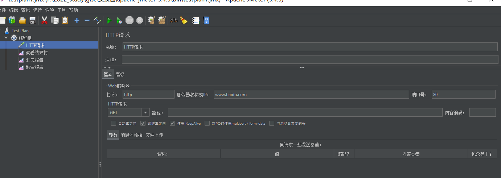
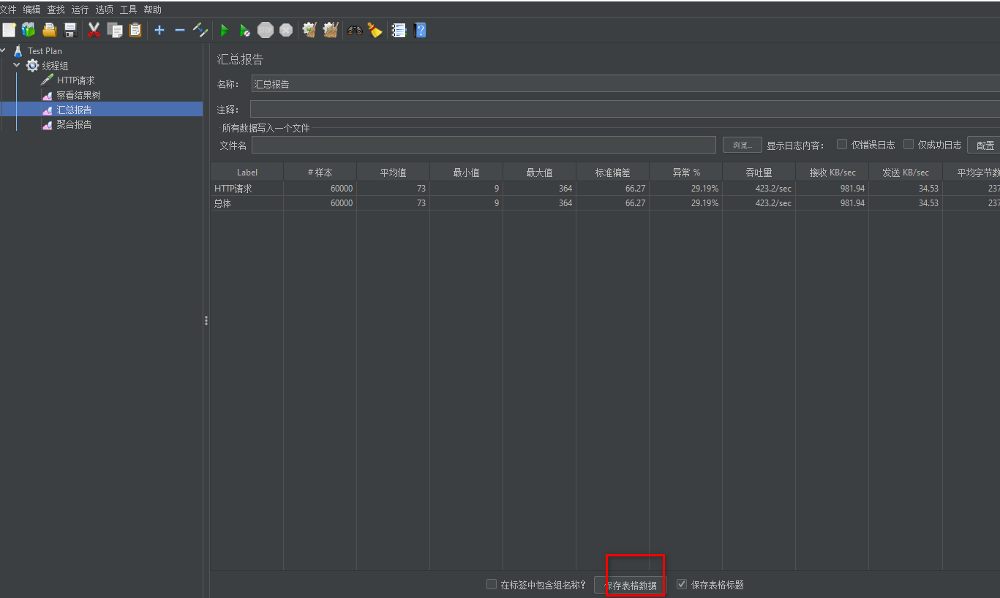
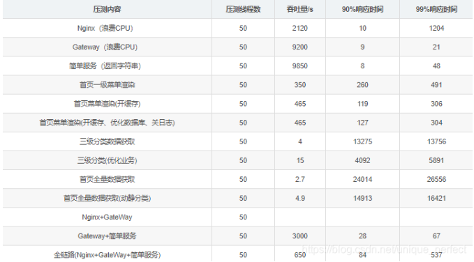

# 1. 压力测试

[[toc]]

## 1、Jmeter

1.下载解压

```sh
https://jmeter.apache.org/download_jmeter.cgi
```



2.启动

点击bin文件夹下的jmeter.bat

3.改成中文显示



4.添加线程组



5.添加取样器



6.添加监听器(可以选择不同的监听器，用来展示不同的结果，通常使用前三个)



7.保存



8.向baidu发送请求



9.分析请求结果，并且可以保存结果



## 2.jconsole与jvisualvm

Jdk 的两个小工具 jconsole、jvisualvm（升级版的 jconsole）;通过命令行启动，可监控本地和

远程应用。远程应用需要配置

## 3.优化

 SQL耗时越小越好，

一般情况下微秒级别 命中率越高越好，

一般情况下不能低于95% 锁等待次数越低越好，

等待时间越短越好 中间件越多，

性能损失越大，大多都损失在网络交互了



## 4.Nginx动静分离

由于动态资源和静态资源目前都处于服务端，所以为了减轻服务器压力，我们将
js、css、img等静态资源放置在Nginx端，以减轻服务器压力

静态文件上传到 mydata/nginx/html/static/index/css，这种格式

修改index.html的静态资源路径，加上static前缀src="/static/index/img/img_09.png"

修改/mydata/nginx/conf/conf.d/gulimall.conf

如果遇到有/static为前缀的请求，转发至html文件夹

```sh
location /static {
	#这里配置的是docker里面的nginx的路径
     root   /usr/share/nginx/html;
 }


 location / {
     proxy_pass http://gulimall;
	proxy_set_header Host $host;
 }
```

## 5.优化三级分类

优化前 对二级菜单的每次遍历都需要查询数据库，浪费大量资源 

优化后 仅查询一次数据库，剩下的数据通过遍历得到并封装  //优化业务逻辑，仅查询一次数据库

```sh
 List<CategoryEntity> categoryEntities = this.list();
        //查出所有一级分类
        List<CategoryEntity> level1Categories = getCategoryByParentCid(categoryEntities, 0L);
        Map<String, List<Catalog2Vo>> listMap = level1Categories.stream().collect(Collectors.toMap(k->k.getCatId().toString(), v -> {
            //遍历查找出二级分类
            List<CategoryEntity> level2Categories = getCategoryByParentCid(categoryEntities, v.getCatId());
            List<Catalog2Vo> catalog2Vos=null;
            if (level2Categories!=null){
                //封装二级分类到vo并且查出其中的三级分类
                catalog2Vos = level2Categories.stream().map(cat -> {
                    //遍历查出三级分类并封装
                    List<CategoryEntity> level3Catagories = getCategoryByParentCid(categoryEntities, cat.getCatId());
                    List<Catalog2Vo.Catalog3Vo> catalog3Vos = null;
                    if (level3Catagories != null) {
                        catalog3Vos = level3Catagories.stream()
                                .map(level3 -> new Catalog2Vo.Catalog3Vo(level3.getParentCid().toString(), level3.getCatId().toString(), level3.getName()))
                                .collect(Collectors.toList());
                    }
                    Catalog2Vo catalog2Vo = new Catalog2Vo(v.getCatId().toString(), cat.getCatId().toString(), cat.getName(), catalog3Vos);
                    return catalog2Vo;
                }).collect(Collectors.toList());
            }
            return catalog2Vos;
        }));
        return listMap;
```

