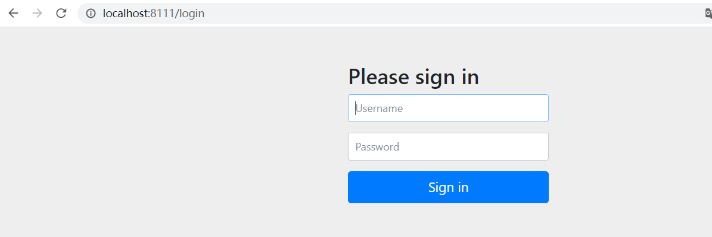

# 1.SpringSecurity 入门案例

[学习视频地址](https://www.bilibili.com/video/BV1mm4y1X7Hc?p=1)

[[toc]]

## 2.创建SpringBoot工程

## 3.引入依赖

pom.xml

```xml
<?xml version="1.0" encoding="UTF-8"?>
<project xmlns="http://maven.apache.org/POM/4.0.0" xmlns:xsi="http://www.w3.org/2001/XMLSchema-instance"
         xsi:schemaLocation="http://maven.apache.org/POM/4.0.0 https://maven.apache.org/xsd/maven-4.0.0.xsd">
    <modelVersion>4.0.0</modelVersion>
    <parent>
        <groupId>org.springframework.boot</groupId>
        <artifactId>spring-boot-starter-parent</artifactId>
        <version>2.2.1.RELEASE</version>
        <relativePath/> <!-- lookup parent from repository -->
    </parent>
    <groupId>com.atguigu</groupId>
    <artifactId>securitydemo1</artifactId>
    <version>0.0.1-SNAPSHOT</version>
    <name>securitydemo1</name>
    <description>Demo project for Spring Boot</description>

    <properties>
        <java.version>1.8</java.version>
    </properties>

    <dependencies>
        <dependency>
            <groupId>org.springframework.boot</groupId>
            <artifactId>spring-boot-starter-web</artifactId>
        </dependency>

        <dependency>
            <groupId>org.springframework.boot</groupId>
            <artifactId>spring-boot-starter-security</artifactId>
        </dependency>

        <dependency>
            <groupId>org.springframework.boot</groupId>
            <artifactId>spring-boot-starter-test</artifactId>
            <scope>test</scope>
        </dependency>

    </dependencies>

    <build>
        <plugins>
            <plugin>
                <groupId>org.springframework.boot</groupId>
                <artifactId>spring-boot-maven-plugin</artifactId>
            </plugin>
        </plugins>
    </build>

</project>
```

## 4.编写Controller

```java
@RestController
@RequestMapping("/test")
public class TestController {

    @GetMapping("/hello")
    public String add(){
        return "Hello,security";
    }

}
```

## 5.修改application.properties

```properties
#修改端号为8111
server.port=8111 
```

## 6.启动测试

访问地址: http://localhost:8111/test/hello



> 访问我们发现，弹出来了一个登录框

+ SpringSecurity默认用户名为user
+ 默认密码打印在控制台

```java
Using generated security password: feff9064-d839-4c90-a305-d87a1d3cc6fc
```

+ 点击登录，访问成功

