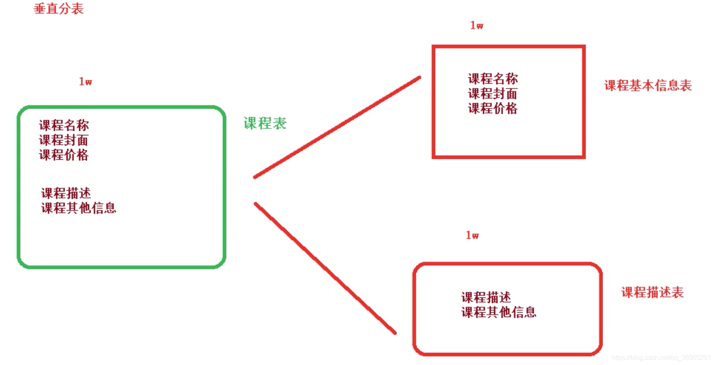
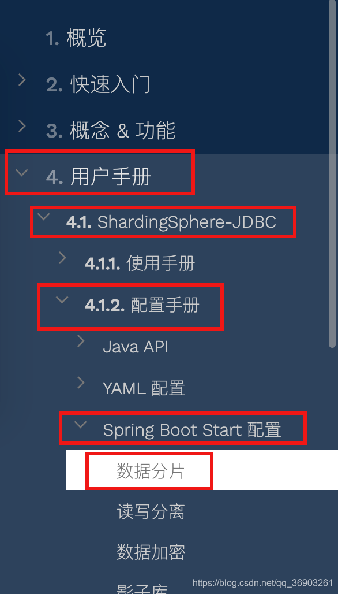
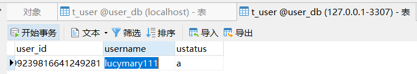

[[toc]]
## 1.基本概念

## 1.1.ShardingSphere简介

Sharding-Sphere官网：http://shardingsphere.apache.org/index_zh.html


## 1.2.什么是ShardingSphere?

1. 一套开源的分布式数据库中间件解决方案。
2. 有三个产品，Sharding-JDBC、Sharding-Proxy 和 Sharding-Sidecar。
3. ShardingSphere 定位为关系型数据库中间件，合理地在分布式环境下使用关系型数据库操作。

## 1.3.什么是分库分表？

数据据库数据量是不可控的，随着时间和业务发展，造成表里面数据越来越多，如果再去对数据库表curd操作时，就会有性能问题。
解决办法：

- 方案1：从硬件上
- 方案2：分库分表

*为了解决由于数据量过大而造成数据库性能降低问题。*


## 1.4.分库分表的方式

分库分表有两种方式：垂直切分和水平切分。

垂直切分：垂直分表和垂直分库
水平切分：水平分表和水平分库
垂直拆字段，水平拆记录。
垂直切分的库和表结构是不同的，而水平切分的库和表是相同的。

### 1.4.1.垂直分表

操作数据库中某张表，把这张表中一部分字段数据存到一张新表里面，再把这张表另部分字段数据存到另外一张表里面。
垂直拆分成的两张表，每张表的数据量和原先的表的数据量相同。





### 1.4.2.垂直分库

把单一数据库按照业务进行划分，专库专表。


### 1.4.3.水平分库


### 1.4.4.水平分表


### 1.4.5.分库分表的应用和问题

**应用**
在数据库设计时候就要考虑垂直分库和垂直分表。
随着数据库数据量增加，不要马上考虑做水平切分。首先考虑缓存处理，读写分离，使用索引等等方式。如果这些方式不能根本解决问题了，再考虑做水平分库和水平分表。
**分库分表问题**
跨节点连接查询问题(分页、排序)。
多数据源管理问题。

## 2.Sharding-JDBC 分库分表操作

## 2.1.ShardingSphere-JDBC 简介


Sharding-JDBC的功能：主要做`数据分片`和`读写分离`，不是做分库分表，分库分表由我们自己做。
主要的目的：`简化分库分表后数据的相关操作`。

## 2.2.Sharding-JDBC 实现水平分表

### 2.2.1.搭建环境

技术：SpringBoot2.2.1 + MybatisPlus + Sharding-JDBC + Druid连接池

`1.创建项目`


`2.修改pom.xml文件`

```xml
<?xml version="1.0" encoding="UTF-8"?>
<project xmlns="http://maven.apache.org/POM/4.0.0" xmlns:xsi="http://www.w3.org/2001/XMLSchema-instance"
         xsi:schemaLocation="http://maven.apache.org/POM/4.0.0 https://maven.apache.org/xsd/maven-4.0.0.xsd">
    <modelVersion>4.0.0</modelVersion>
    <parent>
        <groupId>org.springframework.boot</groupId>
        <artifactId>spring-boot-starter-parent</artifactId>
        <version>2.2.5.RELEASE</version>
        <relativePath/> <!-- lookup parent from repository -->
    </parent>
    <groupId>com.atguigu</groupId>
    <artifactId>shardingjdbcdemo</artifactId>
    <version>0.0.1-SNAPSHOT</version>
    <name>shardingjdbcdemo</name>
    <description>Demo project for Spring Boot</description>

    <properties>
        <java.version>1.8</java.version>
    </properties>

    <dependencies>
        <dependency>
            <groupId>org.springframework.boot</groupId>
            <artifactId>spring-boot-starter</artifactId>
        </dependency>

        <dependency>
            <groupId>org.springframework.boot</groupId>
            <artifactId>spring-boot-starter-test</artifactId>
        </dependency>

        <dependency>
            <groupId>com.alibaba</groupId>
            <artifactId>druid-spring-boot-starter</artifactId>
            <version>1.1.20</version>
        </dependency>
        <dependency>
            <groupId>mysql</groupId>
            <artifactId>mysql-connector-java</artifactId>
        </dependency>
        <dependency>
            <groupId>org.apache.shardingsphere</groupId>
            <artifactId>sharding-jdbc-spring-boot-starter</artifactId>
            <version>4.0.0-RC1</version>
        </dependency>
        <dependency>
            <groupId>com.baomidou</groupId>
            <artifactId>mybatis-plus-boot-starter</artifactId>
            <version>3.0.5</version>
        </dependency>

        <dependency>
            <groupId>org.projectlombok</groupId>
            <artifactId>lombok</artifactId>
        </dependency>
    </dependencies>

    <build>
        <plugins>
            <plugin>
                <groupId>org.springframework.boot</groupId>
                <artifactId>spring-boot-maven-plugin</artifactId>
            </plugin>
        </plugins>
    </build>

</project>

```

### 2.2.2.创建数据库、数据表

按照水平分表的方式创建数据库、数据表

1. 创建数据库 course_db。

2. 在数据库中创建两张表 course_1 和 course_2。

3. 数据存放约定规则：添加的数据id为偶数放` course_1` 表中，id为奇数放` course_2` 表中。

   ```xml
   create database course_db;
   
   use course_db;
   
   create table course_1 (
   	`cid` bigint(20) primary key,
   	`cname` varchar(50) not null,
   	`user_id` bigint(20) not null,
   	`cstatus` varchar(10) not null
   );
   
   create table course_2 (
   	`cid` bigint(20) primary key,
   	`cname` varchar(50) not null,
   	`user_id` bigint(20) not null,
   	`cstatus` varchar(10) not null
   );
   ```

### 2.2.3.编写代码

1.在shardingjdbcdemo包下创建 entity.Course 实体类

```java
@Data
public class Course {
    private Long cid;
    private String cname;
    private Long userId;
    private String cstatus;
}
```

2.创建mapper.CourseMapper 接口

```java
@Repository
public interface CourseMapper extends BaseMapper<Course> {}
```

3.在启动类上加上`@MapperScan("com.angenin.shardingjdbcdemo.mapper")`注解

### 2.2.4.配置水平分表策略

官网数据分片配置：

https://shardingsphere.apache.org/document/current/cn/user-manual/shardingsphere-jdbc/



(1)**在 application.properties 配置文件中配置**

```xml
# shardingjdbc 水平分表策略
# 配置数据源，给数据源起别名
spring.shardingsphere.datasource.names=m1

# 一个实体类对应两张表，覆盖
spring.main.allow-bean-definition-overriding=true

# 配置数据源的具体内容，包含连接池，驱动，地址，用户名，密码
spring.shardingsphere.datasource.m1.type=com.alibaba.druid.pool.DruidDataSource
spring.shardingsphere.datasource.m1.driver-class-name=com.mysql.cj.jdbc.Driver
spring.shardingsphere.datasource.m1.url=jdbc:mysql://localhost:3306/course_db?serverTimezone=GMT%2B8
spring.shardingsphere.datasource.m1.username=root
spring.shardingsphere.datasource.m1.password=123456

# 指定course表分布的情况，配置表在哪个数据库里，表的名称都是什么 m1.course_1,m1.course_2
spring.shardingsphere.sharding.tables.course.actual-data-nodes=m1.course_$->{1..2}

# 指定 course 表里面主键 cid 的生成策略 SNOWFLAKE
spring.shardingsphere.sharding.tables.course.key-generator.column=cid
spring.shardingsphere.sharding.tables.course.key-generator.type=SNOWFLAKE

# 配置分表策略    约定 cid 值偶数添加到 course_1 表，如果 cid 是奇数添加到 course_2 表
spring.shardingsphere.sharding.tables.course.table-strategy.inline.shardingcolumn=cid
spring.shardingsphere.sharding.tables.course.table-strategy.inline.algorithmexpression=course_$->{cid % 2 + 1}

# 打开 sql 输出日志
spring.shardingsphere.props.sql.show=true
```

### 2.2.5.编写测试代码

在test包中的测试类中进行测试

```java
@RunWith(SpringRunner.class)
@SpringBootTest
public class ShardingjdbcdemoApplicationTests {

    @Autowired
    private CourseMapper courseMapper;

    //添加课程
    @Test
    public void addCourse(){
        Course course = new Course();
        //cid由我们设置的策略，雪花算法进行生成（至少70年内生成的id不会重复）
        course.setCname("java");
        course.setUserId(100L);
        course.setCstatus("Normal");

        courseMapper.insert(course);
    }
    
    //查询课程
    @Test
    public void findCourse(){
        QueryWrapper<Course> wrapper = new QueryWrapper<>();
        wrapper.eq("cid", 509755853058867201L);
        courseMapper.selectOne(wrapper);
    }
}
```

`1.addCourse方法执行结果：`


`2.findCourse方法执行结果：`


## 2.3.Sharding-JDBC 实现水平分库

### 2.3.1.需求分析


### 2.3.2.创建数据库，数据表

```xml
create database edu_db_1;
create database edu_db_2;

use edu_db_1;

create table course_1 (
	`cid` bigint(20) primary key,
	`cname` varchar(50) not null,
	`user_id` bigint(20) not null,
	`cstatus` varchar(10) not null
);

create table course_2 (
	`cid` bigint(20) primary key,
	`cname` varchar(50) not null,
	`user_id` bigint(20) not null,
	`cstatus` varchar(10) not null
);

use edu_db_2;

create table course_1 (
	`cid` bigint(20) primary key,
	`cname` varchar(50) not null,
	`user_id` bigint(20) not null,
	`cstatus` varchar(10) not null
);

create table course_2 (
	`cid` bigint(20) primary key,
	`cname` varchar(50) not null,
	`user_id` bigint(20) not null,
	`cstatus` varchar(10) not null
);
```

### 2.3.3.配置水平分库策略

```properties
# shardingjdbc 水平分库分表策略
# 配置数据源，给数据源起别名
# 水平分库需要配置多个数据库
spring.shardingsphere.datasource.names=m1,m2

# 一个实体类对应两张表，覆盖
spring.main.allow-bean-definition-overriding=true

# 配置第一个数据源的具体内容，包含连接池，驱动，地址，用户名，密码
spring.shardingsphere.datasource.m1.type=com.alibaba.druid.pool.DruidDataSource
spring.shardingsphere.datasource.m1.driver-class-name=com.mysql.cj.jdbc.Driver
spring.shardingsphere.datasource.m1.url=jdbc:mysql://localhost:3306/edu_db_1?serverTimezone=GMT%2B8
spring.shardingsphere.datasource.m1.username=root
spring.shardingsphere.datasource.m1.password=123456

# 配置第二个数据源的具体内容，包含连接池，驱动，地址，用户名，密码
spring.shardingsphere.datasource.m2.type=com.alibaba.druid.pool.DruidDataSource
spring.shardingsphere.datasource.m2.driver-class-name=com.mysql.cj.jdbc.Driver
spring.shardingsphere.datasource.m2.url=jdbc:mysql://localhost:3306/edu_db_2?serverTimezone=GMT%2B8
spring.shardingsphere.datasource.m2.username=root
spring.shardingsphere.datasource.m2.password=123456

# 指定数据库分布的情况和数据表分布的情况
# m1 m2   course_1 course_2
spring.shardingsphere.sharding.tables.course.actual-data-nodes=m$->{1..2}.course_$->{1..2}

# 指定 course 表里面主键 cid 的生成策略 SNOWFLAKE
spring.shardingsphere.sharding.tables.course.key-generator.column=cid
spring.shardingsphere.sharding.tables.course.key-generator.type=SNOWFLAKE

# 指定数据库分片策略    约定 user_id 值偶数添加到 m1 库，如果 user_id 是奇数添加到 m2 库
# 默认写法（所有的表的user_id）
#spring.shardingsphere.sharding.default-database-strategy.inline.sharding-column=user_id
#spring.shardingsphere.sharding.default-database-strategy.inline.algorithm-expression=m$->{user_id % 2 + 1}
# 指定只有course表的user_id
spring.shardingsphere.sharding.tables.course.database-strategy.inline.sharding-column=user_id
spring.shardingsphere.sharding.tables.course.database-strategy.inline.algorithm-expression=m$->{user_id % 2 + 1}

# 指定分表策略    约定 cid 值偶数添加到 course_1 表，如果 cid 是奇数添加到 course_2 表
spring.shardingsphere.sharding.tables.course.table-strategy.inline.sharding-column=cid
spring.shardingsphere.sharding.tables.course.table-strategy.inline.algorithm-expression=course_$->{cid % 2 + 1}

# 打开 sql 输出日志
spring.shardingsphere.props.sql.show=true
```

```java
	//添加课程
    @Test
    public void addCourseDb(){
        Course course = new Course();
        //cid由我们设置的策略，雪花算法进行生成（至少70年内生成的id不会重复）
        course.setCname("javademo");
        //分库根据user_id
        course.setUserId(100L);
        course.setCstatus("Normal");
        courseMapper.insert(course);

        course.setCname("javademo2");
        course.setUserId(111L);
        courseMapper.insert(course);
    }

    //查询课程
    @Test
    public void findCourseDb(){
        QueryWrapper<Course> wrapper = new QueryWrapper<>();
        //设置user_id的值
        wrapper.eq("user_id", 100L);
        //设置cid的值
        wrapper.eq("cid", 509771111076986881L);
        Course course = courseMapper.selectOne(wrapper);
        System.out.println(course);
    }
```

`1.addCourseDb方法执行结果：`


`2.findCourseDb方法执行结果：`


## 2.4.Sharding-JDBC 实现垂直分库(专库专表)

### 需求分析


需要查询用户信息的时候，不需要查到课程信息。

### 2.4.1.创建用户数据库、数据表

```sql
create database user_db;

use user_db;

create table t_user(
	`user_id` bigint(20) primary key,
	`username` varchar(100) not null,
	`ustatus` varchar(50) not null
);
```

### 2.4.2.编写User代码

创建user实体类和对应的mapper

```java
@Data
@TableName("t_user")    //指定对应的表名
public class User {
    private Long userId;
    private String username;
    private String ustatus;
}
```

```java
@Repository
public interface UserMapper extends BaseMapper<User> {}
```

### 2.4.3.配置垂直分库策略

```properties
# shardingjdbc 垂直分库策略
# 配置数据源，给数据源起别名
# 水平分库需要配置多个数据库
# m0为用户数据库
spring.shardingsphere.datasource.names=m1,m2,m0

# 一个实体类对应两张表，覆盖
spring.main.allow-bean-definition-overriding=true

# 配置第一个数据源的具体内容，包含连接池，驱动，地址，用户名，密码
spring.shardingsphere.datasource.m1.type=com.alibaba.druid.pool.DruidDataSource
spring.shardingsphere.datasource.m1.driver-class-name=com.mysql.cj.jdbc.Driver
spring.shardingsphere.datasource.m1.url=jdbc:mysql://localhost:3306/edu_db_1?serverTimezone=GMT%2B8
spring.shardingsphere.datasource.m1.username=root
spring.shardingsphere.datasource.m1.password=123456

# 配置第二个数据源的具体内容，包含连接池，驱动，地址，用户名，密码
spring.shardingsphere.datasource.m2.type=com.alibaba.druid.pool.DruidDataSource
spring.shardingsphere.datasource.m2.driver-class-name=com.mysql.cj.jdbc.Driver
spring.shardingsphere.datasource.m2.url=jdbc:mysql://localhost:3306/edu_db_2?serverTimezone=GMT%2B8
spring.shardingsphere.datasource.m2.username=root
spring.shardingsphere.datasource.m2.password=123456

#配置第三个数据源具体内容，包含连接池，驱动，地址，用户名和密码
spring.shardingsphere.datasource.m0.type=com.alibaba.druid.pool.DruidDataSource
spring.shardingsphere.datasource.m0.driver-class-name=com.mysql.cj.jdbc.Driver
spring.shardingsphere.datasource.m0.url=jdbc:mysql://localhost:3306/user_db?serverTimezone=GMT%2B8
spring.shardingsphere.datasource.m0.username=root
spring.shardingsphere.datasource.m0.password=123456
# 配置user_db数据库里面t_user  专库专表
spring.shardingsphere.sharding.tables.t_user.actual-data-nodes=m0.t_user
# 配置主键的生成策略
spring.shardingsphere.sharding.tables.t_user.key-generator.column=user_id
spring.shardingsphere.sharding.tables.t_user.key-generator.type=SNOWFLAKE
# 指定分表策略
spring.shardingsphere.sharding.tables.t_user.table-strategy.inline.sharding-column=user_id
spring.shardingsphere.sharding.tables.t_user.table-strategy.inline.algorithm-expression=t_user

# ... 其他配置同上
```

### 2.4.4.编写测试代码

```java
    //添加用户
    @Test
    public void addUserDb(){
        User user = new User();
        user.setUsername("张三");
        user.setUstatus("a");
        userMapper.insert(user);
    }

    @Test
    //查询用户
    public void findUserDb(){
        QueryWrapper<User> wrapper = new QueryWrapper<>();
        wrapper.eq("user_id", 509793334663839745L);
        User user = userMapper.selectOne(wrapper);
        System.out.println(user);
    }
```

`1.addUserDb方法执行结果：`


`2.findUserDb方法执行结果：`


## 2.5.Sharding-JDBC 公共表

### 2.5.1.公共表概念

`1.存储固定数据的表，表数据很少发生变化，查询时经常要进行关联。`
`2.在每个数据库中都创建出相同结构公共表。`
`3.操作公共表时，同时操作添加了公共表的数据库中的公共表，添加记录时，同时添加，删除时，同时删除。`

### 2.5.2.在多个数据库中创建相同结构的公共表

```sql
use user_db;
#use edu_db_1;
#use edu_db_2;
# 在user_db，edu_db_1，edu_db_2中都创建t_udict表
create table t_udict(
	`dictid` bigint(20) primary key,
	`ustatus` varchar(100) not null,
	`uvalue` varchar(100) not null
);
```

### 2.5.3.公共表配置

```pr
# 其他配置同上

# ...

# 公共表配置
spring.shardingsphere.sharding.broadcast-tables=t_udict
# 配置主键的生成策略
spring.shardingsphere.sharding.tables.t_udict.key-generator.column=dictid
spring.shardingsphere.sharding.tables.t_udict.key-generator.type=SNOWFLAKE

# ...
```

### 2.5.4.编写公共表的实体类及mapper

```java
@Data
@TableName(value = "t_udict")
public class Udict {
    private Long dictid;
    private String ustatus;
    private String uvalue;
}
```

```java
@Repository
public interface UdictMapper extends BaseMapper<Udict> {}
```

### 2.5.5.编写测试代码

```java
    //添加
    @Test
    public void addDict(){
        Udict udict = new Udict();
        udict.setUstatus("a");
        udict.setUvalue("已启用");
        udictMapper.insert(udict);
    }

    //删除
    @Test
    public void deleteDict(){
        QueryWrapper<Udict> wrapper = new QueryWrapper<>();
        wrapper.eq("dictid", 509811689974136833L);
        udictMapper.delete(wrapper);
    }

```

`1.addDict方法执行结果：`


## 2.6.Sharding-JDBC 实现读写分离

### 2.6.1.读写分离概念


### 2.6.2.读写原理


### 2.6.3.Sharding-JDBC 读写分离

Sharding-JDBC通过sql语句语义分析，当sql语句有insert、update、delete时，Sharding-JDBC就把这次操作在主数据库上执行；当sql语句有select时，就会把这次操作在从数据库上执行，从而实现读写分离过程。但Sharding-JDBC并不会做数据同步，数据同步是配置MySQL后由MySQL自己完成的。

MySQL 一主一从读写分离配置

### 2.6.4.Mysql配置读写分离

#### 1.创建两个mysql数据库服务，并且启动两个mysql服务

我们这是是在一个windows上创建两个mysql实例，并不需要安装两个，只需要改下端口和配置文件即可。

`1.首先我们找到mysql的安装位置`

```xml
"C:\Program Files\MySQL\MySQL Server 5.7\bin\mysqld.exe" --defaults-file="C:\ProgramData\MySQL\MySQL Server 5.7\my.ini" MySQL57
```


`2.复制MySQL Server 5.7改个名字`

这两个位置的都要复制

```java
1.C:\Program Files\MySQL\MySQL Server 5.7\bin\mysqld.exe
2.C:\ProgramData\MySQL\MySQL Server 5.7\my.ini
```


`3.修改复制之后的配置文件`

```java
C:\ProgramData\MySQL\MySQL Server 5.7s1\my.ini
```

```java
[client]

# pipe
# socket=0.0
port=3307

[mysql]
no-beep

default-character-set=utf8


# SERVER SECTION
# ----------------------------------------------------------------------
#
# The following options will be read by the MySQL Server. Make sure that
# you have installed the server correctly (see above) so it reads this 
# file.
#
# server_type=3
[mysqld]

# The next three options are mutually exclusive to SERVER_PORT below.
# skip-networking

# enable-named-pipe

# shared-memory

# shared-memory-base-name=MYSQL

# The Pipe the MySQL Server will use
# socket=MYSQL

# The TCP/IP Port the MySQL Server will listen on
port=3307

# Path to installation directory. All paths are usually resolved relative to this.
basedir="C:/Program Files/MySQL/MySQL Server 5.7s1/"

# Path to the database root
datadir=C:/ProgramData/MySQL/MySQL Server 5.7s1\Data
```

`4.把复制修改之后的从数据库在windows安装服务`

在复制出来的mysql的bin目录中cmd中执行下面的命令

```xml
mysqld install mysqls1 --defaults-file="C:\ProgramData\MySQL\MySQL Server 5.7s1\my.ini"
```

报下面的错是因为没有权限，用管理员打开cmd窗口


出现下面提示表示安装成功


刷新之后可以看到我们新安装的myql


`5.启动服务`


可以看到新的mysql启动成功，navicat可以连接成功


#### 2.配置MYSQL主从服务器

`1.在主服务器上my.ini修改`

```ini
#C:\ProgramData\MySQL\MySQL Server 5.7\my.ini 文件中进行添加
#设置服务id，主从不能一致
server-id = 1
#开启二进制日志
log-bin = mysql-bin

#设置需要同步的数据库
binlog-do-db=user_db
#屏蔽系统库同步
binlog-ignore-db=mysql
binlog-ignore-db=information_schema
```

`2.在从服务上my.ini修改`

```ini
#C:\ProgramData\MySQL\MySQL Server 5.7s1\my.ini 文件中进行添加
#设置服务id，主从不能一致
server-id = 2

#开启日志
log-bin = mysql-bin 

#设置需要同步的数据库
replicate_wild_do_table=user_db.%
#屏蔽系统库同步
replicate_wild_ignore_table=mysql.%
replicate_wild_ignore_table=information_schema.%
replicate_wild_ignore_table=performance_schema.%
# The next three options are mutually exclusive to SERVER_PORT below.
```


`3.设置完之后重启两台mysql`

全部重启成功

`4.创建用于主从复制的账号`

**主mysql**

```ini
#切换至主库bin目录，登录主库;
mysql ‐h localhost ‐uroot ‐p
#授权主备复制专用账号或者在navicat中直接执行下面的sql
GRANT REPLICATION SLAVE ON *.* TO 'db_sync'@'%' IDENTIFIED BY 'db_sync';
#刷新权限
FLUSH PRIVILEGES;
```

```sql
#确认位点 记录下文件名以及位点（重启或者刷新都会改变）
show master status
```


`5.设置从库向主库的同步数据`

**从mysql：**

```java
#先停止同步
STOP SLAVE;

#修改从库指向到主库，使用上一步记录的文件名以及位点
# master_host docker容器linux的ip地址
# master_port 主mysql暴露的端口
# master_user 主mysql的用户名
# master_password 主mysql的密码
#（最后两项修改成刚刚从主mysql查到的show master status;查出来的file名和position值，主mysql每次刷新权限或者重启时，这两个值都会改变，所以每次都需要查看是否相同）
CHANGE MASTER TO
master_host = 'localhost',
master_port = 3306,
master_user = 'db_sync',
master_password = 'db_sync',
master_log_file = 'mysql-bin.000001',
master_log_pos = 878;
#重置
reset slave;
#启动同步
START SLAVE;

#查看Slave_IO_Runing和Slave_SQL_Runing字段值都为Yes，表示同步配置成功。
show slave status;
```

错误信息，可以看到slave_IO_running是 no，有问题，将查询出来的信息向后拉，可以看到`last_io_error`字段，里面有报错的信息


报错信息1

```java
Fatal error: The slave I/O thread stops because master and slave have equal MySQL server ids; these ids must be different for replication to work (or the --replicate-same-server-id option must be used on slave but this does not always make sense; please check the manual before using it).
```

解决方式

```java
发现是server-id重复了，为什么会重复呢？明明是复制了一个呀，查询my.ini文件发现，里面原来有一个server-id=1的配置，现在的从库也有server-id=1，所以和主库重复了，删掉从库的server-id=1，重启
```

发现报错，报错信息2

```java
Fatal error: The slave I/O thread stops because master and slave have equal MySQL server UUIDs; these UUIDs must be different for replication to work.
```

解决方式

```java
#分别在主机和从机的mysql下执行,命令查看uuid值,发现是一样的，因为是直接复制的
show variables like '%server_uuid%';

#找到从库中的C:\ProgramData\MySQL\MySQL Server 5.7s1\Data\auto.cnf文件，改值即可，或者直接删除auto.cnf也是可以的

```

可以发现现在已经全是yes了


#### 3.验证

在主服务器的user_db库的t_user表中随便改一个数据，发现从服务器的user_db库中的t_user表中的数据也跟着改了




### 2.6.5.Sharding-JDBC 操作

#### 1.配置读写分离策略

```xml
# 配置数据源，给数据源起别名
# m0为用户数据库
spring.shardingsphere.datasource.names=m0,s0

# 一个实体类对应两张表，覆盖
spring.main.allow-bean-definition-overriding=true

#user_db 主服务器
spring.shardingsphere.datasource.m0.type=com.alibaba.druid.pool.DruidDataSource
spring.shardingsphere.datasource.m0.driver-class-name=com.mysql.cj.jdbc.Driver
spring.shardingsphere.datasource.m0.url=jdbc:mysql://127.0.0.1:3306/user_db?serverTimezone=GMT%2B8
spring.shardingsphere.datasource.m0.username=root
spring.shardingsphere.datasource.m0.password=123456

#user_db 从服务器
spring.shardingsphere.datasource.s0.type=com.alibaba.druid.pool.DruidDataSource
spring.shardingsphere.datasource.s0.driver-class-name=com.mysql.cj.jdbc.Driver
spring.shardingsphere.datasource.s0.url=jdbc:mysql://127.0.0.1:3307/user_db?serverTimezone=GMT%2B8
spring.shardingsphere.datasource.s0.username=root
spring.shardingsphere.datasource.s0.password=123456

# 主库从库逻辑数据源定义 ds0 为 user_db
spring.shardingsphere.sharding.master-slave-rules.ds0.master-data-source-name=m0
spring.shardingsphere.sharding.master-slave-rules.ds0.slave-data-source-names=s0

# 配置user_db数据库里面t_user  专库专表
#spring.shardingsphere.sharding.tables.t_user.actual-data-nodes=m0.t_user
# t_user 分表策略，固定分配至 ds0 的 t_user 真实表
spring.shardingsphere.sharding.tables.t_user.actual-data-nodes=ds0.t_user

# 配置主键的生成策略
spring.shardingsphere.sharding.tables.t_user.key-generator.column=user_id
spring.shardingsphere.sharding.tables.t_user.key-generator.type=SNOWFLAKE
# 指定分表策略
spring.shardingsphere.sharding.tables.t_user.table-strategy.inline.sharding-column=user_id
spring.shardingsphere.sharding.tables.t_user.table-strategy.inline.algorithm-expression=t_user

# 打开 sql 输出日志
spring.shardingsphere.props.sql.show=true
```

测试代码使用垂直分库时编写的addUserDb和findUserDb方法。
addUserDb方法执行结果，可以看到主库已经有数据了：


findUserDb方法执行结果，可以看到是在从库中查寻的：


## 3.Sharding-Proxy 分库分表操作


1. ShardingSphere-Proxy定位为透明的数据库代理端。
2. Sharding-Proxy独立应用，使用安装服务，进行分库分表或者读写分离配置、启动。

## 3.1.下载安装sharding-proxy

https://shardingsphere.apache.org/document/current/en/downloads/


解压启动


注意：lib文件夹下有的文件不是以jar结尾的,改下文件名，需要把jar加上

## 3.2.配置 Sharding-Proxy（分库配置）

进入conf目录

1. 修改 server.yaml 文件（此文件为Sharding-Proxy的配置），去除掉authentication和props的注释。

   

   

2.修改 config-sharding.yaml 配置文件（此文件为分库分表的配置）


`文件里提示说，如果使用mysql，需要把mysql的驱动jar包放到lib目录下。（到maven下载的jar包里找即可）`


先做一个库一个表的配置

```xml
schemaName: sharding_db

dataSources:
  ds_0:
    url: jdbc:mysql://127.0.0.1:3306/edu_1?serverTimezone=UTC&useSSL=false
    username: root
    password: 123456
    connectionTimeoutMilliseconds: 30000
    idleTimeoutMilliseconds: 60000
    maxLifetimeMilliseconds: 1800000
    maxPoolSize: 50

shardingRule:
  tables:
    t_order:
      actualDataNodes: ds_${0}.t_order_${0..1}
      tableStrategy:
        inline:
          shardingColumn: order_id
          algorithmExpression: t_order_${order_id % 2}
      keyGenerator:
        type: SNOWFLAKE
        column: order_id
  bindingTables:
    - t_order
  defaultDatabaseStrategy:
    inline:
      shardingColumn: user_id
      algorithmExpression: ds_${0}
  defaultTableStrategy:
    none:
```

## 3.3.启动sharding-proxy

从终端进入到bin目录，然后`start.bat`启动服务。（空格然后加上端口号，可以指定端口，默认3307,已被从库占用，此处指定端口为3308）

```sql
start.bat 3308
```


显示下面这种，说明启动成功


## 3.4.通过终端进行连接：

```java
mysql -uroot -proot -P3308
```

如果出现下面这种错误，可以尝试连接命令加上`-h127.0.0.1`


```sql
mysql -uroot -proot -h127.0.0.1 -P3307
```


`注意这里连接的是proxy`

`1.执行下面命令`

```sql
show databases;#可以看到只有sharding_db一个库
```

`2.在sharding_db数据库中，新建一张表，并插入一条数据`

```sql
use sharding_db;

create table if not exists ds_0.t_order(`order_id` bigint primary key,`user_id` int not null,`status` varchar(50));

insert into t_order(`order_id`,`user_id`,`status`)values(11,1,'test');

show tables;
```

按照order_id进行分配，因为id是奇数所以被分到了t_order_1表里。


## 3.5.配置 Sharding-Proxy分库

### 3.5.1.创建两个数据库


### 3.5.2.找到conf目录，修改config-sharding.yaml文件

```yaml
schemaName: sharding_db
dataSources:
  ds_0:
    url: jdbc:mysql://127.0.0.1:3306/edu_db_1?serverTimezone=UTC&useSSL=false
    username: root
    password: 123456
    connectionTimeoutMilliseconds: 30000
    idleTimeoutMilliseconds: 60000
    maxLifetimeMilliseconds: 1800000
    maxPoolSize: 50
  ds_1:
    url: jdbc:mysql://127.0.0.1:3306/edu_db_2?serverTimezone=UTC&useSSL=false
    username: root
    password: 123456
    connectionTimeoutMilliseconds: 30000
    idleTimeoutMilliseconds: 60000
    maxLifetimeMilliseconds: 1800000
    maxPoolSize: 50

shardingRule:
  tables:
    t_order:
      actualDataNodes: ds_${0..1}.t_order_${1..2}
      tableStrategy:
        inline:
          shardingColumn: order_id
          algorithmExpression: t_order_${order_id % 2+1}
      keyGenerator:
        type: SNOWFLAKE
        column: order_id
  bindingTables:
    - t_order
  defaultDatabaseStrategy:
    inline:
      shardingColumn: user_id
      algorithmExpression: ds_${user_id % 2}
  defaultTableStrategy:
    none:
```

`1.启动Sharding-Proxy服务`

cmd从终端进入到bin目录，指定端口3308，然后`start.bat`启动服务。（空格然后加上端口号，可以指定端口，默认3307）

```sql
start.bat 3308
```

`2.连接sharding-proxy服务`

```sql
mysql -uroot -proot -P3308
```


`3.创建数据库表，向表里面添加数据`

```sql
show databases;#可以看到只有sharding_db一个库

use sharding_db;

create table if not exists ds_0.t_order(`order_id` bigint primary key,`user_id` int not null,`status` varchar(50));

insert into t_order(`order_id`,`user_id`,`status`)values(11,1,'test');

show tables;
```

`4.可以看到数据已经插入`


## 3.6.sharding-proxy配置（读写分离）

Sharding-Proxy与Sharding-JDBC一样，并不会进行主从复制，主从复制依然是有MySQL自己完成。

`1.创建三个数据库`

```sql
demo_ds_master
demo_ds_slave_0
demo_ds_slave_1
```

`2.修改config-master_slave.yaml文件`

```sql
dataSources:
  master_ds:
    url: jdbc:mysql://127.0.0.1:3306/demo_ds_master?serverTimezone=UTC&useSSL=false
    username: root
    password: 123456
    connectionTimeoutMilliseconds: 30000
    idleTimeoutMilliseconds: 60000
    maxLifetimeMilliseconds: 1800000
    maxPoolSize: 50
  slave_ds_0:
    url: jdbc:mysql://127.0.0.1:3306/demo_ds_slave_0?serverTimezone=UTC&useSSL=false
    username: root
    password: 123456
    connectionTimeoutMilliseconds: 30000
    idleTimeoutMilliseconds: 60000
    maxLifetimeMilliseconds: 1800000
    maxPoolSize: 50
  slave_ds_1:
    url: jdbc:mysql://127.0.0.1:3306/demo_ds_slave_1?serverTimezone=UTC&useSSL=false
    username: root
    password: 123456
    connectionTimeoutMilliseconds: 30000
    idleTimeoutMilliseconds: 60000
    maxLifetimeMilliseconds: 1800000
    maxPoolSize: 50

masterSlaveRule:
  name: ms_ds
  masterDataSourceName: master_ds
  slaveDataSourceNames:
    - slave_ds_0
    - slave_ds_1	
```

`3.启动sharding-proxy,sharding-proxy的默认端口是3307，我的电脑上3307端口被从库占用了，所以此处执行启动端口为3308`

```sql
start.bat 3308
```

`4.连接sharding-proxy服务`

```sql
mysql -uroot -proot -P3308;
	show databases;
```

`5.在主数据库和从数据库都创建表`

```sql
use master_slave_db;

create table if not exists demo_ds_master.t_order(`order_id` bigint primary key,`user_id` int not null,`status` varchar(50));
create table if not exists demo_ds_slave_0.t_order(`order_id` bigint primary key,`user_id` int not null,`status` varchar(50));
create table if not exists demo_ds_slave_1.t_order(`order_id` bigint primary key,`user_id` int not null,`status` varchar(50));

show tables;
```


`6.执行插入语句,不指定向哪个库添加，会添加到主库中`

```sql
insert into t_order(`order_id`,`user_id`,`status`)values(11,1,'test');
```

`7.执行查询语句，不指定向哪个库查询，会在从库中查询`

```sql
select * from t_order;
```


`8.分别向每个从库插入数据`

```sql
insert into demo_ds_slave_0.t_order(`order_id`,`user_id`,`status`)values(12,1,'test');
insert into demo_ds_slave_1.t_order(`order_id`,`user_id`,`status`)values(13,1,'test');
```

`9.再查询发现可以从从库中查出数据`

```sql
select * from t_order;
```


end;
