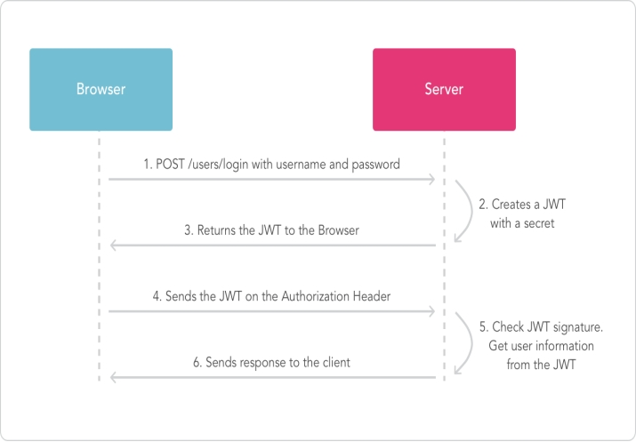

# 1.单点登录

[学习视频地址](https://www.bilibili.com/video/BV14M4y1c7Jm/?spm_id_from=333.999.0.0&vd_source=eddfd6cf09bd51f4b0abf93d76184fef)

[[toc]]

## 1.单点登录介绍

多系统，单一位置登录，实现多系统同时登录的一种技术。

常出现在互联网应用和企业级平台中。

如：京东。

单点登录一般是用于互相授信的系统，实现单一位置登录，全系统有效的。

三方登录：某系统，使用其他系统的用户，实现本系统登录的方式。如，在京东中使用微信登录。解决信息孤岛和用户不对等的实现方案。

## 2.Session跨域

所谓Session跨域就是摒弃了系统（Tomcat）提供的Session，而使用自定义的类似Session的机制来保存客户端数据的一种解决方案。

如：通过设置cookie的domain来实现cookie的跨域传递。在cookie中传递一个自定义的session_id。这个session_id是客户端的唯一标记。将这个标记作为key，将客户端需要保存的数据作为value，在服务端进行保存（数据库保存或NoSQL保存）。这种机制就是Session的跨域解决。

什么跨域： 客户端请求的时候，请求的服务器，不是同一个IP，端口，域名，主机名的时候，都称为跨域。

什么是域：在应用模型，一个完整的，有独立访问路径的功能集合称为一个域。如：百度称为一个应用或系统。百度下有若干的域，如：搜索引擎（www.baidu.com），百度贴吧（tie.baidu.com），百度知道（zhidao.baidu.com），百度地图（map.baidu.com）等。域信息，有时也称为多级域名。域的划分： 以IP，端口，域名，主机名为标准，实现划分。

localhost / 127.0.0.1

使用cookie跨域共享，是session跨域的一种解决方案。

jsessionid是和servlet绑定的httpsession的唯一标记。

 

cookie应用 - new Cookie("", "").  

request.getCookies() -> cookie[] -> 迭代找到需要使用的cookie

response.addCookie().

cookie.setDomain() - 为cookie设定有效域范围。

cookie.setPath() - 为cookie设定有效URI范围。

## 3.Spring Session共享 了解

spring-session技术是spring提供的用于处理集群会话共享的解决方案。spring-session技术是将用户session数据保存到三方存储容器中，如：mysql，redis等。

Spring-session技术是解决同域名下的多服务器集群session共享问题的。不能解决跨域session共享问题。

使用： 配置一个Spring提供的Filter，实现数据的拦截保存，并转换为spring-session需要的会话对象。必须提供一个数据库的表格信息（由spring-session提供，找spring-session-jdbc.jar/org/springframework/session/jdbc/*.sql,根据具体的数据库找对应的SQL文件，做表格的创建）。

spring-session表：保存客户端session对象的表格。

spring-session-attributes表：保存客户端session中的attributes属性数据的表格。

spring-session框架，是结合Servlet技术中的HTTPSession完成的会话共享机制。在代码中是直接操作HttpSession对象的。


## 4.Nginx Session共享

做反向代理服务器，可以为反向代理的服务器集群做集群管理和负载均衡。

正向代理： 对客户端已知，对服务端透明的代理应用，称为正向代理。如：翻墙软件。

反向代理： 对服务端已知，对客户端透明的代理应用，称为反向代理。如：nginx

Nginx服务器一旦安装，一般提供7*24小时服务。建议安装在服务器中（如：Unix、Linux）

Nginx是一个C语言开发的应用服务器。可以提供的服务有：静态WEB服务（Apache http server），邮件代理服务器，虚拟主机，反向代理服务器。

Nginx应用体积非常的小，对CPU和内存的要求也很低。且对负载能力有非常好的体现。核心功能是应用自主开发，很多的附属功能都是借助其他的应用实现的，如：SSL协议的解析-opensll，perl库（正则）的解析-perl包实现。

Nginx安装成功后，在安装位置有三个目录。sbin/conf/html。 sbin是可执行文件，html是nginx提供的默认静态页面，conf是配置文件目录。

nginx中的ip_hash技术能够将某个ip的请求定向到同一台后端，这样一来这个ip下的某个客户端和某个后端就能建立起稳固的session，ip_hash是在upstream配置中定义的，具体如下

```java
upstream nginx.example.com
{
    server 127.0.0.1:8080 weight 1;
    server 127.0.0.1:808 weight 2;
    ip_hash;
}
server
{
    listen 80;
    location /
    {
        proxy_pass
        http://nginx.example.com;
        proxy_set_header Host  $http_host;
        proxy_set_header Cookie $http_cookie;
        proxy_set_header X-Real-IP $remote_addr;
        proxy_set_header X-Forwarded-For $proxy_add_x_forwarded_for;
        proxy_set_header X-Forwarded-Proto $scheme;
        client_max_body_size  100m;
    }
}
```

ip_hash是容易理解的，但是因为仅仅能用ip这个因子来分配后端，因此ip_hash是有缺陷的，不能在一些情况下使用：

nginx不是最前端的服务器。

ip_hash要求nginx一定是最前端的服务器，否则nginx得不到正确ip，就不能根据ip作hash。譬如使用的是squid为最前端，那么nginx取ip时只能得到squid的服务器ip地址，用这个地址来作分流是肯定错乱的。

nginx的后端还有其它方式的负载均衡。

假如nginx后端又有其它负载均衡，将请求又通过另外的方式分流了，那么某个客户端的请求肯定不能定位到同一台session应用服务器上。

## 5.Token机制

### 1.传统身份认证

HTTP 是一种没有状态的协议，也就是它并不知道是谁是访问应用。这里我们把用户看成是客户端，客户端使用用户名还有密码通过了身份验证，不过下回这个客户端再发送请求时候，还得再验证一下。

解决的方法就是，当用户请求登录的时候，如果没有问题，我们在服务端生成一条记录，这个记录里可以说明一下登录的用户是谁，然后把这条记录的 ID 号发送给客户端，客户端收到以后把这个 ID 号存储在 Cookie 里，下次这个用户再向服务端发送请求的时候，可以带着这个 Cookie ，这样服务端会验证一个这个 Cookie 里的信息，看看能不能在服务端这里找到对应的记录，如果可以，说明用户已经通过了身份验证，就把用户请求的数据返回给客户端。

上面说的就是 Session，我们需要在服务端存储为登录的用户生成的 Session ，这些 Session 可能会存储在内存，磁盘，或者数据库里。我们可能需要在服务端定期的去清理过期的 Session 。

这种认证中出现的问题是：

Session：每次认证用户发起请求时，服务器需要去创建一个记录来存储信息。当越来越多的用户发请求时，内存的开销也会不断增加。

可扩展性：在服务端的内存中使用Session存储登录信息，伴随而来的是可扩展性问题。

CORS(跨域资源共享)：当我们需要让数据跨多台移动设备上使用时，跨域资源的共享会是一个让人头疼的问题。在使用Ajax抓取另一个域的资源，就可以会出现禁止请求的情况。

CSRF(跨站请求伪造)：用户在访问银行网站时，他们很容易受到跨站请求伪造的攻击，并且能够被利用其访问其他的网站。

在这些问题中，**可扩展性是最突出的**。因此我们有必要去寻求一种更有行之有效的方法。

### 2.Token身份认证

使用基于 Token 的身份验证方法，在服务端不需要存储用户的登录记录。大概的流程是这样的：

客户端使用用户名、密码请求登录

服务端收到请求，去验证用户名、密码

验证成功后，服务端会签发一个 Token，再把这个 Token 发送给客户端

客户端收到 Token 以后可以把它存储起来，比如放在 Cookie 里或者 Local Storage 、Session Storage里

客户端每次向服务端请求资源的时候需要带着服务端签发的 Token

服务端收到请求，然后去验证客户端请求里面带着的 Token，如果验证成功，就向客户端返回请求的数据

 

使用Token验证的优势：

无状态、可扩展

在客户端存储的Tokens是无状态的，并且能够被扩展。基于这种无状态和不存储Session信息，负载负载均衡器能够将用户信息从一个服务传到其他服务器上。

安全性

请求中发送token而不再是发送cookie能够防止CSRF(跨站请求伪造)。即使在客户端使用cookie存储token，cookie也仅仅是一个存储机制而不是用于认证。不将信息存储在Session中，让我们少了对session操作。

## 6.JSON Web Token（JWT）机制

JWT是一种***\**紧凑\**\***且***\**自包含\**\***的，用于在多方传递JSON对象的技术。传递的数据可以使用数字签名增加其安全行。可以使用HMAC加密算法或RSA公钥/私钥加密方式。

紧凑：数据小，可以通过URL，POST参数，请求头发送。且数据小代表传输速度快。

自包含：使用payload数据块记录用户必要且不隐私的数据，可以有效的减少数据库访问次数，提高代码性能。

JWT一般用于处理***\**用户身份验证\**\***或***\**数据信息交换\**\***。

用户身份验证：一旦用户登录，每个后续请求都将包含JWT，允许用户访问该令牌允许的路由，服务和资源。单点登录是当今广泛使用JWT的一项功能，因为它的开销很小，并且能够轻松地跨不同域使用。

数据信息交换：JWT是一种非常方便的多方传递数据的载体，因为其可以使用数据签名来保证数据的有效性和安全性。

官网： jwt.io

### 1.JWT数据结构

JWT的数据结构是 ： A.B.C。 由字符点‘.’来分隔三部分数据。

A - header 头信息

B - payload （有效荷载？）

C - Signature 签名

#### 1.1.header

数据结构： {“alg”: “加密算法名称”, “typ” : “JWT”}

alg是加密算法定义内容，如：HMAC SHA256 或 RSA

typ是token类型，这里固定为JWT。

#### 1.2.payload

在payload数据块中一般用于记录实体（通常为用户信息）或其他数据的。主要分为三个部分，分别是：已注册信息（registered claims），公开数据（public claims），私有数据（private claims）。

payload中常用信息有：iss（发行者），exp（到期时间），sub（主题），aud（受众）[等](#section-4.1)。前面列举的都是已注册信息。

公开数据部分一般都会在JWT注册表中增加定义。避免和已注册信息冲突。

公开数据和私有数据可以由程序员任意定义。

***\**注意：即使JWT有签名加密机制，但是payload内容都是明文记录，除非记录的是加密数据，否则不排除泄露隐私数据的可能。不推荐在payload中记录任何敏感数据。\**\***

#### 1.3.Signature

签名信息。这是一个由开发者提供的信息。是服务器验证的传递的数据是否有效安全的标准。在生成JWT最终数据的之前。先使用header中定义的加密算法，将header和payload进行加密，并使用点进行连接。如：加密后的head.加密后的payload。再使用相同的加密算法，对加密后的数据和签名信息进行加密。得到最终结果。

### 2.JWT执行流程



## 7.基于JWT机制的单点登录

### 1.实现

详见代码

### 2.注意

使用JWT实现单点登录时，需要注意token时效性。token是保存在客户端的令牌数据，如果永久有效，则有被劫持的可能。token在设计的时候，可以考虑一次性有效或一段时间内有效。如果设置有效时长，则需要考虑是否需要刷新token有效期问题。

### 3.token保存位置

使用JWT技术生成的token，客户端在保存的时候可以考虑cookie或localStorage。cookie保存方式，可以实现跨域传递数据。localStorage是域私有的本地存储，无法实现跨域。

### 4.webstorage

webstorage可保存的数据容量为***\**5M\**\***。且只能存储***\**字符串数据\**\***。

webstorage分为localStorage和sessionStorage。

localStorage的***\**生命周期是永久的\**\***，关闭页面或浏览器之后localStorage中的数据也不会消失。localStorage除非主动删除数据，否则数据永远不会消失。

sessionStorage是会话相关的本地存储单元，***\**生命周期是在仅在当前会话下有效\**\***。sessionStorage引入了一个“浏览器窗口”的概念，sessionStorage是在同源的窗口中始终存在的数据。只要这个浏览器窗口没有关闭，即使刷新页面或者进入同源另一个页面，数据依然存在。但是sessionStorage在关闭了浏览器窗口后就会被销毁。同时独立的打开同一个窗口同一个页面，sessionStorage也是不一样的。

 

## 8.Restful接口设计

### 1.Rest简述

REST（英文：Representational State Transfer，简称REST）描述了一个架构样式的网络系统，比如 web 应用程序。它首次出现在 2000 年 Roy Fielding 的博士论文中，他是 HTTP 规范的主要编写者之一。在目前主流的三种Web服务交互方案中，REST相比于SOAP（Simple Object Access protocol，简单对象访问协议）以及XML-RPC更加简单明了，无论是对URL的处理还是对Payload的编码，REST都倾向于用更加简单轻量的方法设计和实现。值得注意的是REST并没有一个明确的标准，而更像是一种设计的风格。

### 2.Restful简述

对应的中文是rest式的;Restful web service是一种常见的rest的应用,是遵守了rest风格的web服务;rest式的web服务是一种ROA(The Resource-Oriented Architecture)(面向资源的架构).

### 3.Restful特性

#### 3.1.普通架构

每次请求的接口或者地址,都在做描述，例如查询的时候用了query，新增的时候用了save。如：

http://127.0.0.1/user/query/1  GET 根据用户id查询用户数据

http://127.0.0.1/user/save  POST 新增用户

#### 3.2.Restful架构

使用get请求,就是查询.使用post请求，就是新增的请求，意图明显，没有必要做描述,这就是restful。

http://127.0.0.1/user/1  GET 根据用户id查询用户数据

http://127.0.0.1/user  POST 新增用户

#### 3.3.Restful操作方式

| HTTP方法 | 资源操作 | 幂等性 | 是否安全 |
| -------- | -------- | ------ | -------- |
| GET      | 查询     | 是     | 是       |
| POST     | 新增     | 否     | 否       |
| PUT      | 修改     | 是     | 否       |
| DELETE   | 删除     | 是     | 否       |

**幂等性：多次访问，结果资源状态是否相同**

**安全：访问是否会变更服务器资源状态**

#### 3.4.响应状态码

| 编码 | HTTP方法            | 响应体内容   | 描述                         |
| ---- | ------------------- | ------------ | ---------------------------- |
| 200  | get/put             | 资源数据     | 操作成功                     |
| 201  | post                | 源数据       | 创建成功                     |
| 202  | post/put/delete     | 无           | 请求已接受                   |
| 204  | delete/put          | 无           | 请求已处理，无返回数据       |
| 301  | get                 | link 链接    | 资源已被移除                 |
| 303  | get                 | link         | 重定向                       |
| 304  | get                 | 无           | 资源没有被修改               |
| 400  | get/post/put/delete | 错误提示消息 | 参数错误（缺少，格式错误等） |
| 401  | get/post/put/delete | 错误提示消息 | 未授权                       |
| 403  | get/post/put/delete | 错误提示消息 | 访问受限、授权过期           |
| 404  | get/post/put/delete | 错误提示消息 | 资源、服务未找到             |
| 405  | get/post/put/delete | 错误提示消息 | 不允许的HTTP方法             |
| 409  | get/post/put/delete | 错误提示消息 | 资源冲突或资源被锁定         |
| 415  | get/post/put/delete | 错误提示消息 | 不支持的数据类型或媒体类型   |
| 429  | get/post/put/delete | 错误提示消息 | 请求过多被限制               |
| 500  | get/post/put/delete | 错误提示消息 | 系统错误                     |
| 501  | get/post/put/delete | 错误提示消息 | 接口未实现                   |

 

### 4.SpringMVC使用Restful实例

详见代码

## 9.接口安全机制

在对外发布服务接口的时候，定制一套签名机制，保证数据传递有效性的。

### 1.安全机制的设计方案

#### 1.1.单向加密

在理论上，从明文加密到密文后，不可反向解密的。

可以从迭代和加盐的方式尽可能保证加密数据不可反向解密。

传递敏感数据的时候使用的。如：密码。

在金融相关交易中，用户密码是敏感数据，其他数据是非敏感数据。所有的金融相关的应用中，客户端都有一个独立的密码输入控件。这个控件就是做单向加密的。

使用单向加密的时候，传递的数据只有密文，没有明文，也没有密钥。

#### 1.2.双向加密

是可以实现加密和解密双向运算的算法。需要通过密钥实现加解密计算的。

密钥种类：公钥、私钥。

公钥：可以对外公开的，就是可以在网络中传递的。

私钥：必须保密的，绝对不会对外暴露的。

在传递安全数据的时候使用。所谓安全数据，就是不可篡改的数据。如：金融交易中的收款人卡号，转账的金额，货币的种类等。

使用双向加密的时候，传递的有明文，密文，公钥。

##### 1.2.1.对称加密

只有一个密钥，就是公钥。

##### 1.2.2.非对称加密

有两个密钥，公钥和私钥。

### 2.DES加密

详见代码

DES的密文是非定长密文。根据明文数据和key数据动态伸缩的。

### 3.AES加密

详见代码

AES的key要求长度为16。

### 4.使用场景

DES和AES在使用场景上没有区别。

传递非敏感的安全性数据可以使用。如：QQ通讯录获取，微信中的消息传递。

### 5.对比

DES - 加密后的数据是16的整数倍。 是16字节整数倍。

AES - 要求key的长度必须是16字节。 AES相对效率较低，但是可以通过偏移量强化加密。
