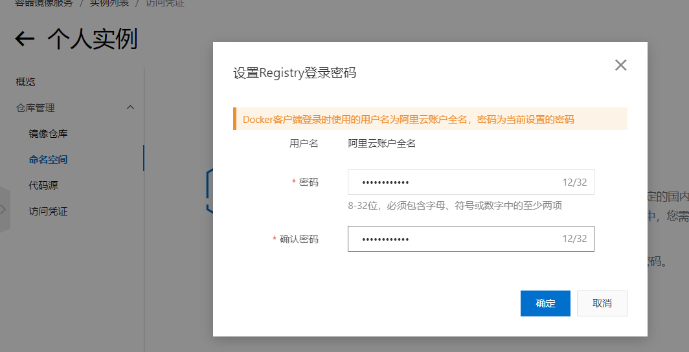

# 本地镜像发布到阿里云

[[toc]]

## 流程


## 镜像的生成方法

+ 第一种：基于当前容器创建一个新的镜像，新功能增强
  + [具体步骤](/project-management/Docker/4.Docker_images_principle/#docker镜像commit操作案例)

+ 第二种：DockerFile章节

## 将本地镜像推送到阿里云

### 本地镜像原型

```sh {3}
[root@frx01 ~]# docker images
REPOSITORY         TAG       IMAGE ID       CREATED          SIZE
node2/myubuntu     1.3       599f5515aeb4   11 minutes ago   180MB
atguigu/tomcat02   8.5.27    c69a4d8dcfcf   53 minutes ago   670MB
tomcat             8.5.73    2d2bccf89f53   10 months ago    678MB
ubuntu             latest    ba6acccedd29   13 months ago    72.8MB
redis              6.0.8     16ecd2772934   2 years ago      104MB
```

+ 阿里云开发者平台:[https://promotion.aliyun.com/ntms/act/kubernetes.html](https://promotion.aliyun.com/ntms/act/kubernetes.html)


+ 选择控制台，进入容器镜像服务


+ 进入个人实例


+ 设置Registry登录密码`502051565Liu`

  

+ 创建命名空间


+ 创建镜像仓库


+ 进入管理页面获得脚本


## 将镜像推送到阿里云

+ 将镜像推送到阿里云registy
+ 管理页面脚本


+ 执行3的命令

```sh
docker login --username=冯荣旭 registry.cn-shenzhen.aliyuncs.com
docker tag [ImageId] registry.cn-shenzhen.aliyuncs.com/frx01/myubuntu1.3:[镜像版本号]
docker push registry.cn-shenzhen.aliyuncs.com/frx01/myubuntu1.3:[镜像版本号]
```

> 密码是自己容器镜像下面的访问凭证设置的密码


> 执行命令截图


> 设置image id和版本号

+ 在阿里云上面查看结果


## 将阿里云的镜像下载到本地

```sh
[root@noed2 ~]# docker images
REPOSITORY                                                TAG       IMAGE ID       CREATED             SIZE
registry.cn-hangzhou.aliyuncs.com/node-beijing/myubuntu   1.3       599f5515aeb4   24 minutes ago      180MB
node2/myubuntu                                            1.3       599f5515aeb4   24 minutes ago      180MB
atguigu/tomcat02                                          8.5.27    c69a4d8dcfcf   About an hour ago   670MB
tomcat                                                    8.5.73    2d2bccf89f53   10 months ago       678MB
ubuntu                                                    latest    ba6acccedd29   13 months ago       72.8MB
redis                                                     6.0.8     16ecd2772934   2 years ago         104MB
#先删掉本地的node2/myubuntu
[root@noed2 ~]# docker rmi -f 599f5515aeb4
Untagged: node2/myubuntu:1.3
Untagged: registry.cn-hangzhou.aliyuncs.com/node-beijing/myubuntu:1.3
Untagged: registry.cn-hangzhou.aliyuncs.com/node-beijing/myubuntu@sha256:a7522f5fc813edcab935155fd044067e57680608b350382e50c4b346bf7d7fbe
Deleted: sha256:599f5515aeb4d40d8ce5f20bdf938a39556c1d3332517b99ddf7427c076f9ae7
```

```sh {6}
[root@noed2 ~]# docker images
REPOSITORY         TAG       IMAGE ID       CREATED             SIZE
atguigu/tomcat02   8.5.27    c69a4d8dcfcf   About an hour ago   670MB
tomcat             8.5.73    2d2bccf89f53   10 months ago       678MB
ubuntu             latest    ba6acccedd29   13 months ago       72.8MB
redis              6.0.8     16ecd2772934   2 years ago         104MB
[root@noed2 ~]# docker pull registry.cn-hangzhou.aliyuncs.com/node-beijing/myubuntu:1.3
1.3: Pulling from node-beijing/myubuntu
7b1a6ab2e44d: Already exists 
e419008f4c59: Already exists 
Digest: sha256:a7522f5fc813edcab935155fd044067e57680608b350382e50c4b346bf7d7fbe
Status: Downloaded newer image for registry.cn-hangzhou.aliyuncs.com/node-beijing/myubuntu:1.3
registry.cn-hangzhou.aliyuncs.com/node-beijing/myubuntu:1.3

[root@noed2 ~]# docker images
REPOSITORY                                                TAG       IMAGE ID       CREATED             SIZE
registry.cn-hangzhou.aliyuncs.com/node-beijing/myubuntu   1.3       599f5515aeb4   31 minutes ago      180MB
atguigu/tomcat02                                          8.5.27    c69a4d8dcfcf   About an hour ago   670MB
tomcat                                                    8.5.73    2d2bccf89f53   10 months ago       678MB
[root@frx01 ~]# docker run -it 599f5515aeb4 /bin/bash
root@a7795849ec26:/# vim a.txt
```

