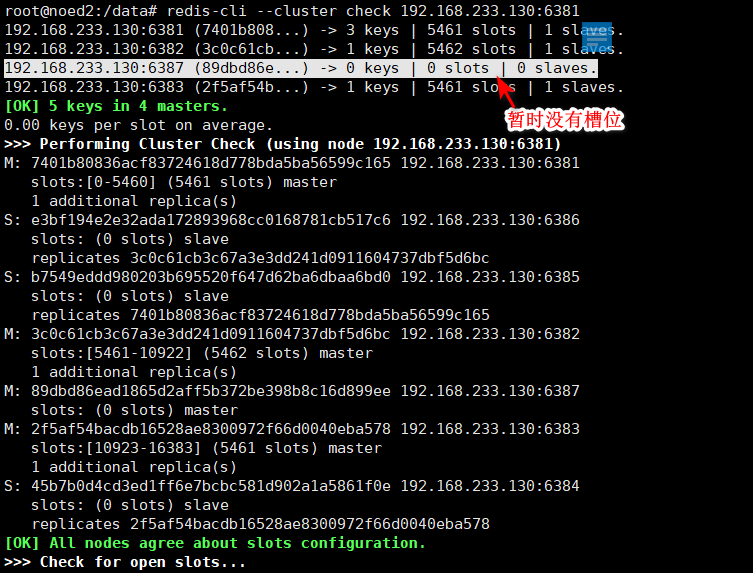

# 1.Docker 复杂安装详说
[[toc]]
## 1.安装mysql主从复制搭建步骤

### 1.1.新建主服务器容器实例 端口 3309

```sh
#首先创建目录 /docker/mysqlMaster/
mkdir /mydata
mkdir /mysqlMaster/
#执行下面命令
docker run -d \
    --name mysqlMaster \
    --restart always \
    -p 3309:3306 \
    -e MYSQL_ROOT_PASSWORD=123456 \
    -v /docker/mysqlMaster/data:/var/lib/mysql \
    -v /docker/mysqlMaster/conf:/etc/mysql/conf.d \
    -v /docker/mysqlMaster/log:/var/log \
    mysql:5.7
```

如果报下面错误的话，解决方法


```sh
#查看容器，看是不是容器重名
docker ps -a
#查看进程，将绑定端口进程杀掉
ps -aux | grep -v grep | grep docker-proxy
kill -9 进程id
```

### 1.2.进入/docker/mysqlMaster/conf目录下新建my.cnf

```sh
cd /docker/mysqlMaster/conf
vi my.cnf
```

复制下面的内容到my.cnf里面

```sh
[mysqld]
## 设置server_id，同一局域网中需要唯一
server_id=101
## 指定不需要同步的数据库名称
binlog-ignore-db=mysql
## 开启二进制日志功能
log-bin=mysql-bin
## 设置二进制日志使用内存大小（事务）
binlog_cache_size=1M
## 设置使用的二进制日志格式（mixed,statement,row）
binlog_format=mixed
## 二进制日志过期清理时间。默认值为0，表示不自动清理。
expire_logs_days=7
## 跳过主从复制中遇到的所有错误或指定类型的错误，避免slave端复制中断。
## 如：1062错误是指一些主键重复，1032错误是因为主从数据库数据不一致
slave_skip_errors=1062
```

### 1.3.修改完配置后重启master实例

```sh
docker restart mysqlMaster
#验证是否启动成功
docker ps
#如果没有mysql启动的容器，说明启动失败，那么可以通过下面的命令查看启动失败的日志
docker logs 容器id
```

可以看到下面错误信息


修改my.cnf 多一些空格或者什么，改完之后重启mysql ，发现启动成功

```sh
[root@noed2 conf]# docker start b7f382c864dd
b7f382c864dd
[root@noed2 conf]# docker ps
CONTAINER ID   IMAGE       COMMAND                  CREATED          STATUS         PORTS                                                  NAMES
b7f382c864dd   mysql:5.7   "docker-entrypoint.s…"   19 minutes ago   Up 5 seconds   33060/tcp, 0.0.0.0:3307->3306/tcp, :::3307->3306/tcp   mysql-master
```

### 1.4.进入mysql-master容器

```sh
docker exec -it mysql-master /bin/bash
#连接mysql
mysql -uroot -p
```

### 1.5.master容器实例内创建数据同步用户

```sh
CREATE USER 'slave'@'%' IDENTIFIED BY '123456';
GRANT REPLICATION SLAVE, REPLICATION CLIENT ON *.* TO 'slave'@'%';
```

### 1.6.新建从服务器实例3310

```sh
#首先创建目录 /docker/mysqlSlave/
mkdir /mysqlSlave/
#执行下面命令
docker run -d \
    --name mysqlSlave \
    --restart always \
    -p 3310:3306 \
    -e MYSQL_ROOT_PASSWORD=123456 \
    -v /docker/mysqlSlave/data:/var/lib/mysql \
    -v /docker/mysqlSlave/conf:/etc/mysql/conf.d \
    -v /docker/mysqlSlave/log:/var/log \
    mysql:5.7
```

### 1.7.进入/docker/mysqlSlave/conf目录下新建my.cnf

```sh
cd /docker/mysqlSlave/conf
vi my.cnf
```

添加下面内容

```sh
[mysqld]
## 设置server_id，同一局域网中需要唯一
server_id=102
## 指定不需要同步的数据库名称
binlog-ignore-db=mysql
## 开启二进制日志功能，以备Slave作为其它数据库实例的Master时使用
log-bin=mall-mysql-slave1-bin
## 设置二进制日志使用内存大小（事务）
binlog_cache_size=1M
## 设置使用的二进制日志格式（mixed,statement,row）
binlog_format=mixed
## 二进制日志过期清理时间。默认值为0，表示不自动清理。
expire_logs_days=7
## 跳过主从复制中遇到的所有错误或指定类型的错误，避免slave端复制中断。
## 如：1062错误是指一些主键重复，1032错误是因为主从数据库数据不一致
slave_skip_errors=1062
## relay_log配置中继日志
relay_log=mall-mysql-relay-bin
## log_slave_updates表示slave将复制事件写进自己的二进制日志
log_slave_updates=1
## slave设置为只读（具有super权限的用户除外）
read_only=1
```

### 1.8.重启从mysql

```sh
docker restart mysqlSlave
#查看重启状态
[root@noed2 conf]# docker ps
CONTAINER ID   IMAGE       COMMAND                  CREATED          STATUS          PORTS                                                  NAMES
b751130910b3   mysql:5.7   "docker-entrypoint.s…"   3 minutes ago    Up 4 seconds    33060/tcp, 0.0.0.0:3310->3306/tcp, :::3310->3306/tcp   mysqlSlave
5bda1e446335   mysql:5.7   "docker-entrypoint.s…"   12 minutes ago   Up 12 minutes   33060/tcp, 0.0.0.0:3309->3306/tcp, :::3309->3306/tcp   mysqlMaster
```

### 1.9.在主mysql3309中查看

```sh
mysql> show master status;
+------------------+----------+--------------+------------------+-------------------+
| File             | Position | Binlog_Do_DB | Binlog_Ignore_DB | Executed_Gtid_Set |
+------------------+----------+--------------+------------------+-------------------+
| mysql-bin.000001 |      154 |              | mysql            |                   |
+------------------+----------+--------------+------------------+-------------------+
1 row in set (0.00 sec)

```

### 1.10.进入从库mysql3310

```sh
docker exec -it 实例id /bin/bash
mysql -uroot -p 
```


### 1.11.在从数据库中配置主从复制

master_host='主mysql主机ip',mysql-bin.000001为上面第四步中查询File值，154为Position值

```sh
change master to master_host='192.168.233.130', master_user='slave', master_password='123456', master_port=3309, master_log_file='mysql-bin.000001', master_log_pos=154, master_connect_retry=30;
```


主从复制命令参数说明

```sql
master_host：主数据库的IP地址；
master_port：主数据库的运行端口；
master_user：在主数据库创建的用于同步数据的用户账号；
master_password：在主数据库创建的用于同步数据的用户密码；
master_log_file：指定从数据库要复制数据的日志文件，通过查看主数据的状态，获取File参数；
master_log_pos：指定从数据库从哪个位置开始复制数据，通过查看主数据的状态，获取Position参数；
master_connect_retry：连接失败重试的时间间隔，单位为秒。
```

### 1.12.在从数据库中查看主从同步状态

```sh
#\G的意思是格式转为竖着的，键值对
show slave status \G;
```


### 1.13.在从库中开启主从同步

```sh
mysql> start slave;
Query OK, 0 rows affected (0.00 sec)
```

### 1.14.查看从数据库中状态

```sh
show slave status \G;
```


### 1.15.主从复制测试

```sh
#主库创建数据库数据库添加数据
mysql> create database db01;
Query OK, 1 row affected (0.00 sec)

mysql> use db01;
Database changed
mysql> create table t1 (id int,name varchar(20));
Query OK, 0 rows affected (0.01 sec)
mysql> insert into t1 values(1,'t111');
Query OK, 1 row affected (0.01 sec)

mysql> select * from t1;
+------+------+
| id   | name |
+------+------+
|    1 | t111 |
+------+------+
1 row in set (0.00 sec)

mysql> 

#从库中查看,发现数据已经同步过来
mysql> use db01;
Reading table information for completion of table and column names
You can turn off this feature to get a quicker startup with -A

Database changed
mysql> select * from t1;
+------+------+
| id   | name |
+------+------+
|    1 | t111 |
+------+------+
1 row in set (0.00 sec)

```

## 2.cluster(集群)模式-docker版 

### 2.1.哈希槽概念

1~2亿条数据需要缓存，请问如何设计这个存储案例?

<mark>哈希槽分区进行亿级数据存储</mark>

1.哈希槽分区是什么?

 哈希槽实质就是一个数组，数组[0,2^14 -1]形成hash slot空间。 

2.能干什么？

解决均匀分配的问题，在数据和节点之间又加入了一层，把这层称为哈希槽（slot），用于管理数据和节点之间的关系，现在就相当于节点上放的是槽，槽里放的是数据。

 

槽解决的是粒度问题，相当于把粒度变大了，这样便于数据移动。

哈希解决的是映射问题，使用key的哈希值来计算所在的槽，便于数据分配。

3.多少个hash槽？

一个集群只能有16384个槽，编号0-16383（0-2^14-1）。这些槽会分配给集群中的所有主节点，分配策略没有要求。可以指定哪些编号的槽分配给哪个主节点。集群会记录节点和槽的对应关系。解决了节点和槽的关系后，接下来就需要对key求哈希值，然后对16384取余，余数是几key就落入对应的槽里。slot = CRC16(key) % 16384。以槽为单位移动数据，因为槽的数目是固定的，处理起来比较容易，这样数据移动问题就解决了。

4.哈希槽计算？

Redis 集群中内置了 16384 个哈希槽，redis 会根据节点数量大致均等的将哈希槽映射到不同的节点。当需要在 Redis 集群中放置一个 key-value时，redis 先对 key 使用 crc16 算法算出一个结果，然后把结果对 16384 求余数，这样每个 key 都会对应一个编号在 0-16383 之间的哈希槽，也就是映射到某个节点上。如下代码，key之A 、B在Node2， key之C落在Node3上


## 3.cluster(集群)实战

### 3.1.3主3从redis集群扩缩容配置案例架构说明


### 3.2主3从redis集群配置步骤

#### 1.关闭防火墙+启动docker后台服务

```sh
systemctl start docker
```

#### 2.新建6个docker容器实例

```sh
docker run -d --name redis-node-1 --net host --privileged=true -v /data/redis/share/redis-node-1:/data redis:6.0.8 --cluster-enabled yes --appendonly yes --port 6381
 
docker run -d --name redis-node-2 --net host --privileged=true -v /data/redis/share/redis-node-2:/data redis:6.0.8 --cluster-enabled yes --appendonly yes --port 6382
 
docker run -d --name redis-node-3 --net host --privileged=true -v /data/redis/share/redis-node-3:/data redis:6.0.8 --cluster-enabled yes --appendonly yes --port 6383
 
docker run -d --name redis-node-4 --net host --privileged=true -v /data/redis/share/redis-node-4:/data redis:6.0.8 --cluster-enabled yes --appendonly yes --port 6384
 
docker run -d --name redis-node-5 --net host --privileged=true -v /data/redis/share/redis-node-5:/data redis:6.0.8 --cluster-enabled yes --appendonly yes --port 6385
 
docker run -d --name redis-node-6 --net host --privileged=true -v /data/redis/share/redis-node-6:/data redis:6.0.8 --cluster-enabled yes --appendonly yes --port 6386
```

<mark>如果运行成功，效果如下：</mark>


参数解释

```sh
·命令分步解释
·docker run
·创建并运行docker容器实例
·--name redis-node-6
·容器名字
·--net host
·使用宿主机的IP和端口，默认
·--privileged=true
·获取宿主机root用户权限
·-v /data/redis/share/redis-node-6:/data
·容器卷，宿主机地址:docker内部地址
·redis:6.0.8
·redis镜像和版本号
·--cluster-enabled yes
·开启redis集群
·--appendonly yes
·开启持久化
·--port 6386
·redis端口号
·进入容器redis-node-1并为6台机器构建集群关系
```

#### 3.构建主从关系

```sh
#进入容器1
docker exec -it redis-node-1 /bin/bash
#构建主从关系
#注意，进入docker容器后才能执行一下命令，且注意自己的真实IP地址
redis-cli --cluster create 192.168.233.130:6381 192.168.233.130:6382 192.168.233.130:6383 192.168.233.130:6384 192.168.233.130:6385 192.168.233.130:6386 --cluster-replicas 1
#--cluster-replicas 1 表示为每个master创建一个slave节点
```


#### 4.以6381为例来查看集群信息

```sql
root@noed2:/data# redis-cli -p 6381
127.0.0.1:6381> cluster info
cluster_state:ok
cluster_slots_assigned:16384
cluster_slots_ok:16384
cluster_slots_pfail:0
cluster_slots_fail:0
cluster_known_nodes:6
cluster_size:3
cluster_current_epoch:6
cluster_my_epoch:1
cluster_stats_messages_ping_sent:132
cluster_stats_messages_pong_sent:131
cluster_stats_messages_sent:263
cluster_stats_messages_ping_received:126
cluster_stats_messages_pong_received:132
cluster_stats_messages_meet_received:5

127.0.0.1:6381> cluster nodes
b7549eddd980203b695520f647d62ba6dbaa6bd0 192.168.233.130:6385@16385 slave 7401b80836acf83724618d778bda5ba56599c165 0 1669022277105 1 connected
45b7b0d4cd3ed1ff6e7bcbc581d902a1a5861f0e 192.168.233.130:6384@16384 slave 2f5af54bacdb16528ae8300972f66d0040eba578 0 1669022276000 3 connected
e3bf194e2e32ada172893968cc0168781cb517c6 192.168.233.130:6386@16386 slave 3c0c61cb3c67a3e3dd241d0911604737dbf5d6bc 0 1669022277000 2 connected
2f5af54bacdb16528ae8300972f66d0040eba578 192.168.233.130:6383@16383 master - 0 1669022278121 3 connected 10923-16383
7401b80836acf83724618d778bda5ba56599c165 192.168.233.130:6381@16381 myself,master - 0 1669022274000 1 connected 0-5460
3c0c61cb3c67a3e3dd241d0911604737dbf5d6bc 192.168.233.130:6382@16382 master - 0 1669022275057 2 connected 5461-10922
127.0.0.1:6381> 

```


从上面可以看出：85挂在81下面，84挂在83下面，86挂在82下面

### 3.3.验证

对6381新增两个key

```sh
#连接81服务
redis-cli -p 6381  #这种是单机版
127.0.0.1:6381> set k1 v1
(error) MOVED 12706 192.168.233.130:6383
127.0.0.1:6381> set k2 v2
OK
127.0.0.1:6381> set k3 v3
OK
127.0.0.1:6381> set k4 v4
(error) MOVED 8455 192.168.233.130:6382
```

加入参数-c，优化路由，集群链接

```sh
root@noed2:/data# redis-cli -p 6381 -c
192.168.233.130:6382> set k1 v1
-> Redirected to slot [12706] located at 192.168.233.130:6383
OK
192.168.233.130:6383> set k2 v2
-> Redirected to slot [449] located at 192.168.233.130:6381
OK
192.168.233.130:6381> set k3 v3
OK
192.168.233.130:6381> set k4 v4
-> Redirected to slot [8455] located at 192.168.233.130:6382
OK
```

查看集群信息

```sql
redis-cli --cluster check 192.168.233.130:6381
```


### 3.4.容错切换迁移案例

#### 1.演示主6381和从机切换

1先停止主机6381,中间需要等待一会儿，docker集群重新响应

```sql
docker stop redis-node-1
```

2.进入6382，查看集群信息

```sh
docker exec -it redis-node-2 bash
redis-cli -p 6382 -c
cluster nodes
```

6381作为1号主机分配的从机以实际情况为准，具体是几号机器就是几号


3.重新启动81机器

```sh
docker start redis-node-1
```

此时发现，81是从节点，85是主节点


如果想让81再成为主节点，那么把85停了，然后过一会再启动

```sh
#停止85
docker stop redis-node-5
#再启动85
docker start redis-node-5
```

可以看到81变成了master,85变成了slave


### 3.5.主从扩容案例

1.新建6387、6388两个节点+新建后启动+查看是否8节点

```sh
docker run -d --name redis-node-7 --net host --privileged=true -v /data/redis/share/redis-node-7:/data redis:6.0.8 --cluster-enabled yes --appendonly yes --port 6387
docker run -d --name redis-node-8 --net host --privileged=true -v /data/redis/share/redis-node-8:/data redis:6.0.8 --cluster-enabled yes --appendonly yes --port 6388

docker ps
```

2.进入6387容器实例内部

```sh
docker exec -it redis-node-7 /bin/bash
```

3.将新增的6387节点(空槽号)作为master节点加入原集群

```sh
#将新增的6387作为master节点加入集群
#redis-cli --cluster add-node 自己实际IP地址:6387 自己实际IP地址:6381
#6387 就是将要作为master新增节点
#6381 就是原来集群节点里面的领路人，相当于6387拜拜6381的码头从而找到组织加入集群

redis-cli --cluster add-node 192.168.233.130:6387 192.168.233.130:6381
```


4.检查集群情况第1次

```sh
#redis-cli --cluster check 真实ip地址:6381
redis-cli --cluster check 192.168.233.130:6381
```



5.重新分配槽号

```sh
#命令:redis-cli --cluster reshard IP地址:端口号
redis-cli --cluster reshard 192.168.233.130:6381
```


all，重新分配槽位


6.检查集群情况第2次

```sh
#redis-cli --cluster check 真实ip地址:6381
redis-cli --cluster check 192.168.233.130:6381
```

槽号分派说明

```sh
为什么6387是3个新的区间，以前的还是连续？
重新分配成本太高，所以前3家各自匀出来一部分，从6381/6382/6383三个旧节点分别匀出1364个坑位给新节点6387,
6387一共4096个槽位
```


7.为主节点6387分配从节点6388

```sh
#命令：redis-cli --cluster add-node ip:新slave端口 ip:新master端口 --cluster-slave --cluster-master-id 新主机节点ID
#89dbd86ead1865d2aff5b372be398b8c16d899ee的值可以通过redis-cli --cluster check 192.168.233.130:6381 查看是6387的节点id
redis-cli --cluster add-node 192.168.233.130:6388 192.168.233.130:6387 --cluster-slave --cluster-master-id 89dbd86ead1865d2aff5b372be398b8c16d899ee
```


8.检查集群情况第3次

```sh
#检查哪个都可以
redis-cli --cluster check 192.168.233.130:6382
```

可以看到四主四从


### 3.6.主从缩容案例

**目的：6387和6388下线**

#### 1.操作步骤说明

```java
1.先清除从节点6388

2.清出来的槽重新分配

3.再删除6387

4.恢复成3主3从
```

1.检查集群情况1获得6388的节点ID

```sh
redis-cli --cluster check 192.168.233.130:6382
```


2.将6388删除 从集群中将4号从节点6388删除

```sh
#命令：redis-cli --cluster del-node ip:从机端口 从机6388节点ID
redis-cli --cluster del-node 192.168.233.130:6388 f5d0925cda5ac3d14bab5e38f05f2facf35e808f
```


3.检查

```sh
redis-cli --cluster check 192.168.233.130:6382
```


可以看到6388已经被删除了

4.将6387的槽号清空，重新分配，本例将清出来的槽号都给6381

```sh
redis-cli --cluster reshard 192.168.233.130:6381
```


5.检查集群情况第二次

```sh
redis-cli --cluster check 192.168.233.130:6381
 
4096个槽位都指给6381，它变成了8192个槽位，相当于全部都给6381了，不然要输入3次，一锅端
```


6.将6387删除

```sh
#命令：redis-cli --cluster del-node ip:端口 6387节点ID
 
redis-cli --cluster del-node 192.168.233.130:6387 89dbd86ead1865d2aff5b372be398b8c16d899ee
```


7.检查集群情况第三次

```sh
redis-cli --cluster check 192.168.233.130:6381
```

可以看到，又变成了3主3从


end；
