# 1.DockerFile解析
[[toc]]
## 1.DockerFile是什么

Dockerfile是用来构建Docker镜像的文本文件，是由一条条构建镜像所需的指令和参数构成的脚本。

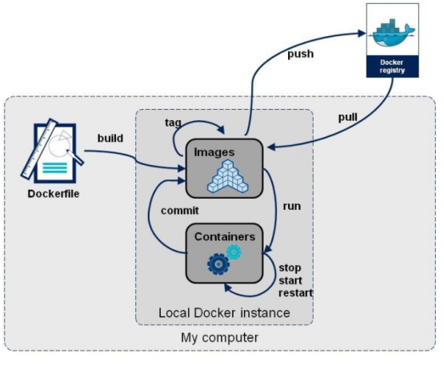

官网 https://docs.docker.com/engine/reference/builder/

**构建三步骤**

1.编写Dockerfile文件

2.docker build命令构建镜像

3.docker run依镜像运行容器实例

## 2.DockerFile构建过程解析

**Dockerfile内容基础知识**

1：每条保留字指令都必须为大写字母且后面要跟随至少一个参数

2：指令按照从上到下，顺序执行

3：#表示注释

4：每条指令都会创建一个新的镜像层并对镜像进行提交

**Docker执行Dockerfile的大致流程**

（1）docker从基础镜像运行一个容器

（2）执行一条指令并对容器作出修改

（3）执行类似docker commit的操作提交一个新的镜像层

（4）docker再基于刚提交的镜像运行一个新容器

（5）执行dockerfile中的下一条指令直到所有指令都执行完成

**小总结**

从应用软件的角度来看，Dockerfile、Docker镜像与Docker容器分别代表软件的三个不同阶段，

\*  Dockerfile是软件的原材料

\*  Docker镜像是软件的交付品

\*  Docker容器则可以认为是软件镜像的运行态，也即依照镜像运行的容器实例

Dockerfile面向开发，Docker镜像成为交付标准，Docker容器则涉及部署与运维，三者缺一不可，合力充当Docker体系的基石。

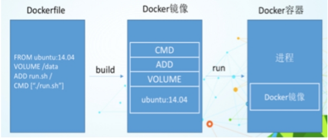

1.Dockerfile，需要定义一个Dockerfile，Dockerfile定义了进程需要的一切东西。Dockerfile涉及的内容包括执行代码或者是文件、环境变量、依赖包、运行时环境、动态链接库、操作系统的发行版、服务进程和内核进程(当应用进程需要和系统服务和内核进程打交道，这时需要考虑如何设计namespace的权限控制)等等;

2.Docker镜像，在用Dockerfile定义一个文件之后，docker build时会产生一个Docker镜像，当运行 Docker镜像时会真正开始提供服务;

3.Docker容器，容器是直接提供服务的。

## 3.DockerFile常用保留字指令

参考tomcat8的dockerfile入门 https://github.com/docker-library/tomcat

<mark>1.FROM</mark>

基础镜像，当前新镜像是基于哪个镜像的，指定一个已经存在的镜像作为模板，第一条必须是from

<mark>2.MAINTAINER</mark>

镜像维护者的姓名和邮箱地址

<mark>3.RUN</mark>

容器构建时需要运行的命令,包括两种格式：shell格式，exec格式

RUN是在 docker build时运行

```sh
#shell格式 RUN<命令行命令> 等同于，在终端操作的 shell 命令
RUN yum -y install vim
#exec格式 RUN['可执行文件','参数1','参数2']
#例如
RUN ["./test.php","dev","offline"] 等价于 RUN ./test.php dev offline
```

<mark>4.EXPOSE</mark>

当前容器对外暴露出的端口

<mark>5.WORKDIR</mark>

指定在创建容器后，终端默认登陆的进来工作目录，一个落脚点

<mark>6.USER</mark>

指定该镜像以什么样的用户去执行，如果都不指定，默认是root

<mark>7.ENV</mark>

用来在构建镜像过程中设置环境变量

```sh
ENV MY_PATH /usr/mytest
这个环境变量可以在后续的任何RUN指令中使用，这就如同在命令前面指定了环境变量前缀一样；
也可以在其它指令中直接使用这些环境变量， 
比如：WORKDIR $MY_PATH
```

<mark>8.ADD</mark>

将宿主机目录下的文件拷贝进镜像且会自动处理URL和解压tar压缩包

<mark>9.COPY</mark>

类似ADD，拷贝文件和目录到镜像中。 将从构建上下文目录中 <源路径> 的文件/目录复制到新的一层的镜像内的 <目标路径> 位置

```sh
COPY src dest
COPY src dest
COPY ["src", "dest"]
<src源路径>：源文件或者源目录
<dest目标路径>：容器内的指定路径，该路径不用事先建好，路径不存在的话，会自动创建。
```

<mark>10.VOLUME</mark>

容器数据卷，用于数据保存和持久化工作

<mark>11.CMD</mark>

指定容器启动后的要干的事情

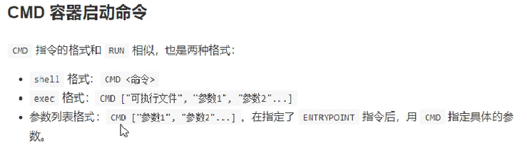

**注意**

Dockerfile 中可以有多个 CMD 指令，但只有最后一个生效，CMD 会被 docker run 之后的参数替换


参考官网Tomcat的dockerfile演示讲解

我们演示自己的覆盖操作,加上 /bin/bash 相当于再最后加了个 cmd ["/bin/bash","run"],所以是启动不了的

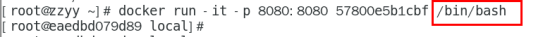

**它和前面RUN命令的区别**

CMD是在docker run 时运行。

RUN是在 docker build时运行。

<mark>12.ENTRYPOINT</mark>

也是用来指定一个容器启动时要运行的命令

类似于 CMD 指令，但是ENTRYPOINT不会被docker run后面的命令覆盖， 而且这些命令行参数会被当作参数送给 ENTRYPOINT 指令指定的程序

命令格式和案例说明

 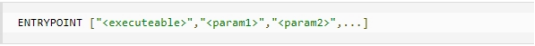

ENTRYPOINT可以和CMD一起用，一般是变参才会使用 CMD ，这里的 CMD 等于是在给ENTRYPOINT 传参。

当指定了ENTRYPOINT后，CMD的含义就发生了变化，不再是直接运行其命令而是将CMD的内容作为参数传递给ENTRYPOINT指令，他两个组合会变成

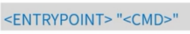

 

案例如下：假设已通过 Dockerfile 构建了 nginx:test 镜像：

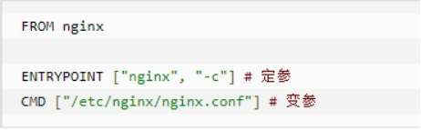

命令格式：

| 是否传参         | 按照dockerfile编写执行         | 传参运行                                     |
| ---------------- | ------------------------------ | -------------------------------------------- |
| Docker命令       | docker run nginx:test          | docker run nginx:test -c /etc/nginx/new.conf |
| 衍生出的实际命令 | nginx -c /etc/nginx/nginx.conf | nginx -c /etc/nginx/new.conf                 |

**优点**

在执行docker run的时候可以指定 ENTRYPOINT 运行所需的参数。

**注意**

如果 Dockerfile 中如果存在多个 ENTRYPOINT 指令，仅最后一个生效。

## 4.案例-自定义镜像mycentosjava8

要求:Centos7镜像具备vim+ifconfig+jdk8

下载镜像centos7

```sh
docker pull centos
```

启动一个容器，并且进入

```sh
docker run -it 5d0da3dc9764 /bin/bash
```

此时的centos并不具备一些命令

```sh
[root@a8a14e2b211a /]# vim 
bash: vim: command not found
```

JDK官网下载镜像地址：

https://www.oracle.com/java/technologies/downloads/#java8

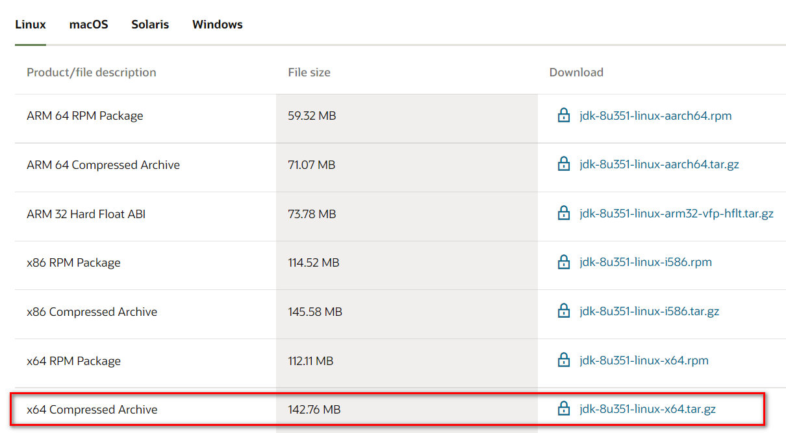

历史版本：https://mirrors.yangxingzhen.com/jdk/

新建一共myfile目录，将下载的压缩包上传到myfile目录下

```sh
[root@noed2 /]# mkdir myfile
```

1.准备编写Dockerfile文件,注意D是大写

```sh
vi Dockerfile
```

复制下面的内容到Dockerfile里面

```sh
FROM centos:7
MAINTAINER zzyy<zzyybs@126.com>
 
ENV MYPATH /usr/local
WORKDIR $MYPATH
 
#安装vim编辑器
RUN yum -y install vim
#安装ifconfig命令查看网络IP
RUN yum -y install net-tools
#安装java8及lib库
RUN yum -y install glibc.i686
RUN mkdir /usr/local/java
#ADD 是相对路径jar,把jdk-8u351-linux-x64.tar.gz添加到容器中,安装包必须要和Dockerfile文件在同一位置
ADD jdk-8u351-linux-x64.tar.gz /usr/local/java/
#配置java环境变量
ENV JAVA_HOME /usr/local/java/jdk1.8.0_351
ENV JRE_HOME $JAVA_HOME/jre
ENV CLASSPATH $JAVA_HOME/lib/dt.jar:$JAVA_HOME/lib/tools.jar:$JRE_HOME/lib:$CLASSPATH
ENV PATH $JAVA_HOME/bin:$PATH
 
EXPOSE 80
 
CMD echo $MYPATH
CMD echo "success--------------ok"
CMD /bin/bash
```

查看ll

```sh
[root@noed2 myfile]# ll
总用量 146196
-rw-r--r--. 1 root root       740 11月 22 16:08 Dockerfile
-rw-r--r--. 1 root root 149697219 11月 22 16:02 jdk-8u351-linux-x64.tar.gz
```

2.构建

docker build -t 新镜像名字:TAG .

```sh
#注意，TAG后面有个空格，有个点
docker build -t centosjava8:1.5 .
```

如果报错

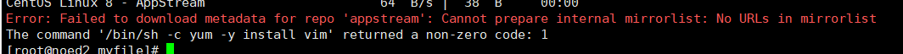

原因是centos的版本不匹配，8太高了，改成7后就可以了,更改Dockerfile文件第一行

```sh
FROM centos:7
```

构建成功

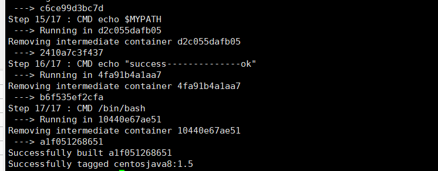

```sh
[root@noed2 myfile]# docker images
REPOSITORY                                                TAG       IMAGE ID       CREATED              SIZE
centosjava8                                               1.5       a1f051268651   About a minute ago   1.24GB
```

3.运行

```sh
[root@noed2 myfile]# docker run -it a1f051268651 /bin/bash
[root@ce06f1b40a94 local]# pwd
/usr/local
[root@5f4b79f2a4fb local]# java -version
java version "1.8.0_351"
Java(TM) SE Runtime Environment (build 1.8.0_351-b10)
Java HotSpot(TM) 64-Bit Server VM (build 25.351-b10, mixed mode)
[root@5f4b79f2a4fb local]# ifconfig
eth0: flags=4163<UP,BROADCAST,RUNNING,MULTICAST>  mtu 1500
        inet 172.17.0.2  netmask 255.255.0.0  broadcast 172.17.255.255
        ether 02:42:ac:11:00:02  txqueuelen 0  (Ethernet)
        RX packets 8  bytes 648 (648.0 B)
        RX errors 0  dropped 0  overruns 0  frame 0
        TX packets 0  bytes 0 (0.0 B)
        TX errors 0  dropped 0 overruns 0  carrier 0  collisions 0

lo: flags=73<UP,LOOPBACK,RUNNING>  mtu 65536
        inet 127.0.0.1  netmask 255.0.0.0
        loop  txqueuelen 1000  (Local Loopback)
        RX packets 0  bytes 0 (0.0 B)
        RX errors 0  dropped 0  overruns 0  frame 0
        TX packets 0  bytes 0 (0.0 B)
        TX errors 0  dropped 0 overruns 0  carrier 0  collisions 0

[root@5f4b79f2a4fb local]# 
```

## 5.再体会下UnionFS（联合文件系统）

UnionFS（联合文件系统）：Union文件系统（UnionFS）是一种分层、轻量级并且高性能的文件系统，它支持对文件系统的修改作为一次提交来一层层的叠加，同时可以将不同目录挂载到同一个虚拟文件系统下(unite several directories into a single virtual filesystem)。Union 文件系统是 Docker 镜像的基础。镜像可以通过分层来进行继承，基于基础镜像（没有父镜像），可以制作各种具体的应用镜像。


特性：一次同时加载多个文件系统，但从外面看起来，只能看到一个文件系统，联合加载会把各层文件系统叠加起来，这样最终的文件系统会包含所有底层的文件和目录

## 6.虚悬镜像

1.是什么

仓库名、标签都是none的镜像，俗称dangling image

2.随便手写一个来测试

创建文件夹test

```sh
[root@noed2 myfile]# mkdir test
[root@noed2 myfile]# cd test
[root@noed2 test]# pwd
/myfile/test
```

2.Dockerfile写一个Dockerfile

```sh
vi Dockerfile
```

```sh
from ubuntu
CMD echo 'action is success'
```

3.构建 注意后面的空格和点

```sh
[root@noed2 test]# docker build .
Sending build context to Docker daemon  2.048kB
Step 1/2 : from ubuntu
 ---> ba6acccedd29
Step 2/2 : CMD echo 'action is success'
 ---> Running in 798a2d1a6104
Removing intermediate container 798a2d1a6104
 ---> 3615c9086bf4
Successfully built 3615c9086bf4
```

4.查看

```sh
#查看虚悬镜像docker image ls -f dangling=true
docker images
```

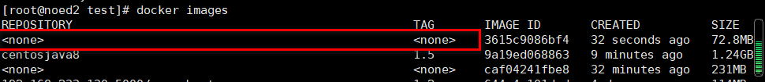

5.删除

虚悬镜像已经失去存在价值，可以删除,删除命令

```sh
docker image prune
```

## 7.自定义镜像myubuntu

1.先拉取ubuntu基础镜像

```sh
docker pull ubuntu
```

2.创建文件夹myubuntu

```sh
mkdir myubuntu
```

3.准备编写Dockerfile文件

```sh
vi Dockerfile
```

内容

```sh
FROM ubuntu
MAINTAINER zzyy<zzyybs@126.com>
 
ENV MYPATH /usr/local
WORKDIR $MYPATH
 
RUN apt-get update
RUN apt-get install net-tools
#RUN apt-get install -y iproute2
#RUN apt-get install -y inetutils-ping
 
EXPOSE 80
 
CMD echo $MYPATH
CMD echo "install inconfig cmd into ubuntu success--------------ok"
CMD /bin/bash
```

4.构建

docker build -t 新镜像名字:TAG .

```sh
docker build -t myubuntu:1.6 .
```

5.查看镜像

```sh
docker images
```

6.运行

docker run -it 新镜像名字:TAG

```sh
docker run -it 56dad7d7671e /bin/bash
```

## 8.小总结

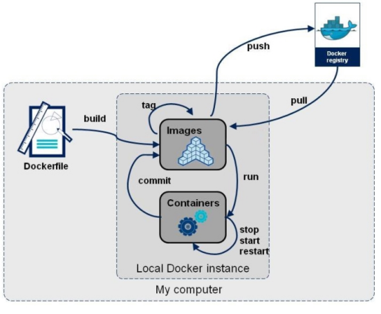

end;
