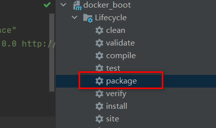
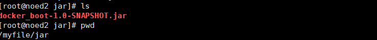
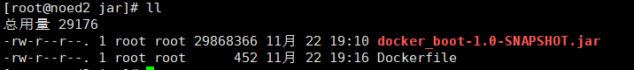
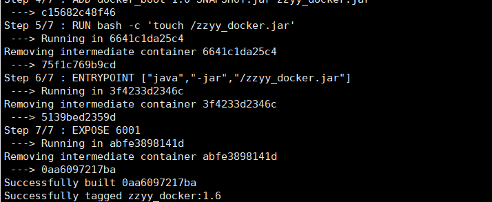
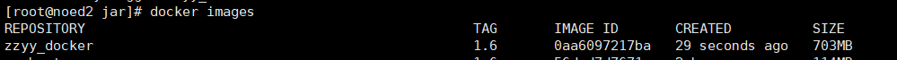
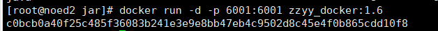

# 1.Docker 微服务实战
[[toc]]
## 1.通过IDEA新建一个普通微服务模块

controller方法

```sh
@RestController
public class OrderController {
    @Value("${server.port}")
    private String port;

    @RequestMapping("/order/docker")
    public String helloDocker(){
        return "hello docker"+"\t"+port+"\t"+ UUID.randomUUID().toString();
    }

    @RequestMapping(value ="/order/index",method = RequestMethod.GET)
    public String index(){
        return "服务端口号: "+"\t"+port+"\t"+UUID.randomUUID().toString();
    }
}
```

```sh
http://127.0.0.1:6001/order/index
```

## 2.通过dockerfile发布微服务部署到docker容器

### 1.IDEA工具里面打微服务jar包

 

### 2.将jar包上传到linux服务器上，上传目录：/myfile/jar



### 3.编写Dockerfile

```sh
vi Dockerfile
```

Dockerfile内容

```sh
# 基础镜像使用java
FROM java:8
# 作者
MAINTAINER zzyy
# VOLUME 指定临时文件目录为/tmp，在主机/var/lib/docker目录下创建了一个临时文件并链接到容器的/tmp
VOLUME /tmp
# 将jar包添加到容器中并更名为zzyy_docker.jar
ADD docker_boot-1.0-SNAPSHOT.jar zzyy_docker.jar
# 运行jar包
RUN bash -c 'touch /zzyy_docker.jar'
ENTRYPOINT ["java","-jar","/zzyy_docker.jar"]
#暴露6001端口作为微服务
EXPOSE 6001
```

Dockerfile和jar包在同一个目录下



### 4.构建镜像

```sh
docker build -t zzyy_docker:1.6 .
```



### 5.查看镜像

```sh
docker images
```



### 6.运行容器

```sh
 docker run -d -p 6001:6001 zzyy_docker:1.6
```



### 7.访问测试

```sh
http://192.168.233.130:6001/order/index
```


end;