# 1.Docker 网络
[[toc]]
## 1.Docker 网络是什么？

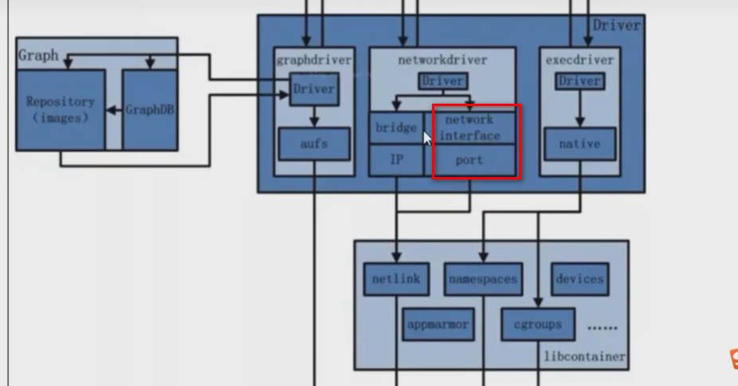

停止docker

```sh
[root@noed2 jar]# systemctl stop docker
Warning: Stopping docker.service, but it can still be activated by:
  docker.socket
root@noed2 jar]# systemctl stop docker.socket
[root@noed2 jar]# docker images
Cannot connect to the Docker daemon at unix:///var/run/docker.sock. Is the docker daemon running?
[root@noed2 jar]# 
```

###  1.docker不启动，默认网络情况

```sh
[root@noed2 jar]# ifconfig
```

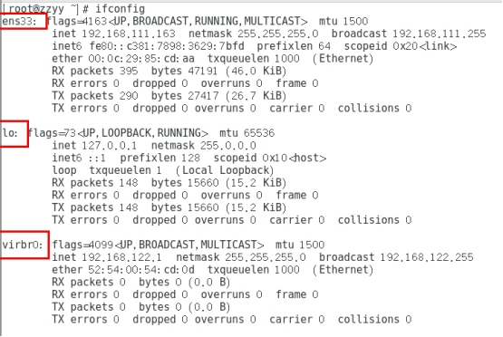

ens33,lo,virbr0

在CentOS7的安装过程中如果有选择相关虚拟化的的服务安装系统后，启动网卡时会发现有一个以网桥连接的私网地址的virbr0网卡(virbr0网卡：它还有一个固定的默认IP地址192.168.122.1)，是做虚拟机网桥的使用的，其作用是为连接其上的虚机网卡提供 NAT访问外网的功能。

我们之前学习Linux安装，勾选安装系统的时候附带了libvirt服务才会生成的一个东西，如果不需要可以直接将libvirtd服务卸载，

yum remove libvirt-libs.x86_64

### 2.docker启动后，网络情况

**会产生一个名为docker0的虚拟网桥**

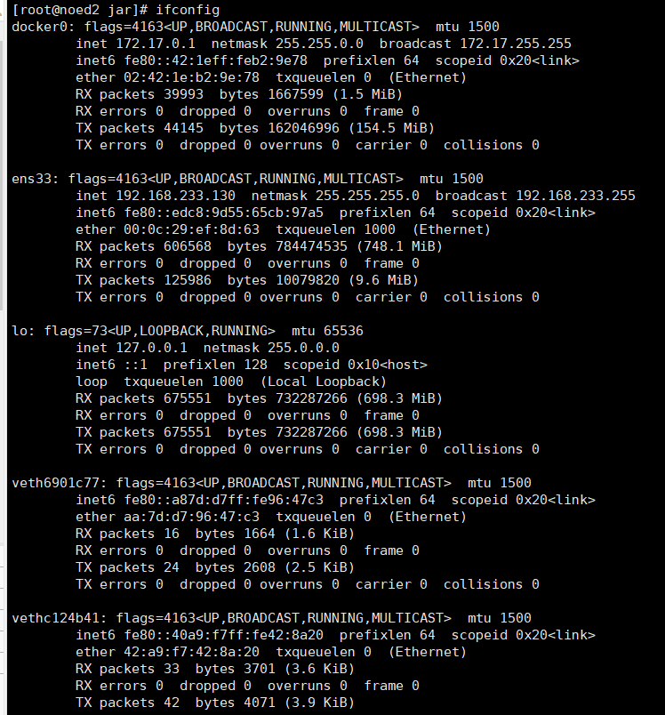

### 3.查看docker网络模式命令

```sh
docker network ls
```

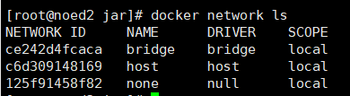

### 4.常用基本命令

```sh
#帮助命令
docker network --help
#查看网络模式
docker network ls
#创建网络
docker network create xx网络名字
#查看网络源数据
docker network inspect xx网络名字
#删除网路
docker network rm xx网络名字
```

### 5.能干嘛

容器间的互联和通信以及端口映射

容器IP变动时候可以通过服务名直接网络通信而不受到影响

### 6.网络模式

总体介绍

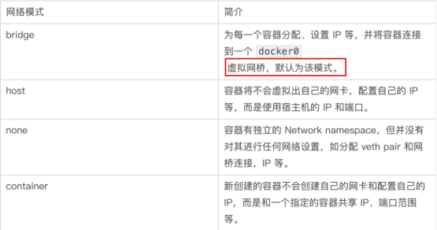

bridge模式：使用--network  bridge指定，默认使用docker0

host模式：使用--network host指定

none模式：使用--network none指定

container模式：使用--network container:NAME或者容器ID指定

### 7.容器实例内默认网络IP生产规则

说明

1 先启动两个ubuntu容器实例

```sh
docker run -it --name  u1 ubuntu bash
docker run -it --name  u2 ubuntu bash
```

2 docker inspect 容器ID or 容器名字

```sh
docker inspect 1f21079593b4
docker inspect bcfe2372a5f4
```

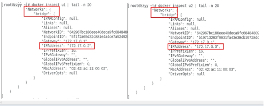

3 删除u2实例，新建u3，查看ip变化

```sh
docker rm -f u2
docker run -it --name  u3 ubuntu bash
```


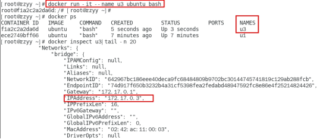

结论

docker容器内部的ip是有可能会发生改变的

###  8.案例说明

#### 1.bridge是什么

Docker 服务默认会创建一个 docker0 网桥（其上有一个 docker0 内部接口），该桥接网络的名称为docker0，它在内核层连通了其他的物理或虚拟网卡，这就将所有容器和本地主机都放到同一个物理网络。Docker 默认指定了 docker0 接口 的 IP 地址和子网掩码，<mark>让主机和容器之间可以通过网桥相互通信</mark>。

```sh
docker network inspect bridge
docker network inspect host
docker network inspect none
```

```sh
# 查看 bridge 网络的详细信息，并通过 grep 获取名称项
docker network inspect bridge | grep name
ifconfig | grep docker
```

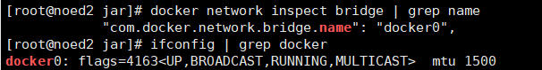

案例说明

1 Docker使用Linux桥接，在宿主机虚拟一个Docker容器网桥(docker0)，Docker启动一个容器时会根据Docker网桥的网段分配给容器一个IP地址，称为Container-IP，同时Docker网桥是每个容器的默认网关。因为在同一宿主机内的容器都接入同一个网桥，这样容器之间就能够通过容器的Container-IP直接通信。

2 docker run 的时候，没有指定network的话默认使用的网桥模式就是bridge，使用的就是docker0。在宿主机ifconfig,就可以看到docker0和自己create的network(后面讲)eth0，eth1，eth2……代表网卡一，网卡二，网卡三……，lo代表127.0.0.1，即localhost，inet addr用来表示网卡的IP地址

3 网桥docker0创建一对对等虚拟设备接口一个叫veth，另一个叫eth0，成对匹配。

  3.1 整个宿主机的网桥模式都是docker0，类似一个交换机有一堆接口，每个接口叫veth，在本地主机和容器内分别创建一个虚拟接口，并让他们彼此联通（这样一对接口叫veth pair）；

  3.2 每个容器实例内部也有一块网卡，每个接口叫eth0；

  3.3 docker0上面的每个veth匹配某个容器实例内部的eth0，两两配对，一一匹配。

 通过上述，将宿主机上的所有容器都连接到这个内部网络上，两个容器在同一个网络下,会从这个网关下各自拿到分配的ip，此时两个容器的网络是互通的。

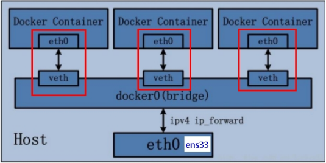

代码

```sh
docker run -d -p 8081:8080  --name tomcat81 billygoo/tomcat8-jdk8
docker run -d -p 8082:8080  --name tomcat82 billygoo/tomcat8-jdk8
```

两两匹配验证

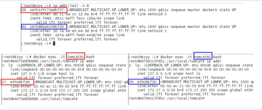

#### 2.host 是什么

直接使用宿主机的 IP 地址与外界进行通信，不再需要额外进行NAT 转换。

案例说明

容器将<mark>不会获得</mark>一个独立的Network Namespace， 而是和宿主机共用一个Network Namespace。容器将不会虚拟出自己的网卡而是使用宿主机的IP和端口。

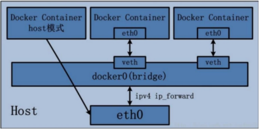

<mark>代码警告</mark>

```sh
docker run -d -p 8083:8080 --network host --name tomcat83 billygoo/tomcat8-jdk8
```

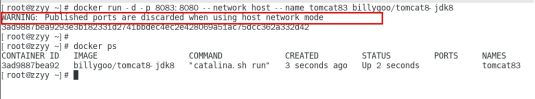

问题：

   docke启动时总是遇见标题中的警告?

原因：

  docker启动时指定--network=host或-net=host，如果还指定了-p映射端口，那这个时候就会有此警告，

并且通过-p设置的参数将不会起到任何作用，端口号会以主机端口号为主，重复时则递增。

解决:

  解决的办法就是使用docker的其他网络模式，例如--network=bridge，这样就可以解决问题，或者直接无视。

<mark>代码正确</mark>

```sh
docker run -d --network host --name tomcat83 billygoo/tomcat8-jdk8
```

无之前的配对显示了，看容器实例内部

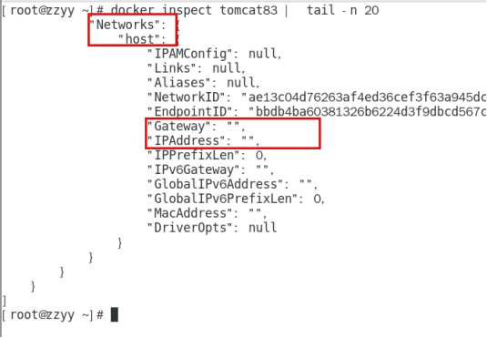

没有设置-p的端口映射了，如何访问启动的tomcat83？

http://宿主机IP:8080/

在CentOS里面用默认的火狐浏览器访问容器内的tomcat83看到访问成功，因为此时容器的IP借用主机的，所以容器共享宿主机网络IP，这样的好处是外部主机与容器可以直接通信。

#### 3.none是什么

在none模式下，并不为Docker容器进行任何网络配置。 也就是说，这个Docker容器没有网卡、IP、路由等信息，只有一个lo,需要我们自己为Docker容器添加网卡、配置IP等。

禁用网络功能，只有lo标识(就是127.0.0.1表示本地回环)

案例

```sh
docker run -d -p 8084:8080 --network none --name tomcat84 billygoo/tomcat8-jdk8
```

进入容器内部查看

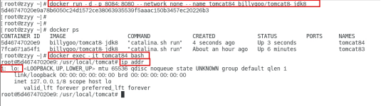

在容器外部查看

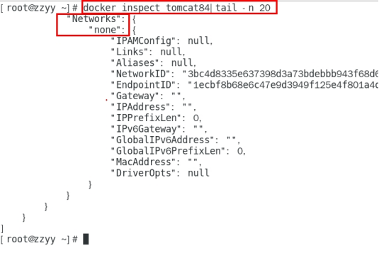

#### 4.container是什么

container⽹络模式 

新建的容器和已经存在的一个容器共享一个网络ip配置而不是和宿主机共享。新创建的容器不会创建自己的网卡，配置自己的IP，而是和一个指定的容器共享IP、端口范围等。同样，两个容器除了网络方面，其他的如文件系统、进程列表等还是隔离的。

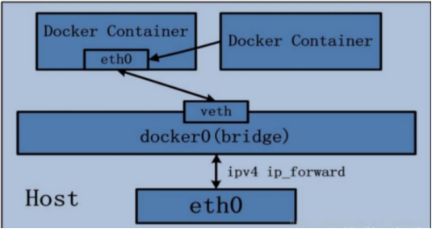

```sh
docker run -d -p 8085:8080 --name tomcat85 billygoo/tomcat8-jdk8
docker run -d -p 8086:8080 --network container:tomcat85 --name tomcat86 billygoo/tomcat8-jdk8
```

运行结果

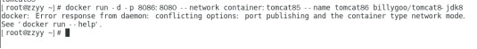

相当于tomcat86和tomcat85公用同一个ip同一个端口，导致端口冲突,本案例用tomcat演示不合,换一个镜像演示

#### 5.Alpine演示

Alpine操作系统是一个面向安全的轻型 Linux发行版

Alpine Linux 是一款独立的、非商业的通用 Linux 发行版，专为追求安全性、简单性和资源效率的用户而设计。 可能很多人没听说过这个 Linux 发行版本，但是经常用 Docker 的朋友可能都用过，因为他小，简单，安全而著称，所以作为基础镜像是非常好的一个选择，可谓是麻雀虽小但五脏俱全，镜像非常小巧，不到 6M的大小，所以特别适合容器打包。

```sh
docker run -it --name alpine1  alpine /bin/sh
docker run -it --network container:alpine1 --name alpine2  alpine /bin/sh
```

运行结果，验证共用搭桥

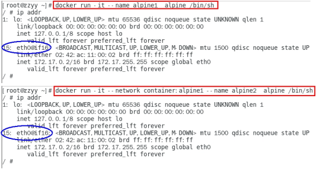

假如此时关闭alpine1，再看看alpine2

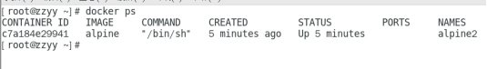

15: eth0@if16: 消失了。关闭alpine1，再看看alpine2

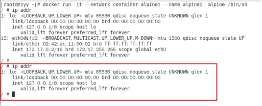

#### 6.自定义网络

过时的link

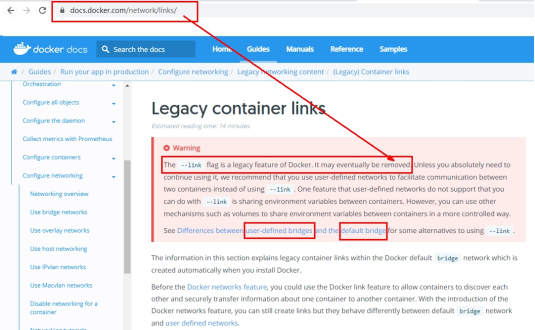

1.没有用自定义网络之前

```sh
docker run -d -p 8081:8080   --name tomcat81 billygoo/tomcat8-jdk8
docker run -d -p 8082:8080   --name tomcat82 billygoo/tomcat8-jdk8
```

上述成功启动并用docker exec进入各自容器实例内部

```sh
docker exec -it tomcat81 bash
docker exec -it tomcat82 bash
```

按照IP地址ping是OK的，81ping82或者82ping81都是通的

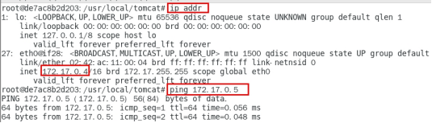

按照服务名ping结果?

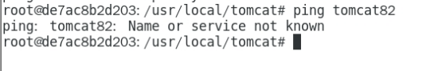

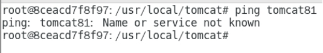

<mark>结果：按照ip是ping通的，按照服务名是不通的，通常我们不会将ip写死</mark>

2.自定义桥接网络

自定义网络默认使用的是桥接网络bridge

`1.新建自定义网络`

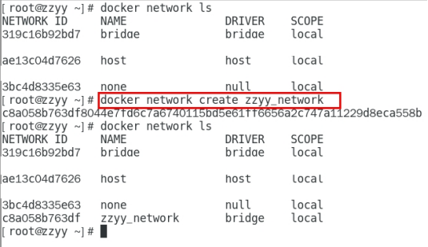

`2.新建容器加入上一步新建的自定义网络`

```sh
docker run -d -p 8081:8080 --network zzyy_network  --name tomcat81 billygoo/tomcat8-jdk8
docker run -d -p 8082:8080 --network zzyy_network  --name tomcat82 billygoo/tomcat8-jdk8
```

`3.互相ping测试`

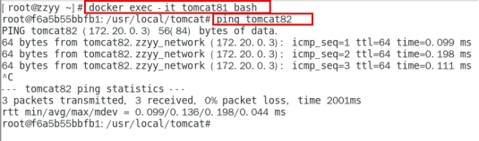

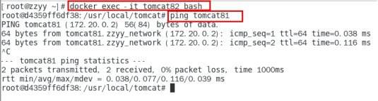

`4.问题结论`

自定义网络本身就维护好了主机名和ip的对应关系（ip和域名都能通）

自定义网络本身就维护好了主机名和ip的对应关系（ip和域名都能通）

自定义网络本身就维护好了主机名和ip的对应关系（ip和域名都能通）
