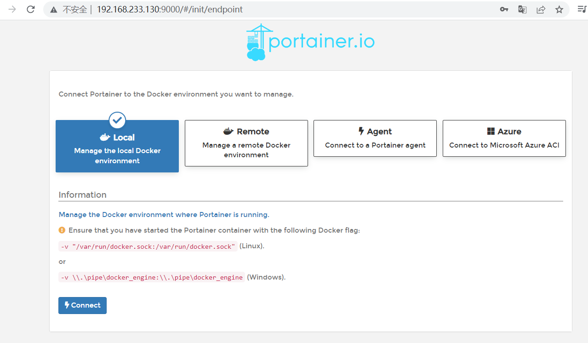
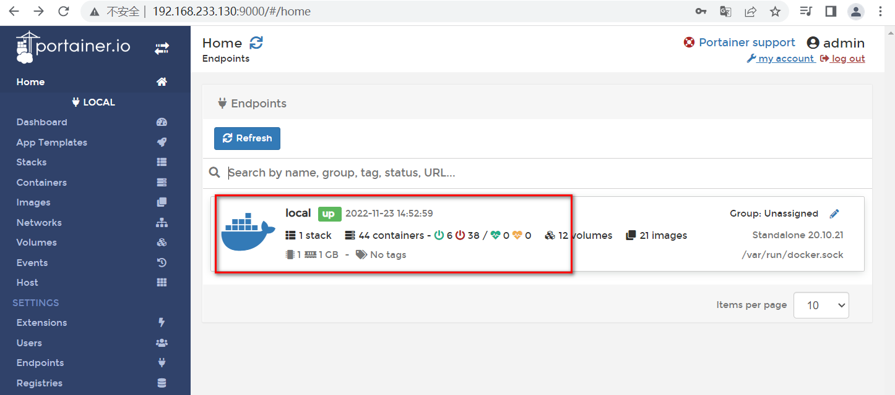
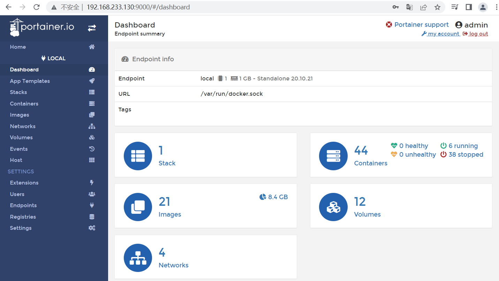

# 1.Docker-Portainer
[[toc]]

## 1.Docker轻量级可视化工具Portainer是什么

Portainer 是一款轻量级的应用，它提供了图形化界面，用于方便地管理Docker环境，包括单机环境和集群环境。

## 2.安装

官网

https://www.portainer.io/

https://docs.portainer.io/v/ce-2.9/start/install/server/docker/linux

步骤

docker命令安装

```sh
docker run -d -p 8000:8000 -p 9000:9000 --name portainer --restart=always -v /var/run/docker.sock:/var/run/docker.sock -v portainer_data:/data portainer/portainer
```

第一次登录需创建admin，访问地址：http://192.168.233.130:9000

| 用户名，直接用默认admin        |
| ------------------------------ |
| 密码记得8位，随便你写 12345678 |







上一步的图形展示，能想得起对应命令吗？

```sh
[root@noed2 boot]# docker system df
TYPE            TOTAL     ACTIVE    SIZE      RECLAIMABLE
Images          21        18        5.77GB    1.831GB (31%)
Containers      44        6         154.9MB   154.9MB (99%)
Local Volumes   12        9         277.8MB   207MB (74%)
Build Cache     0         0         0B        0B
```

## 3.登陆并演示介绍常用操作case

end;
