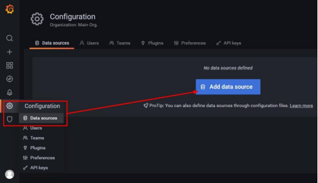

# 1.Docker容器监控之 CAdvisor+InfluxDB+Granfana
[[toc]]

## 1.原生命令

操作

```sh
docker ps
docker stats
```


问题

通过docker stats命令可以很方便的看到当前宿主机上所有容器的CPU,内存以及网络流量等数据，一般小公司够用了。但是，docker stats统计结果只能是当前宿主机的全部容器，数据资料是实时的，没有地方存储、没有健康指标过线预警等功能。

## 2.是什么

容器监控3剑客

一句话


CAdvisor监控收集+InfluxDB存储数据+Granfana展示图表

CAdvisor


InfluxDB


Granfana


总结


## 3.compose容器编排

新建目录

```sh
[root@noed2 myfile]# mkdir cig
[root@noed2 myfile]# cd cig
[root@noed2 cig]# pwd
/myfile/cig
```

新建3件套组合的 docker-compose.yml

```sh
docker-compose.yml
```

```sh
version: '3.1'

volumes:
  grafana_data: {}

services:
  influxdb:
    image: tutum/influxdb:0.9
    restart: always
    environment:
      - PRE_CREATE_DB=cadvisor
    ports:
      - "8083:8083"
      - "8086:8086"
    volumes:
      - ./data/influxdb:/data

  cadvisor:
    image: google/cadvisor
    links:
      - influxdb:influxsrv
    command: -storage_driver=influxdb -storage_driver_db=cadvisor -storage_driver_host=influxsrv:8086
    restart: always
    ports:
      - "8080:8080"
    volumes:
      - /:/rootfs:ro
      - /var/run:/var/run:rw
      - /sys:/sys:ro
      - /var/lib/docker/:/var/lib/docker:ro

  grafana:
    user: "104"
    image: grafana/grafana
    restart: always
    links:
      - influxdb:influxsrv
    ports:
     - "3000:3000"
    volumes:
     - grafana_data:/var/lib/grafana
    environment:
      - HTTP_USER=admin
      - HTTP_PASS=admin
      - INFLUXDB_HOST=influxsrv
      - INFLUXDB_PORT=8086
      - INFLUXDB_NAME=cadvisor
      - INFLUXDB_USER=root
      - INFLUXDB_PASS=root
```

验证

```sh
docker-compose config -q
```

启动docker-compose文件

```sh
docker-compose up
```


查看三个服务容器是否启动

```sh
docker ps
```


## 4.测试

浏览cAdvisor收集服务，http://ip:8080/

访问：http://192.168.233.130:8080

第一次访问慢，cadvisor也有基础的图形展现功能，这里主要用它来作数据采集

浏览influxdb存储服务，http://ip:8083/

访问：http://192.168.233.130:8083

浏览grafana展现服务，http://ip:3000

访问：http://192.168.233.130:3000

ip+3000端口的方式访问,默认帐户密码（admin/admin）


配置步骤

配置数据源



选择influxdb数据源


配置细节

1.


2.


3.


配置面板panel

1.


2.


3.


4.


5.


6.


到这里cAdvisor+InfluxDB+Grafana容器监控系统就部署完成了

end;
